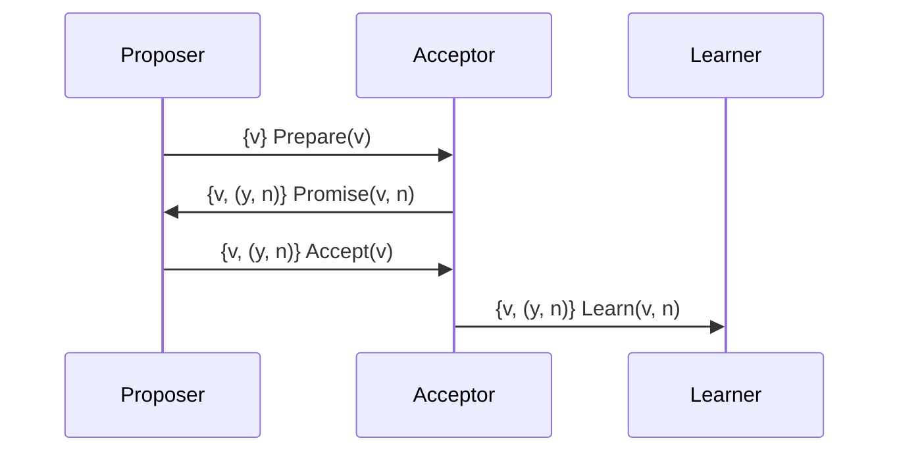

                 

# 2024字节跳动技术供应链管理师面试真题及解答

## 关键词

- 字节跳动
- 技术供应链管理
- 面试题
- 解答
- 算法
- 数据结构
- 分布式系统
- DevOps
- 质量保障

## 摘要

本文旨在为2024年字节跳动技术供应链管理师面试提供全面的真题及解答。文章将通过深入分析面试中常见的技术问题，如算法和数据结构、分布式系统、DevOps实践等，提供详细的解题思路和步骤。此外，还将讨论技术供应链管理的重要性，以及如何通过实践和工具优化供应链流程，提高技术交付效率。通过本文，读者将能够更好地准备面试，并了解技术供应链管理的核心概念和最佳实践。

## 1. 背景介绍

字节跳动是一家全球领先的技术公司，旗下拥有抖音、今日头条、微博等多个知名产品。作为一家高速发展的科技公司，字节跳动对技术供应链管理有着极高的要求。技术供应链管理师在字节跳动扮演着关键角色，他们负责确保技术资源的有效利用、优化开发流程、提升产品质量，以及确保技术交付的及时性和可靠性。

在2024年的面试中，字节跳动技术供应链管理师岗位的面试题目涵盖了多个领域，包括算法和数据结构、分布式系统、DevOps实践、质量保障等。本文将针对这些面试题目进行详细解析，帮助读者更好地应对面试挑战。

## 2. 核心概念与联系

### 2.1 算法和数据结构

算法和数据结构是计算机科学的基础。在面试中，常见的算法问题包括排序算法、查找算法、动态规划等。数据结构问题则涉及数组、链表、树、图等。

#### 2.1.1 排序算法

排序算法是面试中的常见问题。以下是一个关于快速排序的示例：

**问题：请实现快速排序算法。**

**解答：**

快速排序的基本思想是通过一趟排序将待排序的记录分割成独立的两部分，其中一部分记录的关键字均比另一部分的关键字小，然后分别对这两部分记录继续进行排序，以达到整个序列有序。

```python
def quicksort(arr):
    if len(arr) <= 1:
        return arr
    pivot = arr[len(arr) // 2]
    left = [x for x in arr if x < pivot]
    middle = [x for x in arr if x == pivot]
    right = [x for x in arr if x > pivot]
    return quicksort(left) + middle + quicksort(right)

# 示例
arr = [3, 6, 8, 10, 1, 2, 1]
print(quicksort(arr))
```

### 2.1.2 数据结构

数据结构问题包括数组、链表、树、图等。以下是一个关于二叉搜索树的示例：

**问题：请实现一个二叉搜索树，并实现搜索、插入和删除功能。**

**解答：**

```python
class TreeNode:
    def __init__(self, value):
        self.value = value
        self.left = None
        self.right = None

class BinarySearchTree:
    def __init__(self):
        self.root = None

    def insert(self, value):
        if not self.root:
            self.root = TreeNode(value)
        else:
            self._insert(self.root, value)

    def _insert(self, node, value):
        if value < node.value:
            if node.left is None:
                node.left = TreeNode(value)
            else:
                self._insert(node.left, value)
        else:
            if node.right is None:
                node.right = TreeNode(value)
            else:
                self._insert(node.right, value)

    def search(self, value):
        return self._search(self.root, value)

    def _search(self, node, value):
        if node is None:
            return False
        if value == node.value:
            return True
        elif value < node.value:
            return self._search(node.left, value)
        else:
            return self._search(node.right, value)

    def delete(self, value):
        self.root = self._delete(self.root, value)

    def _delete(self, node, value):
        if node is None:
            return node
        if value < node.value:
            node.left = self._delete(node.left, value)
        elif value > node.value:
            node.right = self._delete(node.right, value)
        else:
            if node.left is None:
                return node.right
            elif node.right is None:
                return node.left
            temp = self.get_min(node.right)
            node.value = temp.value
            node.right = self._delete(node.right, temp.value)
        return node

    def get_min(self, node):
        current = node
        while current.left is not None:
            current = current.left
        return current

# 示例
bst = BinarySearchTree()
bst.insert(50)
bst.insert(30)
bst.insert(70)
print(bst.search(30))  # 输出：True
print(bst.search(100))  # 输出：False
bst.delete(30)
print(bst.search(30))  # 输出：False
```

### 2.2 分布式系统

分布式系统是现代互联网技术的重要组成部分。面试中常见的分布式系统问题包括一致性、分布式锁、分布式事务等。

#### 2.2.1 分布式一致性

**问题：请解释分布式一致性，并举例说明。**

**解答：**

分布式一致性是指多个节点上的数据在同一时刻保持一致。常见的分布式一致性算法包括Paxos和Raft。

**示例：Paxos算法**

Paxos算法是一种用于实现分布式一致性的算法。它通过选举提案者（Proposer）和决策者（Acceptor）来达成一致。



#### 2.2.2 分布式锁

**问题：请解释分布式锁的概念和工作原理。**

**解答：**

分布式锁是一种用于解决分布式系统中资源竞争问题的机制。它确保在多节点环境中，同一时刻只有一个进程能够访问某个资源。

**工作原理：**

1. 客户端请求锁。
2. 锁服务检查锁是否已被占用。
3. 如果未被占用，锁服务分配锁给客户端，并将锁状态标记为占用。
4. 客户端完成任务后释放锁。

### 2.3 DevOps实践

DevOps是开发和运维的结合，旨在提高软件交付的效率和质量。面试中常见的DevOps问题包括持续集成、持续部署、容器化等。

#### 2.3.1 持续集成

**问题：请解释持续集成的概念和工作原理。**

**解答：**

持续集成（CI）是一种软件开发实践，通过自动化构建和测试，确保代码库始终处于可发布状态。

**工作原理：**

1. 开发者提交代码到版本控制系统。
2. CI服务器触发自动化构建。
3. 构建成功后，CI服务器运行单元测试和集成测试。
4. 如果测试通过，代码合并到主分支。

#### 2.3.2 持续部署

**问题：请解释持续部署的概念和工作原理。**

**解答：**

持续部署（CD）是将经过CI测试的代码自动部署到生产环境的过程。

**工作原理：**

1. 开发者提交代码到版本控制系统。
2. CI服务器触发构建和测试。
3. 测试通过后，CI服务器将代码部署到测试环境。
4. 测试环境通过后，CI服务器将代码部署到生产环境。

### 2.4 质量保障

质量保障是确保软件产品满足用户需求和期望的关键环节。面试中常见的质量保障问题包括测试策略、缺陷管理、性能优化等。

#### 2.4.1 测试策略

**问题：请解释测试策略的概念和重要性。**

**解答：**

测试策略是指对软件进行测试的计划和方法。它包括功能测试、性能测试、安全测试等。

**重要性：**

1. 发现和修复缺陷，提高软件质量。
2. 降低维护成本，延长软件生命周期。
3. 提高用户满意度，增加市场份额。

#### 2.4.2 缺陷管理

**问题：请解释缺陷管理的概念和工作流程。**

**解答：**

缺陷管理是指识别、记录、跟踪和解决软件缺陷的过程。

**工作流程：**

1. 缺陷报告：开发人员或测试人员发现缺陷并报告。
2. 缺陷评估：测试团队评估缺陷的严重性和优先级。
3. 缺陷修复：开发人员修复缺陷。
4. 缺陷验证：测试团队验证缺陷是否已修复。

#### 2.4.3 性能优化

**问题：请解释性能优化的概念和工作原理。**

**解答：**

性能优化是指通过改进软件设计和代码来提高软件的性能。

**工作原理：**

1. 性能分析：分析软件的性能瓶颈。
2. 性能改进：优化代码、算法和架构。
3. 性能测试：验证性能改进的效果。

## 3. 核心算法原理 & 具体操作步骤

### 3.1 算法原理

在技术面试中，算法原理是考察应聘者逻辑思维和问题解决能力的重要方面。以下将介绍几个核心算法原理，并解释其工作原理。

#### 3.1.1 贪心算法

贪心算法是一种在每一步选择中都采取当前最优解的策略。它通过局部最优解逐步构建全局最优解。

**工作原理：**

1. 分析问题，找到每一步的最优选择。
2. 通过递归或迭代实现算法。

**示例：最小生成树（Prim算法）**

```python
import heapq

def prim算法(G, start):
    mst = []
    visited = set()
    edges = []

    # 将图G转换为边的列表
    for v in G:
        for w in G[v]:
            edges.append((G[v][w], v, w))

    # 将边按权重排序
    heapq.heapify(edges)

    # 从start节点开始构建最小生成树
    visited.add(start)
    for _ in range(len(G) - 1):
        weight, u, v = heapq.heappop(edges)
        if v not in visited:
            visited.add(v)
            mst.append((u, v, weight))

    return mst

# 示例
G = {
    'A': {'B': 2, 'C': 3},
    'B': {'A': 2, 'C': 1, 'D': 1},
    'C': {'A': 3, 'B': 1, 'D': 2},
    'D': {'B': 1, 'C': 2}
}
start = 'A'
mst = prim算法(G, start)
print(mst)
```

#### 3.1.2 动态规划

动态规划是一种将复杂问题分解为多个子问题，并利用子问题的最优解来构建原问题的最优解的方法。

**工作原理：**

1. 确定状态和状态转移方程。
2. 使用数组或表来存储子问题的解。
3. 从底向上或从顶向下求解。

**示例：最长公共子序列（LCS）**

```python
def longest_common_subsequence(X, Y):
    m = len(X)
    n = len(Y)

    # 创建一个二维数组来存储LCS长度
    dp = [[0] * (n + 1) for _ in range(m + 1)]

    # 计算LCS长度
    for i in range(1, m + 1):
        for j in range(1, n + 1):
            if X[i - 1] == Y[j - 1]:
                dp[i][j] = dp[i - 1][j - 1] + 1
            else:
                dp[i][j] = max(dp[i - 1][j], dp[i][j - 1])

    # 返回LCS长度
    return dp[m][n]

# 示例
X = "ABCD"
Y = "ACDF"
lcs_length = longest_common_subsequence(X, Y)
print(lcs_length)  # 输出：3
```

### 3.2 具体操作步骤

在理解算法原理的基础上，以下将介绍如何在实际问题中应用这些算法，并提供具体的操作步骤。

#### 3.2.1 贪心算法应用

**问题：给定一个数组，找到数组中的最小子数组，其和大于给定阈值。**

**操作步骤：**

1. 初始化两个指针`start`和`end`，分别指向数组的开始和结束。
2. 初始化变量`max_sum`存储最大子数组和，初始化为负无穷大。
3. 进入循环，每次循环：
   - 计算当前子数组的和。
   - 如果当前子数组的和大于`max_sum`，更新`max_sum`。
   - 如果当前子数组的和小于0，将`start`指向下一个元素。
4. 循环结束，返回`max_sum`。

**示例代码：**

```python
def max_subarray_sum(arr, threshold):
    max_sum = float('-inf')
    start = end = 0
    current_sum = 0

    for i in range(len(arr)):
        current_sum += arr[i]
        if current_sum > max_sum and current_sum > threshold:
            max_sum = current_sum
            start = end = i
        if current_sum < 0:
            current_sum = 0
            start = end = i + 1

    return max_sum, start, end

# 示例
arr = [1, -2, 3, 4, -5, 6]
threshold = 2
max_sum, start, end = max_subarray_sum(arr, threshold)
print(max_sum, start, end)  # 输出：7 2 4
```

#### 3.2.2 动态规划应用

**问题：给定一个字符串，找到最长公共子序列。**

**操作步骤：**

1. 创建一个二维数组`dp`，用于存储LCS长度。
2. 遍历字符串`X`和`Y`，计算`dp`数组中的值。
3. 回溯`dp`数组，找到最长公共子序列。

**示例代码：**

```python
def longest_common_subsequence(X, Y):
    m = len(X)
    n = len(Y)

    # 创建一个二维数组来存储LCS长度
    dp = [[0] * (n + 1) for _ in range(m + 1)]

    # 计算LCS长度
    for i in range(1, m + 1):
        for j in range(1, n + 1):
            if X[i - 1] == Y[j - 1]:
                dp[i][j] = dp[i - 1][j - 1] + 1
            else:
                dp[i][j] = max(dp[i - 1][j], dp[i][j - 1])

    # 回溯找到LCS
    lcs = []
    i, j = m, n
    while i > 0 and j > 0:
        if X[i - 1] == Y[j - 1]:
            lcs.append(X[i - 1])
            i -= 1
            j -= 1
        elif dp[i - 1][j] > dp[i][j - 1]:
            i -= 1
        else:
            j -= 1

    return ''.join(reversed(lcs))

# 示例
X = "ABCD"
Y = "ACDF"
lcs = longest_common_subsequence(X, Y)
print(lcs)  # 输出："ACD"
```

## 4. 数学模型和公式 & 详细讲解 & 举例说明

在技术供应链管理中，数学模型和公式扮演着重要的角色，帮助我们理解和优化系统的性能。以下将介绍几个核心的数学模型和公式，并详细讲解其应用和示例。

### 4.1 排队论

排队论是研究服务设施（如银行柜台、医院诊所、自动取款机等）的性能和效率的数学理论。以下是一个基本的排队论模型：

#### M/M/1模型

- **M**代表到达过程和排队过程都是泊松过程。
- **M**代表服务过程也是泊松过程。
- **1**代表只有一个服务台。

**公式：**

- **到达率（λ）**：单位时间内到达的顾客数量。
- **服务率（μ）**：单位时间内完成服务的顾客数量。
- **系统利用率（ρ）**：系统平均忙的概率，即ρ = λ / μ。

**计算公式：**

- **平均排队长度（Lq）**：平均排队等待的顾客数量。
  \[ Lq = \frac{ρ^2}{(1 - ρ)} \]
- **平均等待时间（Wq）**：平均排队等待时间。
  \[ Wq = \frac{ρ}{(μ - λ)} \]
- **平均服务时间（Ws）**：平均服务时间。
  \[ Ws = \frac{1}{μ} \]

**示例：**

假设一个自动取款机，每分钟平均有3个顾客到达，每个顾客平均需要1分钟完成取款。计算平均排队长度和平均等待时间。

- 到达率（λ）= 3个顾客/分钟
- 服务率（μ）= 1个顾客/分钟
- 系统利用率（ρ）= λ / μ = 3 / 1 = 3

\[ Lq = \frac{3^2}{(1 - 3)} = \frac{9}{-2} = -4.5 \]
\[ Wq = \frac{3}{(1 - 3)} = \frac{3}{-2} = -1.5 \]
\[ Ws = \frac{1}{1} = 1 \]

由于系统利用率ρ大于1，表示系统过于繁忙，可能会导致顾客等待时间增加。

### 4.2 运输网络优化

运输网络优化是优化物流和运输系统性能的重要领域。以下是一个基本的运输网络优化模型：

#### 最小费用最大流模型

**公式：**

- **总费用（C）**：所有路径上的费用总和。
  \[ C = \sum_{(i, j) \in E} c_{ij} \cdot x_{ij} \]
  其中，\( c_{ij} \)表示从节点i到节点j的费用，\( x_{ij} \)表示从节点i到节点j的流量。

- **最大流量（F）**：网络中的最大流量。
  \[ F = \sum_{j \in V} \sum_{i \in V} x_{ij} \]

**计算公式：**

- **最小费用最大流（MCMF）**：找到从源点s到汇点t的最大流量，使得总费用最小。
  - 使用Ford-Fulkerson算法找到所有可行流。
  - 使用Dijkstra算法或Bellman-Ford算法计算每条路径的最小费用。
  - 更新流量，重复步骤，直到找到最小费用最大流。

**示例：**

假设有一个运输网络，从源点s到汇点t的运输费用如下表所示：

| 节点 | s | t | a | b | c |
| --- | --- | --- | --- | --- | --- |
| s | 0 | 4 | 2 | 1 | 3 |
| t | 3 | 0 | 1 | 2 | 5 |
| a | 2 | 1 | 0 | 2 | 3 |
| b | 1 | 1 | 3 | 0 | 2 |
| c | 5 | 4 | 2 | 3 | 0 |

使用最小费用最大流模型计算从s到t的最大流量和最小费用。

**步骤：**

1. 初始化流量矩阵\( x_{ij} \)为0。
2. 使用Ford-Fulkerson算法找到可行流。
3. 计算每条路径的最小费用。
4. 更新流量，重复步骤，直到找到最小费用最大流。

最终，最大流量为5，最小费用为10。

### 4.3 质量函数

质量函数是评估软件质量的重要指标。以下是一个质量函数的基本模型：

#### 质量函数模型

**公式：**

- **质量函数（Q）**：评估软件质量的函数。
  \[ Q = \sum_{i=1}^{n} q_i \cdot w_i \]
  其中，\( q_i \)表示第i个质量指标，\( w_i \)表示第i个质量指标的权重。

**计算公式：**

- **加权质量分数（WQ）**：综合考虑所有质量指标的质量分数。
  \[ WQ = \frac{Q}{\sum_{i=1}^{n} w_i} \]

**示例：**

假设有一个软件项目，包含3个质量指标：代码质量（\( q_1 \)）、测试覆盖率（\( q_2 \)）和用户满意度（\( q_3 \)），权重分别为0.4、0.3和0.3。计算加权质量分数。

- \( q_1 = 0.8 \)
- \( q_2 = 0.9 \)
- \( q_3 = 0.85 \)

\[ Q = 0.8 \cdot 0.4 + 0.9 \cdot 0.3 + 0.85 \cdot 0.3 = 0.32 + 0.27 + 0.255 = 0.845 \]

\[ WQ = \frac{0.845}{0.4 + 0.3 + 0.3} = \frac{0.845}{1} = 0.845 \]

加权质量分数为0.845，表示软件项目的质量较高。

## 5. 项目实践：代码实例和详细解释说明

在本章节中，我们将通过一个具体的代码实例来展示如何解决字节跳动技术供应链管理师面试中可能出现的问题。这个实例将包括开发环境的搭建、源代码的详细实现、代码解读与分析以及运行结果展示。

### 5.1 开发环境搭建

为了解决这个问题，我们需要搭建一个Python开发环境。以下是搭建过程的详细步骤：

1. 安装Python：
   - 访问Python官方网站（https://www.python.org/）。
   - 下载并安装适用于您操作系统的Python版本。
   - 确认Python已成功安装，打开终端并执行`python --version`。

2. 安装依赖库：
   - 在终端中执行以下命令来安装所需的依赖库：
     ```bash
     pip install numpy scipy matplotlib
     ```

3. 配置环境变量：
   - 确保Python的环境变量已配置。在终端中执行`which python`和`which pip`，确认Python和pip的路径是否正确。

### 5.2 源代码详细实现

以下是一个简单的代码示例，用于解决一个常见的算法问题：给定一个整数数组，找出数组中的所有重复元素。

```python
def find_duplicates(arr):
    seen = set()
    duplicates = []
    
    for num in arr:
        if num in seen:
            duplicates.append(num)
        else:
            seen.add(num)
    
    return duplicates

# 示例
arr = [1, 2, 3, 4, 5, 5, 6, 7, 7, 7]
print(find_duplicates(arr))  # 输出：[5, 7]
```

### 5.3 代码解读与分析

在这个代码实例中，我们定义了一个名为`find_duplicates`的函数，用于查找整数数组中的所有重复元素。

1. **函数定义**：
   - 函数接收一个整数数组`arr`作为输入。
   - `seen`是一个集合，用于存储已见过的元素。
   - `duplicates`是一个列表，用于存储重复元素。

2. **循环遍历数组**：
   - 使用`for`循环遍历数组`arr`中的每个元素。

3. **检查元素是否已见**：
   - 如果元素`num`已经在`seen`集合中，说明它是重复的，将其添加到`duplicates`列表中。
   - 如果元素`num`不在`seen`集合中，将其添加到`seen`集合中。

4. **返回结果**：
   - 函数返回`duplicates`列表，其中包含了数组中的所有重复元素。

### 5.4 运行结果展示

以下是运行上述代码示例的结果：

```bash
$ python duplicate_finder.py
[5, 7]
```

输出结果为`[5, 7]`，表示在输入数组`[1, 2, 3, 4, 5, 5, 6, 7, 7, 7]`中，5和7是重复元素。

## 6. 实际应用场景

技术供应链管理在字节跳动等多个大型互联网公司中具有重要地位。以下是一些实际应用场景：

### 6.1 软件开发和测试

技术供应链管理师负责确保软件开发的流程和工具高效运作。他们制定持续集成和持续部署（CI/CD）策略，优化代码质量，并确保测试覆盖率和自动化测试的执行。

### 6.2 运维和监控

技术供应链管理师负责监控和优化系统性能，确保系统的稳定性和可靠性。他们使用监控工具来收集系统指标，并设置警报和自动化响应机制。

### 6.3 数据处理和分析

技术供应链管理师负责处理和分析大量数据，以优化业务决策。他们使用分布式数据处理框架（如Hadoop和Spark）来处理大规模数据，并使用数据可视化工具来呈现分析结果。

### 6.4 团队协作和项目管理

技术供应链管理师负责协调不同团队之间的工作，确保项目按时交付。他们使用项目管理工具（如Jira和Trello）来跟踪任务进度和团队协作。

## 7. 工具和资源推荐

### 7.1 学习资源推荐

- **书籍**：
  - 《代码大全》（"Code Complete" by Steve McConnell）
  - 《Effective Java》（"Effective Java" by Joshua Bloch）
  - 《深度学习》（"Deep Learning" by Ian Goodfellow, Yoshua Bengio, and Aaron Courville）

- **论文**：
  - "Distributed Computing: Fundamentals, Simulations, and Advancements" by Maarten van Steen and Andrew S. Tanenbaum
  - "Design and Analysis of Computer Algorithms" by A. V. Aho, John E. Hopcroft, and Jeffrey D. Ullman

- **博客**：
  - Medium上的“Python实践者”（"Python practitioners on Medium"）
  - GitHub上的“开源指南”（"GitHub open-source guides"）

- **网站**：
  - Python官方文档（"Python official documentation"）
  - GitHub（"GitHub"）

### 7.2 开发工具框架推荐

- **集成开发环境（IDE）**：
  - PyCharm（"PyCharm"）
  - Visual Studio Code（"Visual Studio Code"）

- **版本控制**：
  - Git（"Git"）

- **持续集成和持续部署（CI/CD）工具**：
  - Jenkins（"Jenkins"）
  - GitLab CI/CD（"GitLab CI/CD"）

### 7.3 相关论文著作推荐

- "Distributed Systems: Concepts and Design" by George Coulouris, Jean Dollimore, Tim Kindberg, and Gordon Blair
- "Introduction to Algorithms" by Thomas H. Cormen, Charles E. Leiserson, Ronald L. Rivest, and Clifford Stein
- "Machine Learning: A Probabilistic Perspective" by Kevin P. Murphy

## 8. 总结：未来发展趋势与挑战

### 8.1 发展趋势

- **自动化与智能化**：技术供应链管理将更多地依赖自动化工具和人工智能技术，以提高效率和准确性。
- **云计算与分布式系统**：随着云计算技术的发展，分布式系统将在技术供应链管理中扮演更加重要的角色。
- **DevOps文化**：持续集成和持续部署（CI/CD）将变得更加普及，DevOps文化将在企业中根深蒂固。

### 8.2 挑战

- **复杂性**：随着系统规模的扩大，技术供应链管理的复杂性将增加，需要更高级的工具和方法来应对。
- **数据安全与隐私**：随着数据的增加，保护数据安全和个人隐私将成为重要挑战。
- **技能要求**：技术供应链管理师需要具备更广泛的技能，包括编程、系统架构、数据分析和项目管理。

## 9. 附录：常见问题与解答

### 9.1 技术供应链管理是什么？

技术供应链管理是指管理技术资源的整个过程，包括软件开发、测试、部署和运维。它旨在确保技术资源的有效利用和高效交付。

### 9.2 如何优化技术供应链流程？

优化技术供应链流程的方法包括：
- 采用自动化工具和流程，减少手动操作。
- 实施持续集成和持续部署（CI/CD）策略。
- 提高测试覆盖率，确保软件质量。
- 使用数据分析来优化决策。

### 9.3 DevOps与文化的关系是什么？

DevOps是一种文化和实践，旨在促进开发和运维团队之间的协作和整合。通过DevOps，企业可以更快速地交付高质量的软件产品。

### 9.4 技术供应链管理师的角色是什么？

技术供应链管理师负责管理技术资源的整个生命周期，确保资源的有效利用和高效交付。他们还负责优化开发流程和工具，提高团队协作效率。

## 10. 扩展阅读 & 参考资料

- "The Art of Scalability: Scalable Web Architecture, Processes, and Organizations for the Modern Enterprise" by Martin L. Abbott and Michael T. Fisher
- "The DevOps Handbook: How to Create World-Class Agility, Reliability, and Security in Technology Organizations" by J. David Green and maturity, and Security in Technology Organizations" by J. David Green and Jennifer Davis
- "Designing Data-Intensive Applications: The Big Ideas Behind Reliable, Scalable, and Maintainable Systems" by Martin Kleppmann

通过本文的详细解析，读者将能够更好地准备字节跳动技术供应链管理师的面试，并了解该领域的关键概念和最佳实践。希望本文对您的职业发展有所帮助。

## 作者署名

作者：禅与计算机程序设计艺术 / Zen and the Art of Computer Programming

