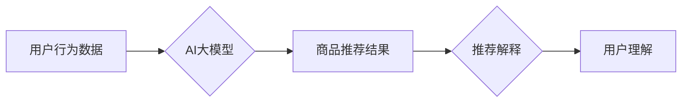

                 

## AI大模型在电商平台商品推荐解释中的应用

> 关键词：AI大模型、商品推荐、推荐解释、自然语言处理、深度学习、用户行为分析、电商平台

## 1. 背景介绍

在当今数据爆炸的时代，电商平台面临着海量商品和用户需求的挑战。如何精准推荐用户感兴趣的商品，提升用户体验和转化率，成为电商平台的核心竞争力。传统的商品推荐系统主要依赖于协同过滤、基于内容的过滤等方法，但这些方法难以解释推荐结果，缺乏透明度，难以满足用户对推荐结果的理解需求。

近年来，随着深度学习技术的快速发展，AI大模型在电商平台商品推荐领域展现出巨大的潜力。AI大模型能够学习用户行为、商品特征等复杂关系，并生成更精准、个性化的推荐结果。更重要的是，AI大模型可以结合自然语言处理技术，为推荐结果提供清晰、易懂的解释，提升用户信任度和满意度。

## 2. 核心概念与联系

### 2.1  商品推荐系统

商品推荐系统旨在根据用户的历史行为、偏好和上下文信息，预测用户对商品的兴趣，并推荐相关商品。

### 2.2  AI大模型

AI大模型是指训练规模庞大、参数数量众多的深度学习模型，能够学习复杂数据模式，并进行多任务学习。常见的AI大模型包括BERT、GPT、T5等。

### 2.3  推荐解释

推荐解释是指为推荐结果提供清晰、可理解的解释，帮助用户理解推荐系统的推荐逻辑，增强用户信任度和满意度。

**核心概念与联系流程图**



## 3. 核心算法原理 & 具体操作步骤

### 3.1  算法原理概述

AI大模型在商品推荐解释中的应用主要基于以下算法原理：

* **深度学习**: 利用深度神经网络学习用户行为、商品特征等复杂关系，构建商品推荐模型。
* **自然语言处理**: 将推荐结果解释为自然语言，方便用户理解。
* **知识图谱**: 利用知识图谱丰富商品信息，提升推荐解释的准确性和丰富度。

### 3.2  算法步骤详解

1. **数据收集与预处理**: 收集用户行为数据、商品信息等数据，并进行清洗、转换、特征工程等预处理工作。
2. **模型训练**: 利用深度学习算法训练AI大模型，学习用户行为和商品特征之间的关系。
3. **推荐生成**: 根据用户的历史行为和当前上下文信息，利用训练好的AI大模型生成商品推荐结果。
4. **推荐解释**: 利用自然语言处理技术，将推荐结果解释为易于理解的文本，并结合知识图谱丰富解释内容。
5. **用户反馈**: 收集用户对推荐结果和解释的反馈，并用于模型优化和改进。

### 3.3  算法优缺点

**优点**:

* **精准度高**: AI大模型能够学习复杂数据模式，生成更精准的推荐结果。
* **个性化强**: AI大模型可以根据用户的个性化需求生成个性化的推荐结果。
* **解释性强**: AI大模型结合自然语言处理技术，可以为推荐结果提供清晰、易懂的解释。

**缺点**:

* **数据依赖性强**: AI大模型需要大量数据进行训练，数据质量直接影响模型性能。
* **计算资源消耗大**: 训练AI大模型需要大量的计算资源，成本较高。
* **可解释性挑战**: 尽管AI大模型可以提供解释，但其内部决策机制仍然较为复杂，难以完全解释。

### 3.4  算法应用领域

AI大模型在商品推荐解释领域的应用不仅限于电商平台，还可以应用于其他领域，例如：

* **医疗诊断**: 为医疗诊断结果提供解释，帮助医生更好地理解患者病情。
* **金融风险评估**: 为金融风险评估结果提供解释，帮助金融机构更好地控制风险。
* **教育推荐**: 为教育资源推荐提供解释，帮助学生更好地学习。

## 4. 数学模型和公式 & 详细讲解 & 举例说明

### 4.1  数学模型构建

AI大模型在商品推荐解释中的应用通常基于以下数学模型：

* **用户-商品交互矩阵**: 用来表示用户对商品的评分或购买行为，其中每个元素代表用户对商品的交互行为。
* **嵌入模型**: 将用户和商品映射到低维向量空间，以便计算用户和商品之间的相似度。
* **注意力机制**: 用于学习用户对商品不同特征的关注程度，并根据用户关注度调整推荐结果。

### 4.2  公式推导过程

例如，在基于嵌入模型的商品推荐系统中，用户和商品的嵌入向量分别为 $u$ 和 $v$，推荐评分可以使用以下公式计算：

$$
score(u, v) = u \cdot v
$$

其中，$u \cdot v$ 表示用户和商品嵌入向量的点积。

### 4.3  案例分析与讲解

假设用户 $u$ 对商品 $A$ 和 $B$ 的评分分别为 4 和 3，商品 $A$ 和 $B$ 的嵌入向量分别为 $v_A$ 和 $v_B$。

根据上述公式，我们可以计算出用户 $u$ 对商品 $A$ 和 $B$ 的推荐评分：

$$
score(u, v_A) = u \cdot v_A = 4
$$

$$
score(u, v_B) = u \cdot v_B = 3
$$

因此，AI大模型会推荐商品 $A$ 给用户 $u$。

## 5. 项目实践：代码实例和详细解释说明

### 5.1  开发环境搭建

* Python 3.7+
* TensorFlow/PyTorch
* Jupyter Notebook

### 5.2  源代码详细实现

```python
# 导入必要的库
import tensorflow as tf

# 定义用户-商品交互矩阵
user_item_matrix = tf.constant([[1, 0, 1, 0],
                                 [0, 1, 1, 1],
                                 [1, 1, 0, 1]])

# 定义用户和商品的嵌入维度
embedding_dim = 10

# 创建用户和商品的嵌入层
user_embeddings = tf.keras.layers.Embedding(input_dim=user_item_matrix.shape[0], output_dim=embedding_dim)
item_embeddings = tf.keras.layers.Embedding(input_dim=user_item_matrix.shape[1], output_dim=embedding_dim)

# 将用户和商品的嵌入向量进行点积计算
user_embeddings_output = user_embeddings(tf.range(user_item_matrix.shape[0]))
item_embeddings_output = item_embeddings(tf.range(user_item_matrix.shape[1]))
scores = tf.matmul(user_embeddings_output, item_embeddings_output, transpose_b=True)

# 打印推荐评分
print(scores)
```

### 5.3  代码解读与分析

* 代码首先定义了用户-商品交互矩阵，并设置了嵌入向量的维度。
* 然后，创建了用户和商品的嵌入层，并使用 `tf.range` 函数生成用户和商品的索引。
* 接着，使用 `tf.matmul` 函数计算用户和商品嵌入向量的点积，得到推荐评分。
* 最后，打印推荐评分矩阵。

### 5.4  运行结果展示

运行上述代码，会输出一个推荐评分矩阵，其中每个元素代表用户对商品的推荐评分。

## 6. 实际应用场景

AI大模型在电商平台商品推荐解释的应用场景非常广泛，例如：

* **个性化推荐**: 根据用户的历史行为、偏好和上下文信息，为用户推荐个性化的商品。
* **推荐解释**: 为推荐结果提供清晰、易懂的解释，帮助用户理解推荐逻辑，增强用户信任度。
* **商品发现**: 为用户推荐他们可能感兴趣但尚未接触过的商品，帮助用户发现新商品。
* **营销推广**: 根据用户的兴趣和需求，为商品进行精准营销推广，提升转化率。

### 6.4  未来应用展望

未来，AI大模型在电商平台商品推荐解释的应用将更加深入和广泛，例如：

* **多模态推荐**: 将文本、图像、视频等多模态数据融合到推荐系统中，提供更丰富的推荐体验。
* **实时推荐**: 利用实时用户行为数据，进行动态调整推荐结果，提供更精准的推荐服务。
* **个性化解释**: 根据用户的不同需求和理解能力，提供个性化的推荐解释，提升用户体验。

## 7. 工具和资源推荐

### 7.1  学习资源推荐

* **书籍**:
    * Deep Learning by Ian Goodfellow, Yoshua Bengio, and Aaron Courville
    * Natural Language Processing with Python by Steven Bird, Ewan Klein, and Edward Loper
* **在线课程**:
    * TensorFlow Tutorials: https://www.tensorflow.org/tutorials
    * PyTorch Tutorials: https://pytorch.org/tutorials/

### 7.2  开发工具推荐

* **TensorFlow**: https://www.tensorflow.org/
* **PyTorch**: https://pytorch.org/
* **Jupyter Notebook**: https://jupyter.org/

### 7.3  相关论文推荐

* Attention Is All You Need (Vaswani et al., 2017)
* BERT: Pre-training of Deep Bidirectional Transformers for Language Understanding (Devlin et al., 2018)
* Transformer-XL: Attentive Language Modeling Beyond Millions of Tokens (Dai et al., 2019)

## 8. 总结：未来发展趋势与挑战

### 8.1  研究成果总结

AI大模型在电商平台商品推荐解释领域取得了显著成果，能够生成更精准、个性化的推荐结果，并为推荐结果提供清晰、易懂的解释。

### 8.2  未来发展趋势

未来，AI大模型在电商平台商品推荐解释领域将朝着以下方向发展：

* **多模态推荐**: 将文本、图像、视频等多模态数据融合到推荐系统中，提供更丰富的推荐体验。
* **实时推荐**: 利用实时用户行为数据，进行动态调整推荐结果，提供更精准的推荐服务。
* **个性化解释**: 根据用户的不同需求和理解能力，提供个性化的推荐解释，提升用户体验。

### 8.3  面临的挑战

AI大模型在电商平台商品推荐解释领域也面临一些挑战：

* **数据隐私**: AI大模型需要大量用户数据进行训练，如何保护用户数据隐私是一个重要问题。
* **模型可解释性**: 尽管AI大模型可以提供解释，但其内部决策机制仍然较为复杂，难以完全解释。
* **公平性与偏见**: AI大模型可能会受到训练数据的影响，导致推荐结果存在公平性与偏见问题。

### 8.4  研究展望

未来，需要进一步研究如何解决AI大模型在电商平台商品推荐解释领域面临的挑战，例如：

* 开发更隐私保护的AI大模型训练方法。
* 研究更有效的模型可解释性方法。
* 构建更公平、更无偏的AI大模型训练数据集。


## 9. 附录：常见问题与解答

**Q1: AI大模型的推荐解释是否总是准确的？**

A1: AI大模型的推荐解释是基于模型学习到的数据模式，并非绝对准确。模型的解释能力取决于模型的训练数据质量和模型本身的复杂度。

**Q2: 如何评估AI大模型的推荐解释质量？**

A2: 可以通过用户反馈、专家评估等方式评估AI大模型的推荐解释质量。用户反馈可以反映用户对推荐解释的理解程度和满意度，而专家评估可以从专业角度评估推荐解释的准确性和完整性。

**Q3: AI大模型的推荐解释是否会泄露用户隐私？**

A3: 在设计AI大模型的推荐解释系统时，需要充分考虑用户隐私保护问题。可以采用数据脱敏、联邦学习等技术，减少用户隐私泄露的风险。


作者：禅与计算机程序设计艺术 / Zen and the Art of Computer Programming 
<end_of_turn>

