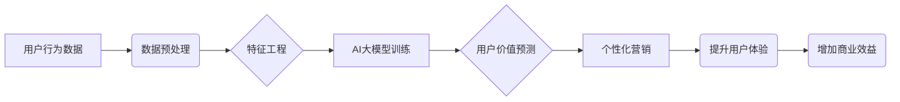

                 

## AI大模型在电商平台用户价值预测中的应用

> 关键词：AI大模型、用户价值预测、电商平台、深度学习、推荐系统、个性化营销、数据挖掘

## 1. 背景介绍

在当今数据爆炸的时代，电商平台面临着巨大的用户群体和海量数据。如何精准地预测用户价值，并将其转化为商业效益，成为电商平台发展的重要课题。传统的用户价值预测方法往往依赖于用户行为数据和人口统计特征，但这些方法难以捕捉用户价值的复杂性和动态性。

近年来，随着深度学习技术的快速发展，AI大模型在用户价值预测领域展现出巨大的潜力。AI大模型能够学习用户行为、兴趣、偏好等复杂模式，并进行更精准的预测。

## 2. 核心概念与联系

### 2.1 用户价值预测

用户价值预测是指通过分析用户行为、特征等数据，预测用户在未来一段时间内对电商平台的贡献度，例如购买金额、复购率、忠诚度等。

### 2.2 AI大模型

AI大模型是指训练数据量巨大、参数规模庞大的深度学习模型。例如GPT-3、BERT、LaMDA等。

### 2.3 关系图



## 3. 核心算法原理 & 具体操作步骤

### 3.1 算法原理概述

AI大模型在用户价值预测中的应用主要基于以下算法原理：

* **深度学习:** 利用多层神经网络结构，学习用户行为数据中的复杂模式和特征。
* **监督学习:** 利用历史用户数据进行训练，学习用户价值与特征之间的映射关系。
* **回归分析:** 将用户价值预测为连续数值，例如购买金额、复购率等。

### 3.2 算法步骤详解

1. **数据收集:** 收集用户行为数据，例如浏览记录、购买记录、评价记录、评论记录等。
2. **数据预处理:** 对收集到的数据进行清洗、转换、编码等操作，使其适合模型训练。
3. **特征工程:** 从原始数据中提取特征，例如用户年龄、性别、购买频率、平均购买金额等。
4. **模型选择:** 选择合适的深度学习模型，例如多层感知机(MLP)、卷积神经网络(CNN)、循环神经网络(RNN)等。
5. **模型训练:** 利用训练数据训练模型，并通过交叉验证等方法进行模型评估和调参。
6. **模型部署:** 将训练好的模型部署到线上环境，用于预测新用户的价值。

### 3.3 算法优缺点

**优点:**

* 能够学习用户行为数据中的复杂模式和特征，提高预测精度。
* 可以处理海量数据，并进行实时预测。
* 可以根据用户行为变化动态调整预测模型。

**缺点:**

* 需要大量的训练数据，否则模型性能会下降。
* 模型训练过程复杂，需要专业的技术人员进行操作。
* 模型解释性较差，难以理解模型的决策过程。

### 3.4 算法应用领域

* **电商平台:** 预测用户价值，进行精准营销和个性化推荐。
* **金融机构:** 评估客户信用风险，进行精准贷款和风险控制。
* **医疗机构:** 预测患者的疾病风险，进行精准诊断和治疗。
* **教育机构:** 预测学生的学习效果，进行个性化教学和学习辅导。

## 4. 数学模型和公式 & 详细讲解 & 举例说明

### 4.1 数学模型构建

用户价值预测模型可以构建为一个回归模型，例如线性回归模型或多层感知机模型。

**线性回归模型:**

$$
y = \beta_0 + \beta_1x_1 + \beta_2x_2 + ... + \beta_nx_n + \epsilon
$$

其中：

* $y$ 是用户价值预测值
* $x_1, x_2, ..., x_n$ 是用户特征向量
* $\beta_0, \beta_1, ..., \beta_n$ 是模型参数
* $\epsilon$ 是误差项

**多层感知机模型:**

多层感知机模型由多个隐藏层组成，每个隐藏层包含多个神经元。每个神经元接收来自上一层的输入，并通过激活函数进行处理，输出到下一层。

### 4.2 公式推导过程

模型参数的学习过程通常使用梯度下降算法。梯度下降算法通过迭代更新模型参数，使得模型预测值与真实值之间的误差最小化。

### 4.3 案例分析与讲解

假设我们想要预测用户的购买金额。我们可以使用用户的年龄、性别、购买频率等特征作为输入，并训练一个线性回归模型。

通过训练模型，我们可以得到模型参数 $\beta_0, \beta_1, ..., \beta_n$。然后，我们可以使用这些参数预测新用户的购买金额。

## 5. 项目实践：代码实例和详细解释说明

### 5.1 开发环境搭建

* Python 3.x
* TensorFlow 或 PyTorch 深度学习框架
* Jupyter Notebook 或 VS Code 开发环境

### 5.2 源代码详细实现

```python
import tensorflow as tf

# 定义模型结构
model = tf.keras.models.Sequential([
    tf.keras.layers.Dense(64, activation='relu', input_shape=(5,)),
    tf.keras.layers.Dense(32, activation='relu'),
    tf.keras.layers.Dense(1)
])

# 编译模型
model.compile(optimizer='adam', loss='mse')

# 训练模型
model.fit(X_train, y_train, epochs=10)

# 预测新用户的价值
predictions = model.predict(X_new)
```

### 5.3 代码解读与分析

* 我们使用 TensorFlow 框架构建了一个多层感知机模型。
* 模型输入层包含 5 个神经元，对应用户的 5 个特征。
* 模型隐藏层包含 64 个和 32 个神经元，分别使用 ReLU 激活函数。
* 模型输出层包含 1 个神经元，用于预测用户的购买金额。
* 我们使用 Adam 优化器和均方误差损失函数训练模型。
* 训练完成后，我们可以使用模型预测新用户的购买金额。

### 5.4 运行结果展示

训练完成后，我们可以使用模型预测新用户的购买金额。预测结果可以以表格或图表的形式展示。

## 6. 实际应用场景

### 6.1 个性化推荐

AI大模型可以根据用户的历史购买记录、浏览记录等数据，预测用户对哪些商品感兴趣，并进行个性化推荐。

### 6.2 精准营销

AI大模型可以根据用户的价值预测结果，进行精准营销，例如发送个性化优惠券、推送相关产品信息等。

### 6.3 用户画像分析

AI大模型可以分析用户的行为数据，构建用户画像，例如用户的年龄、性别、兴趣爱好、消费习惯等。

### 6.4 未来应用展望

* **更精准的价值预测:** 随着深度学习技术的不断发展，AI大模型的预测精度将会进一步提高。
* **更个性化的服务:** AI大模型可以提供更个性化的服务，例如个性化推荐、个性化营销、个性化客服等。
* **更智能的运营:** AI大模型可以帮助电商平台进行更智能的运营，例如自动化的库存管理、自动化的价格调整等。

## 7. 工具和资源推荐

### 7.1 学习资源推荐

* **书籍:**
    * 深度学习
    * 自然语言处理
    * 机器学习实战
* **在线课程:**
    * Coursera
    * edX
    * Udacity

### 7.2 开发工具推荐

* **Python:** 
    * TensorFlow
    * PyTorch
    * scikit-learn
* **云平台:**
    * AWS
    * Azure
    * Google Cloud

### 7.3 相关论文推荐

* **Attention Is All You Need**
* **BERT: Pre-training of Deep Bidirectional Transformers for Language Understanding**
* **Generative Pre-trained Transformer 3**

## 8. 总结：未来发展趋势与挑战

### 8.1 研究成果总结

AI大模型在电商平台用户价值预测领域取得了显著的成果，能够提高预测精度，并为电商平台提供更精准的营销和个性化服务。

### 8.2 未来发展趋势

* **模型规模和复杂度提升:** 未来，AI大模型的规模和复杂度将会进一步提升，能够学习更复杂的模式和特征。
* **多模态数据融合:** 未来，AI大模型将融合文本、图像、音频等多模态数据，进行更全面的用户价值预测。
* **解释性增强:** 未来，研究者将致力于提高AI大模型的解释性，使得模型的决策过程更加透明。

### 8.3 面临的挑战

* **数据质量和隐私问题:** AI大模型的训练需要大量高质量数据，同时需要保证用户数据的隐私安全。
* **模型可解释性和公平性:** AI大模型的决策过程往往难以解释，并且可能存在偏见和歧视问题。
* **模型部署和维护成本:** 部署和维护大型AI大模型需要大量的计算资源和专业人员。

### 8.4 研究展望

未来，AI大模型在电商平台用户价值预测领域将继续发挥重要作用，并推动电商平台的智能化发展。


## 9. 附录：常见问题与解答

* **Q1: AI大模型的训练需要多少数据？**

* **A1:** 训练AI大模型需要大量的训练数据，具体数量取决于模型的复杂度和任务的难度。一般来说，需要至少几万条数据，甚至更多。

* **Q2: 如何保证用户数据的隐私安全？**

* **A2:** 在训练AI大模型时，需要采取措施保护用户数据的隐私安全，例如数据匿名化、数据加密等。

* **Q3: 如何评估AI大模型的性能？**

* **A3:** 可以使用准确率、召回率、F1-score等指标评估AI大模型的性能。

* **Q4: 如何部署AI大模型？**

* **A4:** 可以使用云平台或本地服务器部署AI大模型。

* **Q5: 如何维护AI大模型？**

* **A5:** 需要定期更新模型参数，并进行模型评估和调优。


作者：禅与计算机程序设计艺术 / Zen and the Art of Computer Programming 
<end_of_turn>

