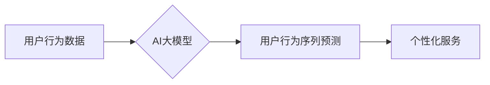

                 

## AI大模型在电商平台用户行为序列建模中的作用

> 关键词：电商平台、用户行为序列、AI大模型、序列建模、推荐系统、个性化服务、深度学习

## 1. 背景介绍

随着电商平台的蓬勃发展，用户行为数据呈指数级增长。这些数据蕴含着丰富的用户偏好、购买习惯和潜在需求，是提升用户体验、精准营销和提高商业效益的关键资源。用户行为序列建模旨在从用户在电商平台上的历史行为数据中挖掘潜在模式，预测用户未来的行为，从而为电商平台提供更精准的个性化服务。

传统的用户行为序列建模方法主要依赖于规则引擎和统计模型，例如 Markov 链和 Hidden Markov 模型。然而，这些方法在捕捉复杂的用户行为模式和处理高维数据方面存在局限性。近年来，随着深度学习技术的快速发展，AI大模型在用户行为序列建模领域展现出巨大的潜力。

## 2. 核心概念与联系

**2.1 核心概念**

* **用户行为序列:** 指用户在电商平台上进行的一系列交互行为，例如浏览商品、加入购物车、下单购买、评价商品等。
* **AI大模型:** 指拥有海量参数和强大的学习能力的深度学习模型，例如 Transformer、BERT、GPT 等。
* **序列建模:** 指针对时间序列数据进行建模，预测未来事件或序列。

**2.2 架构图**



**2.3 联系**

AI大模型通过学习用户行为序列的复杂模式，能够更准确地预测用户的未来行为。这些预测结果可以用于提供个性化服务，例如推荐商品、个性化广告、定制化优惠等，从而提升用户体验和商业效益。

## 3. 核心算法原理 & 具体操作步骤

**3.1 算法原理概述**

常用的AI大模型序列建模算法包括：

* **循环神经网络 (RNN):** RNN能够处理时间序列数据，并捕捉序列中的长期依赖关系。
* **长短期记忆网络 (LSTM):** LSTM是一种改进的RNN，能够更有效地处理长序列数据。
* **Transformer:** Transformer是一种基于注意力机制的序列建模模型，能够捕捉序列中的全局依赖关系，并具有更强的泛化能力。

**3.2 算法步骤详解**

1. **数据预处理:** 将用户行为数据转换为模型可识别的格式，例如将用户行为序列转换为数字编码。
2. **模型训练:** 使用训练数据训练选择的AI大模型，例如使用LSTM模型训练用户行为序列预测模型。
3. **模型评估:** 使用测试数据评估模型的性能，例如使用准确率、召回率等指标评估模型的预测精度。
4. **模型部署:** 将训练好的模型部署到电商平台，用于预测用户的未来行为。

**3.3 算法优缺点**

| 算法 | 优点 | 缺点 |
|---|---|---|
| RNN | 能够处理时间序列数据，捕捉序列中的短期依赖关系 | 难以处理长序列数据，梯度消失问题 |
| LSTM | 能够更有效地处理长序列数据，克服了RNN的梯度消失问题 | 计算复杂度较高 |
| Transformer | 能够捕捉序列中的全局依赖关系，具有更强的泛化能力 | 计算复杂度最高 |

**3.4 算法应用领域**

* **商品推荐:** 根据用户的历史行为序列推荐相关的商品。
* **个性化广告:** 根据用户的兴趣和行为特征展示个性化的广告。
* **用户画像:** 从用户的行为序列中构建用户画像，了解用户的兴趣爱好和消费习惯。
* **欺诈检测:** 检测用户的异常行为，例如恶意刷单、虚假交易等。

## 4. 数学模型和公式 & 详细讲解 & 举例说明

**4.1 数学模型构建**

假设用户行为序列为 $x = (x_1, x_2, ..., x_T)$，其中 $x_t$ 表示用户在时间步 $t$ 的行为。目标是预测用户在时间步 $T+1$ 的行为 $x_{T+1}$。

可以使用以下数学模型来表示用户行为序列预测问题：

$$
\hat{x}_{T+1} = f(x_1, x_2, ..., x_T, \theta)
$$

其中：

* $\hat{x}_{T+1}$ 是预测的用户行为。
* $f$ 是一个映射函数，例如深度神经网络。
* $\theta$ 是模型的参数。

**4.2 公式推导过程**

具体的公式推导过程取决于选择的AI大模型类型。例如，对于LSTM模型，公式推导过程涉及到隐藏状态的更新和输出的计算。

**4.3 案例分析与讲解**

假设用户在电商平台上浏览了以下商品：

* $x_1$: 手机
* $x_2$: 耳机
* $x_3$: 电脑

可以使用LSTM模型学习用户行为序列，并预测用户在下一个时间步 $T+1$ 会浏览什么商品。

## 5. 项目实践：代码实例和详细解释说明

**5.1 开发环境搭建**

* Python 3.x
* TensorFlow 或 PyTorch 深度学习框架
* Jupyter Notebook 或 VS Code 开发环境

**5.2 源代码详细实现**

```python
import tensorflow as tf

# 定义LSTM模型
model = tf.keras.Sequential([
    tf.keras.layers.LSTM(units=64, return_sequences=True, input_shape=(timesteps, features)),
    tf.keras.layers.LSTM(units=32),
    tf.keras.layers.Dense(units=num_classes)
])

# 编译模型
model.compile(optimizer='adam', loss='sparse_categorical_crossentropy', metrics=['accuracy'])

# 训练模型
model.fit(x_train, y_train, epochs=10, batch_size=32)

# 预测用户行为
predictions = model.predict(x_test)
```

**5.3 代码解读与分析**

* 代码首先定义了一个LSTM模型，包含两个LSTM层和一个全连接层。
* 模型使用Adam优化器，损失函数为稀疏类别交叉熵，评价指标为准确率。
* 模型使用训练数据进行训练，训练epochs为10，每次训练batch_size为32。
* 训练完成后，使用测试数据进行预测，并输出预测结果。

**5.4 运行结果展示**

运行结果展示了模型的预测精度，例如准确率、召回率等。

## 6. 实际应用场景

**6.1 商品推荐**

AI大模型可以根据用户的历史浏览、购买和评价行为，推荐相关的商品，提升用户购物体验和转化率。

**6.2 个性化广告**

AI大模型可以根据用户的兴趣和行为特征，展示个性化的广告，提高广告点击率和转化率。

**6.3 用户画像**

AI大模型可以从用户的行为序列中构建用户画像，了解用户的兴趣爱好、消费习惯和价值观，为精准营销提供数据支持。

**6.4 未来应用展望**

* **更精准的个性化服务:** AI大模型可以进一步提升个性化服务的精准度，例如根据用户的实时行为动态调整商品推荐和广告展示。
* **更智能的交互体验:** AI大模型可以与用户进行更智能的交互，例如通过自然语言处理技术理解用户的需求，并提供更精准的回复。
* **更有效的营销策略:** AI大模型可以帮助电商平台制定更有效的营销策略，例如根据用户的行为特征进行精准的群组划分和个性化营销。

## 7. 工具和资源推荐

**7.1 学习资源推荐**

* **书籍:**
    * 深度学习
    * 自然语言处理
* **在线课程:**
    * Coursera
    * edX
    * Udacity

**7.2 开发工具推荐**

* **TensorFlow:** https://www.tensorflow.org/
* **PyTorch:** https://pytorch.org/
* **Jupyter Notebook:** https://jupyter.org/

**7.3 相关论文推荐**

* Attention Is All You Need
* BERT: Pre-training of Deep Bidirectional Transformers for Language Understanding

## 8. 总结：未来发展趋势与挑战

**8.1 研究成果总结**

AI大模型在电商平台用户行为序列建模领域取得了显著成果，能够更准确地预测用户的未来行为，并为电商平台提供更精准的个性化服务。

**8.2 未来发展趋势**

* **模型更深更广:** 未来AI大模型将更加深层、更加广泛，能够捕捉更复杂的用户行为模式。
* **数据更丰富更精准:** 未来电商平台将收集更多更精准的用户行为数据，为AI大模型提供更丰富的训练数据。
* **应用场景更丰富:** AI大模型将在电商平台的更多应用场景中发挥作用，例如用户画像、欺诈检测、客户服务等。

**8.3 面临的挑战**

* **数据隐私保护:** 

AI大模型需要处理大量用户行为数据，如何保护用户隐私是一个重要的挑战。
* **模型可解释性:** 

AI大模型的决策过程往往是复杂的，如何提高模型的可解释性是一个重要的研究方向。
* **模型公平性:** 

AI大模型可能会存在偏见，如何确保模型的公平性是一个重要的伦理问题。

**8.4 研究展望**

未来研究将继续探索AI大模型在电商平台用户行为序列建模领域的应用，并解决上述挑战，推动AI技术在电商领域的更广泛应用。

## 9. 附录：常见问题与解答

**9.1 如何选择合适的AI大模型？**

选择合适的AI大模型取决于具体的应用场景和数据特点。例如，对于短序列数据，RNN模型可能更合适；对于长序列数据，LSTM或Transformer模型可能更合适。

**9.2 如何处理用户行为序列中的缺失数据？**

可以使用多种方法处理用户行为序列中的缺失数据，例如平均值填充、线性插值、KNN填充等。

**9.3 如何评估AI大模型的性能？**

可以使用多种指标评估AI大模型的性能，例如准确率、召回率、F1-score、AUC等。

作者：禅与计算机程序设计艺术 / Zen and the Art of Computer Programming 


<end_of_turn>

