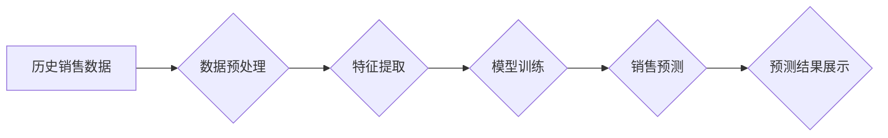

                 

## AI大模型在电商平台销售预测精确化中的应用

> 关键词：电商平台、销售预测、AI大模型、深度学习、时间序列分析、机器学习、数据挖掘、预测模型

## 1. 背景介绍

在当今数据爆炸的时代，电商平台面临着日益激烈的市场竞争。准确预测商品销售量是电商平台运营的关键环节，它直接影响着库存管理、价格策略、营销活动策划等多个方面。传统的销售预测方法往往依赖于历史数据和经验判断，难以捕捉到市场变化的复杂性和动态性。

近年来，人工智能（AI）技术蓬勃发展，特别是深度学习算法的突破，为电商平台销售预测带来了新的机遇。AI大模型凭借其强大的学习能力和数据处理能力，能够从海量数据中挖掘出隐藏的模式和趋势，从而实现更精确、更智能的销售预测。

## 2. 核心概念与联系

### 2.1  电商平台销售预测

电商平台销售预测是指利用历史销售数据、市场趋势、用户行为等信息，预测未来一段时间内特定商品的销售量。准确的销售预测可以帮助电商平台优化库存管理、制定合理的定价策略、提高营销活动效率，最终提升盈利能力。

### 2.2  AI大模型

AI大模型是指训练数据量巨大、参数规模庞大的深度学习模型。这类模型通常具有强大的泛化能力和学习能力，能够处理复杂的数据模式和关系，在自然语言处理、图像识别、语音合成等领域取得了突破性进展。

### 2.3  核心概念联系

AI大模型在电商平台销售预测中的应用，主要体现在以下几个方面：

* **数据挖掘:** AI大模型能够从海量电商平台数据中挖掘出隐藏的模式和趋势，例如用户购买行为、商品属性、市场价格等，为销售预测提供更丰富的输入数据。
* **特征提取:** AI大模型可以自动学习和提取重要的特征，例如用户画像、商品相似度、季节性影响等，这些特征对销售预测具有重要意义。
* **模型训练:** AI大模型可以利用历史销售数据和提取的特征进行训练，建立更精确的销售预测模型。
* **预测结果:** AI大模型可以输出未来一段时间内特定商品的销售量预测结果，为电商平台决策提供参考依据。

**Mermaid 流程图**



## 3. 核心算法原理 & 具体操作步骤

### 3.1  算法原理概述

在电商平台销售预测中，常用的AI大模型算法包括：

* **深度神经网络 (DNN):** DNN能够学习复杂的非线性关系，适用于处理海量数据和多维特征。
* **循环神经网络 (RNN):** RNN具有记忆能力，能够处理时间序列数据，适用于预测具有时间依赖性的销售趋势。
* **长短期记忆网络 (LSTM):** LSTM是一种改进的RNN，能够更好地处理长序列数据，更适合预测长期销售趋势。
* **Transformer:** Transformer是一种基于注意力机制的网络结构，能够捕捉数据中的长距离依赖关系，在自然语言处理领域取得了突破性进展，也逐渐应用于销售预测领域。

### 3.2  算法步骤详解

以深度神经网络为例，其在电商平台销售预测中的具体操作步骤如下：

1. **数据收集:** 收集历史销售数据、用户行为数据、商品属性数据、市场价格数据等相关信息。
2. **数据预处理:** 对收集到的数据进行清洗、转换、归一化等处理，使其符合模型训练的要求。
3. **特征工程:** 从原始数据中提取重要的特征，例如用户画像、商品相似度、季节性影响等，这些特征可以帮助模型更好地理解销售趋势。
4. **模型构建:** 根据实际需求选择合适的深度神经网络结构，并设置模型参数。
5. **模型训练:** 利用历史销售数据和提取的特征对模型进行训练，调整模型参数，使其能够准确预测未来销售量。
6. **模型评估:** 使用测试数据对模型进行评估，评估模型的预测精度、鲁棒性等指标。
7. **模型部署:** 将训练好的模型部署到线上环境，用于实时预测商品销售量。

### 3.3  算法优缺点

**深度神经网络**

* **优点:** 能够学习复杂的非线性关系，处理海量数据和多维特征，预测精度高。
* **缺点:** 训练时间长，参数量大，需要大量的计算资源，易受过拟合影响。

### 3.4  算法应用领域

深度神经网络、循环神经网络、长短期记忆网络等AI大模型算法广泛应用于以下领域：

* **电商平台销售预测:** 预测商品销售量、库存需求、价格波动等。
* **金融风险评估:** 评估贷款风险、识别欺诈交易等。
* **医疗诊断:** 辅助医生诊断疾病、预测患者病情等。
* **自然语言处理:** 机器翻译、文本摘要、情感分析等。

## 4. 数学模型和公式 & 详细讲解 & 举例说明

### 4.1  数学模型构建

在电商平台销售预测中，常用的数学模型包括时间序列模型和回归模型。

* **时间序列模型:** 

时间序列模型假设销售量随着时间呈现一定的规律性变化，例如季节性、趋势性等。常用的时间序列模型包括ARIMA模型、SARIMA模型等。

* **回归模型:** 回归模型假设销售量与其他因素之间存在线性或非线性关系，例如商品价格、用户数量、市场营销活动等。常用的回归模型包括线性回归、逻辑回归、支持向量机等。

### 4.2  公式推导过程

**ARIMA模型**

ARIMA模型是一种基于自回归（AR）、移动平均（MA）和季节性自回归移动平均（SARIMA）的模型，其核心公式如下：

$$y_t = c + \phi_1 y_{t-1} + \phi_2 y_{t-2} + ... + \phi_p y_{t-p} + \theta_1 \epsilon_{t-1} + \theta_2 \epsilon_{t-2} + ... + \theta_q \epsilon_{t-q} + \epsilon_t$$

其中：

* $y_t$ 表示时间t的销售量
* $c$ 表示截距项
* $\phi_i$ 表示自回归系数
* $y_{t-i}$ 表示时间t-i的销售量
* $\theta_j$ 表示移动平均系数
* $\epsilon_{t-j}$ 表示时间t-j的随机误差项
* $p$ 表示自回归阶数
* $q$ 表示移动平均阶数

### 4.3  案例分析与讲解

假设我们想要预测某商品未来一周的销售量，可以使用ARIMA模型进行预测。首先，我们需要收集该商品的历史销售数据，并对其进行分析，确定ARIMA模型的阶数p和q。然后，我们可以使用ARIMA模型公式对历史数据进行拟合，得到模型参数。最后，利用拟合好的模型参数，对未来一周的销售量进行预测。

## 5. 项目实践：代码实例和详细解释说明

### 5.1  开发环境搭建

* **操作系统:** Linux/macOS/Windows
* **编程语言:** Python
* **深度学习框架:** TensorFlow/PyTorch
* **数据处理库:** Pandas/NumPy
* **可视化库:** Matplotlib/Seaborn

### 5.2  源代码详细实现

```python
import pandas as pd
from sklearn.model_selection import train_test_split
from tensorflow.keras.models import Sequential
from tensorflow.keras.layers import Dense

# 1. 数据加载和预处理
data = pd.read_csv('sales_data.csv')
data['Date'] = pd.to_datetime(data['Date'])
data = data.set_index('Date')
# ... 数据清洗、特征工程等操作

# 2. 数据分割
X_train, X_test, y_train, y_test = train_test_split(data.drop('Sales', axis=1), data['Sales'], test_size=0.2)

# 3. 模型构建
model = Sequential()
model.add(Dense(64, activation='relu', input_shape=(X_train.shape[1],)))
model.add(Dense(32, activation='relu'))
model.add(Dense(1))

# 4. 模型编译
model.compile(loss='mean_squared_error', optimizer='adam')

# 5. 模型训练
model.fit(X_train, y_train, epochs=100, batch_size=32)

# 6. 模型评估
loss = model.evaluate(X_test, y_test)
print('测试损失:', loss)

# 7. 模型预测
predictions = model.predict(X_test)
```

### 5.3  代码解读与分析

* **数据加载和预处理:** 首先，我们需要加载销售数据，并对其进行预处理，例如清洗数据、转换数据类型、提取特征等。
* **数据分割:** 将数据分为训练集和测试集，用于模型训练和评估。
* **模型构建:** 使用深度学习框架构建一个深度神经网络模型，例如使用Sequential模型添加多个Dense层。
* **模型编译:** 配置模型的损失函数、优化器等参数。
* **模型训练:** 使用训练数据训练模型，并调整模型参数。
* **模型评估:** 使用测试数据评估模型的性能，例如计算测试损失。
* **模型预测:** 使用训练好的模型对新的数据进行预测。

### 5.4  运行结果展示

运行代码后，会输出模型的测试损失值，以及模型对测试数据的预测结果。我们可以通过这些结果来评估模型的性能。

## 6. 实际应用场景

### 6.1  库存管理

AI大模型可以预测商品的未来销量，帮助电商平台优化库存管理，避免库存积压或缺货。

### 6.2  定价策略

AI大模型可以分析市场价格、用户需求等因素，帮助电商平台制定更合理的定价策略，提高利润率。

### 6.3  营销活动策划

AI大模型可以预测用户购买行为，帮助电商平台策划更精准的营销活动，提高营销效果。

### 6.4  未来应用展望

随着AI技术的不断发展，AI大模型在电商平台销售预测中的应用将更加广泛和深入，例如：

* **个性化推荐:** 基于用户的购买历史和行为特征，为用户提供个性化的商品推荐。
* **动态定价:** 根据实时市场需求和用户行为，动态调整商品价格，实现更精准的定价策略。
* **预测性维护:** 利用AI大模型预测商品的故障率，提前进行维护，降低运营成本。

## 7. 工具和资源推荐

### 7.1  学习资源推荐

* **书籍:**
    * Deep Learning by Ian Goodfellow, Yoshua Bengio, and Aaron Courville
    * Hands-On Machine Learning with Scikit-Learn, Keras & TensorFlow by Aurélien Géron
* **在线课程:**
    * TensorFlow Tutorials: https://www.tensorflow.org/tutorials
    * PyTorch Tutorials: https://pytorch.org/tutorials/

### 7.2  开发工具推荐

* **深度学习框架:** TensorFlow, PyTorch
* **数据处理库:** Pandas, NumPy
* **可视化库:** Matplotlib, Seaborn

### 7.3  相关论文推荐

* **Attention Is All You Need:** https://arxiv.org/abs/1706.03762
* **Recurrent Neural Networks for Sequence Learning:** https://www.cs.toronto.edu/~graves/preprint.pdf

## 8. 总结：未来发展趋势与挑战

### 8.1  研究成果总结

AI大模型在电商平台销售预测领域取得了显著的成果，能够提高预测精度、降低预测成本，为电商平台运营提供更精准的决策支持。

### 8.2  未来发展趋势

* **模型复杂度提升:** 未来，AI大模型的复杂度将进一步提升，例如使用更深层的网络结构、更丰富的模型参数，以提高预测精度。
* **数据融合:** 将来自不同来源的数据融合在一起，例如用户行为数据、商品属性数据、市场价格数据等，以构建更全面的销售预测模型。
* **解释性增强:** 提高AI大模型的解释性，使预测结果更易于理解和解释，增强用户对模型的信任度。

### 8.3  面临的挑战

* **数据质量:** AI大模型的性能依赖于数据质量，需要不断提高数据采集、清洗、预处理等环节的效率和准确性。
* **模型 interpretability:** 提高模型的可解释性，使预测结果更易于理解和信任，是未来研究的重要方向。
* **计算资源:** 训练大型AI大模型需要大量的计算资源，如何降低训练成本，提高训练效率是需要解决的挑战。

### 8.4  研究展望

未来，AI大模型在电商平台销售预测领域将继续发挥重要作用，并与其他技术融合，例如自然语言处理、计算机视觉等，构建更智能、更全面的销售预测系统。


## 9. 附录：常见问题与解答

**Q1: 如何选择合适的AI大模型算法？**

**A1:** 选择合适的AI大模型算法需要根据实际需求和数据特点进行选择。例如，如果销售数据呈现明显的季节性变化，可以使用SARIMA模型；如果销售数据与其他因素存在复杂的关系，可以使用深度神经网络模型。

**Q2: 如何评估AI大模型的预测精度？**

**A2:** 可以使用多种指标来评估AI大模型的预测精度，例如均方误差（MSE）、平均绝对误差（MAE）、R-squared等。

**Q3: 如何提高AI大模型的预测精度？**

**A3:** 可以通过以下方式提高AI大模型的预测精度：

* 提高数据质量
* 优化模型结构
* 调整模型参数
* 使用更丰富的特征


作者：禅与计算机程序设计艺术 / Zen and the Art of Computer Programming 
<end_of_turn>

