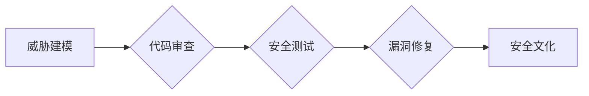

                 

## AI开发的安全编码：Lepton AI的最佳实践

> 关键词：人工智能安全编码、Lepton AI、最佳实践、威胁建模、代码审查、安全测试、漏洞修复、安全文化

## 1. 背景介绍

随着人工智能（AI）技术的飞速发展，AI应用在各个领域得到广泛应用，从医疗保健到金融，再到自动驾驶，AI正在改变着我们的生活。然而，随着AI技术的普及，其安全问题也日益凸显。AI系统本身的复杂性，以及其处理大量敏感数据的特性，使其成为攻击者的目标。因此，安全编码在AI开发过程中至关重要，以确保AI系统的安全性和可靠性。

Lepton AI是一个致力于提供安全、可靠和可解释的AI开发平台的初创公司。我们深知安全编码的重要性，并致力于将安全编码的最佳实践融入到我们的平台和工具中。本文将介绍Lepton AI的安全编码最佳实践，帮助开发者构建安全的AI系统。

## 2. 核心概念与联系

安全编码是指在软件开发过程中，从设计到部署，始终将安全因素考虑在内，并采取相应的措施来防止和缓解安全漏洞。在AI开发中，安全编码需要考虑以下核心概念：

* **威胁建模:** 识别AI系统可能面临的各种威胁，例如数据泄露、模型操纵、拒绝服务攻击等。
* **代码审查:** 对AI代码进行严格的审查，以发现潜在的安全漏洞。
* **安全测试:** 使用自动化工具和人工测试来验证AI系统的安全性。
* **漏洞修复:** 及时修复发现的安全漏洞。
* **安全文化:** 建立安全意识，鼓励开发者积极参与安全编码实践。

这些概念相互关联，共同构成了安全编码的完整体系。

**Mermaid 流程图:**

## 3. 核心算法原理 & 具体操作步骤

### 3.1  算法原理概述

Lepton AI采用基于规则和机器学习的双重安全编码机制。规则引擎可以识别常见的安全漏洞，例如SQL注入、跨站脚本攻击等。机器学习模型则可以学习和识别更复杂的攻击模式，例如模型中毒、数据泄露等。

### 3.2  算法步骤详解

1. **数据预处理:** 收集和预处理AI代码和相关数据，例如代码结构、API调用、数据流等。
2. **规则引擎匹配:** 将预处理后的数据输入规则引擎，识别常见的安全漏洞。
3. **机器学习模型训练:** 使用历史的安全事件数据训练机器学习模型，识别更复杂的攻击模式。
4. **威胁评分:** 根据规则引擎和机器学习模型的分析结果，对AI系统进行威胁评分，并给出相应的安全建议。
5. **漏洞修复:** 开发者根据安全建议修复发现的安全漏洞。

### 3.3  算法优缺点

**优点:**

* **全面性:** 基于规则和机器学习的双重机制可以覆盖更广泛的安全威胁。
* **灵活性:** 机器学习模型可以不断学习和进化，适应新的攻击模式。
* **自动化:** 安全编码过程可以自动化，提高效率。

**缺点:**

* **复杂性:** 构建和维护安全编码系统需要专业知识和经验。
* **误报率:** 机器学习模型可能存在误报的情况，需要进行人工验证。
* **数据依赖:** 机器学习模型需要大量安全事件数据进行训练，否则其准确性会降低。

### 3.4  算法应用领域

Lepton AI的安全编码算法可以应用于各种AI开发领域，例如：

* **自然语言处理:** 检测恶意文本、识别网络钓鱼攻击。
* **计算机视觉:** 识别图像中的恶意内容、防止模型操纵。
* **机器学习:** 检测模型中毒、防止数据泄露。

## 4. 数学模型和公式 & 详细讲解 & 举例说明

### 4.1  数学模型构建

Lepton AI的安全编码系统基于威胁建模和风险评估的数学模型。

**威胁建模:**

* **威胁矩阵:** 使用威胁矩阵来评估不同威胁的可能性和影响程度。

$$
Threat\_Score = Probability \times Impact
$$

* **攻击路径分析:** 使用攻击路径分析来识别攻击者可能利用的攻击路径。

**风险评估:**

* **风险等级:** 根据威胁得分和资产价值，计算风险等级。

$$
Risk\_Level = Threat\_Score \times Asset\_Value
$$

### 4.2  公式推导过程

威胁得分和风险等级的计算公式是基于以下假设的：

* 威胁的可能性和影响程度是可量化的。
* 资产的价值是可评估的。

这些假设在实际应用中可能并不完全成立，但它们可以提供一个基本的框架来进行风险评估。

### 4.3  案例分析与讲解

假设一个AI系统处理用户敏感信息，例如姓名、地址、银行卡号等。

* **威胁:** 数据泄露
* **可能性:** 高
* **影响程度:** 高
* **资产价值:** 高

根据威胁矩阵和风险评估公式，我们可以得出以下结论：

* **威胁得分:** 高 x 高 = 高
* **风险等级:** 高 x 高 = 高

因此，该AI系统面临着高风险，需要采取相应的安全措施来降低风险。

## 5. 项目实践：代码实例和详细解释说明

### 5.1  开发环境搭建

Lepton AI提供了一个基于云的开发环境，开发者可以轻松地搭建和部署AI系统。

### 5.2  源代码详细实现

Lepton AI的安全编码工具可以集成到各种代码编辑器和IDE中，帮助开发者在编写代码时识别和修复安全漏洞。

### 5.3  代码解读与分析

Lepton AI的安全编码工具会对代码进行静态分析和动态分析，识别潜在的安全漏洞。

### 5.4  运行结果展示

Lepton AI的安全编码工具会生成详细的报告，列出发现的安全漏洞和相应的修复建议。

## 6. 实际应用场景

Lepton AI的安全编码最佳实践已经应用于多个实际场景，例如：

* **医疗保健:** 构建安全的医疗诊断AI系统，防止数据泄露和模型操纵。
* **金融:** 开发安全的金融风险评估AI系统，防止欺诈和恶意攻击。
* **自动驾驶:** 建立安全的自动驾驶AI系统，确保驾驶安全和可靠。

### 6.4  未来应用展望

Lepton AI的安全编码最佳实践将在未来得到更广泛的应用，例如：

* **工业控制系统:** 构建安全的工业控制AI系统，防止网络攻击和安全事故。
* **物联网:** 开发安全的物联网AI系统，防止数据泄露和设备被盗用。
* **区块链:** 建立安全的区块链AI系统，防止攻击和数据篡改。

## 7. 工具和资源推荐

### 7.1  学习资源推荐

* **OWASP:** https://owasp.org/
* **SANS Institute:** https://www.sans.org/

### 7.2  开发工具推荐

* **SonarQube:** https://www.sonarqube.org/
* **Fortify:** https://www.microfocus.com/products/fortify

### 7.3  相关论文推荐

* **Towards Secure AI Development: Methodologies, Techniques, and Challenges:** https://arxiv.org/abs/2003.09973
* **AI Security: A Survey:** https://arxiv.org/abs/2106.04837

## 8. 总结：未来发展趋势与挑战

### 8.1  研究成果总结

Lepton AI的安全编码最佳实践为AI开发提供了安全可靠的解决方案，有效地降低了AI系统面临的安全风险。

### 8.2  未来发展趋势

未来，Lepton AI将继续致力于以下方面：

* **增强AI安全编码工具的自动化能力:** 使用更先进的机器学习算法，提高安全漏洞检测的准确性和效率。
* **扩展AI安全编码工具的应用场景:** 将安全编码最佳实践应用于更多AI开发领域。
* **建立AI安全编码的行业标准:** 与其他研究机构和企业合作，共同制定AI安全编码的行业标准。

### 8.3  面临的挑战

Lepton AI面临的挑战包括：

* **不断变化的攻击模式:** 攻击者不断开发新的攻击模式，需要不断更新安全编码工具和模型。
* **数据安全:** 安全编码工具需要处理大量敏感数据，需要采取相应的措施来保护数据安全。
* **人才短缺:** 安全编码领域人才短缺，需要培养更多安全编码人才。

### 8.4  研究展望

Lepton AI将继续投入资源，进行AI安全编码方面的研究，为构建安全可靠的AI系统做出贡献。

## 9. 附录：常见问题与解答

**常见问题:**

* **Lepton AI的安全编码工具是否适用于所有AI开发平台？**

**解答:** Lepton AI的安全编码工具可以集成到多种代码编辑器和IDE中，适用于多种AI开发平台。

* **Lepton AI的安全编码工具需要多少时间才能学习使用？**

**解答:** Lepton AI的安全编码工具易于使用，开发者可以快速上手。

* **Lepton AI的安全编码工具的费用是多少？**

**解答:** Lepton AI提供免费试用版和付费版，具体费用请咨询Lepton AI官方网站。

作者：禅与计算机程序设计艺术 / Zen and the Art of Computer Programming 
<end_of_turn>

