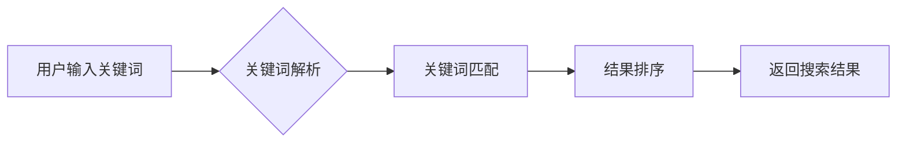

                 

## AI搜索引擎与传统搜索引擎的效率对比

> 关键词：人工智能、搜索引擎、自然语言处理、机器学习、深度学习、信息检索、效率、准确性、用户体验

## 1. 背景介绍

随着互联网信息爆炸式增长，传统基于关键词匹配的搜索引擎逐渐难以满足用户日益复杂的搜索需求。人们不再仅仅依赖简单的关键词查询，而是希望搜索引擎能够理解用户的意图，并提供更精准、更相关的搜索结果。 

人工智能（AI）技术的快速发展为搜索引擎带来了新的机遇。AI搜索引擎利用自然语言处理（NLP）、机器学习（ML）和深度学习（DL）等技术，能够更深入地理解用户查询，并根据用户的搜索历史、偏好和上下文信息，提供更加个性化、智能化的搜索体验。

## 2. 核心概念与联系

### 2.1  传统搜索引擎

传统搜索引擎的核心原理是基于关键词匹配。它通过爬虫抓取网页内容，并建立一个庞大的索引库。当用户输入查询关键词时，搜索引擎会根据关键词在索引库中的出现频率和位置，返回与关键词相关度最高的网页结果。

**传统搜索引擎架构流程图：**



### 2.2  AI搜索引擎

AI搜索引擎则更加注重理解用户的搜索意图。它利用NLP技术将用户查询转换为机器可理解的语义表示，并通过ML和DL算法学习用户行为模式和搜索偏好。

**AI搜索引擎架构流程图：**


## 3. 核心算法原理 & 具体操作步骤

### 3.1  算法原理概述

AI搜索引擎的核心算法主要包括：

* **自然语言处理（NLP）:** 用于理解用户查询的语义含义，包括词性标注、依存句法分析、命名实体识别等。
* **机器学习（ML）:** 用于训练模型，学习用户行为模式和搜索偏好，例如推荐系统、点击率预测等。
* **深度学习（DL）:** 用于构建更复杂的语义理解模型，例如Transformer模型，能够捕捉长距离依赖关系，提升搜索结果的准确性。

### 3.2  算法步骤详解

1. **用户查询预处理:** 将用户输入的查询文本进行清洗、分词、词性标注等预处理操作，转化为机器可理解的格式。
2. **语义表示构建:** 利用NLP技术，将预处理后的查询文本转换为语义向量，例如Word2Vec、GloVe等词嵌入模型。
3. **知识图谱查询:** 将语义向量与知识图谱进行匹配，获取与查询相关的实体和关系信息，丰富搜索结果的上下文理解。
4. **机器学习模型训练:** 利用历史搜索数据和用户行为数据，训练机器学习模型，例如排名模型、推荐模型等，预测用户对不同搜索结果的兴趣和点击率。
5. **结果排序与排名:** 根据机器学习模型的预测结果，对搜索结果进行排序和排名，将最相关的结果展示在用户面前。
6. **结果展示与反馈:** 将排序后的搜索结果展示给用户，并收集用户点击、反馈等信息，用于模型的持续优化和改进。

### 3.3  算法优缺点

**优点:**

* **更精准的搜索结果:** AI搜索引擎能够理解用户的搜索意图，提供更精准、更相关的搜索结果。
* **更个性化的搜索体验:** AI搜索引擎可以根据用户的搜索历史、偏好和上下文信息，提供更加个性化的搜索体验。
* **更丰富的搜索结果:** AI搜索引擎可以利用知识图谱等信息资源，提供更丰富的搜索结果，例如实体信息、关系信息等。

**缺点:**

* **算法复杂度高:** AI搜索引擎的算法更加复杂，需要大量的计算资源和数据支持。
* **数据依赖性强:** AI搜索引擎的性能依赖于训练数据的质量和数量，数据不足或数据偏差会导致模型性能下降。
* **解释性差:** AI模型的决策过程往往是黑箱，难以解释模型的决策逻辑，这可能会导致用户对搜索结果的信任度降低。

### 3.4  算法应用领域

AI搜索引擎的应用领域非常广泛，包括：

* **搜索引擎:** 谷歌、百度等搜索引擎已经开始将AI技术应用于搜索结果排名和推荐系统。
* **电商平台:** 电商平台利用AI搜索引擎，帮助用户更精准地找到所需商品，提高转化率。
* **问答系统:** AI搜索引擎可以用于构建智能问答系统，例如聊天机器人、虚拟助手等。
* **医疗诊断:** AI搜索引擎可以帮助医生快速查找相关医学文献和案例，辅助诊断疾病。

## 4. 数学模型和公式 & 详细讲解 & 举例说明

### 4.1  数学模型构建

AI搜索引擎的核心算法通常基于机器学习模型，例如排名模型、推荐模型等。这些模型通常使用数学公式来描述其学习过程和预测结果。

**举例说明：**

* **排序模型:** 常见的排序模型包括逻辑回归、支持向量机、深度神经网络等。这些模型使用数学公式来计算每个搜索结果的得分，并将得分高的结果排在前面。

**逻辑回归模型的公式:**

$$
P(y=1|x) = \frac{1}{1 + e^{-(w^T x + b)}}
$$

其中：

* $P(y=1|x)$ 是给定输入 $x$ 时，预测结果为 1 的概率。
* $w$ 是模型参数向量。
* $x$ 是输入特征向量。
* $b$ 是模型偏置项。

* **推荐模型:** 推荐模型通常使用协同过滤算法或深度学习模型，例如神经网络推荐器。这些模型学习用户和物品之间的关系，并预测用户对特定物品的兴趣。

**协同过滤算法的公式:**

$$
r_{ui} = \frac{ \sum_{j \in N(u)} \frac{s_{uj} * s_{ij}}{\sqrt{\sum_{k \in N(u)} s_{uk}^2} * \sqrt{\sum_{k \in N(i)} s_{ik}^2}} }{\sum_{j \in N(u)} \frac{s_{uj}}{\sqrt{\sum_{k \in N(u)} s_{uk}^2}}}
$$

其中：

* $r_{ui}$ 是用户 $u$ 对物品 $i$ 的评分。
* $s_{uj}$ 是用户 $u$ 对物品 $j$ 的评分。
* $N(u)$ 是用户 $u$ 评分过的物品集合。
* $N(i)$ 是物品 $i$ 被评分过的用户集合。

### 4.2  公式推导过程

AI搜索引擎的数学模型推导过程通常比较复杂，涉及到概率论、统计学、机器学习等多个领域。

**举例说明:**

* **排名模型的公式推导:** 通常需要使用最大似然估计或贝叶斯方法，根据训练数据推导模型参数，使得模型能够最大化预测结果的准确性。

### 4.3  案例分析与讲解

AI搜索引擎的数学模型在实际应用中需要根据具体场景进行调整和优化。

**举例说明:**

* **电商平台的推荐模型:** 需要考虑用户购买历史、浏览记录、商品属性等多种因素，并根据这些因素构建个性化的推荐模型。

## 5. 项目实践：代码实例和详细解释说明

### 5.1  开发环境搭建

AI搜索引擎的开发环境通常需要包含以下软件：

* **Python:** AI搜索引擎的开发语言。
* **深度学习框架:** TensorFlow、PyTorch等深度学习框架用于构建和训练深度学习模型。
* **NLP库:** NLTK、spaCy等NLP库用于进行自然语言处理任务。
* **数据库:** 用于存储搜索数据和用户行为数据。

### 5.2  源代码详细实现

由于篇幅限制，这里只提供一个简单的AI搜索引擎代码示例，用于演示基本原理。

```python
import nltk
from sklearn.feature_extraction.text import TfidfVectorizer
from sklearn.metrics.pairwise import cosine_similarity

# 下载 nltk 数据集
nltk.download('punkt')

# 定义一个简单的搜索引擎类
class SimpleSearchEngine:
    def __init__(self):
        self.documents = []
        self.vectorizer = None

    def add_document(self, document):
        self.documents.append(document)

    def build_index(self):
        self.vectorizer = TfidfVectorizer()
        self.vectorizer.fit(self.documents)

    def search(self, query):
        query_vector = self.vectorizer.transform([query])
        similarity_scores = cosine_similarity(query_vector, self.vectorizer.transform(self.documents))
        return similarity_scores.argsort()[0][::-1]

# 示例使用
engine = SimpleSearchEngine()
engine.add_document("This is the first document.")
engine.add_document("This document is the second document.")
engine.build_index()

results = engine.search("document")
print(results)
```

### 5.3  代码解读与分析

* **TfidfVectorizer:** 用于将文本转换为TF-IDF向量，TF-IDF是一种常用的文本表示方法，可以衡量词在文档中的重要性。
* **cosine_similarity:** 用于计算两个向量的余弦相似度，余弦相似度可以衡量两个向量的方向相似性。
* **argsort:** 用于返回数组中元素从小到大排序的索引。

### 5.4  运行结果展示

运行上述代码，会输出一个包含索引的列表，表示查询“document”与所有文档的相似度排序。

## 6. 实际应用场景

AI搜索引擎已经广泛应用于各种场景，例如：

### 6.1  搜索引擎

* **谷歌:** 利用深度学习模型，例如BERT，提升搜索结果的准确性和相关性。
* **百度:** 开发了深度学习驱动的搜索引擎，例如ERNIE，能够理解用户的自然语言查询。

### 6.2  电商平台

* **亚马逊:** 利用协同过滤算法和深度学习模型，推荐用户可能感兴趣的商品。
* **淘宝:** 开发了AI驱动的搜索引擎，能够根据用户的搜索历史和偏好，提供个性化的商品推荐。

### 6.3  问答系统

* **微软必应:** 利用深度学习模型，构建智能问答系统，能够回答用户的各种问题。
* **百度AI问答:** 开发了基于深度学习的AI问答系统，能够理解用户的复杂问题，并提供准确的答案。

### 6.4  未来应用展望

AI搜索引擎的未来应用前景非常广阔，例如：

* **个性化搜索:** 更加精准地理解用户的搜索意图，提供更加个性化的搜索结果。
* **多模态搜索:** 支持多种输入方式，例如文本、图像、语音等，提供更加丰富的搜索体验。
* **实时搜索:** 能够实时更新搜索结果，提供更加及时和准确的信息。

## 7. 工具和资源推荐

### 7.1  学习资源推荐

* **书籍:**
    * 《深度学习》
    * 《自然语言处理》
    * 《机器学习实战》
* **在线课程:**
    * Coursera: 深度学习、自然语言处理
    * edX: 机器学习、数据科学
* **博客和网站:**
    * Google AI Blog
    * OpenAI Blog
    * Towards Data Science

### 7.2  开发工具推荐

* **Python:** 
* **深度学习框架:** TensorFlow、PyTorch
* **NLP库:** NLTK、spaCy
* **数据库:** MySQL、MongoDB

### 7.3  相关论文推荐

* **BERT: Pre-training of Deep Bidirectional Transformers for Language Understanding**
* **Attention Is All You Need**
* **Recurrent Neural Network for Sequence Learning**

## 8. 总结：未来发展趋势与挑战

### 8.1  研究成果总结

AI搜索引擎在搜索结果准确性、个性化程度和用户体验方面取得了显著的进步。深度学习模型的应用，使得搜索引擎能够更深入地理解用户的搜索意图，并提供更加精准、更加相关的搜索结果。

### 8.2  未来发展趋势

* **多模态搜索:** 支持多种输入方式，例如文本、图像、语音等，提供更加丰富的搜索体验。
* **个性化搜索:** 更加精准地理解用户的搜索意图，提供更加个性化的搜索结果。
* **实时搜索:** 能够实时更新搜索结果，提供更加及时和准确的信息。
* **解释性AI:** 提升AI模型的解释性，使得用户能够理解模型的决策逻辑。

### 8.3  面临的挑战

* **数据质量:** AI搜索引擎的性能依赖于训练数据的质量和数量，数据不足或数据偏差会导致模型性能下降。
* **算法复杂度:** AI搜索引擎的算法更加复杂，需要大量的计算资源和数据支持。
* **解释性差:** AI模型的决策过程往往是黑箱，难以解释模型的决策逻辑，这可能会导致用户对搜索结果的信任度降低。

### 8.4  研究展望

未来，AI搜索引擎的研究将更加注重以下几个方面:

* **提高数据质量:** 开发新的数据采集和清洗方法，提高训练数据的质量和数量。
* **降低算法复杂度:** 研究更加高效的算法，降低模型的计算复杂度。
* **提升模型解释性:** 研究新的解释性AI方法，使得AI模型的决策过程更加透明。


## 9. 附录：常见问题与解答

**Q1: AI搜索引擎和传统搜索引擎有什么区别？**

**A1:** AI搜索引擎利用自然语言处理、机器学习和深度学习等技术，能够更深入地理解用户的搜索意图，并提供更加精准、更加个性化的搜索结果。而传统搜索引擎则主要依靠关键词匹配，搜索结果的准确性和相关性相对较低。

**Q2: AI搜索引擎的未来发展趋势是什么？**

**A2:** AI搜索引擎的未来发展趋势包括多模态搜索、个性化搜索、实时搜索和解释性AI等。

**Q3: 如何搭建一个AI搜索引擎？**

**A3:** 搭建一个AI搜索引擎需要具备一定的编程和机器学习基础，需要选择合适的开发工具和框架，并收集和处理海量数据。

**作者：禅与计算机程序设计艺术 / Zen and the Art of Computer Programming**<end_of_turn>

