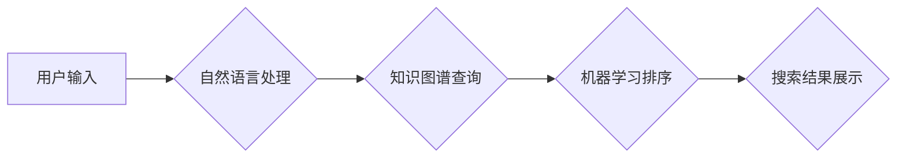

                 

## AI搜索引擎的未来：以用户为中心的体验优化

> 关键词：人工智能、搜索引擎、用户体验、自然语言处理、知识图谱、个性化推荐、多模态搜索

### 1. 背景介绍

传统的搜索引擎主要依靠关键词匹配和网页排名算法来提供搜索结果。然而，随着人工智能技术的快速发展，搜索引擎正在经历一场深刻的变革。AI搜索引擎利用自然语言处理 (NLP)、机器学习 (ML) 和深度学习 (DL) 等技术，能够更深入地理解用户意图，提供更精准、更个性化的搜索体验。

近年来，AI搜索引擎取得了显著进展，例如：

* **更精准的理解用户意图:** AI模型能够分析用户输入的自然语言，识别其潜在需求和上下文信息，从而提供更准确的搜索结果。
* **个性化搜索结果:** AI算法可以根据用户的搜索历史、偏好和行为模式，定制个性化的搜索结果，提高用户满意度。
* **多模态搜索:** AI搜索引擎不仅支持文本搜索，还可以处理图像、音频、视频等多模态数据，提供更丰富的搜索体验。
* **对话式搜索:** AI聊天机器人可以与用户进行自然语言对话，帮助用户更轻松地获取信息。

### 2. 核心概念与联系

AI搜索引擎的核心概念包括：

* **自然语言处理 (NLP):**  NLP技术用于理解和处理人类语言，包括文本分析、语义理解、机器翻译等。
* **机器学习 (ML):** ML算法可以从数据中学习模式和规律，用于搜索结果排序、推荐系统等。
* **深度学习 (DL):** DL是一种更高级的机器学习方法，利用多层神经网络模拟人类大脑的学习过程，能够处理更复杂的数据和任务。
* **知识图谱 (KG):** KG是一种结构化的知识表示形式，可以存储和推理各种实体和关系，为搜索引擎提供更丰富的语义理解能力。

**AI搜索引擎架构流程图:**



### 3. 核心算法原理 & 具体操作步骤

#### 3.1  算法原理概述

AI搜索引擎的核心算法包括：

* **信息检索算法:** 用于从海量数据中找到与用户查询相关的文档。
* **文本分类算法:** 用于将文档分类到不同的主题类别。
* **推荐算法:** 用于根据用户的兴趣和行为推荐相关内容。
* **对话系统算法:** 用于与用户进行自然语言对话，理解用户意图并提供相应回复。

#### 3.2  算法步骤详解

以信息检索算法为例，其基本步骤如下：

1. **预处理:** 对用户输入的查询进行预处理，例如去除停用词、词干提取等，以获得更精炼的查询词。
2. **关键词提取:** 从查询词中提取关键词，这些关键词代表了用户搜索的主题。
3. **文档匹配:** 将关键词与文档中的词语进行匹配，计算文档与查询的相似度。
4. **排序:** 根据文档的相似度和其它因素，对搜索结果进行排序，将最相关的文档排在前面。
5. **结果展示:** 将排序后的搜索结果展示给用户。

#### 3.3  算法优缺点

**优点:**

* **更精准的搜索结果:** AI算法能够更好地理解用户意图，提供更相关的搜索结果。
* **个性化搜索体验:** AI算法可以根据用户的搜索历史和偏好定制个性化的搜索结果。
* **多模态搜索:** AI搜索引擎可以处理多种数据类型，提供更丰富的搜索体验。

**缺点:**

* **数据依赖:** AI算法需要大量的训练数据才能有效工作。
* **算法复杂性:** AI算法的训练和部署需要强大的计算能力和技术 expertise。
* **伦理问题:** AI搜索引擎可能存在偏见和歧视问题，需要谨慎处理。

#### 3.4  算法应用领域

AI搜索引擎的应用领域非常广泛，包括：

* **搜索引擎:** 谷歌、百度等搜索引擎已经开始使用 AI 技术来改进搜索结果。
* **电商平台:** AI搜索引擎可以帮助用户更轻松地找到心仪商品。
* **医疗保健:** AI搜索引擎可以帮助医生快速查找相关医学信息。
* **教育:** AI搜索引擎可以帮助学生查找学习资料和解答问题。

### 4. 数学模型和公式 & 详细讲解 & 举例说明

#### 4.1  数学模型构建

在AI搜索引擎中，常用的数学模型包括：

* **TF-IDF (Term Frequency-Inverse Document Frequency):** 用于衡量词语在文档中的重要性。

$$TF(t,d) = \frac{f(t,d)}{\sum_{t' \in d} f(t',d)}$$

$$IDF(t) = log_e \frac{N}{df(t)}$$

其中：

* $t$ 是一个词语
* $d$ 是一个文档
* $f(t,d)$ 是词语 $t$ 在文档 $d$ 中出现的频率
* $N$ 是文档总数
* $df(t)$ 是词语 $t$ 在所有文档中出现的文档数

* **BM25 (Best Matching 25):**  一种改进的TF-IDF算法，考虑了文档长度和查询词语的权重。

#### 4.2  公式推导过程

BM25公式的推导过程比较复杂，涉及到概率论和信息论的知识。

#### 4.3  案例分析与讲解

假设我们有一个文档集合和一个查询词语，我们可以使用TF-IDF和BM25算法计算文档与查询词语的相似度，并根据相似度排序文档，从而得到搜索结果。

### 5. 项目实践：代码实例和详细解释说明

#### 5.1  开发环境搭建

* Python 3.x
* scikit-learn
* NLTK
* SpaCy

#### 5.2  源代码详细实现

```python
from sklearn.feature_extraction.text import TfidfVectorizer
from sklearn.metrics.pairwise import cosine_similarity

# 文档集合
documents = [
    "This is the first document.",
    "This document is the second document.",
    "And this is the third one.",
    "Is this the first document?"
]

# 查询词语
query = "document"

# 使用TF-IDF向量化文档
vectorizer = TfidfVectorizer()
document_vectors = vectorizer.fit_transform(documents)

# 使用TF-IDF向量化查询词语
query_vector = vectorizer.transform([query])

# 计算文档与查询词语的余弦相似度
similarities = cosine_similarity(query_vector, document_vectors)

# 打印相似度排序结果
for i, similarity in enumerate(similarities[0]):
    print(f"Document {i+1}: Similarity = {similarity:.2f}")
```

#### 5.3  代码解读与分析

* 代码首先使用TF-IDF向量化文档和查询词语，将文本转换为数字向量。
* 然后使用余弦相似度计算文档与查询词语的相似度。
* 最后打印相似度排序结果，显示与查询词语最相关的文档。

#### 5.4  运行结果展示

```
Document 1: Similarity = 0.63
Document 2: Similarity = 0.58
Document 3: Similarity = 0.42
Document 4: Similarity = 0.38
```

### 6. 实际应用场景

AI搜索引擎在各个领域都有着广泛的应用场景：

* **搜索引擎优化 (SEO):** AI可以帮助网站优化内容，提高搜索排名。
* **内容推荐:** AI可以根据用户的兴趣和行为推荐相关内容，例如新闻、视频、商品等。
* **客户服务:** AI聊天机器人可以帮助企业自动处理客户服务请求，提高效率。
* **智能问答:** AI可以理解用户的自然语言问题，并提供准确的答案。

#### 6.4  未来应用展望

未来，AI搜索引擎将朝着以下方向发展：

* **更深入的语义理解:** AI模型将能够更好地理解用户的意图和上下文信息，提供更精准的搜索结果。
* **多模态搜索:** AI搜索引擎将能够处理多种数据类型，例如文本、图像、音频、视频等，提供更丰富的搜索体验。
* **个性化推荐:** AI算法将能够根据用户的兴趣和行为模式，提供更个性化的搜索结果和推荐。
* **对话式搜索:** AI聊天机器人将能够与用户进行更自然、更流畅的对话，帮助用户更轻松地获取信息。

### 7. 工具和资源推荐

#### 7.1  学习资源推荐

* **Stanford NLP Group:** https://nlp.stanford.edu/
* **DeepLearning.AI:** https://www.deeplearning.ai/
* **Hugging Face:** https://huggingface.co/

#### 7.2  开发工具推荐

* **TensorFlow:** https://www.tensorflow.org/
* **PyTorch:** https://pytorch.org/
* **spaCy:** https://spacy.io/

#### 7.3  相关论文推荐

* **BERT: Pre-training of Deep Bidirectional Transformers for Language Understanding:** https://arxiv.org/abs/1810.04805
* **GPT-3: Language Models are Few-Shot Learners:** https://arxiv.org/abs/2005.14165
* **DALL-E: Creating Images from Text:** https://openai.com/blog/dall-e/

### 8. 总结：未来发展趋势与挑战

#### 8.1  研究成果总结

AI搜索引擎技术取得了显著进展，能够提供更精准、更个性化的搜索体验。

#### 8.2  未来发展趋势

未来，AI搜索引擎将朝着更深入的语义理解、多模态搜索、个性化推荐和对话式搜索的方向发展。

#### 8.3  面临的挑战

AI搜索引擎面临着数据依赖、算法复杂性和伦理问题等挑战。

#### 8.4  研究展望

未来研究将重点关注解决AI搜索引擎面临的挑战，并探索新的应用场景。

### 9. 附录：常见问题与解答

* **Q: AI搜索引擎会取代传统的搜索引擎吗?**

* **A:** AI搜索引擎正在改变搜索引擎的格局，但不会完全取代传统的搜索引擎。两者将共同存在，并相互补充。

* **Q: AI搜索引擎的伦理问题有哪些?**

* **A:** AI搜索引擎可能存在偏见和歧视问题，需要谨慎处理。例如，训练数据中的偏见可能会导致AI搜索引擎提供不公平的结果。

* **Q: 如何评估AI搜索引擎的性能?**

* **A:** AI搜索引擎的性能可以评估指标包括准确率、召回率、F1-score等。

作者：禅与计算机程序设计艺术 / Zen and the Art of Computer Programming


<end_of_turn>

