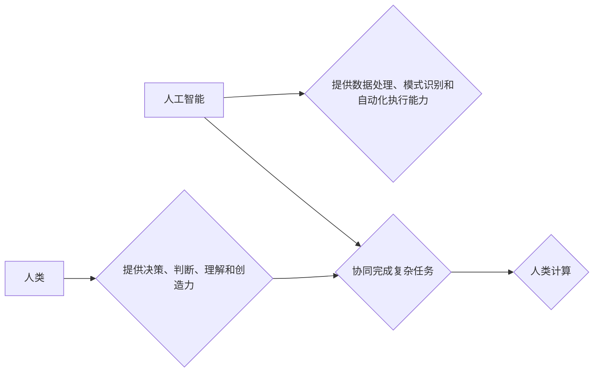

                 

## AI时代的人类计算：未来的道德边界

> 关键词：人工智能、人类计算、道德边界、算法伦理、可解释性、公平性、透明度、责任

### 1. 背景介绍

人工智能（AI）正以惊人的速度发展，其影响力渗透到我们生活的方方面面。从自动驾驶汽车到医疗诊断，从个性化教育到金融交易，AI正在改变着人类社会。然而，随着AI技术的进步，也引发了关于其伦理和社会影响的广泛讨论。

人类计算是指人类与人工智能协同工作，共同完成复杂任务的过程。在AI时代，人类计算将成为一种新的计算模式，它将赋予人类更强大的认知能力和创造力。然而，这种协同工作也面临着新的挑战，特别是如何确保AI技术的应用符合人类的道德价值观和社会规范。

### 2. 核心概念与联系

**2.1 人类计算的本质**

人类计算的核心在于将人类的智慧和创造力与AI技术的计算能力相结合。人类提供决策、判断、理解和创造力，而AI提供数据处理、模式识别和自动化执行的能力。这种协同工作可以实现比单一模式更有效的解决方案。

**2.2 人工智能与道德边界**

人工智能的应用涉及到许多伦理问题，例如：

* **公平性:** AI算法是否会产生偏见，导致不公平的结果？
* **透明度:** AI决策的逻辑是否清晰可解释？
* **责任:** 当AI系统导致负面后果时，谁应该承担责任？
* **隐私:** AI系统如何保护个人隐私数据？

**2.3 人类计算的道德框架**

为了应对这些挑战，我们需要建立一个完善的道德框架来指导AI技术的应用。这个框架应该包含以下原则：

* **尊重人类尊严:** AI技术应该服务于人类，而不是取代人类。
* **公平正义:** AI算法应该公平公正，避免产生偏见。
* **透明可解释:** AI决策的逻辑应该清晰可解释，让人们能够理解和信任。
* **责任问责:** AI系统的开发和应用应该承担相应的责任。
* **隐私保护:** AI系统应该保护个人隐私数据，并获得用户的知情同意。

**Mermaid 流程图**



### 3. 核心算法原理 & 具体操作步骤

**3.1 算法原理概述**

人类计算的核心算法通常基于机器学习和深度学习技术。这些算法能够从海量数据中学习模式和规律，并根据这些模式进行预测和决策。

**3.2 算法步骤详解**

1. **数据收集和预处理:** 收集相关数据，并进行清洗、转换和特征提取等预处理工作。
2. **模型选择和训练:** 选择合适的机器学习或深度学习模型，并使用训练数据进行模型训练。
3. **模型评估和优化:** 使用测试数据评估模型的性能，并根据评估结果进行模型优化。
4. **模型部署和应用:** 将训练好的模型部署到实际应用场景中，并根据需要进行调整和维护。

**3.3 算法优缺点**

**优点:**

* 能够处理复杂的数据和任务。
* 能够不断学习和改进。
* 能够实现自动化决策。

**缺点:**

* 需要大量的训练数据。
* 模型训练过程可能耗时和耗能。
* 模型的决策过程可能难以解释。

**3.4 算法应用领域**

* **医疗诊断:** 利用AI算法分析患者的医疗影像和数据，辅助医生进行诊断。
* **金融风险评估:** 利用AI算法分析金融数据的风险因素，帮助金融机构进行风险评估和控制。
* **个性化教育:** 利用AI算法分析学生的学习情况，提供个性化的学习方案。
* **自动驾驶:** 利用AI算法感知周围环境，控制车辆行驶。

### 4. 数学模型和公式 & 详细讲解 & 举例说明

**4.1 数学模型构建**

在机器学习中，常用的数学模型包括线性回归、逻辑回归、支持向量机、决策树等。这些模型都基于一定的数学公式，用来描述数据之间的关系和预测目标变量。

**4.2 公式推导过程**

例如，线性回归模型的目标是找到一条直线，能够最佳地拟合数据点。其数学公式如下：

$$y = mx + c$$

其中，y是目标变量，x是输入变量，m是斜率，c是截距。

通过最小化误差函数，可以求解出最佳的m和c值。

**4.3 案例分析与讲解**

假设我们有一组数据，记录了房屋面积和房屋价格的关系。我们可以使用线性回归模型来预测房屋价格。

通过训练模型，我们可以得到一条最佳拟合直线，例如：

$$y = 5000x + 100000$$

其中，y表示房屋价格，x表示房屋面积。

根据这个模型，我们可以预测面积为100平方米的房屋价格为：

$$y = 5000 * 100 + 100000 = 1000000$$

### 5. 项目实践：代码实例和详细解释说明

**5.1 开发环境搭建**

可以使用Python语言和相关的机器学习库，例如Scikit-learn，TensorFlow或PyTorch，来实现人类计算项目。

**5.2 源代码详细实现**

```python
from sklearn.linear_model import LinearRegression

# 数据准备
X = [[100], [150], [200], [250]]  # 房屋面积
y = [1000000, 1500000, 2000000, 2500000]  # 房屋价格

# 模型训练
model = LinearRegression()
model.fit(X, y)

# 模型预测
new_area = [[120]]
predicted_price = model.predict(new_area)
print(f"面积为120平方米的房屋价格预测为：{predicted_price[0]}")
```

**5.3 代码解读与分析**

这段代码首先定义了房屋面积和房屋价格的数据，然后使用Scikit-learn库中的LinearRegression模型进行线性回归训练。训练完成后，可以使用模型预测新的房屋价格。

**5.4 运行结果展示**

运行代码后，会输出预测结果，例如：

```
面积为120平方米的房屋价格预测为：1200000.0
```

### 6. 实际应用场景

**6.1 医疗诊断辅助**

AI算法可以分析患者的医疗影像数据，例如X光片、CT扫描和MRI扫描，帮助医生诊断疾病。例如，AI算法可以识别肺癌、脑肿瘤和其他疾病的早期迹象。

**6.2 金融风险评估**

AI算法可以分析金融数据的风险因素，例如客户信用评分、交易记录和市场波动，帮助金融机构评估风险并做出决策。例如，AI算法可以帮助银行识别欺诈交易和评估贷款风险。

**6.3 个性化教育**

AI算法可以分析学生的学习情况，例如学习进度、考试成绩和学习偏好，提供个性化的学习方案。例如，AI算法可以推荐适合学生的学习资源和制定个性化的学习计划。

**6.4 自动驾驶**

AI算法可以感知周围环境，例如道路状况、交通信号和行人，控制车辆行驶。例如，AI算法可以帮助自动驾驶汽车避开障碍物、保持车距和行驶在车道内。

**6.4 未来应用展望**

随着AI技术的不断发展，人类计算将在更多领域得到应用，例如：

* **科学研究:** AI算法可以帮助科学家分析大规模实验数据，加速科学发现。
* **艺术创作:** AI算法可以辅助艺术家创作新的艺术作品。
* **社会治理:** AI算法可以帮助政府部门提高效率、优化资源配置和服务民众。

### 7. 工具和资源推荐

**7.1 学习资源推荐**

* **在线课程:** Coursera、edX、Udacity等平台提供丰富的AI和机器学习课程。
* **书籍:** 《深度学习》、《机器学习实战》等书籍是学习AI技术的经典教材。
* **开源项目:** TensorFlow、PyTorch等开源项目提供了丰富的代码示例和学习资源。

**7.2 开发工具推荐**

* **Python:** Python是AI开发最常用的编程语言。
* **Scikit-learn:** Scikit-learn是Python机器学习库，提供了丰富的算法和工具。
* **TensorFlow:** TensorFlow是Google开发的深度学习框架。
* **PyTorch:** PyTorch是Facebook开发的深度学习框架。

**7.3 相关论文推荐**

* **《ImageNet Classification with Deep Convolutional Neural Networks》**
* **《Attention Is All You Need》**
* **《BERT: Pre-training of Deep Bidirectional Transformers for Language Understanding》**

### 8. 总结：未来发展趋势与挑战

**8.1 研究成果总结**

近年来，AI技术取得了长足的进步，在许多领域取得了突破性进展。例如，在图像识别、语音识别、自然语言处理等领域，AI算法的性能已经超过人类水平。

**8.2 未来发展趋势**

未来，AI技术将继续朝着更智能、更安全、更可解释的方向发展。例如：

* **增强型AI:** AI系统将更加智能，能够自主学习和解决更复杂的问题。
* **联邦学习:** AI模型将能够在不共享原始数据的情况下进行训练，提高数据隐私保护。
* **可解释性AI:** AI决策过程将更加透明可解释，让人们能够更好地理解AI的决策逻辑。

**8.3 面临的挑战**

AI技术的发展也面临着一些挑战，例如：

* **算法偏见:** AI算法可能存在偏见，导致不公平的结果。
* **数据安全:** AI系统需要处理大量数据，数据安全问题需要得到重视。
* **伦理问题:** AI技术的应用涉及到许多伦理问题，需要得到妥善解决。

**8.4 研究展望**

未来，我们需要加强对AI技术的伦理研究，制定相应的规范和政策，确保AI技术安全、可控和可持续发展。同时，还需要加强AI人才培养，促进AI技术与社会和谐发展。

### 9. 附录：常见问题与解答

**9.1 如何避免AI算法的偏见？**

* 使用多样化的训练数据，确保数据代表真实世界。
* 对算法进行公平性评估，识别和修正潜在的偏见。
* 采用公平性约束，在算法设计中加入公平性考虑。

**9.2 如何保护AI系统的数据安全？**

* 使用加密技术保护数据传输和存储。
* 采用身份验证和授权机制，控制对数据的访问权限。
* 定期进行安全评估，及时发现和修复漏洞。

**9.3 如何确保AI系统的透明可解释性？**

* 使用可解释性AI算法，例如规则式模型和决策树。
* 提供AI决策的解释报告，帮助用户理解AI的决策逻辑。
* 开发AI解释工具，使AI决策更加透明可理解。


作者：禅与计算机程序设计艺术 / Zen and the Art of Computer Programming 
<end_of_turn>

