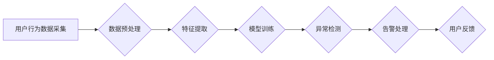

                 

## AI赋能的电商平台用户行为异常检测

> 关键词：电商平台、用户行为、异常检测、机器学习、深度学习、推荐系统、数据分析

## 1. 背景介绍

随着电商平台的蓬勃发展，用户数据呈指数级增长，用户行为也变得更加复杂多样。如何有效识别和应对用户行为异常，保障平台安全和用户权益，成为电商平台运营的一项重要任务。传统的规则引擎难以应对海量数据和复杂行为模式，而人工智能技术的兴起为电商平台用户行为异常检测提供了新的解决方案。

AI赋能的异常检测系统能够通过学习用户行为模式，识别与正常行为相悖的异常行为，并及时采取措施进行预警和处理。这不仅可以帮助电商平台降低风险，提高运营效率，还能提升用户体验，增强用户信任。

## 2. 核心概念与联系

### 2.1 用户行为分析

用户行为分析是指通过收集、分析用户在电商平台上的各种行为数据，如浏览记录、购买记录、评价记录、评论记录等，以了解用户需求、偏好和行为模式。

### 2.2 异常检测

异常检测是指识别与正常行为模式相悖的异常数据或事件。在电商平台中，异常行为可能包括：

* **欺诈行为:** 假冒用户账号、恶意刷单、虚假交易等。
* **恶意攻击:** DDoS攻击、SQL注入、数据泄露等。
* **账户异常:** 密码泄露、账号被盗用、账户被锁定等。
* **用户异常:** 异常频繁的访问、购买、评论等行为。

### 2.3 AI赋能

人工智能技术可以帮助电商平台构建更智能、更精准的异常检测系统。

* **机器学习:** 通过训练机器学习模型，识别用户行为模式，并识别与正常模式相悖的异常行为。
* **深度学习:** 使用深度神经网络，学习更复杂的特征，识别更细粒度的异常行为。
* **自然语言处理:** 分析用户评论和反馈，识别潜在的风险和问题。

**核心架构流程图**



## 3. 核心算法原理 & 具体操作步骤

### 3.1 算法原理概述

常见的异常检测算法包括：

* **基于统计的算法:** 例如均值、标准差、z-score等，通过计算数据与平均值的偏差来识别异常值。
* **基于机器学习的算法:** 例如k-近邻、支持向量机、决策树等，通过学习训练数据中的正常行为模式来识别异常行为。
* **基于深度学习的算法:** 例如自编码器、异常检测器等，通过学习更复杂的特征来识别更细粒度的异常行为。

### 3.2 算法步骤详解

以基于机器学习的异常检测算法为例，其具体操作步骤如下：

1. **数据采集:** 收集用户行为数据，包括浏览记录、购买记录、评价记录等。
2. **数据预处理:** 对数据进行清洗、转换、归一化等处理，以提高算法的精度。
3. **特征提取:** 从用户行为数据中提取特征，例如用户购买频率、平均购买金额、浏览时长等。
4. **模型训练:** 使用机器学习算法对训练数据进行训练，学习正常行为模式。
5. **异常检测:** 将新用户行为数据输入到训练好的模型中，预测其是否属于异常行为。
6. **告警处理:** 当模型预测到异常行为时，触发告警机制，并采取相应的处理措施。

### 3.3 算法优缺点

**优点:**

* 能够识别复杂、非线性异常行为。
* 可以自动学习和适应不断变化的用户行为模式。
* 能够提供更精准的异常检测结果。

**缺点:**

* 需要大量的训练数据才能达到较高的精度。
* 模型训练过程可能比较耗时和资源密集。
* 对数据质量要求较高，数据不干净或不完整会影响算法性能。

### 3.4 算法应用领域

基于机器学习的异常检测算法广泛应用于各个领域，例如：

* **金融领域:** 识别欺诈交易、账户异常等。
* **电商领域:** 识别欺诈用户、恶意刷单等。
* **网络安全领域:** 识别DDoS攻击、恶意软件等。
* **医疗领域:** 识别医疗数据异常、疾病预警等。

## 4. 数学模型和公式 & 详细讲解 & 举例说明

### 4.1 数学模型构建

在异常检测中，常用的数学模型包括：

* **概率模型:** 假设数据服从某个概率分布，例如正态分布，并根据数据与该分布的偏差来判断异常性。
* **距离度量模型:** 使用距离度量来衡量数据与正常数据之间的差异，例如欧氏距离、马氏距离等。
* **密度估计模型:** 通过估计数据分布的密度，识别密度较低的区域，即异常数据。

### 4.2 公式推导过程

以基于概率模型的异常检测为例，假设用户行为数据服从正态分布，其均值为μ，标准差为σ。则可以使用z-score公式来判断数据是否异常：

$$z = \frac{x - \mu}{\sigma}$$

其中，x为用户行为数据，μ为数据均值，σ为数据标准差。当z-score大于某个阈值时，则认为该数据为异常值。

### 4.3 案例分析与讲解

假设电商平台的用户购买金额服从正态分布，均值为100元，标准差为20元。如果一个用户购买金额为50元，则其z-score为：

$$z = \frac{50 - 100}{20} = -2.5$$

由于z-score小于-2，因此认为该用户的购买金额为异常值，可能存在欺诈行为。

## 5. 项目实践：代码实例和详细解释说明

### 5.1 开发环境搭建

* 操作系统: Ubuntu 20.04
* Python 版本: 3.8
* 必要的库: scikit-learn, pandas, numpy

### 5.2 源代码详细实现

```python
import pandas as pd
from sklearn.ensemble import IsolationForest

# 加载用户行为数据
data = pd.read_csv('user_behavior.csv')

# 选择特征列
features = ['purchase_frequency', 'average_purchase_amount', 'browse_duration']
X = data[features]

# 训练 IsolationForest 模型
model = IsolationForest()
model.fit(X)

# 预测异常值
y_pred = model.predict(X)

# 将异常值标记为 1，正常值标记为 0
data['is_anomaly'] = y_pred

# 保存结果
data.to_csv('anomaly_detection_result.csv', index=False)
```

### 5.3 代码解读与分析

* 使用 pandas 库加载用户行为数据。
* 选择需要用于异常检测的特征列。
* 使用 IsolationForest 模型训练异常检测模型。
* 使用训练好的模型预测数据是否为异常值。
* 将预测结果标记到数据中，方便后续分析和处理。

### 5.4 运行结果展示

运行代码后，将生成一个包含异常检测结果的 CSV 文件。该文件包含用户行为数据和对应的异常检测结果，方便后续分析和处理。

## 6. 实际应用场景

### 6.1 欺诈行为检测

AI赋能的异常检测系统可以识别欺诈用户，例如假冒用户账号、恶意刷单、虚假交易等。

* **案例:** 一家电商平台使用异常检测系统识别了大量恶意刷单行为，有效降低了平台的运营成本。

### 6.2 恶意攻击检测

AI赋能的异常检测系统可以识别恶意攻击，例如DDoS攻击、SQL注入、数据泄露等。

* **案例:** 一家金融机构使用异常检测系统识别了大量DDoS攻击，有效保护了用户的资金安全。

### 6.3 账户异常检测

AI赋能的异常检测系统可以识别账户异常，例如密码泄露、账号被盗用、账户被锁定等。

* **案例:** 一家社交平台使用异常检测系统识别了大量账号被盗用行为，及时提醒用户并采取措施保护用户账号安全。

### 6.4 未来应用展望

AI赋能的异常检测系统在电商平台的应用前景广阔，未来可能应用于：

* **个性化推荐:** 通过识别用户的异常行为，更精准地推荐商品和服务。
* **用户画像:** 通过分析用户的异常行为，构建更精准的用户画像，为用户提供更个性化的服务。
* **风险控制:** 通过识别用户的异常行为，降低平台的运营风险。

## 7. 工具和资源推荐

### 7.1 学习资源推荐

* **书籍:**
    * 《异常检测》
    * 《机器学习实战》
* **在线课程:**
    * Coursera: Machine Learning
    * edX: Introduction to Artificial Intelligence

### 7.2 开发工具推荐

* **Python:** 
    * scikit-learn: 机器学习库
    * pandas: 数据分析库
    * numpy: 数值计算库
* **其他工具:**
    * TensorFlow: 深度学习框架
    * PyTorch: 深度学习框架

### 7.3 相关论文推荐

* **Isolation Forest for Anomaly Detection**
* **One-Class SVM for Anomaly Detection**
* **Anomaly Detection with Deep Learning**

## 8. 总结：未来发展趋势与挑战

### 8.1 研究成果总结

AI赋能的异常检测系统在电商平台的应用取得了显著成果，能够有效识别和应对各种异常行为，保障平台安全和用户权益。

### 8.2 未来发展趋势

* **模型精度提升:** 探索更先进的机器学习和深度学习算法，提高异常检测的精度和效率。
* **多模态数据融合:** 将文本、图像、视频等多模态数据融合到异常检测模型中，提高检测的准确性和泛化能力。
* **实时性增强:** 开发更快速的异常检测算法，实现对用户行为的实时监控和预警。
* **解释性增强:** 研究更可解释的异常检测模型，帮助用户理解模型的决策过程。

### 8.3 面临的挑战

* **数据质量问题:** 异常检测算法对数据质量要求较高，数据不干净或不完整会影响算法性能。
* **模型可解释性问题:** 一些深度学习模型的决策过程难以解释，这可能会导致用户对模型结果的信任度降低。
* **隐私保护问题:** 异常检测系统需要处理大量用户数据，需要采取措施保护用户的隐私安全。

### 8.4 研究展望

未来，AI赋能的异常检测系统将继续朝着更智能、更精准、更安全的方向发展，为电商平台提供更有效的风险控制和用户体验提升。


## 9. 附录：常见问题与解答

**Q1: 什么是异常检测？**

A1: 异常检测是指识别与正常行为模式相悖的异常数据或事件。

**Q2: 常见的异常检测算法有哪些？**

A2: 常见的异常检测算法包括基于统计的算法、基于机器学习的算法和基于深度学习的算法。

**Q3: 如何选择合适的异常检测算法？**

A3: 选择合适的异常检测算法需要根据具体应用场景和数据特点进行选择。

**Q4: 如何评估异常检测算法的性能？**

A4: 常见的异常检测算法性能评估指标包括准确率、召回率、F1-score等。

**Q5: 如何保护用户隐私安全？**

A5: 在开发异常检测系统时，需要采取措施保护用户的隐私安全，例如数据匿名化、数据加密等。


作者：禅与计算机程序设计艺术 / Zen and the Art of Computer Programming 
<end_of_turn>

