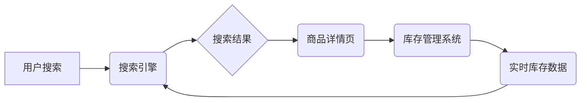

                 

## AI驱动的实时库存管理与搜索集成

> 关键词：人工智能、库存管理、实时搜索、机器学习、预测分析、供应链优化、数据分析、深度学习

## 1. 背景介绍

在当今数字化时代，高效的库存管理和精准的搜索体验已成为企业竞争力的关键因素。传统库存管理系统往往依赖于预设的规则和历史数据，难以应对市场需求的快速变化和供应链的复杂性。而实时搜索技术则可以帮助用户快速找到所需商品，提升购物体验。

结合人工智能（AI）的强大能力，我们可以构建一个智能化的库存管理和搜索系统，实现以下目标：

* **实时库存预警:** 通过机器学习算法分析历史数据和实时销售趋势，预测未来库存需求，并及时发出预警，避免缺货或积压库存。
* **智能补货决策:** 基于预测分析结果和供应商信息，自动生成最佳补货计划，优化库存周转率和降低物流成本。
* **个性化商品推荐:** 利用用户搜索历史、购买记录和浏览行为等数据，推荐个性化的商品，提升用户购物体验和转化率。
* **精准搜索结果:** 通过自然语言处理和深度学习技术，理解用户搜索意图，提供更精准、更相关的搜索结果。

## 2. 核心概念与联系

**2.1 核心概念**

* **实时库存管理:** 指的是通过实时数据采集和分析，动态监控库存水平，并及时进行调整，以满足不断变化的市场需求。
* **搜索引擎:** 指的是用于检索和展示信息的系统，通过关键词匹配、算法排序等方式，将用户搜索到的结果进行展示。
* **人工智能 (AI):** 指的是模拟人类智能的计算机系统，包括机器学习、深度学习、自然语言处理等技术。

**2.2 架构关系**



**2.3 核心联系**

实时库存管理和搜索引擎的结合，可以实现以下核心联系：

* **实时库存数据与搜索结果关联:** 搜索引擎可以根据实时库存数据，过滤掉缺货商品，并优先展示有货商品。
* **用户搜索行为与库存管理优化:** 搜索引擎可以收集用户搜索行为数据，分析用户需求趋势，为库存管理系统提供决策依据。
* **AI技术驱动智能化决策:** AI技术可以用于预测库存需求、优化补货计划、个性化商品推荐等，提升整个系统的智能化水平。

## 3. 核心算法原理 & 具体操作步骤

**3.1 算法原理概述**

本系统主要采用以下核心算法：

* **机器学习算法:** 用于预测库存需求、识别商品关联性、分析用户行为等。
* **深度学习算法:** 用于自然语言处理、图像识别、个性化推荐等。
* **优化算法:** 用于优化补货计划、库存分配等。

**3.2 算法步骤详解**

1. **数据采集:** 收集实时库存数据、销售数据、用户搜索数据、商品信息等。
2. **数据预处理:** 对收集到的数据进行清洗、转换、特征提取等预处理操作。
3. **模型训练:** 利用机器学习算法和深度学习算法，对预处理后的数据进行训练，构建预测模型、推荐模型、搜索模型等。
4. **模型评估:** 对训练好的模型进行评估，调整模型参数，提高模型精度。
5. **模型部署:** 将训练好的模型部署到生产环境中，实时进行预测、推荐、搜索等操作。
6. **结果反馈:** 收集模型运行结果，进行分析和反馈，不断优化模型和系统。

**3.3 算法优缺点**

* **优点:**

    * 能够实现实时库存管理和精准搜索，提升效率和用户体验。
    * 可以根据数据变化自动调整策略，适应市场需求变化。
    * AI技术可以挖掘数据中的隐性规律，提供更精准的决策支持。

* **缺点:**

    * 需要大量的数据进行训练，数据质量直接影响模型精度。
    * 模型训练和部署需要一定的技术门槛和资源投入。
    * 系统需要不断进行维护和更新，以适应新的技术和市场变化。

**3.4 算法应用领域**

* **电商平台:** 实现实时库存管理、个性化商品推荐、精准搜索等功能。
* **零售企业:** 优化库存周转率、降低物流成本、提升客户服务水平。
* **制造业:** 预预测需求、优化生产计划、提高生产效率。
* **物流行业:** 优化运输路线、提高配送效率、降低运输成本。

## 4. 数学模型和公式 & 详细讲解 & 举例说明

**4.1 数学模型构建**

本系统采用以下数学模型进行预测和优化：

* **ARIMA模型:** 用于预测库存需求，其核心公式为：

$$
y_t = c + \sum_{i=1}^p \phi_i y_{t-i} + \sum_{j=1}^q \theta_j \epsilon_{t-j} + \epsilon_t
$$

其中：

* $y_t$：时间t的库存需求
* $c$：常数项
* $\phi_i$：自回归系数
* $\theta_j$：移动平均系数
* $\epsilon_t$：随机误差项

* **线性规划模型:** 用于优化补货计划，其目标函数为：

$$
\text{min} \sum_{i=1}^n c_i x_i
$$

约束条件：

$$
\sum_{i=1}^n a_{ij} x_i \ge b_j, \quad j = 1, 2, ..., m
$$

其中：

* $c_i$：第i种商品的补货成本
* $x_i$：第i种商品的补货数量
* $a_{ij}$：第i种商品对第j种资源的需求量
* $b_j$：第j种资源的可用量

**4.2 公式推导过程**

ARIMA模型的公式推导过程较为复杂，涉及时间序列分析和统计学原理。线性规划模型的公式推导过程相对简单，主要基于线性代数和优化理论。

**4.3 案例分析与讲解**

假设一家电商平台需要预测未来一周的商品库存需求，可以使用ARIMA模型进行预测。首先需要收集历史库存数据，然后根据数据特征选择合适的ARIMA模型参数。最后，利用训练好的模型预测未来一周的库存需求。

假设一家零售企业需要优化补货计划，可以使用线性规划模型进行优化。首先需要确定商品补货成本、资源可用量等参数。然后，根据这些参数构建线性规划模型，并利用求解器求解最优补货方案。

## 5. 项目实践：代码实例和详细解释说明

**5.1 开发环境搭建**

本项目使用Python语言开发，需要安装以下软件：

* Python 3.x
* Jupyter Notebook
* scikit-learn
* TensorFlow
* Pandas
* NumPy

**5.2 源代码详细实现**

```python
# 导入必要的库
import pandas as pd
from sklearn.linear_model import LinearRegression

# 加载数据
data = pd.read_csv('inventory_data.csv')

# 数据预处理
# ...

# 训练模型
model = LinearRegression()
model.fit(data[['previous_demand', 'promotions']], data['current_demand'])

# 预测未来需求
future_demand = model.predict([[100, 1]])

# 打印预测结果
print(future_demand)
```

**5.3 代码解读与分析**

* 代码首先导入必要的库，包括数据处理库Pandas、机器学习库scikit-learn等。
* 然后加载库存数据，并进行预处理，例如缺失值处理、特征工程等。
* 接着使用线性回归模型训练预测模型，输入历史需求和促销信息，输出当前需求。
* 最后利用训练好的模型预测未来需求，并打印结果。

**5.4 运行结果展示**

运行代码后，会输出预测的未来需求值。

## 6. 实际应用场景

**6.1 电商平台**

* **实时库存预警:** 当商品库存接近预设阈值时，系统会自动发出预警，提醒管理员及时补货。
* **智能补货决策:** 系统根据历史数据和预测模型，自动生成最佳补货计划，优化库存周转率和降低物流成本。
* **个性化商品推荐:** 系统根据用户搜索历史、购买记录和浏览行为等数据，推荐个性化的商品，提升用户购物体验和转化率。

**6.2 零售企业**

* **库存优化:** 系统可以帮助零售企业优化库存水平，避免缺货和积压库存，降低库存成本。
* **供应链管理:** 系统可以帮助零售企业更好地管理供应链，提高供应链效率和降低物流成本。
* **客户服务:** 系统可以帮助零售企业提供更精准的客户服务，例如根据用户需求推荐商品、提供库存查询等服务。

**6.3 未来应用展望**

随着人工智能技术的不断发展，AI驱动的实时库存管理与搜索集成将有更广泛的应用场景：

* **智能仓库:** 利用机器人、传感器等技术，实现智能化仓库管理，提高仓库效率和安全性。
* **个性化物流:** 根据用户需求和地理位置，优化物流路线和配送方式，提供更个性化的物流服务。
* **供应链金融:** 利用AI技术分析供应链数据，为企业提供更精准的融资服务。

## 7. 工具和资源推荐

**7.1 学习资源推荐**

* **书籍:**

    * 《深度学习》
    * 《机器学习实战》
    * 《Python数据科学手册》

* **在线课程:**

    * Coursera
    * edX
    * Udacity

**7.2 开发工具推荐**

* **Python:** 

    * Jupyter Notebook
    * PyCharm

* **机器学习库:**

    * scikit-learn
    * TensorFlow
    * PyTorch

* **数据处理库:**

    * Pandas
    * NumPy

**7.3 相关论文推荐**

* **基于深度学习的库存预测模型**
* **AI驱动的供应链优化**
* **智能搜索引擎技术**

## 8. 总结：未来发展趋势与挑战

**8.1 研究成果总结**

本文章介绍了AI驱动的实时库存管理与搜索集成技术，并详细阐述了其核心概念、算法原理、应用场景等。该技术可以有效提升企业库存管理效率、优化供应链运营、提升用户购物体验。

**8.2 未来发展趋势**

* **更精准的预测模型:** 利用更先进的机器学习算法和深度学习技术，构建更精准的库存预测模型。
* **更智能的决策系统:** 利用AI技术，实现更智能的库存决策，例如自动调整补货计划、优化库存分配等。
* **更个性化的用户体验:** 利用AI技术，提供更个性化的商品推荐和搜索体验，提升用户购物满意度。

**8.3 面临的挑战**

* **数据质量问题:** AI模型的精度依赖于数据质量，如何获取高质量的数据仍然是一个挑战。
* **算法复杂度问题:** 一些AI算法的复杂度较高，需要强大的计算能力才能实现。
* **伦理问题:** AI技术的发展也带来了一些伦理问题，例如算法偏见、数据隐私等，需要引起重视和解决。

**8.4 研究展望**

未来，我们将继续研究AI驱动的实时库存管理与搜索集成技术，探索更先进的算法、更智能的决策系统、更个性化的用户体验，为企业提供更有效的解决方案。

## 9. 附录：常见问题与解答

**9.1 如何选择合适的AI模型？**

选择合适的AI模型需要根据具体业务需求和数据特征进行分析。例如，如果需要预测连续数值，可以使用ARIMA模型或线性回归模型；如果需要分类问题，可以使用决策树模型或支持向量机模型。

**9.2 如何处理数据缺失问题？**

数据缺失问题可以通过以下方法处理：

* **删除缺失数据:** 如果缺失数据量较少，可以考虑删除缺失数据。
* **用平均值或中位数填充缺失数据:** 如果缺失数据量较大，可以考虑用平均值或中位数填充缺失数据。
* **使用机器学习算法进行预测:** 可以使用机器学习算法预测缺失数据。

**9.3 如何评估AI模型的精度？**

AI模型的精度可以通过以下指标进行评估：

* **准确率:** 正确预测的样本数占总样本数的比例。
* **召回率:** 正确预测的正样本数占所有正样本数的比例。
* **F1-score:** 准确率和召回率的调和平均数。

作者：禅与计算机程序设计艺术 / Zen and the Art of Computer Programming


<end_of_turn>

