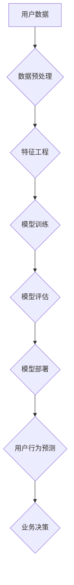

                 

## AI驱动的电商平台用户行为预测模型

> 关键词：电商平台、用户行为预测、机器学习、深度学习、推荐系统、数据挖掘、自然语言处理

## 1. 背景介绍

随着电商平台的蓬勃发展，用户行为预测已成为提升用户体验、提高转化率和促进商业增长的关键技术。传统的电商平台依靠规则引擎和基于历史数据的简单统计模型来预测用户行为，但这些方法难以捕捉用户行为的复杂性和动态性。

近年来，人工智能（AI）技术的快速发展为用户行为预测提供了新的机遇。AI算法能够从海量用户数据中学习用户行为模式，并对未来行为进行更准确的预测。

## 2. 核心概念与联系

### 2.1 用户行为预测

用户行为预测是指利用历史用户数据，通过机器学习算法，预测用户未来在电商平台上的行为，例如：

* **购买行为预测**: 预测用户是否会购买某个商品，以及购买数量和时间。
* **浏览行为预测**: 预测用户会浏览哪些商品，以及浏览时长和频率。
* **评价行为预测**: 预测用户对商品的评价，以及评价内容。
* **流失行为预测**: 预测用户是否会离开电商平台，以及流失原因。

### 2.2 核心技术

用户行为预测模型主要依赖以下核心技术：

* **机器学习**: 利用算法从数据中学习，并对未来行为进行预测。常见的机器学习算法包括：
    * **分类算法**: 用于预测用户是否会执行某个行为，例如购买或评价。
    * **回归算法**: 用于预测用户行为的连续值，例如购买数量或浏览时长。
    * **聚类算法**: 用于将用户分组，并根据用户群体的特征进行预测。
* **深度学习**: 一种更高级的机器学习方法，能够处理更复杂的数据结构，例如文本和图像。
* **数据挖掘**: 从海量用户数据中提取有价值的信息，用于训练机器学习模型。
* **自然语言处理**: 用于处理用户文本数据，例如评论和搜索词，并从中提取有用的特征。

### 2.3 架构图



## 3. 核心算法原理 & 具体操作步骤

### 3.1 算法原理概述

本模型采用基于深度学习的**多层感知机（MLP）**算法进行用户行为预测。MLP是一种前馈神经网络，能够学习用户行为的复杂非线性关系。

### 3.2 算法步骤详解

1. **数据收集**: 收集用户在电商平台上的各种行为数据，例如浏览记录、购买记录、评价记录、搜索记录等。
2. **数据预处理**: 对收集到的数据进行清洗、转换和格式化，例如删除缺失值、处理文本数据、归一化数值数据等。
3. **特征工程**: 从原始数据中提取有价值的特征，例如用户 demographics 信息、商品属性、浏览历史、购买历史等。
4. **模型训练**: 使用提取的特征数据训练MLP模型，并通过交叉验证等方法选择最佳模型参数。
5. **模型评估**: 使用测试数据评估模型的预测性能，例如准确率、召回率、F1-score等。
6. **模型部署**: 将训练好的模型部署到线上环境，用于实时预测用户行为。

### 3.3 算法优缺点

**优点**:

* 能够学习用户行为的复杂非线性关系。
* 预测精度较高。
* 可扩展性强，可以处理海量数据。

**缺点**:

* 需要大量的训练数据。
* 模型训练时间较长。
* 对数据质量要求较高。

### 3.4 算法应用领域

* **电商推荐**: 根据用户的历史行为和偏好，推荐相关的商品。
* **个性化营销**: 根据用户的行为特征，进行个性化的营销推广。
* **用户流失预测**: 预测用户是否会离开电商平台，并采取措施挽留用户。
* **库存管理**: 根据用户的购买预测，优化库存管理。

## 4. 数学模型和公式 & 详细讲解 & 举例说明

### 4.1 数学模型构建

本模型采用多层感知机（MLP）作为核心算法，其数学模型可以表示为：

$$
y = f(W^L \cdot a^{L-1} + b^L)
$$

其中：

* $y$ 是预测结果。
* $W^L$ 是第 $L$ 层神经元的权重矩阵。
* $a^{L-1}$ 是第 $L-1$ 层神经元的激活值。
* $b^L$ 是第 $L$ 层神经元的偏置项。
* $f$ 是激活函数，例如ReLU或Sigmoid函数。

### 4.2 公式推导过程

MLP模型的训练过程是通过反向传播算法来实现的。反向传播算法的基本思想是：

1. 将预测结果与真实值进行比较，计算损失函数。
2. 根据损失函数对模型参数进行梯度下降更新。

损失函数的计算公式通常为：

$$
L = \frac{1}{N} \sum_{i=1}^{N} (y_i - \hat{y}_i)^2
$$

其中：

* $L$ 是损失函数值。
* $N$ 是样本数量。
* $y_i$ 是第 $i$ 个样本的真实值。
* $\hat{y}_i$ 是第 $i$ 个样本的预测值。

### 4.3 案例分析与讲解

假设我们想要预测用户是否会购买某个商品。我们可以将购买行为作为二分类问题，并将MLP模型的输出层设置为一个神经元，其激活函数为Sigmoid函数。Sigmoid函数的输出值在0到1之间，可以表示用户购买的概率。

如果模型的输出值为0.8，则表示该用户购买该商品的概率为80%。

## 5. 项目实践：代码实例和详细解释说明

### 5.1 开发环境搭建

本项目使用Python语言进行开发，所需的库包括：

* TensorFlow或PyTorch：深度学习框架。
* Pandas：数据处理库。
* Scikit-learn：机器学习库。
* Matplotlib：数据可视化库。

### 5.2 源代码详细实现

```python
import tensorflow as tf

# 定义模型结构
model = tf.keras.models.Sequential([
    tf.keras.layers.Dense(64, activation='relu', input_shape=(input_dim,)),
    tf.keras.layers.Dense(32, activation='relu'),
    tf.keras.layers.Dense(1, activation='sigmoid')
])

# 编译模型
model.compile(optimizer='adam',
              loss='binary_crossentropy',
              metrics=['accuracy'])

# 训练模型
model.fit(X_train, y_train, epochs=10, batch_size=32)

# 评估模型
loss, accuracy = model.evaluate(X_test, y_test)
print('Loss:', loss)
print('Accuracy:', accuracy)
```

### 5.3 代码解读与分析

* **模型定义**: 使用`tf.keras.models.Sequential`定义一个多层感知机模型，包含三个全连接层。
* **激活函数**: 使用ReLU函数作为隐藏层的激活函数，Sigmoid函数作为输出层的激活函数。
* **编译模型**: 使用Adam优化器、二分类交叉熵损失函数和准确率作为评估指标。
* **训练模型**: 使用训练数据训练模型，设置训练轮数和批量大小。
* **评估模型**: 使用测试数据评估模型的性能。

### 5.4 运行结果展示

训练完成后，可以查看模型的损失值和准确率。

## 6. 实际应用场景

### 6.1 商品推荐

根据用户的浏览历史、购买记录和评价记录，推荐相关的商品。

### 6.2 个性化营销

根据用户的行为特征，发送个性化的营销邮件、短信和广告。

### 6.3 用户流失预测

预测用户是否会离开电商平台，并采取措施挽留用户。

### 6.4 未来应用展望

* **更精准的预测**: 利用更先进的深度学习算法和更丰富的用户数据，提高预测精度。
* **多模态预测**: 将文本、图像、视频等多模态数据融合到预测模型中，获得更全面的用户行为理解。
* **实时预测**: 利用实时数据流，实现对用户行为的实时预测和响应。

## 7. 工具和资源推荐

### 7.1 学习资源推荐

* **书籍**:
    * 《深度学习》
    * 《机器学习实战》
* **在线课程**:
    * Coursera上的深度学习课程
    * Udacity上的机器学习工程师课程

### 7.2 开发工具推荐

* **TensorFlow**: 开源深度学习框架。
* **PyTorch**: 开源深度学习框架。
* **Scikit-learn**: 机器学习库。

### 7.3 相关论文推荐

* **Attention Is All You Need**: 
* **BERT: Pre-training of Deep Bidirectional Transformers for Language Understanding**: 

## 8. 总结：未来发展趋势与挑战

### 8.1 研究成果总结

AI驱动的电商平台用户行为预测模型取得了显著的成果，能够有效提升用户体验、提高转化率和促进商业增长。

### 8.2 未来发展趋势

* **模型精度提升**: 利用更先进的深度学习算法和更丰富的用户数据，提高预测精度。
* **多模态融合**: 将文本、图像、视频等多模态数据融合到预测模型中，获得更全面的用户行为理解。
* **实时预测**: 利用实时数据流，实现对用户行为的实时预测和响应。

### 8.3 面临的挑战

* **数据质量**: 用户行为数据往往存在噪声和缺失值，需要进行有效的数据清洗和处理。
* **模型 interpretability**: 深度学习模型的内部机制难以理解，需要开发更可解释的模型。
* **隐私保护**: 用户行为数据涉及个人隐私，需要采取有效措施保护用户隐私。

### 8.4 研究展望

未来，AI驱动的电商平台用户行为预测模型将朝着更精准、更智能、更安全的方向发展。


## 9. 附录：常见问题与解答

**Q1: 如何选择合适的深度学习算法？**

**A1:** 选择合适的深度学习算法取决于具体应用场景和数据特点。

* **分类问题**: 使用多层感知机、卷积神经网络或循环神经网络。
* **回归问题**: 使用多层感知机或长短期记忆网络。

**Q2: 如何处理用户行为数据中的缺失值？**

**A2:** 可以使用以下方法处理缺失值：

* **删除缺失值**: 如果缺失值较少，可以删除包含缺失值的样本。
* **填充缺失值**: 使用均值、中位数或其他统计方法填充缺失值。
* **使用机器学习算法**: 使用KNN或其他机器学习算法预测缺失值。

**Q3: 如何评估模型的性能？**

**A3:** 可以使用以下指标评估模型的性能：

* **分类问题**: 准确率、召回率、F1-score、AUC。
* **回归问题**: 均方误差、平均绝对误差、R-squared。


作者：禅与计算机程序设计艺术 / Zen and the Art of Computer Programming 
<end_of_turn>

