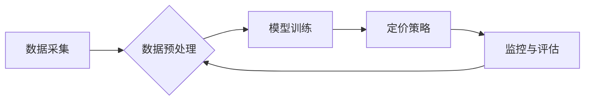

                 

## AI驱动的电商智能定价敏感度分析系统

> 关键词：电商智能定价、价格敏感度分析、机器学习、深度学习、自然语言处理、预测模型、数据可视化

## 1. 背景介绍

在当今竞争激烈的电商市场中，定价策略是企业获取利润和提升市场竞争力的关键因素。传统的定价方法往往依赖于经验和主观判断，难以准确反映市场变化和消费者行为。随着人工智能技术的快速发展，AI驱动的智能定价系统逐渐成为电商行业的新趋势。

智能定价系统能够通过分析海量数据，识别价格敏感度、预测市场需求和竞争对手行为，从而制定更精准、更有效的定价策略。其中，价格敏感度分析是智能定价系统的重要组成部分，它旨在量化消费者对价格变化的反应程度，为定价决策提供科学依据。

## 2. 核心概念与联系

### 2.1 价格敏感度

价格敏感度是指消费者对商品价格变化的反应程度，即价格变化对购买决策的影响大小。价格敏感度高的消费者对价格变化非常敏感，即使价格微小变化也会影响他们的购买意愿。而价格敏感度低的消费者则对价格变化相对不敏感，即使价格大幅度变化也可能不会影响他们的购买决策。

### 2.2 智能定价系统

智能定价系统是一种利用人工智能技术，通过分析市场数据、消费者行为和竞争对手策略，自动制定最优定价策略的系统。它通常包含以下几个核心模块：

* 数据采集模块：收集商品信息、市场数据、消费者行为数据等。
* 数据预处理模块：对收集到的数据进行清洗、转换和特征提取。
* 模型训练模块：利用机器学习算法训练价格敏感度模型和预测模型。
* 定价策略模块：根据模型预测结果，制定最优定价策略。
* 监控与评估模块：监控定价策略效果，并根据实际情况进行调整。

### 2.3 关联关系

价格敏感度分析是智能定价系统的重要组成部分，它为定价策略的制定提供了科学依据。通过分析消费者对价格变化的反应程度，智能定价系统可以：

* 识别不同商品的价格敏感度群体，制定针对性的定价策略。
* 预测价格变化对销售额的影响，制定动态调整价格的策略。
* 比较不同定价策略的效果，选择最优的定价方案。

**核心架构流程图**



## 3. 核心算法原理 & 具体操作步骤

### 3.1 算法原理概述

价格敏感度分析算法通常基于机器学习技术，通过训练模型来预测消费者对价格变化的反应程度。常见的算法包括：

* 线性回归：假设价格敏感度与价格之间存在线性关系，通过最小化误差来估计价格敏感度。
* 逻辑回归：将价格敏感度作为二分类问题，预测消费者是否会购买商品，并根据购买概率估计价格敏感度。
* 支持向量机：通过寻找最佳的分隔超平面，将价格敏感度高的消费者和价格敏感度低的消费者分开，并根据分类结果估计价格敏感度。
* 深度学习：利用多层神经网络，学习更复杂的非线性关系，提高价格敏感度预测的准确性。

### 3.2 算法步骤详解

以线性回归为例，价格敏感度分析的具体操作步骤如下：

1. **数据收集:** 收集商品信息、市场数据、消费者行为数据等，包括商品价格、销量、消费者属性、购买历史等。
2. **数据预处理:** 对收集到的数据进行清洗、转换和特征提取，例如处理缺失值、编码类别变量、提取特征向量等。
3. **模型训练:** 使用线性回归算法训练模型，将价格作为自变量，销量作为因变量，并估计价格敏感度系数。
4. **模型评估:** 使用测试数据评估模型的预测精度，例如计算R-squared值、均方误差等指标。
5. **模型部署:** 将训练好的模型部署到生产环境中，用于实时预测价格敏感度。

### 3.3 算法优缺点

**优点:**

* 能够量化消费者对价格变化的反应程度。
* 基于数据驱动，决策更加科学和客观。
* 可以识别不同商品的价格敏感度群体，制定针对性的定价策略。

**缺点:**

* 需要大量的数据进行训练，数据质量对模型精度影响较大。
* 模型的预测结果可能存在一定的误差，需要结合其他因素进行决策。
* 价格敏感度是一个动态变化的因素，模型需要定期更新和调整。

### 3.4 算法应用领域

价格敏感度分析算法广泛应用于电商、零售、旅游、金融等领域，例如：

* **电商平台:** 优化商品定价，提高销售额和利润。
* **零售商:** 制定促销策略，吸引消费者购买。
* **旅游公司:** 动态调整旅游产品价格，根据市场需求进行优化。
* **金融机构:** 分析客户对金融产品的敏感度，制定个性化服务方案。

## 4. 数学模型和公式 & 详细讲解 & 举例说明

### 4.1 数学模型构建

假设价格敏感度模型为线性回归模型，则模型表达式为：

$$
y = \beta_0 + \beta_1 x + \epsilon
$$

其中：

* $y$：销量
* $x$：商品价格
* $\beta_0$：截距
* $\beta_1$：价格敏感度系数
* $\epsilon$：随机误差

### 4.2 公式推导过程

通过最小二乘法，可以求解出价格敏感度系数 $\beta_1$ 的估计值：

$$
\hat{\beta}_1 = \frac{\sum_{i=1}^{n}(x_i - \bar{x})(y_i - \bar{y})}{\sum_{i=1}^{n}(x_i - \bar{x})^2}
$$

其中：

* $n$：样本数量
* $x_i$：第 $i$ 个样本的价格
* $y_i$：第 $i$ 个样本的销量
* $\bar{x}$：价格的平均值
* $\bar{y}$：销量的平均值

### 4.3 案例分析与讲解

假设某电商平台销售一款商品，收集了100个样本的价格和销量数据，通过线性回归模型训练得到价格敏感度系数为 -0.2。

这意味着，当商品价格每增加1元时，销量预计会减少0.2个单位。

## 5. 项目实践：代码实例和详细解释说明

### 5.1 开发环境搭建

* 操作系统：Windows/macOS/Linux
* Python版本：3.6+
* 必要的库：pandas、numpy、scikit-learn、matplotlib

### 5.2 源代码详细实现

```python
import pandas as pd
from sklearn.linear_model import LinearRegression
from sklearn.model_selection import train_test_split
import matplotlib.pyplot as plt

# 加载数据
data = pd.read_csv('price_sales_data.csv')

# 划分训练集和测试集
X = data[['price']]
y = data['sales']
X_train, X_test, y_train, y_test = train_test_split(X, y, test_size=0.2, random_state=42)

# 创建线性回归模型
model = LinearRegression()

# 训练模型
model.fit(X_train, y_train)

# 预测测试集销量
y_pred = model.predict(X_test)

# 计算模型精度
from sklearn.metrics import mean_squared_error
mse = mean_squared_error(y_test, y_pred)
print(f'Mean Squared Error: {mse}')

# 可视化预测结果
plt.scatter(X_test, y_test, color='blue', label='Actual Sales')
plt.plot(X_test, y_pred, color='red', label='Predicted Sales')
plt.xlabel('Price')
plt.ylabel('Sales')
plt.legend()
plt.show()
```

### 5.3 代码解读与分析

* 代码首先加载数据，并划分训练集和测试集。
* 然后创建线性回归模型，并使用训练集训练模型。
* 接着使用测试集预测销量，并计算模型精度。
* 最后使用可视化工具展示预测结果。

### 5.4 运行结果展示

运行代码后，会输出模型的均方误差值，以及预测结果和实际销量的散点图。

## 6. 实际应用场景

### 6.1 商品定价优化

电商平台可以利用价格敏感度分析系统，根据不同商品的价格敏感度，制定最优的定价策略。例如，对于价格敏感度高的商品，可以采用更优惠的价格策略，吸引消费者购买；而对于价格敏感度低的商品，可以采用更高的价格策略，提高利润率。

### 6.2 促销活动效果评估

价格敏感度分析系统可以帮助电商平台评估促销活动的效果。通过比较促销活动前后商品的销量和价格变化，可以分析促销活动对消费者购买行为的影响，并优化未来的促销策略。

### 6.3 动态定价策略

随着市场需求和竞争对手行为的不断变化，价格敏感度也会发生变化。AI驱动的智能定价系统可以实时监测市场数据，动态调整商品价格，以保持竞争优势。

### 6.4 未来应用展望

随着人工智能技术的不断发展，价格敏感度分析系统将更加智能化、精准化。未来，价格敏感度分析系统可能应用于以下领域：

* 个性化定价：根据消费者的购买历史、偏好和行为特征，制定个性化的定价策略。
* 跨境电商：分析不同国家和地区的消费者价格敏感度，制定针对性的定价策略。
* 物联网时代：利用物联网数据，实时监测商品的库存、销量和市场价格，动态调整定价策略。

## 7. 工具和资源推荐

### 7.1 学习资源推荐

* **书籍:**
    * 《Python机器学习》
    * 《深度学习》
    * 《数据挖掘：概念与技术》
* **在线课程:**
    * Coursera: Machine Learning
    * edX: Artificial Intelligence
    * Udemy: Python for Data Science

### 7.2 开发工具推荐

* **Python:** 强大的数据分析和机器学习库，例如pandas、numpy、scikit-learn等。
* **Jupyter Notebook:** 交互式编程环境，方便数据分析和模型开发。
* **TensorFlow/PyTorch:** 深度学习框架，用于训练复杂的深度学习模型。

### 7.3 相关论文推荐

* **"Price Sensitivity Analysis Using Machine Learning"**
* **"Deep Learning for Dynamic Pricing"**
* **"A Survey of Price Optimization Techniques"**

## 8. 总结：未来发展趋势与挑战

### 8.1 研究成果总结

AI驱动的电商智能定价系统已经取得了显著的成果，能够帮助电商企业优化定价策略，提高利润率。价格敏感度分析算法是智能定价系统的重要组成部分，能够量化消费者对价格变化的反应程度，为定价决策提供科学依据。

### 8.2 未来发展趋势

未来，价格敏感度分析系统将朝着以下方向发展：

* **更精准的预测:** 利用更先进的机器学习算法和深度学习模型，提高价格敏感度预测的准确性。
* **更个性化的定价:** 根据消费者的购买历史、偏好和行为特征，制定个性化的定价策略。
* **更动态的调整:** 利用物联网数据和实时市场信息，动态调整商品价格，以保持竞争优势。

### 8.3 面临的挑战

价格敏感度分析系统也面临一些挑战：

* **数据质量:** 价格敏感度分析算法依赖于高质量的数据，数据质量问题会影响模型精度。
* **模型解释性:** 一些深度学习模型的决策过程难以解释，这可能会导致企业难以理解模型的预测结果。
* **伦理问题:** 个性化定价可能会导致价格歧视，需要谨慎考虑伦理问题。

### 8.4 研究展望

未来，需要进一步研究以下问题：

* 如何提高价格敏感度分析算法的鲁棒性和泛化能力。
* 如何开发更易解释的深度学习模型，提高模型的可信度。
* 如何制定公平合理的个性化定价策略，避免价格歧视。


## 9. 附录：常见问题与解答

### 9.1 如何选择合适的价格敏感度分析算法？

选择合适的算法取决于数据的特点和业务需求。

* 如果数据量较小，特征数量较少，可以使用线性回归等简单算法。
* 如果数据量较大，特征数量较多，可以使用支持向量机、决策树等更复杂的算法。
* 如果需要学习更复杂的非线性关系，可以使用深度学习算法。

### 9.2 如何处理缺失数据？

缺失数据会影响模型的精度，需要采取措施进行处理。常用的方法包括：

* 删除缺失数据
* 使用均值、中位数等方法填充缺失值
* 使用机器学习算法进行缺失值预测

### 9.3 如何评估模型的精度？

常用的评估指标包括：

* 均方误差 (MSE)
* 平均绝对误差 (MAE)
* R-squared值

选择合适的评估指标取决于具体的业务需求。

### 9.4 如何部署价格敏感度分析模型？

可以将训练好的模型部署到云平台、服务器或边缘设备上，以便实时预测价格敏感度。

### 9.5 如何保证模型的安全性？

需要采取措施防止模型被恶意攻击或滥用，例如：

* 使用加密技术保护模型数据
* 进行模型审计，确保模型的公平性和透明度
* 制定使用模型的规范和政策


作者：禅与计算机程序设计艺术 / Zen and the Art of Computer Programming 
<end_of_turn>

