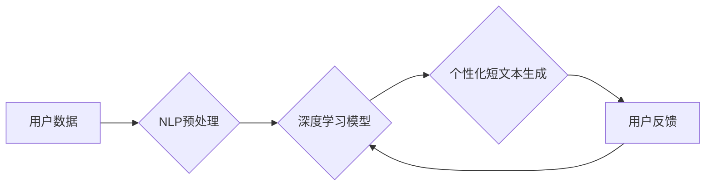

                 

## AI驱动的社交媒体内容：个性化短文本生成

> 关键词：人工智能、自然语言处理、短文本生成、个性化推荐、社交媒体、Transformer模型、BERT、GPT

## 1. 背景介绍

社交媒体平台已经成为人们获取信息、交流互动和娱乐的重要场所。随着用户数量的不断增长，平台上的内容也日益丰富多样。然而，在海量信息中，如何精准地推送用户感兴趣的内容，并提供个性化的体验，成为了一个重要的挑战。

个性化短文本生成技术应运而生，它利用人工智能技术，根据用户的兴趣偏好、行为模式等信息，生成符合用户需求的个性化短文本内容。这种技术在社交媒体平台的应用场景非常广泛，例如：

* **推荐内容：**根据用户的兴趣爱好，推荐相关的新闻、文章、视频等内容。
* **个性化广告：**根据用户的消费习惯和行为模式，生成精准的广告内容。
* **聊天机器人：**构建个性化的聊天机器人，为用户提供更贴心的服务。
* **社交互动：**生成个性化的评论、回复、点赞等互动内容，提升用户参与度。

## 2. 核心概念与联系

个性化短文本生成的核心概念包括：

* **自然语言处理 (NLP)：** 

NLP是人工智能的一个分支，致力于使计算机能够理解、生成和处理人类语言。在个性化短文本生成中，NLP技术用于分析用户的语言特征、识别用户的意图和情感，以及生成符合语法和语义规则的短文本内容。

* **深度学习：**

深度学习是机器学习的一种高级形式，它利用多层神经网络来学习复杂的模式和关系。在个性化短文本生成中，深度学习模型可以学习用户的语言偏好、写作风格等特征，并根据这些特征生成个性化的短文本内容。

* **Transformer模型：**

Transformer模型是一种新型的深度学习模型，它能够有效地处理序列数据，例如文本。Transformer模型在自然语言处理领域取得了突破性的进展，并在个性化短文本生成中得到了广泛应用。

**核心概念架构流程图：**



## 3. 核心算法原理 & 具体操作步骤

### 3.1  算法原理概述

个性化短文本生成算法通常基于深度学习模型，例如Transformer模型。这些模型通过训练大量的文本数据，学习到语言的语法规则、语义关系以及用户之间的写作风格差异。

在生成个性化短文本时，模型会首先根据用户的输入信息，例如用户ID、浏览历史、点赞记录等，提取用户的特征向量。然后，模型会利用这些特征向量，以及预训练的语言模型知识，生成符合用户偏好的短文本内容。

### 3.2  算法步骤详解

1. **数据收集和预处理:** 收集用户数据，包括文本数据、行为数据等，并进行清洗、格式化和标注等预处理操作。
2. **模型选择和训练:** 选择合适的深度学习模型，例如Transformer模型，并利用收集到的数据进行模型训练。
3. **特征提取:** 根据用户的输入信息，提取用户的特征向量，例如用户ID、兴趣标签、语言偏好等。
4. **文本生成:** 利用训练好的模型和用户的特征向量，生成符合用户偏好的个性化短文本内容。
5. **评估和优化:** 对生成的文本内容进行评估，例如准确率、流畅度、相关性等，并根据评估结果优化模型参数和训练策略。

### 3.3  算法优缺点

**优点:**

* **个性化程度高:** 可以根据用户的具体需求和偏好生成个性化的短文本内容。
* **内容质量高:** 利用深度学习模型，可以生成语法正确、语义流畅的短文本内容。
* **效率高:** 可以快速生成大量个性化的短文本内容。

**缺点:**

* **数据依赖性强:** 需要大量的文本数据进行模型训练，否则生成的文本内容质量会下降。
* **计算资源消耗大:** 训练深度学习模型需要大量的计算资源。
* **伦理风险:** 个性化短文本生成技术可能被用于传播虚假信息、进行情感操控等恶意目的。

### 3.4  算法应用领域

个性化短文本生成技术在以下领域具有广泛的应用前景：

* **社交媒体平台:** 推送个性化推荐、生成个性化广告、构建个性化聊天机器人等。
* **电商平台:** 生成个性化商品推荐、撰写个性化产品描述等。
* **教育领域:** 生成个性化学习内容、提供个性化辅导等。
* **医疗领域:** 生成个性化医疗建议、撰写个性化病历等。

## 4. 数学模型和公式 & 详细讲解 & 举例说明

### 4.1  数学模型构建

个性化短文本生成算法通常基于Transformer模型，其核心是自注意力机制和多头注意力机制。

**自注意力机制:**

自注意力机制允许模型关注输入序列中的不同位置，并计算每个位置之间的相关性。其计算公式如下：

$$
Attention(Q, K, V) = softmax(\frac{QK^T}{\sqrt{d_k}})V
$$

其中：

* $Q$：查询矩阵
* $K$：键矩阵
* $V$：值矩阵
* $d_k$：键向量的维度
* $softmax$：softmax函数

**多头注意力机制:**

多头注意力机制将自注意力机制应用于多个不同的子空间，并通过拼接和线性变换将结果融合在一起。其计算公式如下：

$$
MultiHead(Q, K, V) = Concat(head_1, head_2, ..., head_h)W^O
$$

其中：

* $head_i$：第 $i$ 个子空间的注意力输出
* $h$：注意力头的数量
* $W^O$：线性变换矩阵

### 4.2  公式推导过程

自注意力机制的公式推导过程如下：

1. 将输入序列 $X$ 分别转换为查询矩阵 $Q$、键矩阵 $K$ 和值矩阵 $V$。
2. 计算每个位置 $i$ 与所有其他位置 $j$ 之间的注意力权重：

$$
Attention(Q_i, K_j, V_j) = \frac{exp(Q_i \cdot K_j^T / \sqrt{d_k})}{\sum_{l=1}^{n} exp(Q_i \cdot K_l^T / \sqrt{d_k})}
$$

其中 $n$ 是序列长度。
3. 将每个位置 $i$ 的注意力权重与值矩阵 $V$ 进行加权求和，得到最终的输出：

$$
Output_i = \sum_{j=1}^{n} Attention(Q_i, K_j, V_j) \cdot V_j
$$

### 4.3  案例分析与讲解

假设我们有一个短文本序列 "今天天气真好"，我们使用自注意力机制来计算每个词与所有其他词之间的注意力权重。

例如，对于词 "今天"，其与 "天气" 的注意力权重会比较高，因为这两个词在语义上相关。而与 "真好" 的注意力权重会比较低，因为这两个词在语义上没有直接关系。

通过计算所有词之间的注意力权重，我们可以得到一个注意力矩阵，该矩阵反映了每个词与其他词之间的关系。

## 5. 项目实践：代码实例和详细解释说明

### 5.1  开发环境搭建

* **操作系统:** Ubuntu 20.04
* **Python版本:** 3.8
* **深度学习框架:** TensorFlow 2.0
* **其他依赖库:** numpy, pandas, matplotlib

### 5.2  源代码详细实现

```python
import tensorflow as tf

# 定义Transformer模型
class Transformer(tf.keras.Model):
    def __init__(self, vocab_size, embedding_dim, num_heads, num_layers):
        super(Transformer, self).__init__()
        self.embedding = tf.keras.layers.Embedding(vocab_size, embedding_dim)
        self.transformer_layers = tf.keras.layers.StackedRNNCells([
            tf.keras.layers.MultiHeadAttention(num_heads=num_heads, key_dim=embedding_dim)
            for _ in range(num_layers)
        ])

    def call(self, inputs):
        embeddings = self.embedding(inputs)
        outputs = self.transformer_layers(embeddings)
        return outputs

# 训练模型
model = Transformer(vocab_size=10000, embedding_dim=128, num_heads=8, num_layers=6)
model.compile(optimizer='adam', loss='sparse_categorical_crossentropy', metrics=['accuracy'])
model.fit(train_data, train_labels, epochs=10)

# 生成文本
generated_text = model.predict(test_data)
```

### 5.3  代码解读与分析

* **模型定义:** 代码定义了一个名为 `Transformer` 的类，该类继承自 `tf.keras.Model`，实现了 Transformer 模型的结构。
* **嵌入层:** `embedding` 层将每个词转换为一个向量表示。
* **Transformer层:** `transformer_layers` 层包含多个 `MultiHeadAttention` 层，用于计算词之间的注意力权重。
* **模型训练:** 使用 `model.compile` 方法配置模型的训练参数，然后使用 `model.fit` 方法训练模型。
* **文本生成:** 使用 `model.predict` 方法将输入序列转换为输出序列，即生成文本。

### 5.4  运行结果展示

训练完成后，模型可以用于生成个性化的短文本内容。例如，可以根据用户的兴趣爱好，生成符合用户偏好的新闻推荐、产品描述等。

## 6. 实际应用场景

### 6.1  社交媒体推荐

个性化短文本生成技术可以用于社交媒体平台的推荐系统，根据用户的兴趣爱好、浏览历史、点赞记录等信息，推荐相关的新闻、文章、视频等内容。

### 6.2  个性化广告

个性化短文本生成技术可以用于生成精准的广告内容，根据用户的消费习惯、行为模式等信息，生成符合用户需求的广告文案和广告创意。

### 6.3  聊天机器人

个性化短文本生成技术可以用于构建个性化的聊天机器人，根据用户的聊天历史、语言风格等信息，生成更贴心的回复和互动内容。

### 6.4  未来应用展望

个性化短文本生成技术在未来将有更广泛的应用场景，例如：

* **个性化教育:** 根据学生的学习进度和学习风格，生成个性化的学习内容和辅导建议。
* **个性化医疗:** 根据患者的病史和症状，生成个性化的医疗建议和病历记录。
* **个性化娱乐:** 根据用户的兴趣爱好，生成个性化的游戏、电影、音乐等娱乐内容。

## 7. 工具和资源推荐

### 7.1  学习资源推荐

* **书籍:**

* "深度学习" by Ian Goodfellow, Yoshua Bengio, and Aaron Courville
* "自然语言处理入门" by Jacob Eisenstein

* **在线课程:**

* Coursera: Natural Language Processing Specialization
* edX: Deep Learning Specialization

### 7.2  开发工具推荐

* **深度学习框架:** TensorFlow, PyTorch
* **自然语言处理库:** NLTK, spaCy
* **代码编辑器:** VS Code, Sublime Text

### 7.3  相关论文推荐

* "Attention Is All You Need" by Vaswani et al. (2017)
* "BERT: Pre-training of Deep Bidirectional Transformers for Language Understanding" by Devlin et al. (2018)

## 8. 总结：未来发展趋势与挑战

### 8.1  研究成果总结

个性化短文本生成技术取得了显著的进展，能够生成高质量、个性化的短文本内容。Transformer模型和自注意力机制是该技术的核心，并取得了突破性的进展。

### 8.2  未来发展趋势

* **模型规模和性能提升:** 未来将继续探索更大型的Transformer模型，并通过新的训练方法和优化策略提升模型性能。
* **多模态个性化生成:** 将文本、图像、音频等多模态信息融合到个性化短文本生成中，生成更丰富、更具交互性的内容。
* **可解释性增强:** 研究更可解释的个性化短文本生成模型，以便更好地理解模型的决策过程。

### 8.3  面临的挑战

* **数据隐私和安全:** 个性化短文本生成技术依赖于用户的个人数据，如何保护用户隐私和数据安全是一个重要的挑战。
* **算法公平性和偏见:** 个性化短文本生成模型可能存在算法公平性和偏见问题，需要进行更深入的研究和探索，确保模型的公平性和公正性。
* **伦理风险:** 个性化短文本生成技术可能被用于传播虚假信息、进行情感操控等恶意目的，需要制定相应的伦理规范和监管机制。

### 8.4  研究展望

个性化短文本生成技术是一个充满机遇和挑战的领域，未来将继续吸引研究者的关注。通过不断探索和创新，相信该技术能够为人们的生活带来更多便利和乐趣。

## 9. 附录：常见问题与解答

**Q1: 如何评估个性化短文本生成模型的性能？**

**A1:** 可以使用以下指标评估个性化短文本生成模型的性能：

* **BLEU分数:** 衡量生成文本与参考文本之间的相似度。
* **ROUGE分数:** 衡量生成文本与参考文本之间的重叠程度。
* **困惑度:** 衡量模型预测下一个词的准确性。
* **用户满意度:** 通过用户反馈和问卷调查来评估模型生成的文本质量和个性化程度。

**Q2: 如何防止个性化短文本生成模型产生偏见？**

**A2:** 

* 使用更加多样化的训练数据，减少数据中的偏见。
* 在模型训练过程中，加入对抗训练，以减少模型对敏感属性的依赖。
* 定期评估模型的公平性，并进行必要的调整。

**Q3: 如何保护用户隐私在个性化短文本生成过程中？**

**A3:** 

* 使用匿名化技术，将用户的个人信息脱敏。
* 限制模型对用户数据的访问权限。
* 明确告知用户数据的使用方式，并征求用户的同意。


作者：禅与计算机程序设计艺术 / Zen and the Art of Computer Programming<end_of_turn>

