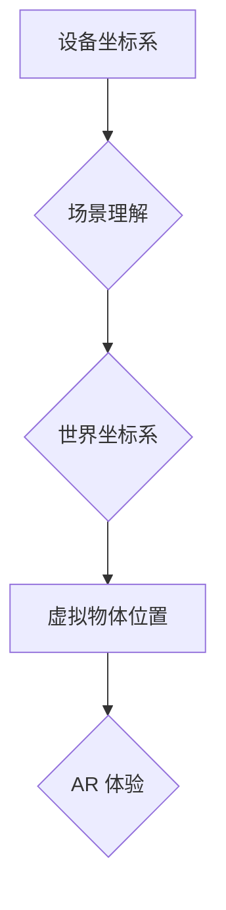

                 

## ARKit 应用开发：在 iOS 上创建 AR 体验

> 关键词：ARKit, AR, iOS, 增强现实, 计算机视觉, 3D 模型,  移动开发,  Unity, Xcode

## 1. 背景介绍

增强现实 (AR) 技术近年来发展迅速，它将虚拟内容叠加到现实世界中，为用户提供一种全新的交互体验。苹果公司推出的 ARKit 框架为 iOS 开发者提供了强大的工具，可以轻松地创建沉浸式的 AR 应用。

ARKit 依赖于设备的摄像头、传感器和 GPU，通过对环境进行深度感知和理解，将虚拟物体准确地放置在现实世界中。它提供了丰富的 API 和功能，包括：

* **场景理解:** ARKit 可以识别水平面、平面和物体，为虚拟物体提供稳定的放置基础。
* **物体追踪:** ARKit 可以跟踪现实世界中的物体，即使物体移动或旋转，虚拟物体也能跟随其运动。
* **光照环境捕捉:** ARKit 可以捕捉现实世界的光照环境，使虚拟物体看起来更加逼真。
* **3D 物体渲染:** ARKit 提供了渲染 3D 模型的 API，可以创建逼真的虚拟物体。

ARKit 的出现极大地降低了开发 AR 应用的门槛，让更多开发者能够参与到 AR 的发展中来。

## 2. 核心概念与联系

ARKit 的核心概念包括：

* **世界坐标系:** ARKit 使用一个世界坐标系来表示虚拟物体的位置和方向。
* **设备坐标系:** 设备坐标系是相对于设备本身的坐标系。
* **场景图:** 场景图是 ARKit 对现实世界环境的理解，包含了水平面、平面和物体的识别信息。
* **锚点:** 锚点是虚拟物体在场景图中的位置，可以用来跟踪虚拟物体的运动。

ARKit 将这些概念结合起来，通过设备的传感器数据和计算机视觉算法，将虚拟物体准确地放置在现实世界中。

**Mermaid 流程图:**



## 3. 核心算法原理 & 具体操作步骤

### 3.1  算法原理概述

ARKit 的核心算法原理包括：

* **视觉惯性估计 (VIO):** VIO 结合了视觉信息和惯性传感器数据，估计设备的运动和姿态。
* **深度感知:** ARKit 使用深度相机或通过视觉算法估计场景的深度信息。
* **平面检测:** ARKit 使用计算机视觉算法检测水平面和平面，为虚拟物体提供稳定的放置基础。
* **物体追踪:** ARKit 使用特征点匹配和模板匹配等算法跟踪现实世界中的物体。

### 3.2  算法步骤详解

1. **设备初始化:** ARKit 会首先初始化设备的传感器和摄像头。
2. **场景理解:** ARKit 会使用视觉信息和惯性传感器数据，估计设备的运动和姿态，并识别场景中的水平面、平面和物体。
3. **世界坐标系构建:** ARKit 会根据设备的运动和姿态，构建一个世界坐标系，用于表示虚拟物体的位置和方向。
4. **虚拟物体放置:** 开发者可以使用 ARKit 的 API 将虚拟物体放置在场景图中，并设置其位置、方向和缩放比例。
5. **虚拟物体渲染:** ARKit 会根据设备的运动和姿态，渲染虚拟物体，使其看起来像是出现在现实世界中。

### 3.3  算法优缺点

**优点:**

* **易于使用:** ARKit 提供了丰富的 API 和功能，简化了 AR 应用开发。
* **高精度:** ARKit 使用先进的算法，可以实现高精度的场景理解和物体追踪。
* **平台兼容性:** ARKit 仅适用于 iOS 设备，但苹果设备的用户群体庞大，覆盖面广。

**缺点:**

* **设备依赖:** ARKit 依赖于设备的摄像头、传感器和 GPU，并非所有设备都支持 ARKit。
* **环境限制:** ARKit 的性能会受到环境光线、物体纹理等因素的影响。
* **平台限制:** ARKit 仅适用于 iOS 设备，无法跨平台使用。

### 3.4  算法应用领域

ARKit 的应用领域非常广泛，包括：

* **游戏:** ARKit 可以为游戏添加 AR 元素，例如将虚拟角色放置在现实世界中。
* **教育:** ARKit 可以用于创建交互式的教育内容，例如虚拟解剖模型或历史场景。
* **零售:** ARKit 可以用于展示虚拟商品，例如在手机上试穿衣服或家具。
* **医疗:** ARKit 可以用于辅助手术、进行远程诊断或培训医护人员。

## 4. 数学模型和公式 & 详细讲解 & 举例说明

### 4.1  数学模型构建

ARKit 的核心算法基于一系列数学模型，例如：

* **相机模型:** 描述了相机如何将三维世界投影到二维图像中的数学模型。
* **深度估计模型:** 将图像像素值映射到深度值的数学模型。
* **运动估计模型:** 估计设备运动和姿态的数学模型。

### 4.2  公式推导过程

由于篇幅限制，这里只列举一个简单的公式，例如相机模型中的投影公式：

$$
x' = f \frac{X}{Z}
$$

其中：

* $x'$ 是投影坐标
* $f$ 是焦距
* $X$ 是三维物体在世界坐标系中的 x 坐标
* $Z$ 是三维物体在世界坐标系中的 z 坐标

### 4.3  案例分析与讲解

假设我们有一个三维物体，其世界坐标系中的位置为 (1, 2, 3)，焦距为 500，则其投影坐标为：

$$
x' = 500 \frac{1}{3} = 166.67
$$

## 5. 项目实践：代码实例和详细解释说明

### 5.1  开发环境搭建

开发 ARKit 应用需要 Xcode 和 iOS 设备。

### 5.2  源代码详细实现

以下是一个简单的 ARKit 应用代码示例，用于在屏幕上渲染一个虚拟立方体：

```swift
import UIKit
import ARKit

class ViewController: UIViewController, ARSCNViewDelegate {

    @IBOutlet var sceneView: ARSCNView!

    override func viewDidLoad() {
        super.viewDidLoad()

        // Set the view's delegate
        sceneView.delegate = self

        // Create a new scene
        let scene = SCNScene()

        // Create a new cube node
        let cube = SCNNode(geometry: SCNBox(width: 0.1, height: 0.1, length: 0.1, chamferRadius: 0.01))

        // Add the cube to the scene
        scene.rootNode.addChildNode(cube)

        // Set the scene to the view
        sceneView.scene = scene
    }

    override func viewWillAppear(_ animated: Bool) {
        super.viewWillAppear(animated)

        // Create a session configuration
        let configuration = ARWorldTrackingConfiguration()

        // Run the view's session
        sceneView.session.run(configuration)
    }

    override func viewWillDisappear(_ animated: Bool) {
        super.viewWillDisappear(animated)

        // Pause the view's session
        sceneView.session.pause()
    }

    // MARK: - ARSCNViewDelegate

    func renderer(_ renderer: SCNSceneRenderer, didAdd node: SCNNode, for anchor: ARAnchor) {
        // ...
    }

    func renderer(_ renderer: SCNSceneRenderer, didUpdate node: SCNNode, for anchor: ARAnchor) {
        // ...
    }
}
```

### 5.3  代码解读与分析

* `ARSCNView` 是 ARKit 的核心视图，用于渲染 AR 场景。
* `ARWorldTrackingConfiguration` 是一个 AR 跟踪配置，用于启用世界跟踪功能。
* `SCNNode` 是一个场景节点，用于表示虚拟物体。
* `SCNBox` 是一个立方体几何体。
* `addChildNode` 方法用于将节点添加到场景树中。
* `sceneView.session.run` 方法启动 AR 跟踪会话。
* `sceneView.session.pause` 方法暂停 AR 跟踪会话。

### 5.4  运行结果展示

运行此代码后，会在设备屏幕上渲染一个虚拟立方体，并随着设备的移动而移动。

## 6. 实际应用场景

### 6.1  AR 游戏

ARKit 可以为游戏添加 AR 元素，例如将虚拟角色放置在现实世界中，让玩家与虚拟世界互动。

### 6.2  AR 教育

ARKit 可以用于创建交互式的教育内容，例如虚拟解剖模型或历史场景，让学生更直观地理解知识。

### 6.3  AR 零售

ARKit 可以用于展示虚拟商品，例如在手机上试穿衣服或家具，让消费者更直观地了解商品。

### 6.4  未来应用展望

ARKit 的应用场景还在不断扩展，未来可能会应用于更多领域，例如：

* **AR 旅游:** 提供虚拟导游和景点信息，增强旅游体验。
* **AR 建筑:** 虚拟展示建筑模型，帮助用户了解建筑设计。
* **AR 医疗:** 辅助手术、进行远程诊断或培训医护人员。

## 7. 工具和资源推荐

### 7.1  学习资源推荐

* **苹果官方文档:** https://developer.apple.com/documentation/arkit
* **ARKit 教程:** https://www.raywenderlich.com/1005-arkit-tutorial-getting-started-with-augmented-reality

### 7.2  开发工具推荐

* **Xcode:** https://developer.apple.com/xcode/
* **Unity:** https://unity.com/

### 7.3  相关论文推荐

* **ARKit: A Platform for Augmented Reality on iOS**
* **Real-Time 3D Reconstruction from a Single RGB Camera**

## 8. 总结：未来发展趋势与挑战

### 8.1  研究成果总结

ARKit 的出现极大地推动了 AR 技术的发展，为开发者提供了强大的工具，使其能够轻松地创建沉浸式的 AR 应用。

### 8.2  未来发展趋势

AR 技术的未来发展趋势包括：

* **更逼真的视觉效果:** AR 技术将朝着更逼真的视觉效果发展，例如更精细的纹理、更真实的阴影和光照效果。
* **更强大的交互体验:** AR 技术将提供更强大的交互体验，例如手势识别、语音识别和物体识别。
* **更广泛的应用场景:** AR 技术将应用于更多领域，例如医疗、教育、零售和娱乐。

### 8.3  面临的挑战

AR 技术还面临着一些挑战，例如：

* **设备性能:** AR 应用对设备性能要求较高，需要更高效的算法和更强大的硬件。
* **用户体验:** AR 应用需要提供良好的用户体验，例如流畅的画面、准确的跟踪和易于使用的界面。
* **隐私问题:** AR 应用可能会收集用户的个人信息，需要妥善处理用户隐私问题。

### 8.4  研究展望

未来，AR 技术将继续发展，并为我们带来更多创新和改变。

## 9. 附录：常见问题与解答

**Q1: 如何安装 ARKit？**

A1: ARKit 是 iOS 系统的一部分，无需单独安装。

**Q2: 如何使用 ARKit 开发应用？**

A2: 可以使用 Xcode 和 Swift 语言开发 ARKit 应用。

**Q3: ARKit 支持哪些设备？**

A3: ARKit 支持 iPhone 6s 及更新机型、iPad Pro (9.7 英寸、10.5 英寸、12.9 英寸) 和 iPad (2017 年及更新机型)。

**作者：禅与计算机程序设计艺术 / Zen and the Art of Computer Programming**<end_of_turn>

