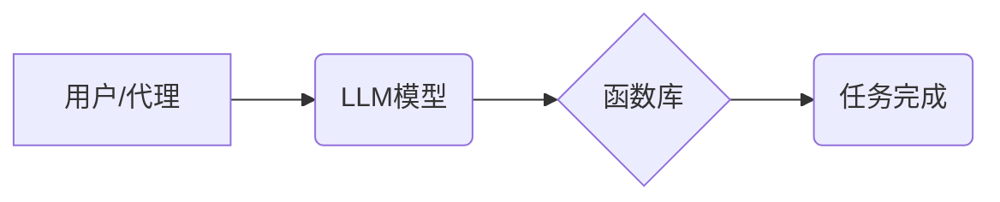
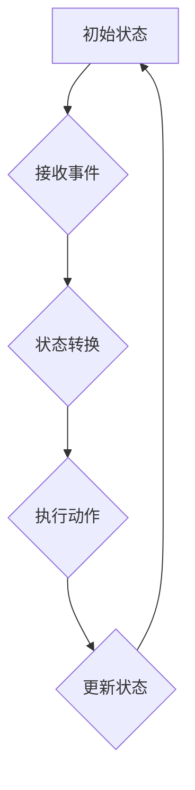

                 

## Agents与函数库：LLM操作系统的核心组件

> 关键词：大型语言模型 (LLM)、代理 (Agent)、函数库、操作系统、人工智能 (AI)、可编程性、可扩展性

## 1. 背景介绍

大型语言模型 (LLM) 近年来取得了令人瞩目的进展，展现出强大的文本生成、理解和翻译能力。然而，将这些强大的模型应用于实际场景仍然面临着挑战。LLM 通常是一个“黑盒子”，缺乏明确的接口和可编程性，难以与其他系统和应用程序集成。

为了解决这个问题，我们需要构建一个更高级的架构，将LLM与其他组件结合起来，形成一个完整的AI操作系统。在这个架构中，**代理 (Agent)** 和 **函数库** 将扮演核心角色。

## 2. 核心概念与联系

**代理** 是一个能够感知环境、做出决策并与环境交互的智能体。在LLM操作系统的框架中，代理可以被视为一个“用户”或“应用程序”，它与LLM交互，利用其强大的语言能力来完成特定的任务。

**函数库** 是一个包含预定义函数的集合，这些函数可以被代理调用来执行特定的操作。在LLM操作系统的框架中，函数库可以提供各种功能，例如数据处理、网络请求、文件操作等，帮助代理更有效地利用LLM的能力。

**LLM操作系统的核心架构** 可以概括为以下流程：



**核心概念联系：**

* **代理** 通过调用 **函数库** 中的函数，与 **LLM模型** 交互，并最终完成任务。
* **函数库** 提供了代理与 **LLM模型** 之间的接口，使得代理可以更方便地利用LLM的能力。
* **LLM模型** 提供了强大的语言处理能力，为代理完成任务提供了基础。

## 3. 核心算法原理 & 具体操作步骤

### 3.1  算法原理概述

LLM操作系统的核心算法原理是基于**代理驱动的函数调用**。代理通过定义一系列函数调用，将任务分解成多个步骤，并通过函数库将这些步骤传递给LLM模型执行。

LLM模型根据函数调用参数和上下文信息，生成相应的文本输出，代理根据输出结果进行下一步操作，最终完成整个任务。

### 3.2  算法步骤详解

1. **代理定义任务：** 代理首先需要明确要完成的任务，并将其分解成一系列子任务。
2. **代理构建函数调用序列：** 代理根据子任务，构建一个函数调用序列，每个函数代表一个具体的操作步骤。
3. **代理调用函数库：** 代理将函数调用序列传递给函数库，函数库根据调用信息，找到相应的函数并执行。
4. **LLM模型执行函数：** 函数库将函数调用传递给LLM模型，LLM模型根据函数参数和上下文信息，生成相应的文本输出。
5. **代理处理输出结果：** 代理接收LLM模型的输出结果，并根据结果进行下一步操作，直到完成整个任务。

### 3.3  算法优缺点

**优点：**

* **可编程性：** 代理通过定义函数调用序列，可以实现对LLM模型的灵活控制，从而实现各种复杂的任务。
* **可扩展性：** 函数库可以不断扩展，添加新的功能，从而使LLM操作系统的功能更加丰富。
* **模块化设计：** 代理和函数库的模块化设计，使得系统更加易于维护和扩展。

**缺点：**

* **代理设计复杂：** 设计一个能够有效地利用LLM能力的代理，需要一定的专业知识和经验。
* **函数库维护成本：** 函数库的维护成本较高，需要不断更新和完善函数库的功能。

### 3.4  算法应用领域

LLM操作系统的核心算法可以应用于各种领域，例如：

* **聊天机器人：** 代理可以定义一系列函数调用，实现与用户的自然语言交互。
* **文本生成：** 代理可以利用LLM模型生成各种类型的文本，例如文章、故事、诗歌等。
* **代码生成：** 代理可以利用LLM模型生成代码，帮助程序员提高开发效率。
* **数据分析：** 代理可以利用LLM模型分析文本数据，提取关键信息。

## 4. 数学模型和公式 & 详细讲解 & 举例说明

### 4.1  数学模型构建

LLM操作系统的核心算法可以抽象为一个**状态机模型**。

* **状态：** 代理当前的状态，包括其内部变量和外部环境信息。
* **事件：** 代理接收到的外部事件，例如用户输入、系统通知等。
* **转换：** 状态机根据事件和当前状态，进行状态转换。
* **动作：** 状态机在转换过程中执行的动作，例如调用函数、发送消息等。

我们可以用一个状态转移图来表示状态机模型：



### 4.2  公式推导过程

状态机的状态转换可以由一个**状态转换函数**来描述：

$$
f(s, e) = s'
$$

其中：

* $s$ 是当前状态
* $e$ 是接收到的事件
* $s'$ 是转换后的状态

状态转换函数的具体实现取决于具体的应用场景和状态机模型的设计。

### 4.3  案例分析与讲解

例如，在聊天机器人应用场景中，代理的状态可以包括其当前对话上下文、用户身份等信息。事件可以包括用户的输入文本、系统通知等。状态转换函数可以根据用户的输入文本，判断其意图，并进行相应的状态转换，例如切换到不同的对话主题，或者执行特定的动作，例如发送回复消息。

## 5. 项目实践：代码实例和详细解释说明

### 5.1  开发环境搭建

LLM操作系统的开发环境可以基于Python语言和相关的框架搭建。

* **Python:** 作为主流的AI开发语言，Python拥有丰富的库和工具，可以方便地开发LLM操作系统的核心组件。
* **Transformers:** HuggingFace的Transformers库提供了对各种LLM模型的封装和接口，可以方便地调用LLM模型进行文本处理。
* **Flask/FastAPI:** 可以用于构建代理和函数库之间的API接口，实现系统之间的交互。

### 5.2  源代码详细实现

以下是一个简单的LLM操作系统的代码示例，演示了代理如何调用函数库中的函数，利用LLM模型生成文本：

```python
from transformers import pipeline

# 初始化LLM模型
generator = pipeline("text-generation", model="gpt2")

# 定义一个代理类
class ChatbotAgent:
    def __init__(self):
        self.context = ""

    def greet(self):
        return generator(f"你好！{self.context}", max_length=50)[0]['generated_text']

    def respond(self, user_input):
        self.context += user_input
        return generator(f"{self.context}", max_length=50)[0]['generated_text']

# 创建代理实例
agent = ChatbotAgent()

# 与代理交互
print(agent.greet())
user_input = input("您：")
print(agent.respond(user_input))
```

### 5.3  代码解读与分析

* 代码首先初始化一个GPT-2模型，用于文本生成。
* 然后定义了一个代理类`ChatbotAgent`，包含两个方法：`greet()`用于初始问候，`respond()`用于根据用户输入生成回复。
* 代理的`context`属性用于存储对话上下文，以便生成更相关的回复。
* 最后，代码创建了一个代理实例，并演示了与代理的交互过程。

### 5.4  运行结果展示

运行该代码后，用户可以与代理进行简单的对话，代理会根据用户输入生成相应的回复。

## 6. 实际应用场景

LLM操作系统的应用场景非常广泛，例如：

* **智能客服：** 代理可以处理用户的常见问题，并提供自动回复，减轻客服人员的工作压力。
* **个性化推荐：** 代理可以根据用户的喜好和行为，推荐个性化的商品或服务。
* **自动写作：** 代理可以帮助用户生成各种类型的文本，例如新闻稿、广告文案、诗歌等。
* **代码辅助：** 代理可以帮助程序员生成代码片段，提高开发效率。

### 6.4  未来应用展望

随着LLM技术的不断发展，LLM操作系统的应用场景将会更加丰富。未来，LLM操作系统可能能够实现以下功能：

* **更复杂的对话：** 代理能够理解更复杂的语言，并进行更自然的对话。
* **多模态交互：** 代理能够处理文本、图像、音频等多种类型的输入，实现更丰富的交互方式。
* **自主学习：** 代理能够从数据中学习，不断提升其能力。

## 7. 工具和资源推荐

### 7.1  学习资源推荐

* **HuggingFace Transformers:** https://huggingface.co/docs/transformers/index
* **OpenAI API:** https://platform.openai.com/docs/api-reference
* **DeepMind Blog:** https://deepmind.com/blog/

### 7.2  开发工具推荐

* **Python:** https://www.python.org/
* **Flask:** https://flask.palletsprojects.com/en/2.2.x/
* **FastAPI:** https://fastapi.tiangolo.com/

### 7.3  相关论文推荐

* **Attention Is All You Need:** https://arxiv.org/abs/1706.03762
* **BERT: Pre-training of Deep Bidirectional Transformers for Language Understanding:** https://arxiv.org/abs/1810.04805
* **GPT-3: Language Models are Few-Shot Learners:** https://arxiv.org/abs/2005.14165

## 8. 总结：未来发展趋势与挑战

### 8.1  研究成果总结

LLM操作系统的核心算法和架构为将LLM模型应用于实际场景提供了新的思路和方法。代理驱动的函数调用机制，使得LLM模型更加可编程和可扩展，为开发更智能、更灵活的AI应用程序提供了基础。

### 8.2  未来发展趋势

未来，LLM操作系统的研究方向将集中在以下几个方面：

* **更强大的LLM模型:** 开发更强大的LLM模型，能够理解更复杂的语言，并生成更高质量的文本。
* **更智能的代理:** 设计更智能的代理，能够更好地理解用户意图，并提供更个性化的服务。
* **多模态交互:** 实现LLM操作系统的多模态交互能力，能够处理文本、图像、音频等多种类型的输入。
* **自主学习:** 使LLM操作系统能够自主学习，从数据中不断提升其能力。

### 8.3  面临的挑战

LLM操作系统的开发也面临着一些挑战：

* **模型规模和效率:** 强大的LLM模型通常体积庞大，计算资源消耗高，需要开发更有效的模型压缩和加速技术。
* **数据安全和隐私:** LLM模型的训练和应用需要大量数据，如何保证数据安全和隐私是一个重要的挑战。
* **伦理和社会影响:** LLM操作系统的应用可能会带来一些伦理和社会问题，例如信息误导、偏见放大等，需要进行深入的伦理研究和社会规范制定。

### 8.4  研究展望

尽管面临着挑战，但LLM操作系统的研究前景依然广阔。随着技术的不断发展，LLM操作系统将成为未来人工智能发展的重要方向，为我们带来更加智能、便捷的生活体验。

## 9. 附录：常见问题与解答

**Q1: 如何选择合适的LLM模型？**

**A1:** 选择合适的LLM模型取决于具体的应用场景和需求。例如，对于文本生成任务，GPT-3是一个不错的选择；对于对话系统，BERT是一个更合适的模型。

**Q2: 如何设计一个有效的代理？**

**A2:** 设计一个有效的代理需要考虑以下几个方面：

* 代理的知识和能力：代理需要具备完成特定任务所需的知识和能力。
* 代理的感知和决策机制：代理需要能够感知环境信息，并做出合理的决策。
* 代理的交互方式：代理需要能够与用户和系统进行有效的交互。

**Q3: 如何保证LLM操作系统的安全性？**

**A3:** 确保LLM操作系统的安全性需要从多个方面入手：

* 使用安全的LLM模型和数据源。
* 对代理和函数库进行安全认证和授权。
* 对用户输入进行过滤和验证。
* 定期进行安全评估和漏洞修复。


作者：禅与计算机程序设计艺术 / Zen and the Art of Computer Programming 
<end_of_turn>

