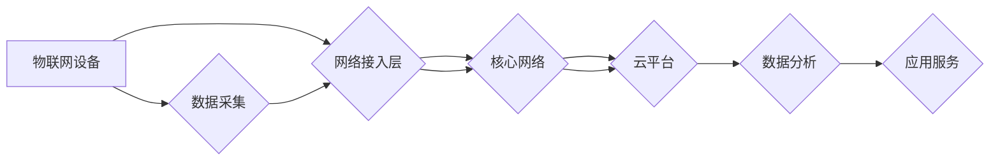

                 

## 5G 物联网应用场景：高速低延迟连接的创新应用

> 关键词：5G, 物联网, 低延迟, 高速连接, 应用场景, 创新, 未来趋势

## 1. 背景介绍

物联网（IoT）正以惊人的速度发展，连接着越来越多的设备，从智能家居到工业自动化，再到城市管理和医疗保健。然而，传统的网络基础设施难以满足物联网对高速、低延迟和大规模连接的需求。5G 作为下一代移动通信技术，凭借其高速率、低延迟和高可靠性，为物联网的广泛应用提供了强有力的支撑。

5G 的关键特性包括：

* **高速率:** 5G 的峰值下载速度可达 10 Gbps，远超 4G 网络，能够支持海量数据传输。
* **低延迟:** 5G 的延迟时间可低至 1 毫秒，能够满足实时交互和控制的需求。
* **高可靠性:** 5G 的可靠性更高，能够确保数据传输的稳定性和安全性。
* **大连接数:** 5G 可以支持数百万个设备同时连接，满足物联网的大规模连接需求。

## 2. 核心概念与联系

**2.1 物联网 (IoT)**

物联网是指通过传感器、网络和数据分析技术，将物理世界中的物体连接到互联网，实现数据采集、传输、处理和应用的系统。物联网应用场景广泛，包括智能家居、智能交通、智能农业、工业自动化等。

**2.2 5G 网络**

5G 是第五代移动通信技术，其核心目标是提供更高的数据速率、更低的延迟、更高的连接密度和更强的安全性。5G 采用多种技术手段实现其目标，包括毫米波频段、Massive MIMO、网络切片等。

**2.3 5G 物联网架构**

5G 物联网架构通常由以下几个主要部分组成：

* **物联网设备:** 包括传感器、执行器、智能终端等，负责收集数据、执行控制指令。
* **网络接入层:** 连接物联网设备到 5G 网络，负责数据传输和网络管理。
* **核心网络:** 提供网络功能和服务，包括数据路由、安全管理、用户认证等。
* **云平台:** 提供数据存储、处理和分析服务，支持物联网应用的开发和部署。

**2.4 Mermaid 流程图**



## 3. 核心算法原理 & 具体操作步骤

**3.1 算法原理概述**

在 5G 物联网应用场景中，各种算法发挥着重要作用，例如：

* **数据压缩算法:** 减少数据传输量，提高网络效率。
* **数据加密算法:** 保护数据安全，防止信息泄露。
* **路由算法:** 优化数据传输路径，降低延迟。
* **机器学习算法:** 从物联网数据中提取有价值的信息，支持智能决策。

**3.2 算法步骤详解**

以数据压缩算法为例，其基本步骤包括：

1. **数据分析:** 分析待压缩数据的特征，例如重复模式、冗余信息等。
2. **编码方案选择:** 根据数据特征选择合适的压缩算法，例如 Huffman 编码、Lempel-Ziv 算法等。
3. **数据编码:** 使用选定的算法将数据编码成更紧凑的格式。
4. **数据解码:** 在接收端使用相同的算法解码压缩数据，恢复原始数据。

**3.3 算法优缺点**

不同的算法具有不同的优缺点，需要根据具体应用场景选择合适的算法。例如，Huffman 编码适用于文本数据压缩，而 Lempel-Ziv 算法更适合图像和音频数据压缩。

**3.4 算法应用领域**

数据压缩算法广泛应用于物联网场景，例如：

* **智能家居:** 压缩传感器数据，降低网络带宽需求。
* **智能交通:** 压缩视频流数据，提高监控系统效率。
* **工业自动化:** 压缩生产数据，支持实时分析和决策。

## 4. 数学模型和公式 & 详细讲解 & 举例说明

**4.1 数学模型构建**

在 5G 物联网应用场景中，可以使用数学模型来描述网络性能、数据传输效率等方面。例如，可以建立一个模型来描述数据传输速率与网络带宽、延迟、数据包大小之间的关系。

**4.2 公式推导过程**

假设数据传输速率为 R，网络带宽为 B，延迟为 D，数据包大小为 S，则可以推导出以下公式：

$$R = \frac{S}{D + \frac{S}{B}}$$

**4.3 案例分析与讲解**

假设网络带宽为 10 Mbps，延迟为 10 毫秒，数据包大小为 1 KB，则根据公式可以计算出数据传输速率为：

$$R = \frac{1024}{0.01 + \frac{1024}{10 \times 10^6}} \approx 9.99 Mbps$$

## 5. 项目实践：代码实例和详细解释说明

**5.1 开发环境搭建**

为了实现 5G 物联网应用，需要搭建相应的开发环境，包括：

* **硬件设备:** 5G 模块、物联网传感器、执行器等。
* **软件工具:** 5G 网络仿真工具、物联网平台、编程语言等。

**5.2 源代码详细实现**

以 Python 语言为例，可以编写代码来实现物联网设备的数据采集和传输功能：

```python
import time
import socket

# 物联网设备信息
device_id = "123456"
server_ip = "192.168.1.1"
server_port = 8080

# 创建 socket 对象
sock = socket.socket(socket.AF_INET, socket.SOCK_STREAM)

# 连接服务器
sock.connect((server_ip, server_port))

while True:
    # 采集传感器数据
    temperature = 25.5
    humidity = 60.2

    # 组装数据包
    data = f"device_id={device_id},temperature={temperature},humidity={humidity}"

    # 发送数据包
    sock.sendall(data.encode())

    # 接收服务器响应
    response = sock.recv(1024).decode()

    # 打印响应信息
    print(response)

    # 等待一段时间
    time.sleep(1)
```

**5.3 代码解读与分析**

这段代码首先创建了一个 socket 对象，用于与服务器进行通信。然后，它连接到服务器，并进入一个循环，不断采集传感器数据，组装数据包，发送到服务器，并接收服务器的响应。

**5.4 运行结果展示**

运行这段代码后，物联网设备会向服务器发送数据包，服务器会接收并处理这些数据包，并返回相应的响应信息。

## 6. 实际应用场景

**6.1 智能家居**

5G 能够支持智能家居设备的高速、低延迟连接，实现实时控制和远程管理。例如，用户可以通过手机APP控制智能灯光、空调、窗帘等设备，还可以远程监控家居安全。

**6.2 智能交通**

5G 可以支持自动驾驶汽车、智能交通信号灯、车联网等应用，提高交通效率和安全性。例如，自动驾驶汽车可以通过 5G 网络获取实时路况信息，避免交通拥堵和事故发生。

**6.3 智能农业**

5G 可以支持农业传感器、无人机、智能灌溉系统等应用，提高农业生产效率和产品质量。例如，传感器可以监测土壤湿度、温度、光照等信息，无人机可以进行田间巡查和喷洒农药，智能灌溉系统可以根据土壤湿度自动调节灌溉量。

**6.4 未来应用展望**

随着 5G 技术的不断发展，物联网应用场景将更加广泛，例如：

* **远程医疗:** 5G 可以支持远程医疗诊断、手术指导等应用，提高医疗服务质量和效率。
* **工业4.0:** 5G 可以支持工业自动化、机器人控制等应用，实现智能制造。
* **智慧城市:** 5G 可以支持城市管理、公共安全等应用，提高城市运营效率和居民生活质量。

## 7. 工具和资源推荐

**7.1 学习资源推荐**

* **书籍:**
    * 《5G 技术与应用》
    * 《物联网技术》
* **在线课程:**
    * Coursera: 5G Networks and Applications
    * edX: Internet of Things (IoT)

**7.2 开发工具推荐**

* **物联网平台:** AWS IoT Core, Azure IoT Hub, Google Cloud IoT Core
* **编程语言:** Python, C++, Java
* **网络仿真工具:** ns-3, OMNeT++

**7.3 相关论文推荐**

* **5G 物联网架构:**
    * "5G Network Slicing for IoT: A Survey"
* **5G 物联网应用场景:**
    * "5G for Smart Cities: A Comprehensive Survey"
    * "5G-Enabled Industrial Internet of Things: A Survey"

## 8. 总结：未来发展趋势与挑战

**8.1 研究成果总结**

5G 技术为物联网的发展提供了强有力的支撑，推动了物联网应用场景的拓展和创新。

**8.2 未来发展趋势**

未来，5G 物联网将朝着以下方向发展：

* **更高速、更低延迟:** 5G 技术将不断演进，提供更高的数据速率和更低的延迟。
* **更智能化:** 人工智能技术将与 5G 物联网深度融合，实现更智能的应用场景。
* **更安全可靠:** 5G 网络将更加安全可靠，能够更好地保护物联网数据的安全。

**8.3 面临的挑战**

5G 物联网的发展也面临一些挑战，例如：

* **网络部署成本:** 5G 网络部署成本较高，需要投入大量资金和人力。
* **数据安全和隐私保护:** 物联网数据量巨大，需要加强数据安全和隐私保护措施。
* **标准化和互操作性:** 物联网设备和平台之间缺乏统一的标准，导致互操作性问题。

**8.4 研究展望**

未来，需要进一步研究和探索 5G 物联网的应用场景，开发更智能、更安全、更可靠的物联网应用，推动 5G 物联网技术向更广泛领域拓展。

## 9. 附录：常见问题与解答

**9.1 Q: 5G 和 4G 的区别是什么？**

**A:** 5G 和 4G 都是移动通信技术，但 5G 的数据速率、延迟和连接密度都远超 4G。

**9.2 Q: 5G 物联网有哪些应用场景？**

**A:** 5G 物联网的应用场景非常广泛，包括智能家居、智能交通、智能农业、远程医疗、工业4.0 等。

**9.3 Q: 如何搭建 5G 物联网开发环境？**

**A:** 需要准备 5G 模块、物联网传感器、执行器等硬件设备，以及 5G 网络仿真工具、物联网平台、编程语言等软件工具。


作者：禅与计算机程序设计艺术 / Zen and the Art of Computer Programming 
<end_of_turn>

