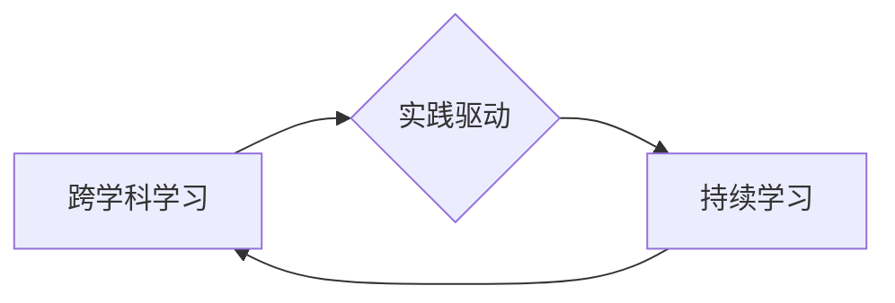

                 

## Google的AI人才培养体系:学习路径和职业发展

> 关键词：人工智能、人才培养、学习路径、职业发展、Google AI、机器学习、深度学习、数据科学

## 1. 背景介绍

人工智能（AI）正以惊人的速度发展，对各行各业产生着深远的影响。作为AI领域的领导者，Google一直致力于培养顶尖的AI人才，为推动AI技术进步和应用做出贡献。本文将深入探讨Google的AI人才培养体系，分析其学习路径、职业发展机会以及背后的核心理念。

近年来，AI技术在各个领域取得了突破性进展，例如图像识别、自然语言处理、语音识别等。这些进展离不开大量优秀的人才。Google认识到AI人才的重要性，并建立了完善的人才培养体系，旨在培养具备扎实理论基础、实践经验和创新能力的AI专家。

## 2. 核心概念与联系

Google的AI人才培养体系基于以下核心概念：

* **跨学科学习:** AI领域需要融合数学、计算机科学、统计学、心理学等多学科知识。Google鼓励员工学习不同领域的知识，拓宽视野，提升解决复杂问题的能力。
* **实践驱动:** 理论知识需要通过实践应用才能真正掌握。Google提供丰富的实践机会，例如参与开源项目、参加竞赛、开发实际应用等，帮助员工将理论知识转化为实际能力。
* **持续学习:** AI技术发展迅速，需要不断学习新知识和技能。Google鼓励员工保持学习的热情，提供各种学习资源和平台，例如在线课程、研讨会、内部培训等。

**核心概念关系图:**



## 3. 核心算法原理 & 具体操作步骤

### 3.1  算法原理概述

Google的AI人才培养体系中，涉及到多种核心算法，例如机器学习、深度学习、强化学习等。这些算法的原理需要深入理解，才能有效地应用于实际问题。

* **机器学习:** 机器学习是人工智能的一个分支，它通过算法学习数据中的模式，从而进行预测或分类。常见的机器学习算法包括线性回归、逻辑回归、支持向量机、决策树等。
* **深度学习:** 深度学习是机器学习的一个子集，它使用多层神经网络来学习数据。深度学习算法能够处理更复杂的数据，并取得更好的性能。常见的深度学习算法包括卷积神经网络（CNN）、循环神经网络（RNN）、生成对抗网络（GAN）等。
* **强化学习:** 强化学习是一种通过试错学习的算法，它通过奖励和惩罚来引导智能体做出最佳决策。强化学习算法广泛应用于游戏、机器人控制等领域。

### 3.2  算法步骤详解

以下以线性回归为例，详细说明机器学习算法的步骤：

1. **数据收集和预处理:** 收集相关数据，并进行清洗、转换、特征工程等预处理工作。
2. **模型选择:** 选择合适的机器学习算法，例如线性回归。
3. **模型训练:** 使用训练数据训练模型，调整模型参数，使模型能够准确地预测目标变量。
4. **模型评估:** 使用测试数据评估模型的性能，例如计算准确率、召回率、F1-score等指标。
5. **模型调优:** 根据评估结果，调整模型参数或选择其他算法，进一步提高模型性能。
6. **模型部署:** 将训练好的模型部署到实际应用场景中，用于预测或分类。

### 3.3  算法优缺点

每个算法都有其优缺点，需要根据实际问题选择合适的算法。

* **线性回归:** 优点：简单易懂、计算效率高；缺点：对数据线性关系依赖性强，难以处理非线性问题。
* **深度学习:** 优点：能够处理复杂数据，性能优异；缺点：训练时间长、参数量大、需要大量数据。

### 3.4  算法应用领域

机器学习、深度学习和强化学习算法广泛应用于各个领域，例如：

* **图像识别:** 用于识别物体、场景、人脸等。
* **自然语言处理:** 用于文本分类、机器翻译、语音识别等。
* **推荐系统:** 用于推荐商品、电影、音乐等。
* **医疗诊断:** 用于辅助医生诊断疾病。
* **金融风险控制:** 用于识别欺诈交易、评估风险等。

## 4. 数学模型和公式 & 详细讲解 & 举例说明

### 4.1  数学模型构建

机器学习算法通常基于数学模型，例如线性回归模型、逻辑回归模型、神经网络模型等。这些模型通过数学公式来描述数据之间的关系。

### 4.2  公式推导过程

以线性回归模型为例，其目标是找到一条直线，使得这条直线与数据点之间的误差最小。

线性回归模型的数学公式如下：

$$y = wx + b$$

其中：

* $y$ 是目标变量
* $x$ 是输入变量
* $w$ 是权重参数
* $b$ 是偏置参数

为了找到最佳的 $w$ 和 $b$ 值，可以使用最小二乘法。最小二乘法的目标是找到 $w$ 和 $b$ 值，使得模型预测值与实际值之间的平方误差最小。

### 4.3  案例分析与讲解

假设我们有一组数据，其中 $x$ 是房屋面积， $y$ 是房屋价格。我们可以使用线性回归模型来预测房屋价格。

通过训练模型，我们可以得到最佳的 $w$ 和 $b$ 值。例如，假设 $w = 1000$ 和 $b = 50000$。

那么，对于面积为 $100$ 平方米的房屋，我们可以预测其价格为：

$$y = 1000 * 100 + 50000 = 150000$$

## 5. 项目实践：代码实例和详细解释说明

### 5.1  开发环境搭建

Google提供了一系列开发工具和平台，例如TensorFlow、Keras、Cloud AI Platform等，可以帮助开发者构建和训练AI模型。

### 5.2  源代码详细实现

以下是一个使用TensorFlow构建线性回归模型的代码示例：

```python
import tensorflow as tf

# 定义模型
model = tf.keras.Sequential([
  tf.keras.layers.Dense(units=1, input_shape=[1])
])

# 编译模型
model.compile(optimizer='sgd', loss='mean_squared_error')

# 训练模型
model.fit(x_train, y_train, epochs=100)

# 评估模型
loss = model.evaluate(x_test, y_test)
print('Loss:', loss)
```

### 5.3  代码解读与分析

这段代码首先定义了一个线性回归模型，包含一个全连接层。然后，使用随机梯度下降算法（SGD）进行模型训练，并使用均方误差作为损失函数。最后，使用测试数据评估模型的性能。

### 5.4  运行结果展示

训练完成后，我们可以使用测试数据预测房屋价格，并与实际价格进行比较。

## 6. 实际应用场景

Google的AI人才培养体系培养出的AI专家广泛应用于各个领域，例如：

* **搜索引擎:** Google搜索引擎利用AI技术进行关键词匹配、网页排名、结果排序等，提高搜索结果的准确性和相关性。
* **广告平台:** Google广告平台利用AI技术进行广告投放、目标用户识别、广告效果评估等，帮助广告主提高广告效果。
* **语音助手:** Google Assistant是Google开发的语音助手，它利用AI技术进行语音识别、自然语言理解、对话生成等，帮助用户完成各种任务。
* **自动驾驶:** Google Waymo是Google的自动驾驶项目，它利用AI技术进行环境感知、路径规划、决策控制等，开发自动驾驶汽车。

### 6.4  未来应用展望

随着AI技术的不断发展，Google的AI人才培养体系将继续发挥重要作用，为推动AI技术进步和应用做出更大的贡献。未来，AI技术将在更多领域得到应用，例如医疗保健、教育、金融、制造业等。

## 7. 工具和资源推荐

### 7.1  学习资源推荐

* **Coursera:** 提供丰富的AI课程，例如Andrew Ng的机器学习课程。
* **edX:** 提供由麻省理工学院、哈佛大学等知名大学提供的AI课程。
* **Udacity:** 提供针对AI领域的职业培训课程。
* **Google AI Education:** 提供Google内部的AI学习资源。

### 7.2  开发工具推荐

* **TensorFlow:** Google开发的开源机器学习框架。
* **Keras:** 基于TensorFlow的深度学习框架。
* **PyTorch:** Facebook开发的开源机器学习框架。
* **Cloud AI Platform:** Google提供的云端AI平台。

### 7.3  相关论文推荐

* **Deep Learning** by Ian Goodfellow, Yoshua Bengio, and Aaron Courville
* **Machine Learning: A Probabilistic Perspective** by Kevin Murphy
* **Pattern Recognition and Machine Learning** by Christopher Bishop

## 8. 总结：未来发展趋势与挑战

### 8.1  研究成果总结

Google的AI人才培养体系取得了显著成果，培养了一批优秀的AI专家，为推动AI技术进步和应用做出了重要贡献。

### 8.2  未来发展趋势

未来，AI技术将继续发展，并应用于更多领域。Google的AI人才培养体系将继续适应发展趋势，培养具备更深层次AI知识和技能的人才。

### 8.3  面临的挑战

AI人才培养面临着一些挑战，例如：

* **人才短缺:** AI人才需求量大，但供给不足。
* **技术更新快:** AI技术发展迅速，需要不断学习新知识和技能。
* **伦理问题:** AI技术发展需要考虑伦理问题，例如算法偏见、数据隐私等。

### 8.4  研究展望

Google将继续加强AI人才培养，并与学术界、产业界合作，共同推动AI技术进步和应用。

## 9. 附录：常见问题与解答

**Q1: 如何申请加入Google的AI人才培养体系？**

A1: Google提供多种途径申请加入AI人才培养体系，例如实习生项目、研究生项目、全职招聘等。

**Q2: Google的AI人才培养体系有哪些优势？**

A2: Google的AI人才培养体系拥有以下优势：

* **顶尖专家指导:** 由Google的顶级AI专家提供指导和 mentorship。
* **丰富的实践机会:** 提供丰富的实践机会，例如参与开源项目、参加竞赛等。
* **先进的学习资源:** 提供最新的AI学习资源和平台。
* **良好的职业发展机会:** 为优秀人才提供良好的职业发展机会。


作者：禅与计算机程序设计艺术 / Zen and the Art of Computer Programming 
<end_of_turn>

