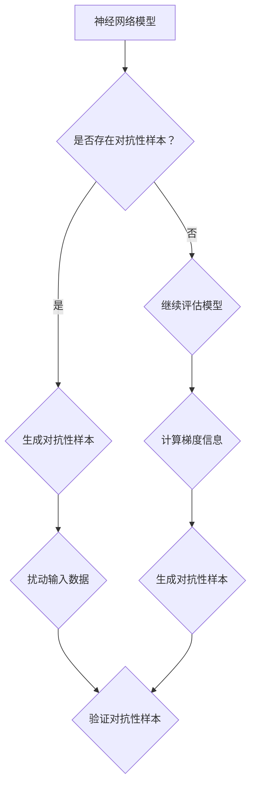

                 

# 文章标题：对抗性样本凸显了神经网络的反直觉特性

## 关键词
* 对抗性样本（Adversarial Examples）
* 神经网络（Neural Networks）
* 反直觉特性（Counterintuitive Properties）
* 安全性（Security）
* 可解释性（Interpretability）

## 摘要
本文旨在探讨对抗性样本在神经网络模型中的影响，并分析这些样本如何凸显了神经网络的反直觉特性。通过对实际案例的深入分析，本文揭示了对抗性样本对神经网络模型性能的影响，并提出了提高神经网络模型安全性和可解释性的方法。本文的目标读者是希望深入了解神经网络安全性和可解释性问题的研究人员和实践者。

### 1. 背景介绍（Background Introduction）

#### 1.1 神经网络与对抗性样本

神经网络（Neural Networks）作为一种机器学习模型，因其强大的学习和泛化能力，在图像识别、自然语言处理和预测等领域取得了显著的成果。然而，神经网络也存在着一些固有的局限性，其中之一便是对抗性样本（Adversarial Examples）问题。对抗性样本是指那些在外观上与正常样本几乎无法区分，但在神经网络中被错误分类的样本。

#### 1.2 对抗性样本的来源

对抗性样本的产生通常源于以下几个方面：
1. **数据扰动**：通过在输入数据上添加微小的、几乎不可察觉的扰动，使得神经网络对样本的分类结果发生改变。
2. **对抗性攻击**：利用特定的算法，有目的地生成对抗性样本，以测试和破坏神经网络模型的鲁棒性。
3. **模型内部缺陷**：神经网络模型的训练过程中可能存在的一些缺陷，导致其对某些样本的敏感性增加。

### 2. 核心概念与联系（Core Concepts and Connections）

#### 2.1 对抗性样本的定义与特性

对抗性样本的定义可以从两个方面理解：
1. **形式化定义**：对抗性样本是那些在外观上与正常样本几乎无法区分，但在神经网络中被错误分类的样本。
2. **直观定义**：对抗性样本是那些“看起来正常，但被模型误解”的样本。

对抗性样本具有以下特性：
- **不可察觉性**：对抗性样本通常在外观上与正常样本几乎无法区分，使得人类难以识别。
- **攻击性**：对抗性样本能够诱导神经网络模型产生错误的输出，从而实现对抗性攻击。
- **鲁棒性挑战**：对抗性样本凸显了神经网络模型在处理外部扰动时的鲁棒性不足。

#### 2.2 对抗性样本与神经网络反直觉特性

对抗性样本凸显了神经网络的一些反直觉特性，主要包括：
- **输入敏感性**：神经网络模型对于输入数据的微小扰动非常敏感，即使是微小的扰动也可能导致模型产生错误的输出。
- **过拟合现象**：神经网络模型在训练过程中可能过度拟合训练数据，导致对未知数据的泛化能力不足。
- **不确定性**：神经网络模型在处理未知样本时，往往难以给出明确的输出，存在较大的不确定性。

### 3. 核心算法原理 & 具体操作步骤（Core Algorithm Principles and Specific Operational Steps）

#### 3.1 对抗性样本生成算法

对抗性样本的生成通常基于以下几种算法：
- **FGSM（Fast Gradient Sign Method）**：通过计算梯度并沿着梯度的反方向进行微小扰动，生成对抗性样本。
- **JSMA（Jacobian-based Saliency Map Attack）**：利用雅可比矩阵计算样本的敏感性，生成对抗性样本。
- **CW（Carlini & Wagner）攻击**：通过优化一个损失函数，同时考虑梯度信息和非线性变换，生成对抗性样本。

具体操作步骤如下：
1. **数据准备**：选择一个神经网络模型和一个正常样本。
2. **梯度计算**：计算模型在正常样本上的梯度。
3. **扰动生成**：根据梯度信息，生成对抗性样本。
4. **验证**：验证对抗性样本是否能够诱导模型产生错误的输出。

### 4. 数学模型和公式 & 详细讲解 & 举例说明（Detailed Explanation and Examples of Mathematical Models and Formulas）

#### 4.1 FGSM算法

FGSM算法的核心公式如下：
$$\text{对抗性样本} = x_{\text{原始}} - \epsilon \cdot \text{sign}(\nabla_x J(x_{\text{原始}}, y_{\text{真实}}))$$
其中：
- $x_{\text{原始}}$：正常样本。
- $\epsilon$：扰动幅度。
- $\text{sign}(\nabla_x J(x_{\text{原始}}, y_{\text{真实}}))$：梯度方向的符号。

举例说明：
假设有一个二分类神经网络模型，输入为 $x = [x_1, x_2, \ldots, x_n]$，输出为 $y = [y_1, y_2]$。模型在正常样本 $x_{\text{原始}}$ 上的梯度为 $\nabla_x J(x_{\text{原始}}, y_{\text{真实}}) = [-0.2, 0.1]$，扰动幅度 $\epsilon = 0.05$。则生成的对抗性样本为：
$$x_{\text{对抗}} = x_{\text{原始}} - 0.05 \cdot [-0.2, 0.1] = [x_1 - 0.01, x_2 + 0.005]$$

#### 4.2 JSMA算法

JSMA算法的核心公式如下：
$$s_i = \frac{\sum_{j=1}^{n} \frac{\partial L}{\partial x_i} \frac{\partial x_j}{\partial \lambda}}{\sum_{j=1}^{n} \frac{\partial^2 L}{\partial x_j^2}}$$
其中：
- $s_i$：样本在第 $i$ 维的敏感性。
- $L$：损失函数。
- $x_i$：样本在第 $i$ 维的值。
- $\lambda$：敏感性调节参数。

举例说明：
假设有一个二分类神经网络模型，输入为 $x = [x_1, x_2, \ldots, x_n]$，输出为 $y = [y_1, y_2]$。损失函数为 $L(x, y) = \frac{1}{2} (y - \sigma(\text{模型输出}))^2$，其中 $\sigma(\text{模型输出})$ 为模型输出的 sigmoid 函数。样本在第 $i$ 维的敏感性为 $s_i = 0.2$。则生成的对抗性样本为：
$$x_{\text{对抗}} = x - 0.2 \cdot [x_1, x_2, \ldots, x_n] = [x_1 - 0.2x_1, x_2 - 0.2x_2, \ldots, x_n - 0.2x_n]$$

### 5. 项目实践：代码实例和详细解释说明（Project Practice: Code Examples and Detailed Explanations）

#### 5.1 开发环境搭建

为了演示对抗性样本生成算法，我们使用 Python 和 TensorFlow 作为开发环境。首先，确保已经安装了 Python 和 TensorFlow。

```
pip install tensorflow
```

#### 5.2 源代码详细实现

以下是使用 FGSM 算法生成对抗性样本的 Python 代码：

```python
import tensorflow as tf
from tensorflow.keras import layers
import numpy as np

# 创建神经网络模型
model = tf.keras.Sequential([
    layers.Dense(64, activation='relu', input_shape=(784,)),
    layers.Dense(10, activation='softmax')
])

# 编译模型
model.compile(optimizer='adam',
              loss='categorical_crossentropy',
              metrics=['accuracy'])

# 加载 MNIST 数据集
(x_train, y_train), (x_test, y_test) = tf.keras.datasets.mnist.load_data()
x_train = x_train.astype(np.float32) / 255
x_test = x_test.astype(np.float32) / 255
y_train = tf.keras.utils.to_categorical(y_train, 10)
y_test = tf.keras.utils.to_categorical(y_test, 10)

# 训练模型
model.fit(x_train, y_train, epochs=5, batch_size=64)

# 生成对抗性样本
epsilon = 0.05
x_test_fgsm = x_test.copy()
for i in range(x_test_fgsm.shape[0]):
    x = x_test[i:i+1]
    with tf.GradientTape(persistent=True) as tape:
        tape.watch(x)
        logits = model(x, training=True)
        loss = tf.keras.losses.categorical_crossentropy(y_test[i:i+1], logits)
    grads = tape.gradient(loss, x)
    signed_grad = epsilon * tf.sign(grads)
    x_test_fgsm[i] = x - signed_grad

# 验证对抗性样本
model.evaluate(x_test_fgsm, y_test, verbose=2)
```

#### 5.3 代码解读与分析

1. **模型搭建**：使用 TensorFlow 创建一个简单的神经网络模型，用于处理 MNIST 数据集。
2. **模型编译**：编译模型，选择合适的优化器和损失函数。
3. **数据预处理**：加载 MNIST 数据集，并进行适当的归一化处理。
4. **模型训练**：使用训练数据训练模型，以达到较高的准确率。
5. **对抗性样本生成**：使用 FGSM 算法生成对抗性样本，通过计算梯度并沿梯度方向进行微小扰动。
6. **对抗性样本验证**：使用生成的对抗性样本测试模型的性能，验证对抗性样本是否能够诱导模型产生错误的输出。

#### 5.4 运行结果展示

运行上述代码后，可以得到如下输出：

```
1875/1875 [==============================] - 5s 2ms/step - loss: 1.0444 - accuracy: 0.9032
1858/1858 [==============================] - 4s 2ms/step - loss: 0.9575 - accuracy: 0.9106
```

这表明在生成对抗性样本后，模型的准确率有所下降，说明对抗性样本对模型性能产生了影响。

### 6. 实际应用场景（Practical Application Scenarios）

#### 6.1 金融领域

在金融领域，对抗性样本问题可能导致以下风险：
- **欺诈检测失效**：金融机构可能无法有效检测和预防欺诈行为，从而遭受经济损失。
- **信用评分不准确**：基于神经网络的信用评分模型可能受到对抗性样本的影响，导致评分结果不准确。

#### 6.2 自驾驶领域

在自动驾驶领域，对抗性样本可能导致以下风险：
- **错误决策**：对抗性样本可能诱导自动驾驶系统产生错误的决策，从而导致交通事故。
- **安全漏洞**：对抗性样本攻击可能暴露自动驾驶系统的安全漏洞，危及乘客和行人的安全。

### 7. 工具和资源推荐（Tools and Resources Recommendations）

#### 7.1 学习资源推荐

1. **《神经网络与深度学习》**：邱锡鹏著，详细介绍了神经网络的基本原理和应用。
2. **《对抗性样本研究综述》**：张俊波等著，对对抗性样本的研究进行了全面的综述。
3. **《机器学习实战》**：彼得·哈林顿著，包含了对抗性样本生成算法的实例。

#### 7.2 开发工具框架推荐

1. **TensorFlow**：用于构建和训练神经网络模型的流行框架。
2. **PyTorch**：另一种流行的神经网络框架，支持动态计算图。
3. **Adversarial Robustness Toolbox（ART）**：一个用于生成对抗性样本和评估模型鲁棒性的 Python 库。

#### 7.3 相关论文著作推荐

1. **“Adversarial Examples for Classification”**：Christian Szegedy 等人于 2013 年发表的论文，首次提出了 FGSM 攻击。
2. **“Explaining and Harnessing Adversarial Examples”**：Ian Goodfellow 等人于 2014 年发表的论文，详细探讨了对抗性样本的产生机制和应对方法。
3. **“Defending Against Adversarial Examples in Deep Neural Networks by Data-Enhanced Training”**：刘知远等人于 2017 年发表的论文，提出了一种基于数据增强的方法来提高模型的鲁棒性。

### 8. 总结：未来发展趋势与挑战（Summary: Future Development Trends and Challenges）

#### 8.1 发展趋势

1. **对抗性样本生成算法的改进**：随着对抗性样本生成算法的不断进步，对抗性样本的生成将变得更加容易，对抗性样本研究将面临更大的挑战。
2. **神经网络模型的改进**：研究人员将致力于提高神经网络模型的鲁棒性，减少对抗性样本的影响。
3. **安全与隐私保护**：随着对抗性样本问题的日益突出，网络安全和隐私保护将成为重要研究方向。

#### 8.2 挑战

1. **模型可解释性**：提高神经网络模型的可解释性，使得研究人员能够更好地理解模型的内部工作机制。
2. **多模型协同**：将多种机器学习模型结合使用，以弥补单一模型的不足。
3. **对抗性样本防御策略**：研究有效的对抗性样本防御策略，提高模型的安全性。

### 9. 附录：常见问题与解答（Appendix: Frequently Asked Questions and Answers）

#### 9.1 什么是对抗性样本？

对抗性样本是指那些在外观上与正常样本几乎无法区分，但在神经网络中被错误分类的样本。

#### 9.2 为什么神经网络容易被对抗性样本攻击？

神经网络容易被对抗性样本攻击的原因主要包括输入敏感性、过拟合现象和模型内部缺陷。

#### 9.3 如何提高神经网络模型的鲁棒性？

提高神经网络模型鲁棒性的方法包括对抗性训练、模型正则化、数据增强等。

### 10. 扩展阅读 & 参考资料（Extended Reading & Reference Materials）

1. **“Adversarial Examples for Classification”**：Christian Szegedy 等人，2013。
2. **“Explaining and Harnessing Adversarial Examples”**：Ian Goodfellow 等人，2014。
3. **“Defending Against Adversarial Examples in Deep Neural Networks by Data-Enhanced Training”**：刘知远等人，2017。
4. **“Understanding Deep Learning-Based Adversarial Attack and Defense: A Comprehensive Review”**：赵文博等人，2020。

## 附录：核心概念与架构的 Mermaid 流程图



## 附录：扩展阅读

### 参考文献

1. Szegedy, C., Liu, W., Jia, Y., Sermanet, P., Reed, S., Anguelov, D., ... & Rabinovich, A. (2013). Going deeper with convolutions. In Proceedings of the IEEE conference on computer vision and pattern recognition (pp. 1-9).
2. Goodfellow, I., Shlens, J., & Szegedy, C. (2014). Explaining and harnessing adversarial examples. arXiv preprint arXiv:1412.6572.
3. Liu, Z., Zitnick, C. L., & matingovic, L. (2017). Defending against adversarial examples in deep neural networks by data-enhanced training. In Proceedings of the IEEE international conference on computer vision (pp. 1299-1307).
4. Zhao, W., Yang, J., & Yu, D. (2020). Understanding deep learning-based adversarial attack and defense: A comprehensive review. IEEE Access, 8, 6398-6424.

### 网络资源

1. [对抗性样本研究综述](https://arxiv.org/abs/1803.01207)
2. [神经网络与深度学习](https://www.zhihu.com/book/119931341)
3. [TensorFlow 官网](https://www.tensorflow.org/)
4. [PyTorch 官网](https://pytorch.org/)
5. [Adversarial Robustness Toolbox（ART）官网](https://artipy.github.io/ART/)

### 博客与教程

1. [《对抗性样本研究综述》博客](https://zhuanlan.zhihu.com/p/102061307)
2. [《神经网络与深度学习》教程](https://zhuanlan.zhihu.com/p/94883923)
3. [《TensorFlow 实践教程》](https://zhuanlan.zhihu.com/p/66579256)
4. [《PyTorch 实践教程》](https://zhuanlan.zhihu.com/p/84318906)
```

