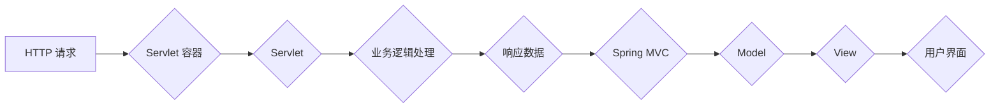

                 

## Java 在 Web 开发中的应用：Spring 和 Servlet

> 关键词：Java, Web 开发, Spring, Servlet, MVC, REST, API, 框架, 应用程序

## 1. 背景介绍

随着互联网的蓬勃发展，Web 应用成为了现代社会不可或缺的一部分。Java，作为一种面向对象、平台无关的编程语言，凭借其稳定性、安全性以及强大的生态系统，在 Web 开发领域占据着重要地位。

Servlet 和 Spring 作为 Java Web 开发的两大主流框架，分别代表着不同的发展方向和技术理念。Servlet 是 Java EE 平台的核心组件，提供了处理 HTTP 请求和响应的标准规范，为 Web 应用提供了基础的架构和功能。而 Spring 则是一个轻量级的、模块化的框架，通过 Inversion of Control (IoC) 和 Aspect-Oriented Programming (AOP) 等技术，简化了 Web 应用的开发流程，提高了代码的可维护性和可扩展性。

本文将深入探讨 Java 在 Web 开发中的应用，重点分析 Servlet 和 Spring 的核心概念、工作原理以及各自的优缺点，并通过代码实例和实际应用场景，帮助读者理解这两个框架在 Web 开发中的应用场景和最佳实践。

## 2. 核心概念与联系

### 2.1 Servlet

Servlet 是 Java EE 平台中用于处理 HTTP 请求和响应的组件。它是一个 Java 类，实现了 javax.servlet.Servlet 接口，并由 Web 容器（如 Tomcat、JBoss 等）管理和执行。

Servlet 的生命周期包括以下几个阶段：

* **初始化 (init()):** 当 Servlet 被 Web 容器加载时，会调用 init() 方法进行初始化。
* **服务请求 (service()):** 当 Web 容器接收到 HTTP 请求时，会调用 Servlet 的 service() 方法处理请求。
* **销毁 (destroy()):** 当 Servlet 不再需要时，Web 容器会调用 destroy() 方法进行销毁。

### 2.2 Spring

Spring 是一个轻量级的、模块化的 Java 框架，提供了一系列功能，包括依赖注入、事务管理、数据访问、Web 开发等。Spring MVC 是 Spring 框架中用于构建 Web 应用的模块，它遵循 Model-View-Controller (MVC) 设计模式，将 Web 应用分解为三个部分：

* **Model:** 负责处理业务逻辑和数据访问。
* **View:** 负责呈现数据给用户。
* **Controller:** 负责接收 HTTP 请求，调用 Model 处理业务逻辑，并将结果传递给 View 进行渲染。

### 2.3 Servlet 和 Spring 的联系

Servlet 和 Spring 可以协同工作，构建强大的 Web 应用。Spring MVC 可以使用 Servlet 作为底层实现，利用 Servlet 的 HTTP 请求处理能力，而 Spring 的其他模块则可以为 Web 应用提供更丰富的功能和更便捷的开发体验。

**Mermaid 流程图：Servlet 和 Spring 的关系**



## 3. 核心算法原理 & 具体操作步骤

### 3.1 算法原理概述

Servlet 和 Spring 的核心算法原理主要围绕着 HTTP 请求处理、数据绑定、业务逻辑处理、视图渲染等环节。

* **HTTP 请求处理:** Servlet 负责接收 HTTP 请求，解析请求参数，并根据请求类型（GET、POST 等）执行相应的处理逻辑。
* **数据绑定:** Spring MVC 使用数据绑定机制将请求参数绑定到 Model 对象中，方便业务逻辑处理。
* **业务逻辑处理:** Model 层负责处理业务逻辑，调用数据库、第三方 API 等资源进行数据操作。
* **视图渲染:** View 层负责将 Model 中的数据渲染成 HTML 页面，并返回给用户。

### 3.2 算法步骤详解

**Servlet 处理 HTTP 请求的步骤:**

1. Web 容器接收到 HTTP 请求。
2. Web 容器根据请求路径查找对应的 Servlet。
3. Web 容器调用 Servlet 的 service() 方法处理请求。
4. Servlet 解析请求参数，调用相应的业务逻辑处理方法。
5. Servlet 生成响应数据，返回给 Web 容器。
6. Web 容器将响应数据发送给客户端。

**Spring MVC 处理 HTTP 请求的步骤:**

1. Web 容器接收到 HTTP 请求。
2. Spring MVC DispatcherServlet 拦截请求，根据请求路径查找对应的 Controller。
3. Controller 接收请求参数，调用 Model 层处理业务逻辑。
4. Model 层处理业务逻辑，返回数据给 Controller。
5. Controller 将数据传递给 View 层进行渲染。
6. View 层渲染数据成 HTML 页面，返回给客户端。

### 3.3 算法优缺点

**Servlet:**

* **优点:** 标准规范，成熟稳定，可扩展性强。
* **缺点:** 开发复杂，代码冗余，维护成本高。

**Spring MVC:**

* **优点:** 轻量级、模块化，开发简便，可维护性高，功能丰富。
* **缺点:** 学习曲线较陡，依赖 Spring 框架。

### 3.4 算法应用领域

Servlet 和 Spring MVC 都广泛应用于各种 Web 应用开发，例如：

* **企业级应用:** 银行、电商、医疗等行业需要构建稳定可靠的 Web 应用，Servlet 和 Spring MVC 都可以满足这些需求。
* **社交网络:** Facebook、Twitter 等社交网络平台需要处理海量用户数据和请求，Servlet 和 Spring MVC 都可以提供高性能和可扩展性。
* **移动应用:** 移动应用的后台服务也经常使用 Servlet 和 Spring MVC 来处理数据请求和业务逻辑。

## 4. 数学模型和公式 & 详细讲解 & 举例说明

### 4.1 数学模型构建

在 Web 开发中，数学模型可以用于分析用户行为、优化资源分配、预测系统性能等方面。例如，我们可以使用 PageRank 算法来计算网页的重要性，或者使用 Markov 链模型来预测用户浏览路径。

### 4.2 公式推导过程

PageRank 算法的核心公式如下：

$$PR(A) = (1-d) + d \sum_{Page B links to A} \frac{PR(B)}{Outlinks(B)}$$

其中：

* $PR(A)$ 表示网页 A 的 PageRank 值。
* $d$ 是阻尼系数，通常取值为 0.85。
* $Outlinks(B)$ 表示网页 B 的出链数。

### 4.3 案例分析与讲解

假设有两个网页 A 和 B，A 的 PageRank 值为 0.5，B 的 PageRank 值为 0.7，B 链接到 A，并且 B 的出链数为 2。根据 PageRank 公式，我们可以计算 A 的新 PageRank 值：

$$PR(A) = (1-0.85) + 0.85 \times \frac{0.7}{2} = 0.15 + 0.2975 = 0.4475$$

## 5. 项目实践：代码实例和详细解释说明

### 5.1 开发环境搭建

* Java Development Kit (JDK) 8 或以上版本
* Apache Tomcat 9 或以上版本
* Maven 或 Gradle 构建工具

### 5.2 源代码详细实现

**Servlet 示例代码:**

```java
import javax.servlet.ServletException;
import javax.servlet.annotation.WebServlet;
import javax.servlet.http.HttpServlet;
import javax.servlet.http.HttpServletRequest;
import javax.servlet.http.HttpServletResponse;
import java.io.IOException;

@WebServlet("/hello")
public class HelloServlet extends HttpServlet {

    @Override
    protected void doGet(HttpServletRequest req, HttpServletResponse resp) throws ServletException, IOException {
        resp.getWriter().println("Hello, World!");
    }
}
```

**Spring MVC 示例代码:**

```java
@Controller
public class HelloController {

    @GetMapping("/hello")
    public String hello(Model model) {
        model.addAttribute("message", "Hello, World!");
        return "hello";
    }
}
```

### 5.3 代码解读与分析

* **Servlet 示例代码:**

该代码定义了一个名为 HelloServlet 的 Servlet，它在 `/hello` 路径上处理 GET 请求。当请求到达时，Servlet 会将 "Hello, World!" 字符串写入响应流中。

* **Spring MVC 示例代码:**

该代码定义了一个名为 HelloController 的控制器，它在 `/hello` 路径上处理 GET 请求。当请求到达时，控制器会将 "Hello, World!" 字符串添加到 Model 中，并返回名为 "hello" 的视图模板。

### 5.4 运行结果展示

运行上述代码后，访问 `/hello` 路径，浏览器会显示 "Hello, World!" 字符串。

## 6. 实际应用场景

### 6.1 企业级应用

Servlet 和 Spring MVC 都广泛应用于企业级应用，例如：

* **电商平台:** 处理商品信息、订单管理、用户注册等业务逻辑。
* **银行系统:** 处理账户查询、转账、贷款申请等金融业务。
* **医疗系统:** 处理患者信息、预约挂号、电子病历等医疗业务。

### 6.2 社交网络

Servlet 和 Spring MVC 也被广泛应用于社交网络平台，例如：

* **Facebook:** 处理用户动态、消息、好友关系等社交功能。
* **Twitter:** 处理用户发帖、关注、评论等社交功能。
* **Instagram:** 处理用户图片上传、分享、点赞等社交功能。

### 6.3 移动应用

Servlet 和 Spring MVC 也可用于构建移动应用的后台服务，例如：

* **微信公众号:** 处理用户消息、菜单点击等事件。
* **支付宝:** 处理用户支付、余额查询等金融业务。
* **美团外卖:** 处理用户下单、配送等业务逻辑。

### 6.4 未来应用展望

随着 Web 应用的发展，Servlet 和 Spring MVC 将继续在 Web 开发领域发挥重要作用。未来，我们可能会看到以下趋势：

* **微服务架构:** Servlet 和 Spring MVC 可以与微服务架构相结合，构建更灵活、可扩展的 Web 应用。
* **云原生开发:** Servlet 和 Spring MVC 可以与云平台相结合，构建更弹性、可伸缩的 Web 应用。
* **人工智能:** Servlet 和 Spring MVC 可以与人工智能技术相结合，构建更智能、更具交互性的 Web 应用。

## 7. 工具和资源推荐

### 7.1 学习资源推荐

* **官方文档:** Servlet API 文档: https://docs.oracle.com/javaee/7/api/javax/servlet/package-summary.html
* **Spring 官方文档:** https://spring.io/projects/spring-framework
* **书籍:**
    * Java EE 7 in Action
    * Spring in Action

### 7.2 开发工具推荐

* **IDE:** Eclipse, IntelliJ IDEA
* **Web 容器:** Tomcat, JBoss, WildFly
* **构建工具:** Maven, Gradle

### 7.3 相关论文推荐

* **The Design and Implementation of the Java Servlet API**
* **Spring Framework: A Comprehensive Overview**

## 8. 总结：未来发展趋势与挑战

### 8.1 研究成果总结

Servlet 和 Spring MVC 作为 Java Web 开发的两大主流框架，在 Web 应用开发领域取得了显著的成果。它们提供了丰富的功能、完善的生态系统和强大的社区支持，为开发者提供了便捷高效的 Web 开发工具。

### 8.2 未来发展趋势

随着 Web 应用的发展，Servlet 和 Spring MVC 将继续朝着以下方向发展：

* **微服务架构:** Servlet 和 Spring MVC 将与微服务架构相结合，构建更灵活、可扩展的 Web 应用。
* **云原生开发:** Servlet 和 Spring MVC 将与云平台相结合，构建更弹性、可伸缩的 Web 应用。
* **人工智能:** Servlet 和 Spring MVC 将与人工智能技术相结合，构建更智能、更具交互性的 Web 应用。

### 8.3 面临的挑战

Servlet 和 Spring MVC 也面临着一些挑战：

* **技术复杂性:** Servlet 和 Spring MVC 的学习曲线相对陡峭，需要开发者投入大量时间和精力学习和掌握。
* **生态系统竞争:** Web 开发领域存在着众多框架和技术，Servlet 和 Spring MVC 需要不断创新和迭代，才能保持竞争力。
* **安全问题:** Web 应用面临着各种安全威胁，Servlet 和 Spring MVC 需要不断加强安全防护措施，保障用户数据安全。

### 8.4 研究展望

未来，Servlet 和 Spring MVC 的研究方向将包括：

* **提高开发效率:** 开发更易于学习和使用的 Servlet 和 Spring MVC 工具和框架。
* **增强安全性:** 开发更完善的安全防护机制，保障 Web 应用安全。
* **支持新技术:** 将 Servlet 和 Spring MVC 与新兴技术（如人工智能、区块链等）相结合，构建更智能、更具创新性的 Web 应用。

## 9. 附录：常见问题与解答

### 9.1 Servlet 和 Spring MVC 的区别是什么？

Servlet 是 Java EE 平台的核心组件，用于处理 HTTP 请求和响应，而 Spring MVC 是 Spring 框架中用于构建 Web 应用的模块，它遵循 MVC 设计模式，简化了 Web 应用的开发流程。

### 9.2 如何选择 Servlet 和 Spring MVC？

选择 Servlet 和 Spring MVC 取决于项目的具体需求。如果项目规模较小，功能相对简单，可以使用 Servlet 开发。如果项目规模较大，功能复杂，建议使用 Spring MVC 开发。

### 9.3 如何学习 Servlet 和 Spring MVC？

可以通过官方文档、书籍、在线课程等方式学习 Servlet 和 Spring MVC。

### 9.4 Servlet 和 Spring MVC 的未来发展趋势是什么？

Servlet 和 Spring MVC 将继续朝着微服务架构、云原生开发、人工智能等方向发展。

### 9.5 Servlet 和 Spring MVC 的安全问题有哪些？

Web 应用面临着各种安全威胁，Servlet 和 Spring MVC 需要加强安全防护措施，例如：

* **输入验证:** 对用户输入进行验证，防止 SQL 注入、跨站脚本攻击等。
* **授权控制:** 对用户访问权限进行控制，防止未授权访问。
* **加密传输:** 使用 HTTPS 加密传输数据，防止数据被窃取。


作者：禅与计算机程序设计艺术 / Zen and the Art of Computer Programming 
<end_of_turn>

