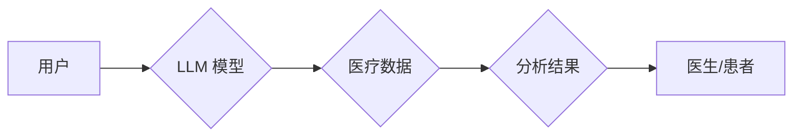

                 

## LLM 在医疗保健中的应用：变革性实践

> 关键词：大型语言模型（LLM）、医疗保健、自然语言处理（NLP）、临床决策支持、药物发现、患者教育、医疗保健效率

## 1. 背景介绍

医疗保健行业正处于数字化转型时期，海量医疗数据不断涌现，为人工智能（AI）的应用提供了广阔的舞台。大型语言模型（LLM）作为一种强大的AI技术，凭借其强大的文本理解和生成能力，在医疗保健领域展现出巨大的潜力，有望彻底改变医疗服务、研究和管理方式。

LLM 是一种基于深度学习的Transformer架构的模型，通过训练海量文本数据，能够理解和生成人类语言，并执行各种自然语言处理（NLP）任务，例如文本分类、问答、机器翻译和文本摘要。

在医疗保健领域，LLM 可以应用于多个方面，例如：

* **临床决策支持：** 帮助医生更快、更准确地诊断疾病，制定治疗方案。
* **药物发现：** 加速药物研发过程，识别潜在的药物候选物。
* **患者教育：** 为患者提供个性化的医疗信息，提高患者健康 literacy。
* **医疗保健效率：** 自动化医疗文书处理、预约管理等任务，提高医疗机构效率。

## 2. 核心概念与联系

### 2.1  LLM 的核心概念

LLM 的核心概念是利用深度学习技术训练一个能够理解和生成人类语言的模型。

* **Transformer 架构：** Transformer 架构是一种专门用于处理序列数据的深度学习模型，其核心是“注意力机制”，能够捕捉文本中单词之间的长距离依赖关系。
* **深度学习：** 深度学习是一种机器学习的子领域，利用多层神经网络来学习复杂的数据模式。
* **海量文本数据：** LLM 的训练需要大量的文本数据，才能学习到丰富的语言知识和模式。

### 2.2  LLM 与医疗保健的联系

LLM 的强大文本处理能力可以与医疗保健领域的数据和任务相结合，实现多种应用场景。

* **电子病历（EMR）分析：** LLM 可以分析患者的EMR数据，提取关键信息，例如症状、诊断、治疗方案等，为医生提供决策支持。
* **医学文献检索：** LLM 可以理解复杂的医学术语，帮助医生快速检索相关文献，了解最新的研究进展。
* **患者咨询：** LLM 可以与患者进行自然语言对话，回答患者的健康问题，提供个性化的医疗建议。

### 2.3  LLM 应用架构



## 3. 核心算法原理 & 具体操作步骤

### 3.1  算法原理概述

LLM 的核心算法是基于 Transformer 架构的深度学习模型，其训练目标是最大化预测下一个单词的概率。

* **注意力机制：** Transformer 架构的核心是注意力机制，它能够捕捉文本中单词之间的长距离依赖关系，提高模型的理解能力。
* **编码器-解码器结构：** LLM 通常采用编码器-解码器结构，编码器负责将输入文本编码成向量表示，解码器则根据编码结果生成输出文本。

### 3.2  算法步骤详解

1. **数据预处理：** 将原始文本数据进行清洗、分词、标记等预处理操作，使其适合模型训练。
2. **模型训练：** 使用深度学习算法训练 LLM 模型，目标是最大化预测下一个单词的概率。
3. **模型评估：** 使用测试数据评估模型的性能，例如准确率、困惑度等指标。
4. **模型部署：** 将训练好的模型部署到实际应用场景中，例如医疗诊断系统、药物发现平台等。

### 3.3  算法优缺点

**优点：**

* 强大的文本理解和生成能力
* 可以处理长文本序列
* 能够捕捉文本中的长距离依赖关系

**缺点：**

* 训练成本高
* 需要大量的训练数据
* 可能存在偏差和偏见

### 3.4  算法应用领域

LLM 的应用领域非常广泛，除了医疗保健领域，还包括：

* 自然语言理解
* 机器翻译
* 文本摘要
* 代码生成
* 聊天机器人

## 4. 数学模型和公式 & 详细讲解 & 举例说明

### 4.1  数学模型构建

LLM 的数学模型主要基于 Transformer 架构，其核心是注意力机制和多层感知机。

* **注意力机制：** 用于计算每个单词对其他单词的“注意力”权重，从而捕捉文本中的长距离依赖关系。

* **多层感知机：** 用于将单词的向量表示进行变换，学习复杂的文本表示。

### 4.2  公式推导过程

注意力机制的计算公式如下：

$$
\text{Attention}(Q, K, V) = \text{softmax}\left(\frac{Q K^T}{\sqrt{d_k}}\right) V
$$

其中：

* $Q$：查询矩阵
* $K$：键矩阵
* $V$：值矩阵
* $d_k$：键向量的维度
* $\text{softmax}$：softmax 函数，用于归一化注意力权重

### 4.3  案例分析与讲解

假设我们有一个句子“我爱吃苹果”，我们要计算“吃”这个单词对其他单词的注意力权重。

* $Q$：表示“吃”这个单词的查询向量
* $K$：表示每个单词的键向量
* $V$：表示每个单词的值向量

通过计算 $QK^T$，我们可以得到一个注意力矩阵，每个元素代表“吃”这个单词对其他单词的注意力权重。然后使用 softmax 函数归一化注意力矩阵，得到最终的注意力权重分布。

## 5. 项目实践：代码实例和详细解释说明

### 5.1  开发环境搭建

* Python 3.7+
* PyTorch 或 TensorFlow
* CUDA 和 cuDNN（可选，用于GPU加速）

### 5.2  源代码详细实现

```python
import torch
import torch.nn as nn

class Transformer(nn.Module):
    def __init__(self, vocab_size, embedding_dim, num_heads, num_layers):
        super(Transformer, self).__init__()
        self.embedding = nn.Embedding(vocab_size, embedding_dim)
        self.transformer_layers = nn.ModuleList([
            nn.TransformerEncoderLayer(embedding_dim, num_heads)
            for _ in range(num_layers)
        ])

    def forward(self, x):
        x = self.embedding(x)
        for layer in self.transformer_layers:
            x = layer(x)
        return x
```

### 5.3  代码解读与分析

* `Transformer` 类定义了一个 Transformer 模型。
* `embedding` 层将单词索引转换为词向量。
* `transformer_layers` 是一个列表，包含多个 Transformer Encoder Layer。
* `forward` 方法定义了模型的正向传播过程。

### 5.4  运行结果展示

训练好的 LLM 模型可以用于各种 NLP 任务，例如文本分类、机器翻译、文本摘要等。

## 6. 实际应用场景

### 6.1  临床决策支持

LLM 可以分析患者的EMR数据，识别潜在的疾病风险，并提供个性化的治疗建议。例如，LLM 可以帮助医生更快地诊断糖尿病、心血管疾病等慢性病。

### 6.2  药物发现

LLM 可以分析大量的生物医学文献，识别潜在的药物候选物，并预测药物的疗效和安全性。例如，LLM 可以帮助科学家更快地发现新的抗癌药物。

### 6.3  患者教育

LLM 可以为患者提供个性化的医疗信息，帮助患者更好地理解自己的病情，并做出更明智的健康决策。例如，LLM 可以帮助患者了解疾病的症状、治疗方案和生活方式建议。

### 6.4  未来应用展望

LLM 在医疗保健领域的应用前景广阔，未来可能在以下方面取得突破：

* **更精准的诊断：** LLM 可以分析患者的各种数据，例如基因信息、影像数据、生活方式数据等，提供更精准的诊断结果。
* **更个性化的治疗：** LLM 可以根据患者的个体特征，制定更个性化的治疗方案。
* **更有效的药物研发：** LLM 可以加速药物研发过程，降低研发成本，并提高药物的疗效和安全性。

## 7. 工具和资源推荐

### 7.1  学习资源推荐

* **课程：**
    * 深度学习 Specialization (Coursera)
    * Natural Language Processing Specialization (Coursera)
* **书籍：**
    * Deep Learning (Ian Goodfellow, Yoshua Bengio, Aaron Courville)
    * Speech and Language Processing (Daniel Jurafsky, James H. Martin)
* **博客：**
    * The Gradient
    * Towards Data Science

### 7.2  开发工具推荐

* **框架：**
    * PyTorch
    * TensorFlow
* **库：**
    * Hugging Face Transformers
    * Gensim
* **平台：**
    * Google Colab
    * Paperspace Gradient

### 7.3  相关论文推荐

* **Attention Is All You Need (Vaswani et al., 2017)**
* **BERT: Pre-training of Deep Bidirectional Transformers for Language Understanding (Devlin et al., 2018)**
* **GPT-3: Language Models are Few-Shot Learners (Brown et al., 2020)**

## 8. 总结：未来发展趋势与挑战

### 8.1  研究成果总结

LLM 在医疗保健领域的应用取得了显著进展，例如在临床决策支持、药物发现、患者教育等方面展现出巨大的潜力。

### 8.2  未来发展趋势

* **更强大的模型：** 未来将出现更强大的 LLMs，能够处理更复杂的任务，并提供更精准的医疗建议。
* **更广泛的应用场景：** LLM 将应用于更多医疗保健领域，例如手术机器人、远程医疗、医疗保险等。
* **更安全的应用：** 确保 LLM 在医疗保健领域的应用安全可靠，并保护患者隐私。

### 8.3  面临的挑战

* **数据隐私和安全：** 医疗数据非常敏感，需要采取严格的措施保护患者隐私。
* **模型解释性和可信度：** LLM 的决策过程往往是复杂的，需要提高模型的解释性和可信度。
* **伦理问题：** LLM 在医疗保健领域的应用可能引发一些伦理问题，例如算法偏见、责任归属等。

### 8.4  研究展望

未来研究将集中在以下几个方面：

* **开发更安全、更可靠的 LLM 模型。**
* **提高 LLM 模型的解释性和可信度。**
* **解决 LLM 在医疗保健领域的伦理问题。**


## 9. 附录：常见问题与解答

* **Q：LLM 在医疗保健领域的应用有哪些？**

* **A：** LLM 在医疗保健领域可以应用于临床决策支持、药物发现、患者教育、医疗保健效率等多个方面。

* **Q：LLM 的训练需要哪些数据？**

* **A：** LLM 的训练需要大量的文本数据，例如医学文献、患者记录、临床指南等。

* **Q：LLM 在医疗保健领域的应用有哪些挑战？**

* **A：** LLM 在医疗保健领域的应用面临着数据隐私和安全、模型解释性和可信度、伦理问题等挑战。


作者：禅与计算机程序设计艺术 / Zen and the Art of Computer Programming 
<end_of_turn>

