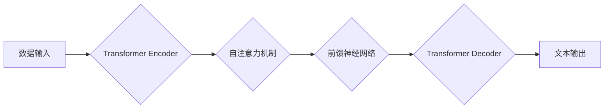

                 

## LLM: 计算机架构的新时代

> 关键词：大型语言模型 (LLM)、Transformer、深度学习、自然语言处理 (NLP)、计算机架构、并行计算、高效训练

### 1. 背景介绍

近年来，人工智能领域取得了令人瞩目的进展，其中大型语言模型 (LLM) 的出现尤为引人注目。这些模型拥有数十亿甚至数千亿的参数，能够处理和生成人类语言，展现出强大的文本理解、生成、翻译和问答能力。

LLM 的兴起对计算机架构提出了新的挑战和机遇。传统的计算机架构设计主要针对传统应用程序，而 LLM 的训练和推理需要海量数据和计算资源，对硬件性能和能源效率提出了更高的要求。

### 2. 核心概念与联系

**2.1  大型语言模型 (LLM)**

大型语言模型 (LLM) 是指参数规模庞大、训练数据海量的人工智能模型，能够理解和生成人类语言。它们基于深度学习算法，通常采用 Transformer 架构，并通过大量的文本数据进行预训练。

**2.2  Transformer 架构**

Transformer 架构是 LLM 的核心，它通过自注意力机制 (Self-Attention) 实现了序列数据的并行处理，大幅提升了模型的训练效率和性能。

**2.3  计算机架构与 LLM**

计算机架构是硬件和软件的结合体，决定了计算机的性能、效率和成本。LLM 的训练和推理对计算机架构提出了新的要求，例如：

* **并行计算能力:** LLM 的训练需要处理海量数据，需要强大的并行计算能力。
* **内存带宽:** LLM 的模型参数和输入数据量巨大，需要高带宽的内存访问。
* **高效的计算单元:** LLM 的计算密集型操作需要高效的计算单元，例如 GPU 和 TPU。

**2.4  Mermaid 流程图**



### 3. 核心算法原理 & 具体操作步骤

**3.1  算法原理概述**

Transformer 架构的核心是自注意力机制，它允许模型关注输入序列中的不同位置，并学习它们之间的关系。

**3.2  算法步骤详解**

1. **输入嵌入:** 将输入文本序列转换为向量表示。
2. **多头自注意力:** 对输入序列进行多头自注意力计算，学习每个词与其他词之间的关系。
3. **前馈神经网络:** 对每个词的注意力输出进行非线性变换。
4. **位置编码:** 添加位置信息，使模型能够理解词序。
5. **输出层:** 将模型输出转换为目标文本序列。

**3.3  算法优缺点**

**优点:**

* 并行计算能力强，训练效率高。
* 可以学习长距离依赖关系。
* 表现出强大的文本理解和生成能力。

**缺点:**

* 参数量巨大，训练成本高。
* 对训练数据质量要求高。

**3.4  算法应用领域**

* 自然语言处理 (NLP): 文本分类、情感分析、机器翻译、问答系统等。
* 代码生成: 自动生成代码片段。
* 内容创作: 生成小说、诗歌、剧本等。

### 4. 数学模型和公式 & 详细讲解 & 举例说明

**4.1  数学模型构建**

Transformer 模型的数学模型基于深度神经网络，主要包括以下组件:

* **嵌入层:** 将输入词转换为向量表示。
* **多头自注意力层:** 计算每个词与其他词之间的关系。
* **前馈神经网络层:** 对每个词的注意力输出进行非线性变换。
* **位置编码层:** 添加位置信息。
* **输出层:** 将模型输出转换为目标文本序列。

**4.2  公式推导过程**

自注意力机制的核心公式是计算每个词与其他词之间的加权和:

$$
Attention(Q, K, V) = softmax(\frac{QK^T}{\sqrt{d_k}})V
$$

其中:

* $Q$ 是查询矩阵。
* $K$ 是键矩阵。
* $V$ 是值矩阵。
* $d_k$ 是键向量的维度。

**4.3  案例分析与讲解**

假设我们有一个句子 "The cat sat on the mat"，将其转换为词向量表示，并计算每个词与其他词之间的注意力权重。

例如，对于词 "cat"，其与其他词的注意力权重可能如下:

* "The": 0.2
* "cat": 1.0
* "sat": 0.3
* "on": 0.1
* "the": 0.4
* "mat": 0.0

这表明 "cat" 与自身相关性最强，其次与 "sat" 和 "the" 相关性较高。

### 5. 项目实践：代码实例和详细解释说明

**5.1  开发环境搭建**

* 操作系统: Ubuntu 20.04
* Python 版本: 3.8
* 深度学习框架: PyTorch 1.8

**5.2  源代码详细实现**

```python
import torch
import torch.nn as nn

class Transformer(nn.Module):
    def __init__(self, vocab_size, embedding_dim, num_heads, num_layers):
        super(Transformer, self).__init__()
        self.embedding = nn.Embedding(vocab_size, embedding_dim)
        self.transformer_layers = nn.ModuleList([
            nn.TransformerEncoderLayer(embedding_dim, num_heads)
            for _ in range(num_layers)
        ])
        self.linear = nn.Linear(embedding_dim, vocab_size)

    def forward(self, x):
        x = self.embedding(x)
        for layer in self.transformer_layers:
            x = layer(x)
        x = self.linear(x)
        return x
```

**5.3  代码解读与分析**

* `__init__` 方法初始化模型参数，包括词嵌入层、Transformer 层和输出层。
* `forward` 方法定义模型的正向传播过程，将输入词转换为向量表示，并通过 Transformer 层进行编码，最后输出目标文本序列。

**5.4  运行结果展示**

训练好的 Transformer 模型可以用于各种 NLP 任务，例如文本分类、机器翻译等。

### 6. 实际应用场景

**6.1  自然语言理解 (NLU)**

LLM 可以用于理解自然语言文本，例如情感分析、问答系统、文本摘要等。

**6.2  机器翻译 (MT)**

LLM 可以用于将一种语言翻译成另一种语言，例如 Google Translate。

**6.3  代码生成 (Code Generation)**

LLM 可以用于自动生成代码片段，例如 GitHub Copilot。

**6.4  未来应用展望**

LLM 的应用场景还在不断扩展，未来可能应用于：

* 个性化教育
* 医疗诊断
* 法律文本分析
* 创意写作

### 7. 工具和资源推荐

**7.1  学习资源推荐**

* **书籍:**

    * 《深度学习》 (Deep Learning)
    * 《自然语言处理》 (Natural Language Processing)

* **在线课程:**

    * Coursera: 深度学习
    * edX: 自然语言处理

**7.2  开发工具推荐**

* **深度学习框架:** PyTorch, TensorFlow
* **文本处理工具:** NLTK, SpaCy

**7.3  相关论文推荐**

* 《Attention Is All You Need》
* 《BERT: Pre-training of Deep Bidirectional Transformers for Language Understanding》

### 8. 总结：未来发展趋势与挑战

**8.1  研究成果总结**

LLM 在文本理解、生成和翻译等领域取得了显著进展，展现出强大的潜力。

**8.2  未来发展趋势**

* 模型规模进一步扩大
* 训练效率和性能提升
* 应用场景更加广泛
* 伦理和安全问题得到重视

**8.3  面临的挑战**

* 训练成本高
* 数据质量问题
* 偏见和歧视问题
* 可解释性和透明度问题

**8.4  研究展望**

* 开发更有效的训练算法
* 探索新的模型架构
* 构建更安全和可靠的 LLM
* 促进 LLM 的伦理和社会责任发展

### 9. 附录：常见问题与解答

**9.1  什么是 LLMs 的 "参数规模"?**

参数规模是指 LLM 模型中可训练参数的数量。参数规模越大，模型的容量越大，理论上可以学习更复杂的模式。

**9.2  LLMs 如何训练?**

LLMs 通常使用大量的文本数据进行预训练，然后在特定任务上进行微调。预训练阶段的目标是学习语言的通用表示，微调阶段的目标是将模型适应特定任务。

**9.3  LLMs 的应用有哪些?**

LLMs 的应用场景非常广泛，包括自然语言理解、机器翻译、代码生成、内容创作等。

**9.4  LLMs 的伦理问题是什么?**

LLMs 可能会产生偏见和歧视，并被用于恶意目的，例如生成虚假信息。因此，LLMs 的伦理和社会责任问题需要得到重视。


作者：禅与计算机程序设计艺术 / Zen and the Art of Computer Programming 
<end_of_turn>

