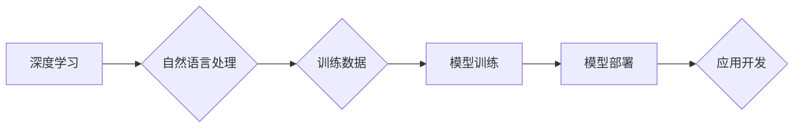

                 

## LLM产业链生态:从无到有的蝶变

> 关键词：LLM, 产业链, 生态系统, 深度学习, 自然语言处理, 训练数据, 模型部署, 应用场景

### 1. 背景介绍

近年来，大语言模型（LLM）的蓬勃发展，掀起了人工智能领域的又一次革命。从 GPT-3 到 LaMDA，从 BERT 到 PaLM，这些强大的模型展现出令人惊叹的语言理解和生成能力，跨越了文本生成、机器翻译、代码编写等多个领域，深刻地改变着我们与信息交互的方式。

然而，LLM 的发展并非孤立的，它背后蕴藏着一个庞大而复杂的产业链生态系统。从基础研究到应用开发，从数据标注到模型部署，每一个环节都扮演着至关重要的角色，共同推动着 LLM 技术的进步和应用落地。

### 2. 核心概念与联系

LLM 产业链生态是一个多层次、多参与者的系统，其核心概念包括：

* **深度学习:** LLM 的基础是深度学习算法，特别是 Transformer 架构，它能够学习语言的复杂模式和关系。
* **自然语言处理 (NLP):** LLM 属于 NLP 的范畴，旨在使计算机能够理解和处理人类语言。
* **训练数据:** LLM 的训练需要海量文本数据，这些数据用于训练模型，使其能够生成流畅、自然的文本。
* **模型训练:** 模型训练是一个耗时、耗能的过程，需要强大的计算资源和专业的技术团队。
* **模型部署:** 训练好的模型需要部署到实际应用场景中，以便用户能够使用。
* **应用开发:** LLM 可以应用于各种领域，例如聊天机器人、文本摘要、机器翻译等。

这些核心概念相互关联，共同构成了 LLM 产业链生态的完整体系。

**Mermaid 流程图:**

### 3. 核心算法原理 & 具体操作步骤

#### 3.1  算法原理概述

LLM 的核心算法是基于 Transformer 架构的深度神经网络。Transformer 是一种新型的序列到序列模型，它能够有效地处理长距离依赖关系，并具有并行计算能力，从而能够训练出更强大的语言模型。

Transformer 的核心组件包括：

* **编码器 (Encoder):** 用于将输入文本序列编码成向量表示。
* **解码器 (Decoder):** 用于根据编码后的向量表示生成输出文本序列。
* **注意力机制 (Attention):** 用于捕捉文本序列中不同词之间的关系，并赋予它们不同的权重。

#### 3.2  算法步骤详解

LLM 的训练过程可以概括为以下步骤：

1. **数据预处理:** 将原始文本数据进行清洗、分词、标记等预处理操作，使其能够被模型理解。
2. **模型初始化:** 初始化 Transformer 模型的参数，通常使用随机初始化。
3. **前向传播:** 将预处理后的文本数据输入到模型中，计算模型的输出。
4. **损失函数计算:** 计算模型输出与真实文本之间的差异，使用损失函数衡量模型的训练效果。
5. **反向传播:** 根据损失函数的梯度，更新模型的参数，使其朝着更准确的方向调整。
6. **迭代训练:** 重复前向传播、损失函数计算和反向传播的过程，直到模型的训练效果达到预期的水平。

#### 3.3  算法优缺点

**优点:**

* 能够学习语言的复杂模式和关系。
* 具有强大的文本生成能力。
* 可以应用于多种 NLP 任务。

**缺点:**

* 训练成本高，需要大量的计算资源和时间。
* 对训练数据质量要求高，容易受到数据偏差的影响。
* 缺乏对真实世界知识的理解，生成的文本可能存在逻辑错误或不准确。

#### 3.4  算法应用领域

LLM 的应用领域非常广泛，包括：

* **聊天机器人:** 开发更智能、更自然的聊天机器人。
* **文本摘要:** 自动生成文本的摘要。
* **机器翻译:** 将文本从一种语言翻译成另一种语言。
* **代码生成:** 自动生成代码。
* **写作辅助:** 帮助用户写作，例如提供语法检查、风格建议等。

### 4. 数学模型和公式 & 详细讲解 & 举例说明

#### 4.1  数学模型构建

LLM 的数学模型主要基于 Transformer 架构，其核心是注意力机制和多头注意力机制。

**注意力机制:**

注意力机制允许模型关注输入序列中与当前输出相关的部分，并赋予它们不同的权重。

公式:

$$
Attention(Q, K, V) = softmax(\frac{QK^T}{\sqrt{d_k}})V
$$

其中：

* $Q$：查询矩阵
* $K$：键矩阵
* $V$：值矩阵
* $d_k$：键向量的维度
* $softmax$：softmax 函数

**多头注意力机制:**

多头注意力机制将注意力机制应用于多个不同的子空间，并将其结果进行融合，从而能够捕捉到更丰富的上下文信息。

#### 4.2  公式推导过程

注意力机制的公式推导过程可以参考 Transformer 原文论文。

#### 4.3  案例分析与讲解

例如，在机器翻译任务中，注意力机制可以帮助模型关注源语言中与目标语言单词相关的部分，从而生成更准确的翻译结果。

### 5. 项目实践：代码实例和详细解释说明

#### 5.1  开发环境搭建

LLM 的开发环境通常需要安装 Python、PyTorch 或 TensorFlow 等深度学习框架，以及一些 NLP 工具库，例如 HuggingFace Transformers。

#### 5.2  源代码详细实现

LLM 的源代码实现通常比较复杂，需要对 Transformer 架构和深度学习算法有深入的理解。

#### 5.3  代码解读与分析

代码解读需要分析 Transformer 模型的各个组件，例如编码器、解码器、注意力机制等，以及它们之间的交互关系。

#### 5.4  运行结果展示

LLM 的运行结果通常包括文本生成、机器翻译、代码生成等方面的表现，需要通过评测指标来评估模型的性能。

### 6. 实际应用场景

LLM 的实际应用场景非常广泛，例如：

* **聊天机器人:** 开发更智能、更自然的聊天机器人，例如 ChatGPT。
* **文本摘要:** 自动生成文本的摘要，例如新闻摘要、会议纪要等。
* **机器翻译:** 将文本从一种语言翻译成另一种语言，例如 Google Translate。
* **代码生成:** 自动生成代码，例如 GitHub Copilot。
* **写作辅助:** 帮助用户写作，例如提供语法检查、风格建议等。

#### 6.4  未来应用展望

LLM 的未来应用前景非常广阔，例如：

* **个性化教育:** 根据学生的学习情况提供个性化的学习内容和辅导。
* **医疗诊断:** 辅助医生进行疾病诊断和治疗方案制定。
* **法律服务:** 帮助律师进行法律研究和案件分析。
* **科学研究:** 辅助科学家进行数据分析和模型构建。

### 7. 工具和资源推荐

#### 7.1  学习资源推荐

* **书籍:**

    * 《深度学习》
    * 《Transformer 详解》
    * 《自然语言处理》

* **在线课程:**

    * Coursera: 深度学习
    * edX: 自然语言处理
    * fast.ai: 深度学习

#### 7.2  开发工具推荐

* **深度学习框架:**

    * PyTorch
    * TensorFlow

* **NLP 工具库:**

    * HuggingFace Transformers
    * spaCy

#### 7.3  相关论文推荐

* 《Attention Is All You Need》
* 《BERT: Pre-training of Deep Bidirectional Transformers for Language Understanding》
* 《GPT-3: Language Models are Few-Shot Learners》

### 8. 总结：未来发展趋势与挑战

#### 8.1  研究成果总结

LLM 的发展取得了令人瞩目的成果，其强大的语言理解和生成能力已经应用于多个领域，并取得了显著的进展。

#### 8.2  未来发展趋势

LLM 的未来发展趋势包括：

* **模型规模的进一步扩大:** 更大的模型能够学习更复杂的语言模式，并提高模型的性能。
* **训练数据的多样化:** 更丰富的训练数据能够帮助模型更好地理解和生成不同类型的文本。
* **模型的解释性和可控性:** 研究更可解释和可控的 LLMs，使其能够更好地服务于人类。
* **跨模态 LLMs:** 将文本与其他模态（例如图像、音频）相结合，开发更强大的多模态 LLMs。

#### 8.3  面临的挑战

LLM 的发展也面临着一些挑战，例如：

* **训练成本高:** 训练大型 LLMs 需要大量的计算资源和时间，成本很高。
* **数据安全和隐私问题:** LLM 的训练需要海量文本数据，如何保证数据的安全和隐私是一个重要问题。
* **模型的偏见和误导性:** LLM 可能受到训练数据中的偏见影响，生成带有偏见或误导性的文本。

#### 8.4  研究展望

未来，LLM 研究将继续朝着更强大、更安全、更可解释的方向发展，并为人类社会带来更多福祉。

### 9. 附录：常见问题与解答

* **什么是 LLM？**

LLM 指的是大语言模型，是一种能够理解和生成人类语言的深度学习模型。

* **LLM 的训练数据是什么？**

LLM 的训练数据通常是海量文本数据，例如书籍、文章、网站内容等。

* **LLM 的应用场景有哪些？**

LLM 的应用场景非常广泛，例如聊天机器人、文本摘要、机器翻译、代码生成等。

* **如何训练 LLM？**

训练 LLM 需要使用深度学习框架，例如 PyTorch 或 TensorFlow，以及大量的计算资源和时间。

* **LLM 的未来发展趋势是什么？**

LLM 的未来发展趋势包括模型规模的扩大、训练数据的多样化、模型的解释性和可控性，以及跨模态 LLMs 的发展。

作者：禅与计算机程序设计艺术 / Zen and the Art of Computer Programming 
<end_of_turn>

