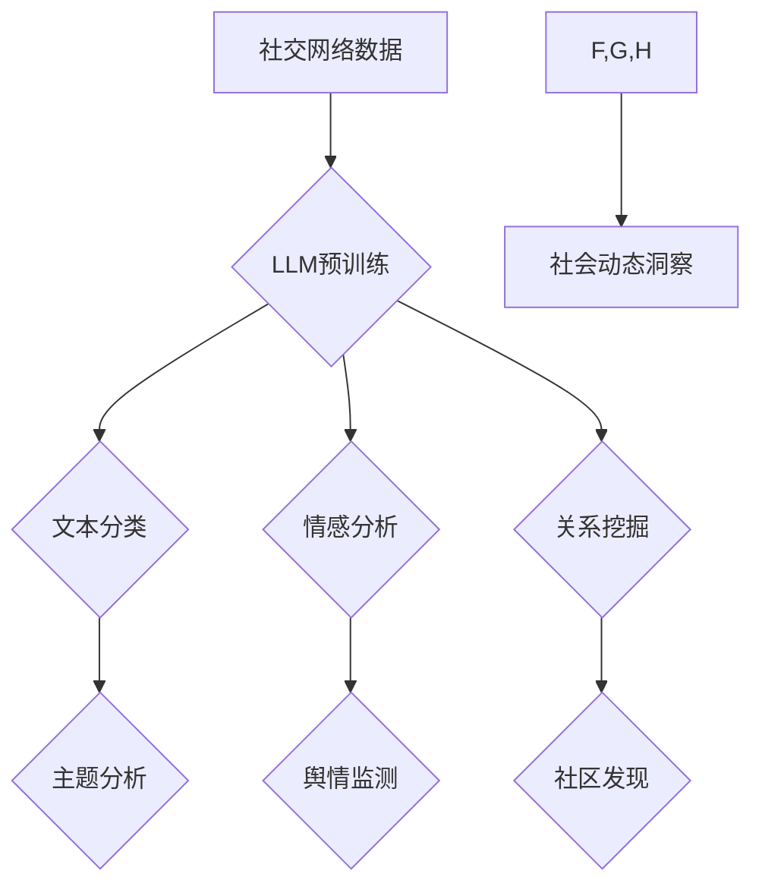

                 

##  LLM在社交网络分析中的作用：洞察社会动态

> 关键词：大型语言模型（LLM）、社交网络分析、社会动态、文本挖掘、情感分析、趋势预测、网络社区发现

## 1. 背景介绍

社交网络已经成为人类社会不可或缺的一部分，人们通过社交平台进行信息交流、分享生活、建立关系，产生了海量的数据。这些数据蕴含着丰富的社会信息，例如用户兴趣、行为模式、舆情趋势等。社交网络分析旨在从这些数据中挖掘有价值的信息，帮助我们理解社会动态、预测社会趋势，并为决策提供支持。

传统的社交网络分析方法主要依赖于结构特征和文本特征的统计分析，例如节点度、连接强度、关键词频率等。然而，随着社交网络数据的规模和复杂性不断增加，传统的分析方法逐渐显得力不从心。

大型语言模型（LLM）的出现为社交网络分析带来了新的机遇。LLM拥有强大的文本理解和生成能力，能够从文本数据中提取更深层的语义信息，并进行更复杂的分析。

## 2. 核心概念与联系

**2.1  大型语言模型（LLM）**

LLM是一种基于深度学习的强大人工智能模型，能够理解和生成人类语言。它通过训练大量的文本数据，学习语言的语法、语义和上下文关系。

**2.2  社交网络分析**

社交网络分析是指利用数据挖掘、统计分析、机器学习等技术，从社交网络数据中提取有价值的信息，并进行分析和解释。

**2.3  联系**

LLM可以为社交网络分析提供以下方面的支持：

* **文本理解:** LLM能够理解复杂的文本语义，例如情感、意图、主题等，从而更深入地分析用户表达的内容。
* **关系挖掘:** LLM可以识别用户之间的关系，例如朋友、家人、同事等，并分析这些关系的结构和动态。
* **趋势预测:** LLM可以分析用户行为和语言趋势，预测未来的社会动态和事件。

**2.4  架构图**



## 3. 核心算法原理 & 具体操作步骤

**3.1  算法原理概述**

LLM在社交网络分析中的核心算法主要包括：

* **文本分类:** 将文本数据分类到预定义的类别中，例如主题、情感、意图等。
* **情感分析:** 分析文本中表达的情感，例如正面、负面、中性等。
* **关系挖掘:** 识别用户之间的关系，例如朋友、家人、同事等。
* **趋势预测:** 分析用户行为和语言趋势，预测未来的社会动态和事件。

这些算法通常基于深度学习模型，例如Transformer、BERT等。

**3.2  算法步骤详解**

以文本分类为例，其具体操作步骤如下：

1. **数据预处理:** 将社交网络文本数据进行清洗、分词、词向量化等预处理操作。
2. **模型训练:** 使用深度学习模型训练分类器，输入预处理后的文本数据，输出分类结果。
3. **模型评估:** 使用测试数据评估模型的性能，例如准确率、召回率、F1-score等。
4. **模型部署:** 将训练好的模型部署到生产环境中，用于对实时数据进行分类。

**3.3  算法优缺点**

**优点:**

* 能够处理海量文本数据。
* 能够提取更深层的语义信息。
* 能够实现自动化分析。

**缺点:**

* 需要大量的训练数据。
* 模型训练成本较高。
* 模型解释性较差。

**3.4  算法应用领域**

LLM在社交网络分析中的算法应用领域广泛，例如：

* **舆情监测:** 分析用户对特定事件或产品的评价，及时发现潜在的风险和机会。
* **品牌管理:** 了解用户对品牌的感知和态度，改进品牌营销策略。
* **市场调研:** 分析用户需求和趋势，为产品开发和市场推广提供决策支持。
* **社会科学研究:** 研究社会现象、群体行为和文化趋势。

## 4. 数学模型和公式 & 详细讲解 & 举例说明

**4.1  数学模型构建**

LLM的训练过程本质上是一个优化问题，目标是找到一个模型参数，使得模型在训练数据上的预测结果与真实标签尽可能接近。常用的数学模型包括：

* **交叉熵损失函数:** 用于分类任务，衡量模型预测结果与真实标签之间的差异。

$$
Loss = - \sum_{i=1}^{N} y_i \log(p_i)
$$

其中：

* $N$ 是样本数量。
* $y_i$ 是真实标签。
* $p_i$ 是模型预测的概率。

* **均方误差损失函数:** 用于回归任务，衡量模型预测结果与真实值之间的差异。

$$
Loss = \frac{1}{N} \sum_{i=1}^{N} (y_i - \hat{y}_i)^2
$$

其中：

* $N$ 是样本数量。
* $y_i$ 是真实值。
* $\hat{y}_i$ 是模型预测值。

**4.2  公式推导过程**

交叉熵损失函数的推导过程如下：

1. 假设模型输出一个概率分布 $p = (p_1, p_2, ..., p_C)$，其中 $C$ 是类别数量。
2. 对于每个样本 $i$，真实标签为 $y_i$。
3. 交叉熵损失函数定义为：

$$
Loss = - \sum_{i=1}^{N} y_i \log(p_i)
$$

其中 $y_i$ 是一个one-hot编码向量，表示样本 $i$ 的真实类别。

**4.3  案例分析与讲解**

假设我们有一个文本分类任务，目标是将社交媒体上的评论分类为正面、负面或中性。我们可以使用LLM训练一个文本分类模型，并使用交叉熵损失函数进行模型训练。

在训练过程中，模型会不断调整参数，使得预测结果与真实标签之间的差异最小化。最终训练出来的模型能够对新的文本评论进行分类，并预测其情感倾向。

## 5. 项目实践：代码实例和详细解释说明

**5.1  开发环境搭建**

* Python 3.7+
* PyTorch 或 TensorFlow
* NLTK 或 spaCy

**5.2  源代码详细实现**

```python
import torch
from torch import nn

class TextClassifier(nn.Module):
    def __init__(self, vocab_size, embedding_dim, hidden_dim, num_classes):
        super(TextClassifier, self).__init__()
        self.embedding = nn.Embedding(vocab_size, embedding_dim)
        self.lstm = nn.LSTM(embedding_dim, hidden_dim)
        self.fc = nn.Linear(hidden_dim, num_classes)

    def forward(self, x):
        embedded = self.embedding(x)
        output, (hidden, cell) = self.lstm(embedded)
        output = self.fc(hidden[-1])
        return output

# ... (其他代码，例如数据加载、模型训练、评估等)
```

**5.3  代码解读与分析**

* `TextClassifier` 类定义了一个文本分类模型。
* `embedding` 层将单词转换为词向量。
* `lstm` 层是一个循环神经网络，用于提取文本序列的上下文信息。
* `fc` 层是一个全连接层，用于将 LSTM 输出映射到类别数。
* `forward` 方法定义了模型的计算流程。

**5.4  运行结果展示**

模型训练完成后，可以使用测试数据评估模型的性能。例如，可以使用准确率、召回率、F1-score等指标来衡量模型的分类效果。

## 6. 实际应用场景

**6.1  舆情监测**

LLM可以分析社交媒体上的用户评论，识别负面情绪、热点话题和潜在风险，帮助企业及时应对舆情危机。

**6.2  品牌管理**

LLM可以分析用户对品牌的评价和反馈，了解用户需求和痛点，帮助企业改进产品和服务，提升品牌形象。

**6.3  市场调研**

LLM可以分析用户对产品的兴趣和购买意愿，预测市场趋势，为企业提供决策支持。

**6.4  未来应用展望**

LLM在社交网络分析领域的应用前景广阔，未来可能在以下方面得到进一步发展：

* **更精准的分析:** LLM可以学习更复杂的语义关系，实现更精准的文本分类、情感分析和关系挖掘。
* **更个性化的服务:** LLM可以根据用户的兴趣和偏好，提供个性化的信息推荐和服务。
* **更智能的互动:** LLM可以与用户进行更自然的对话，提供更智能的交互体验。

## 7. 工具和资源推荐

**7.1  学习资源推荐**

* **书籍:**

    * 《深度学习》 by Ian Goodfellow, Yoshua Bengio, and Aaron Courville
    * 《自然语言处理》 by Dan Jurafsky and James H. Martin

* **在线课程:**

    * Coursera: Natural Language Processing Specialization
    * edX: Deep Learning

**7.2  开发工具推荐**

* **PyTorch:** https://pytorch.org/
* **TensorFlow:** https://www.tensorflow.org/
* **NLTK:** https://www.nltk.org/
* **spaCy:** https://spacy.io/

**7.3  相关论文推荐**

* **BERT: Pre-training of Deep Bidirectional Transformers for Language Understanding**
* **GPT-3: Language Models are Few-Shot Learners**
* **XLNet: Generalized Autoregressive Pretraining for Language Understanding**

## 8. 总结：未来发展趋势与挑战

**8.1  研究成果总结**

LLM在社交网络分析领域取得了显著的成果，能够实现更精准的文本分类、情感分析和关系挖掘，为社会动态洞察提供了新的工具和方法。

**8.2  未来发展趋势**

未来LLM在社交网络分析领域的应用将更加广泛和深入，例如：

* **更个性化的服务:** LLM可以根据用户的兴趣和偏好，提供个性化的信息推荐和服务。
* **更智能的互动:** LLM可以与用户进行更自然的对话，提供更智能的交互体验。
* **跨语言分析:** LLM可以跨语言进行分析，帮助我们理解全球性的社会动态。

**8.3  面临的挑战**

LLM在社交网络分析领域也面临一些挑战，例如：

* **数据隐私:** LLM的训练需要大量的数据，如何保护用户隐私是一个重要问题。
* **模型解释性:** LLM的决策过程比较复杂，如何解释模型的预测结果是一个挑战。
* **公平性:** LLM可能会存在偏见，如何确保模型的公平性是一个需要解决的问题。

**8.4  研究展望**

未来研究方向包括：

* **开发更安全、更可靠的LLM模型。**
* **提高LLM的解释性，使其决策过程更加透明。**
* **研究LLM在不同文化背景下的应用，确保模型的公平性和普适性。**

## 9. 附录：常见问题与解答

**9.1  LLM训练需要多少数据？**

LLM的训练需要大量的文本数据，通常需要数十亿甚至数百亿个单词。

**9.2  LLM的训练成本很高吗？**

是的，LLM的训练成本很高，需要强大的计算资源和大量的电力消耗。

**9.3  LLM可以理解所有语言吗？**

目前LLM主要针对英语进行训练，对其他语言的理解能力有限。

**9.4  LLM的应用场景有哪些？**

LLM的应用场景非常广泛，例如文本分类、情感分析、机器翻译、对话系统等。

**9.5  如何评估LLM的性能？**

LLM的性能可以评估指标，例如准确率、召回率、F1-score等。


作者：禅与计算机程序设计艺术 / Zen and the Art of Computer Programming 
<end_of_turn>

