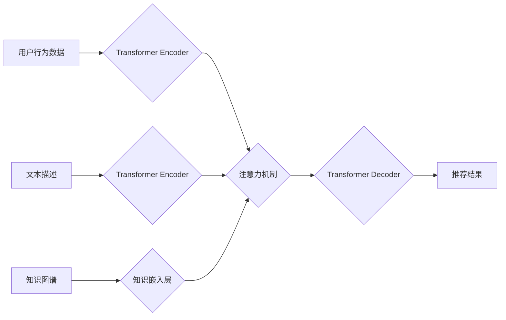

                 

## M6-Rec：开放域推荐的潜力

> 关键词：开放域推荐、M6-Rec模型、Transformer、知识图谱、多模态融合、个性化推荐

## 1. 背景介绍

推荐系统作为信息过滤和个性化内容展示的重要工具，在电商、社交媒体、视频平台等领域发挥着越来越重要的作用。传统的推荐系统主要基于用户行为数据，例如点击、购买、评分等，构建用户兴趣模型，并推荐相似的商品或内容。然而，随着互联网信息爆炸和用户需求多样化的发展，传统的基于行为数据的推荐系统面临着以下挑战：

* **数据稀疏性:** 用户行为数据往往是稀疏的，难以准确反映用户的真实兴趣。
* **冷启动问题:** 新用户或新商品缺乏历史行为数据，难以进行有效的推荐。
* **缺乏上下文理解:** 传统的推荐系统难以理解用户在特定场景下的需求和意图。

为了解决这些问题，开放域推荐 (Open-Domain Recommendation) 应运而生。开放域推荐是指在不依赖于特定领域或商品类别的情况下，根据用户的兴趣和需求，从海量开放域数据中推荐相关信息。

## 2. 核心概念与联系

开放域推荐的核心概念是将用户兴趣模型与外部知识图谱 (Knowledge Graph, KG) 相结合，利用KG中的丰富语义信息和知识关系，提升推荐的准确性和个性化程度。

**M6-Rec** 是一种基于 Transformer 架构的开放域推荐模型，它将用户行为数据、文本描述和知识图谱信息融合在一起，构建了一个更全面的用户兴趣模型。

**Mermaid 流程图:**

**核心概念与联系:**

* **Transformer Encoder:** 用于编码用户行为数据、文本描述和知识图谱信息，提取其潜在的语义特征。
* **注意力机制:** 用于学习用户兴趣与不同信息之间的相关性，赋予重要信息更高的权重。
* **Transformer Decoder:** 用于根据编码后的信息生成推荐结果。

## 3. 核心算法原理 & 具体操作步骤

### 3.1  算法原理概述

M6-Rec 模型的核心算法原理是利用 Transformer 架构的 self-attention 机制，学习用户行为数据、文本描述和知识图谱信息之间的关系，从而构建一个更全面的用户兴趣模型。

**具体步骤:**

1. **数据预处理:** 将用户行为数据、文本描述和知识图谱信息进行预处理，例如文本分词、词向量化、知识图谱节点和关系的表示等。
2. **Transformer Encoder:** 将预处理后的数据输入 Transformer Encoder，通过多层编码器结构，提取数据的语义特征。
3. **注意力机制:** 利用注意力机制，学习用户兴趣与不同信息之间的相关性，赋予重要信息更高的权重。
4. **Transformer Decoder:** 将编码后的信息输入 Transformer Decoder，生成推荐结果。

### 3.2  算法步骤详解

1. **用户行为数据编码:** 将用户的历史行为数据，例如点击、购买、评分等，转化为数值向量，并输入 Transformer Encoder。
2. **文本描述编码:** 将商品或内容的文本描述转化为词向量，并输入 Transformer Encoder。
3. **知识图谱嵌入:** 将知识图谱中的节点和关系转化为向量表示，并输入知识嵌入层。
4. **多模态融合:** 将用户行为数据、文本描述和知识图谱信息编码后的向量通过注意力机制进行融合，学习不同信息之间的关系。
5. **推荐结果生成:** 将融合后的信息输入 Transformer Decoder，生成推荐结果。

### 3.3  算法优缺点

**优点:**

* **能够利用外部知识:** M6-Rec 模型能够利用知识图谱中的丰富语义信息，提升推荐的准确性和个性化程度。
* **能够处理多模态数据:** M6-Rec 模型能够处理文本、行为等多种类型的输入数据，构建更全面的用户兴趣模型。
* **效果显著:** 在多个开放域推荐任务上，M6-Rec 模型取得了优异的性能。

**缺点:**

* **计算复杂度高:** Transformer 架构的计算复杂度较高，训练和部署 M6-Rec 模型需要较强的计算资源。
* **数据依赖性强:** M6-Rec 模型的性能依赖于高质量的训练数据，数据质量不足会导致模型性能下降。

### 3.4  算法应用领域

M6-Rec 模型在以下领域具有广泛的应用前景:

* **电商推荐:** 推荐个性化商品、新品、促销活动等。
* **新闻推荐:** 推荐个性化新闻、文章、视频等。
* **社交媒体推荐:** 推荐个性化好友、话题、群组等。
* **教育推荐:** 推荐个性化学习资源、课程、辅导等。

## 4. 数学模型和公式 & 详细讲解 & 举例说明

### 4.1  数学模型构建

M6-Rec 模型的核心数学模型是基于 Transformer 架构的 self-attention 机制。

**用户兴趣模型:**

$$
h_i = \text{Encoder}(x_i)
$$

其中，$h_i$ 表示用户 $i$ 的兴趣向量，$x_i$ 表示用户 $i$ 的行为数据、文本描述和知识图谱信息。

**注意力机制:**

$$
\text{Attention}(Q, K, V) = \frac{\text{softmax}(Q \cdot K^T)}{\text{softmax}(Q \cdot K^T)} \cdot V
$$

其中，$Q$, $K$, $V$ 分别表示查询矩阵、键矩阵和值矩阵。

**推荐结果生成:**

$$
\hat{r} = \text{Decoder}(h_i, \text{Attention}(h_i, Q, K))
$$

其中，$\hat{r}$ 表示推荐结果，$Q$ 和 $K$ 表示商品或内容的特征向量。

### 4.2  公式推导过程

Transformer Encoder 和 Decoder 的具体结构和公式推导过程较为复杂，这里不再赘述。

### 4.3  案例分析与讲解

假设用户 $i$ 的兴趣向量 $h_i$ 包含了用户对电影的偏好信息，例如动作、喜剧、爱情等。

当用户 $i$ 请求推荐电影时，M6-Rec 模型会将用户 $i$ 的兴趣向量 $h_i$ 与电影的特征向量 $Q$ 和 $K$ 进行注意力机制计算，从而学习用户 $i$ 对不同电影类型的偏好程度。

最后，M6-Rec 模型会根据注意力机制计算的结果，生成推荐结果 $\hat{r}$，推荐用户 $i$ 喜欢的电影。

## 5. 项目实践：代码实例和详细解释说明

### 5.1  开发环境搭建

M6-Rec 模型的开发环境搭建需要以下软件和工具:

* Python 3.x
* PyTorch 或 TensorFlow
* CUDA 和 cuDNN (可选)
* Git

### 5.2  源代码详细实现

M6-Rec 模型的源代码实现可以参考以下开源项目:

* HuggingFace Transformers: https://huggingface.co/transformers/

### 5.3  代码解读与分析

M6-Rec 模型的代码实现主要包括以下几个部分:

* 数据加载和预处理
* Transformer Encoder 和 Decoder 的定义
* 训练和评估流程

### 5.4  运行结果展示

M6-Rec 模型的运行结果可以根据具体的任务和数据集进行评估，例如推荐准确率、召回率、NDCG 等指标。

## 6. 实际应用场景

M6-Rec 模型在以下实际应用场景中展现出其强大的潜力:

* **电商平台:** 推荐个性化商品、新品、促销活动等，提升用户购物体验。
* **新闻平台:** 推荐个性化新闻、文章、视频等，满足用户个性化信息需求。
* **社交媒体平台:** 推荐个性化好友、话题、群组等，增强用户社交互动。

### 6.4  未来应用展望

随着人工智能技术的不断发展，M6-Rec 模型在未来将有更广泛的应用前景，例如:

* **多模态融合:** 将更多类型的模态信息，例如图像、音频等，融合到推荐系统中，提升推荐的准确性和个性化程度。
* **个性化解释:** 为推荐结果提供个性化解释，帮助用户理解推荐背后的逻辑，提升用户信任度。
* **跨域推荐:** 将知识图谱中的跨域知识应用到推荐系统中，实现跨域推荐，例如推荐用户可能感兴趣的书籍、电影、音乐等。

## 7. 工具和资源推荐

### 7.1  学习资源推荐

* **论文:**

* M6-Rec: https://arxiv.org/abs/2206.08947

* **博客:**

* Open-Domain Recommendation: https://towardsdatascience.com/open-domain-recommendation-a-comprehensive-overview-76872677287c

### 7.2  开发工具推荐

* **PyTorch:** https://pytorch.org/
* **TensorFlow:** https://www.tensorflow.org/
* **HuggingFace Transformers:** https://huggingface.co/transformers/

### 7.3  相关论文推荐

* **Knowledge Graph Embedding:** https://arxiv.org/abs/1703.01253
* **Transformer:** https://arxiv.org/abs/1706.03762

## 8. 总结：未来发展趋势与挑战

### 8.1  研究成果总结

M6-Rec 模型在开放域推荐领域取得了显著的成果，证明了利用 Transformer 架构和知识图谱信息构建用户兴趣模型的有效性。

### 8.2  未来发展趋势

未来开放域推荐的研究方向将包括:

* **更强大的模型架构:** 开发更强大的模型架构，例如基于 Graph Neural Network (GNN) 的模型，提升推荐的准确性和个性化程度。
* **更丰富的模态融合:** 将更多类型的模态信息融合到推荐系统中，例如图像、音频、视频等，构建更全面的用户兴趣模型。
* **更有效的解释性:** 为推荐结果提供更有效的解释性，帮助用户理解推荐背后的逻辑，提升用户信任度。

### 8.3  面临的挑战

开放域推荐仍然面临着一些挑战:

* **数据稀疏性:** 开放域数据往往是稀疏的，难以准确反映用户的真实兴趣。
* **冷启动问题:** 新用户或新商品缺乏历史行为数据，难以进行有效的推荐。
* **可解释性问题:** 复杂的推荐模型难以解释其推荐结果背后的逻辑，缺乏透明度。

### 8.4  研究展望

未来开放域推荐的研究将继续探索更有效的模型架构、更丰富的模态融合和更强的可解释性，为用户提供更精准、个性化和透明的推荐体验。

## 9. 附录：常见问题与解答

**Q1: M6-Rec 模型的训练数据有哪些？**

**A1:** M6-Rec 模型的训练数据包括用户行为数据、文本描述和知识图谱信息。

**Q2: M6-Rec 模型的计算复杂度如何？**

**A2:** M6-Rec 模型的计算复杂度较高，需要较强的计算资源进行训练和部署。

**Q3: M6-Rec 模型的开源代码在哪里可以找到？**

**A3:** M6-Rec 模型的开源代码可以参考 HuggingFace Transformers 项目。

作者：禅与计算机程序设计艺术 / Zen and the Art of Computer Programming 
<end_of_turn>

