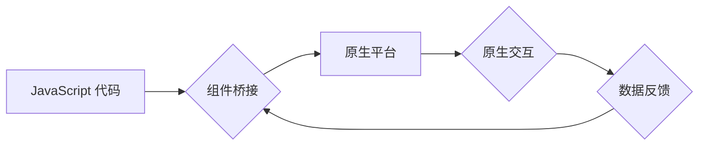

                 

## React Native与原生交互

> 关键词：React Native, 原生交互, 跨平台, 性能优化, 组件桥接, Native Modules, JavaScript,  Android, iOS

## 1. 背景介绍

React Native 作为一款流行的跨平台移动应用开发框架，凭借其使用 JavaScript 开发、代码可复用、开发效率高等优势，吸引了众多开发者。然而，在追求跨平台一致性的同时，React Native 与原生交互的实现也成为了一个重要的挑战。

原生交互是指应用程序与设备硬件和系统功能进行直接交互，例如访问相机、传感器、通知中心等。这些交互通常需要调用平台特定的 API 和库，而 React Native 作为跨平台框架，需要提供一种机制来实现与不同平台的原生交互。

## 2. 核心概念与联系

React Native 的核心思想是使用 JavaScript 和 React 框架构建用户界面，并通过 **组件桥接** 机制与原生平台进行交互。

**组件桥接** 是 React Native 与原生交互的关键技术。它通过一个独立的进程，将 JavaScript 代码中的 UI 渲染指令传递给原生平台，并将原生平台的事件和数据反馈给 JavaScript 代码。

**流程图：**



**核心概念：**

* **Native Modules:**  React Native 提供了 Native Modules 的机制，允许开发者将原生代码封装成模块，并通过 JavaScript 代码调用。
* **桥接机制:** 组件桥接机制负责将 JavaScript 代码中的请求传递给 Native Modules，并将 Native Modules 的返回结果传递回 JavaScript 代码。

## 3. 核心算法原理 & 具体操作步骤

### 3.1  算法原理概述

React Native 的组件桥接机制基于 **消息传递** 的原理。

JavaScript 代码通过调用特定的 API 发送消息给 Native Modules，Native Modules 接收消息后执行相应的操作，并将结果以消息的形式返回给 JavaScript 代码。

### 3.2  算法步骤详解

1. **JavaScript 代码调用 Native Modules API:** JavaScript 代码通过 `requireNativeModule` 或 `NativeEventEmitter` 等 API 调用 Native Modules。
2. **消息序列化:**  JavaScript 代码将请求参数序列化成 JSON 格式的消息。
3. **消息传递:**  组件桥接机制将消息发送到 Native Modules 的进程。
4. **Native Modules 处理消息:** Native Modules 接收消息后，解析消息内容，执行相应的操作。
5. **结果序列化:** Native Modules 将操作结果序列化成 JSON 格式的消息。
6. **消息返回:** 组件桥接机制将消息返回给 JavaScript 代码。
7. **JavaScript 代码处理结果:** JavaScript 代码解析消息内容，并根据结果进行相应的处理。

### 3.3  算法优缺点

**优点:**

* **跨平台:**  组件桥接机制可以实现跨平台的原生交互。
* **代码复用:**  JavaScript 代码可以复用于不同的平台。
* **开发效率:**  使用 JavaScript 开发原生交互逻辑，可以提高开发效率。

**缺点:**

* **性能:**  消息传递过程会带来一定的性能开销。
* **复杂性:**  组件桥接机制的实现相对复杂。
* **调试:**  跨平台的调试难度相对较高。

### 3.4  算法应用领域

* **访问设备硬件:**  例如相机、传感器、定位等。
* **使用平台特定功能:**  例如通知中心、推送服务等。
* **集成第三方库:**  例如支付、地图等。

## 4. 数学模型和公式 & 详细讲解 & 举例说明

在 React Native 的组件桥接机制中，消息传递过程可以抽象为一个数学模型。

**4.1  数学模型构建**

假设：

* $M$ 为 Native Modules 的集合。
* $J$ 为 JavaScript 代码的集合。
* $R$ 为消息的集合。

则组件桥接机制可以表示为一个函数：

$$f: J \times M \rightarrow R$$

其中，$f(j, m)$ 表示 JavaScript 代码 $j$ 调用 Native Modules $m$ 的结果。

**4.2  公式推导过程**

消息传递过程可以分为以下步骤：

1. **消息编码:**  将 JavaScript 代码 $j$ 和 Native Modules $m$ 的参数编码成消息 $r$。

$$r = encode(j, m, params)$$

2. **消息发送:**  将消息 $r$ 发送到 Native Modules 的进程。

3. **消息解码:**  Native Modules 解码消息 $r$，获取 JavaScript 代码 $j$ 和 Native Modules $m$ 的参数。

$$j', m' = decode(r)$$

4. **Native Modules 处理:**  Native Modules 执行相应的操作，并生成结果 $result$。

$$result = m'(params)$$

5. **结果编码:**  将结果 $result$ 编码成消息 $r'$。

$$r' = encode(result)$$

6. **消息返回:**  将消息 $r'$ 发送回 JavaScript 代码。

7. **消息解码:**  JavaScript 代码解码消息 $r'$，获取结果 $result$。

$$result = decode(r')$$

**4.3  案例分析与讲解**

例如，假设 JavaScript 代码想要获取设备的地理位置信息，可以调用 Native Modules 的 `Geolocation` 模块。

1. JavaScript 代码调用 `Geolocation.getCurrentPosition()` 方法，并传递参数 `successCallback` 和 `errorCallback`。
2. 组件桥接机制将消息发送到 Native Modules 的 `Geolocation` 模块。
3. `Geolocation` 模块解码消息，获取 `successCallback` 和 `errorCallback`。
4. `Geolocation` 模块调用平台特定的 API 获取地理位置信息。
5. `Geolocation` 模块将地理位置信息编码成消息，并发送回 JavaScript 代码。
6. JavaScript 代码解码消息，获取地理位置信息。

## 5. 项目实践：代码实例和详细解释说明

### 5.1  开发环境搭建

* 安装 Node.js 和 npm 或 yarn。
* 安装 React Native CLI: `npm install -g react-native-cli`
* 创建 React Native 项目: `react-native init MyProject`

### 5.2  源代码详细实现

```javascript
// App.js
import React, { useState, useEffect } from 'react';
import { View, Text, Button } from 'react-native';
import Geolocation from 'react-native-geolocation-service';

const App = () => {
  const [location, setLocation] = useState(null);

  useEffect(() => {
    Geolocation.getCurrentPosition(
      (position) => {
        setLocation(position);
      },
      (error) => {
        console.log(error.code, error.message);
      },
      { enableHighAccuracy: true, timeout: 15000, maximumAge: 10000 }
    );
  }, []);

  return (
    <View>
      <Text>我的位置:</Text>
      {location ? (
        <Text>
          纬度: {location.coords.latitude}, 经度: {location.coords.longitude}
        </Text>
      ) : (
        <Text>正在获取位置...</Text>
      )}
      <Button title="获取位置" onPress={() => Geolocation.getCurrentPosition()} />
    </View>
  );
};

export default App;
```

### 5.3  代码解读与分析

* 使用 `react-native-geolocation-service` 库来访问地理位置信息。
* `getCurrentPosition()` 方法用于获取当前位置。
* `successCallback` 和 `errorCallback` 用于处理位置获取成功和失败的情况。
* `enableHighAccuracy`, `timeout` 和 `maximumAge` 参数用于配置位置获取的精度和超时时间。

### 5.4  运行结果展示

运行应用程序后，会显示当前设备的地理位置信息。

## 6. 实际应用场景

React Native 的原生交互能力广泛应用于各种移动应用场景，例如：

* **地图应用:**  使用 Native Modules 调用地图 API，实现地图显示、定位、导航等功能。
* **社交应用:**  使用 Native Modules 调用相机、麦克风等硬件，实现拍照、录音、视频通话等功能。
* **游戏应用:**  使用 Native Modules 调用游戏引擎，实现游戏逻辑、物理模拟等功能。
* **电商应用:**  使用 Native Modules 调用支付 API，实现在线支付功能。

### 6.4  未来应用展望

随着 React Native 的不断发展，原生交互能力将会更加强大，应用场景将会更加广泛。例如：

* **AR/VR 应用:**  使用 Native Modules 调用 AR/VR API，实现增强现实和虚拟现实体验。
* **物联网应用:**  使用 Native Modules 连接物联网设备，实现远程控制、数据采集等功能。
* **人工智能应用:**  使用 Native Modules 调用人工智能 API，实现语音识别、图像识别等功能。

## 7. 工具和资源推荐

### 7.1  学习资源推荐

* React Native 官方文档: https://reactnative.dev/docs/getting-started
* React Native 中文社区: https://reactnative.cn/
* React Native 入门教程: https://www.reactnative.cn/tutorial/

### 7.2  开发工具推荐

* Xcode (iOS 开发)
* Android Studio (Android 开发)
* React Native Debugger: https://github.com/jhen0409/react-native-debugger

### 7.3  相关论文推荐

* React Native: A Framework for Mobile App Development Using JavaScript
* Bridging the Gap: A Survey of Cross-Platform Mobile Development Frameworks

## 8. 总结：未来发展趋势与挑战

### 8.1  研究成果总结

React Native 的原生交互能力已经取得了显著的进展，为跨平台移动应用开发提供了强大的工具。

### 8.2  未来发展趋势

* **性能优化:**  React Native 将继续致力于提升性能，减少消息传递带来的开销。
* **更丰富的原生交互:**  React Native 将支持更多平台特定的功能和 API。
* **更易于使用的开发体验:**  React Native 将提供更直观、更易于使用的开发工具和框架。

### 8.3  面临的挑战

* **跨平台兼容性:**  确保 React Native 应用在不同平台上都能正常运行仍然是一个挑战。
* **性能瓶颈:**  原生交互操作可能会导致性能瓶颈，需要不断优化。
* **开发者生态:**  React Native 的开发者生态仍然相对较小，需要更多的开发者加入。

### 8.4  研究展望

未来，React Native 的原生交互能力将会更加强大，应用场景将会更加广泛。

## 9. 附录：常见问题与解答

* **如何解决 React Native 原生交互性能问题？**

  * 使用异步操作来减少阻塞。
  * 优化 Native Modules 的代码。
  * 使用缓存机制来减少重复操作。

* **如何调试 React Native 原生交互问题？**

  * 使用 React Native Debugger 工具。
  * 打印日志信息来跟踪代码执行过程。
  * 使用断点调试来定位问题所在。


作者：禅与计算机程序设计艺术 / Zen and the Art of Computer Programming 
<end_of_turn>

