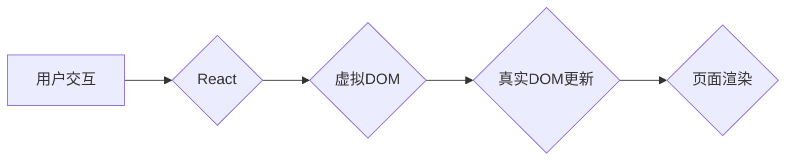

                 

## React 和前端框架：构建动态用户界面

> 关键词：React, 前端框架, 虚拟DOM, JSX, 组件化, 状态管理, 单向数据流, 性能优化

### 1. 背景介绍

随着互联网的蓬勃发展，用户对网站和应用程序的体验要求越来越高。传统的静态网页难以满足用户对交互性和动态内容的需求。前端框架应运而生，为开发复杂、交互丰富的用户界面提供了强大的工具和机制。

React，由 Facebook 开源，是目前最流行的前端框架之一。它以其组件化架构、虚拟DOM和高效的渲染机制，在构建动态用户界面方面展现出强大的优势。本文将深入探讨 React 的核心概念、工作原理、应用场景以及未来发展趋势。

### 2. 核心概念与联系

React 的核心概念围绕着 **组件化**、**虚拟DOM** 和 **单向数据流** 展开。

**2.1 组件化**

React 鼓励将应用程序拆分成小的、可复用的组件。每个组件都是独立的，拥有自己的状态和逻辑，可以被组合成更复杂的界面。组件化架构带来以下优势：

* **代码复用性高:** 组件可以被多次使用，减少代码重复，提高开发效率。
* **代码可维护性强:** 组件独立性强，修改一个组件不会影响其他组件，降低代码维护难度。
* **开发协作性好:** 团队可以分别开发不同的组件，并将其组合在一起，提高开发协作效率。

**2.2 虚拟DOM**

虚拟DOM 是 React 的核心技术之一。它是一个 JavaScript 对象，代表了真实 DOM 的结构。React 使用虚拟DOM 来优化渲染过程。

当应用程序状态发生变化时，React 会首先更新虚拟DOM，然后比较新旧虚拟DOM的差异，只更新真正需要改变的部分，从而提高渲染效率。

**2.3 单向数据流**

React 遵循单向数据流原则，数据只从父组件向子组件流动。这种数据流方式使得数据管理更加清晰，更容易追踪数据变化，提高代码可读性和可维护性。

**2.4 Mermaid 流程图**



### 3. 核心算法原理 & 具体操作步骤

**3.1 算法原理概述**

React 的核心算法是 **虚拟DOM diffing**。它通过比较新旧虚拟DOM的差异，只更新真正需要改变的部分，从而实现高效的渲染。

**3.2 算法步骤详解**

1. **创建虚拟DOM:** 当应用程序状态发生变化时，React 会根据新的状态生成新的虚拟DOM。
2. **比较虚拟DOM:** React 会比较新旧虚拟DOM的结构和属性，找出差异。
3. **生成更新操作:** 根据差异，React 会生成一个更新操作列表，指示哪些节点需要添加、删除或修改。
4. **更新真实DOM:** React 会根据更新操作列表，更新真实DOM，从而实现页面渲染。

**3.3 算法优缺点**

**优点:**

* **高效:** 只更新真正需要改变的部分，提高渲染效率。
* **可预测:** 数据流单向，易于追踪数据变化，提高代码可读性和可维护性。
* **可扩展:** 组件化架构使得代码可复用和扩展性强。

**缺点:**

* **学习曲线:** 虚拟DOM 和 diffing 算法需要一定的学习成本。
* **性能瓶颈:** 在某些情况下，虚拟DOM diffing 可能会导致性能瓶颈，需要进行优化。

**3.4 算法应用领域**

React 的虚拟DOM diffing 算法广泛应用于各种前端框架和库，例如 Vue.js、Angular 等。

### 4. 数学模型和公式 & 详细讲解 & 举例说明

**4.1 数学模型构建**

虚拟DOM diffing 算法的核心是比较两个树状结构的差异。我们可以用树形结构来表示虚拟DOM，每个节点代表一个 DOM 元素。

**4.2 公式推导过程**

比较两个树状结构的差异可以使用以下公式：

```latex
D(T1, T2) = \sum_{i=1}^{n} d(T1[i], T2[i])
```

其中：

* $D(T1, T2)$ 表示两个树状结构 $T1$ 和 $T2$ 的差异。
* $n$ 表示树状结构中节点的数量。
* $d(T1[i], T2[i])$ 表示节点 $i$ 在两个树状结构中的差异。

**4.3 案例分析与讲解**

假设有两个虚拟DOM，$T1$ 和 $T2$，如下所示：

* $T1$:

```
<div>
  <h1>Hello</h1>
  <p>World</p>
</div>
```

* $T2$:

```
<div>
  <h1>Welcome</h1>
  <p>React</p>
</div>
```

我们可以看到，$T1$ 和 $T2$ 的结构相同，但内容不同。因此，$D(T1, T2)$ 的值取决于节点内容的差异。

### 5. 项目实践：代码实例和详细解释说明

**5.1 开发环境搭建**

* 安装 Node.js 和 npm 或 yarn。
* 创建一个新的 React 项目：

```bash
npx create-react-app my-react-app
```

**5.2 源代码详细实现**

```jsx
import React, { useState } from 'react';

function Counter() {
  const [count, setCount] = useState(0);

  return (
    <div>
      <h1>{count}</h1>
      <button onClick={() => setCount(count + 1)}>Increment</button>
    </div>
  );
}

export default Counter;
```

**5.3 代码解读与分析**

* `useState` hook 用于管理组件的状态。
* `count` 变量存储当前计数值。
* `setCount` 函数用于更新 `count` 的值。
* `onClick` 事件处理函数在按钮被点击时调用 `setCount` 函数，增加计数值。

**5.4 运行结果展示**

运行项目后，会看到一个页面，显示一个计数器，初始值为 0。点击按钮可以增加计数器值。

### 6. 实际应用场景

React 的应用场景非常广泛，包括：

* **单页面应用 (SPA):** React 非常适合构建 SPA，因为它可以高效地更新页面内容，提供流畅的用户体验。
* **移动应用:** React Native 可以使用 React 的语法和机制开发移动应用。
* **桌面应用:** Electron 可以使用 React 开发桌面应用。
* **游戏:** React 可以用于开发一些简单的游戏。

### 7. 工具和资源推荐

**7.1 学习资源推荐**

* React 官方文档: https://reactjs.org/docs/getting-started.html
* React 教程: https://www.freecodecamp.org/learn/front-end-libraries/react/

**7.2 开发工具推荐**

* Create React App: https://create-react-app.dev/
* VS Code: https://code.visualstudio.com/

**7.3 相关论文推荐**

* React: A Declarative JavaScript Library for Building User Interfaces: https://arxiv.org/abs/1308.0398

### 8. 总结：未来发展趋势与挑战

**8.1 研究成果总结**

React 作为一种流行的前端框架，已经取得了巨大的成功。它的组件化架构、虚拟DOM 和单向数据流等特性，为开发复杂、交互丰富的用户界面提供了强大的工具和机制。

**8.2 未来发展趋势**

* **性能优化:** React 将继续致力于提高性能，例如通过更智能的虚拟DOM diffing 算法和代码分割技术。
* **更强大的工具链:** React 的生态系统将继续发展，提供更强大的工具和库，例如状态管理库、路由库和测试工具。
* **移动端和桌面端扩展:** React Native 和 Electron 等技术将继续推动 React 在移动端和桌面端的应用。

**8.3 面临的挑战**

* **学习曲线:** React 的学习曲线相对较陡峭，需要一定的编程基础和学习成本。
* **生态系统复杂性:** React 的生态系统庞大而复杂，需要开发者花费时间学习和选择合适的工具和库。
* **性能瓶颈:** 在某些情况下，React 的性能可能会受到限制，需要进行优化。

**8.4 研究展望**

未来，React 将继续朝着更强大、更易用、更高效的方向发展。随着技术的不断进步，React 将在前端开发领域扮演越来越重要的角色。

### 9. 附录：常见问题与解答

**9.1 什么是 JSX?**

JSX 是 React 中的一种语法扩展，允许开发者使用 HTML-like 语法来描述 UI 组件。

**9.2 如何在 React 中管理状态?**

React 提供了 `useState` hook 来管理组件的状态。

**9.3 如何在 React 中进行路由?**

React Router 是一个流行的 React 路由库，可以用于实现单页面应用的路由功能。


作者：禅与计算机程序设计艺术 / Zen and the Art of Computer Programming 
<end_of_turn>

