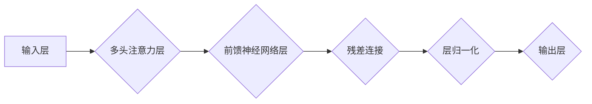

                 

## 1. 背景介绍

自然语言处理 (NLP) 领域一直以来都致力于让计算机理解和生成人类语言。传统的基于循环神经网络 (RNN) 的模型在处理长文本序列时存在着梯度消失和梯度爆炸的问题，难以捕捉长距离依赖关系。2017 年，谷歌发布了 Transformer 架构，彻底改变了 NLP 领域的发展方向。Transformer 摒弃了 RNN 的循环结构，采用了一种全新的注意力机制，能够有效地捕捉长距离依赖关系，并取得了显著的性能提升。

## 2. 核心概念与联系

Transformer 架构的核心概念包括：

* **注意力机制 (Attention Mechanism):**  注意力机制允许模型关注输入序列中与当前任务最相关的部分，从而更好地理解上下文信息。

* **多头注意力 (Multi-Head Attention):** 多头注意力机制通过并行执行多个注意力头，学习到不同层次的语义信息，提升模型的表达能力。

* **残差连接 (Residual Connection):** 残差连接允许模型学习到更深层的特征表示，并缓解梯度消失问题。

* **层归一化 (Layer Normalization):** 层归一化可以加速模型训练，并提高模型的稳定性。

**Transformer 架构流程图:**



## 3. 核心算法原理 & 具体操作步骤

### 3.1  算法原理概述

Transformer 架构的核心是注意力机制和多头注意力机制。注意力机制允许模型在处理输入序列时，根据每个词语的重要性赋予不同的权重，从而更好地理解上下文信息。多头注意力机制通过并行执行多个注意力头，学习到不同层次的语义信息，提升模型的表达能力。

### 3.2  算法步骤详解

1. **输入嵌入:** 将输入序列中的每个词语转换为向量表示，称为词嵌入。

2. **多头注意力层:** 对输入序列进行多头注意力操作，学习到不同层次的语义信息。

3. **前馈神经网络层:** 对注意力输出进行进一步的处理，提取更深层的特征表示。

4. **残差连接:** 将前馈神经网络层的输出与输入连接起来，缓解梯度消失问题。

5. **层归一化:** 对残差连接后的输出进行归一化处理，加速模型训练，并提高模型的稳定性。

6. **重复步骤 2-5:** 将上述步骤重复多次，形成多层 Transformer 网络。

7. **输出层:** 将多层 Transformer 网络的输出进行分类或生成任务。

### 3.3  算法优缺点

**优点:**

* 能够有效地捕捉长距离依赖关系。
* 并行计算能力强，训练速度快。
* 表现能力强，在各种 NLP 任务中取得了优异的成绩。

**缺点:**

* 参数量大，需要大量的计算资源进行训练。
* 对训练数据要求较高。

### 3.4  算法应用领域

Transformer 架构在 NLP 领域有着广泛的应用，例如：

* 机器翻译
* 文本摘要
* 问答系统
* 情感分析
* 代码生成

## 4. 数学模型和公式 & 详细讲解 & 举例说明

### 4.1  数学模型构建

Transformer 架构的核心是注意力机制和多头注意力机制。

**注意力机制:**

注意力机制的目的是学习到输入序列中每个词语的重要性权重，从而更好地理解上下文信息。注意力机制的计算公式如下：

$$
\text{Attention}(Q, K, V) = \text{softmax}\left(\frac{Q K^T}{\sqrt{d_k}}\right) V
$$

其中：

* $Q$ 是查询矩阵，表示当前词语的表示。
* $K$ 是键矩阵，表示所有词语的表示。
* $V$ 是值矩阵，表示所有词语的含义。
* $d_k$ 是键向量的维度。

**多头注意力机制:**

多头注意力机制通过并行执行多个注意力头，学习到不同层次的语义信息。多头注意力机制的计算公式如下：

$$
\text{Multi-Head Attention}(Q, K, V) = \text{Concat}(head_1, head_2, ..., head_h) W^O
$$

其中：

* $head_i$ 是第 $i$ 个注意力头的输出。
* $h$ 是注意力头的数量。
* $W^O$ 是一个线性变换矩阵。

### 4.2  公式推导过程

注意力机制的公式推导过程如下：

1. 计算查询矩阵 $Q$ 和键矩阵 $K$ 的点积。
2. 对点积结果进行缩放，以防止梯度爆炸。
3. 对缩放后的结果进行 softmax 操作，得到每个词语的重要性权重。
4. 将重要权重与值矩阵 $V$ 进行加权求和，得到注意力输出。

多头注意力机制的公式推导过程如下：

1. 将查询矩阵 $Q$、键矩阵 $K$ 和值矩阵 $V$ 分别投影到多个子空间。
2. 对每个子空间执行注意力机制，得到多个注意力头。
3. 将多个注意力头的输出进行拼接，并进行线性变换，得到最终的注意力输出。

### 4.3  案例分析与讲解

假设我们有一个句子 "The cat sat on the mat"，我们想要使用注意力机制来理解每个词语的重要性。

* 查询矩阵 $Q$ 表示当前词语 "sat" 的表示。
* 键矩阵 $K$ 表示所有词语的表示。
* 值矩阵 $V$ 表示所有词语的含义。

注意力机制会计算每个词语与 "sat" 的相关性，并赋予不同的权重。例如，"cat" 和 "mat" 的权重会比 "the" 和 "on" 高，因为它们与 "sat" 的语义关系更密切。

## 5. 项目实践：代码实例和详细解释说明

### 5.1  开发环境搭建

为了实现 Transformer 架构，我们需要搭建一个 Python 开发环境。

* 安装 Python 3.6 或更高版本。
* 安装 PyTorch 或 TensorFlow 深度学习框架。
* 安装必要的库，例如 NumPy、pandas、matplotlib 等。

### 5.2  源代码详细实现

以下是一个使用 PyTorch 实现 Transformer 架构的简单代码示例：

```python
import torch
import torch.nn as nn

class Transformer(nn.Module):
    def __init__(self, input_size, hidden_size, num_heads, num_layers):
        super(Transformer, self).__init__()
        self.embedding = nn.Embedding(input_size, hidden_size)
        self.transformer_layers = nn.ModuleList([
            nn.TransformerEncoderLayer(hidden_size, num_heads)
            for _ in range(num_layers)
        ])
        self.linear = nn.Linear(hidden_size, input_size)

    def forward(self, x):
        x = self.embedding(x)
        for layer in self.transformer_layers:
            x = layer(x)
        x = self.linear(x)
        return x
```

### 5.3  代码解读与分析

* `__init__` 方法初始化模型参数，包括输入大小、隐藏大小、注意力头数量和 Transformer 层数。
* `embedding` 层将输入词语转换为向量表示。
* `transformer_layers` 是一个模块列表，包含多个 Transformer 编码器层。
* `forward` 方法定义模型的正向传播过程。

### 5.4  运行结果展示

为了运行上述代码，我们需要准备训练数据和模型参数。训练完成后，我们可以使用模型对新的文本序列进行预测。

## 6. 实际应用场景

Transformer 架构在 NLP 领域有着广泛的应用，例如：

* **机器翻译:** Transformer 模型能够有效地捕捉语言之间的语义关系，从而实现高质量的机器翻译。

* **文本摘要:** Transformer 模型能够学习到文本的关键信息，并生成简洁的文本摘要。

* **问答系统:** Transformer 模型能够理解自然语言问题，并从文本中找到相应的答案。

* **情感分析:** Transformer 模型能够识别文本中的情感倾向，例如积极、消极或中性。

* **代码生成:** Transformer 模型能够学习代码的语法和语义规则，并生成新的代码。

### 6.4  未来应用展望

Transformer 架构在未来将继续推动 NLP 领域的发展，并应用于更多领域，例如：

* **对话系统:** Transformer 模型能够构建更自然、更流畅的对话系统。
* **文本生成:** Transformer 模型能够生成更逼真的文本，例如小说、诗歌和剧本。
* **知识图谱构建:** Transformer 模型能够帮助构建更完整的知识图谱。

## 7. 工具和资源推荐

### 7.1  学习资源推荐

* **论文:** "Attention Is All You Need" (https://arxiv.org/abs/1706.03762)
* **博客:** "The Illustrated Transformer" (https://jalammar.github.io/illustrated-transformer/)
* **课程:** "Deep Learning Specialization" (https://www.deeplearning.ai/)

### 7.2  开发工具推荐

* **PyTorch:** https://pytorch.org/
* **TensorFlow:** https://www.tensorflow.org/
* **Hugging Face Transformers:** https://huggingface.co/transformers/

### 7.3  相关论文推荐

* "BERT: Pre-training of Deep Bidirectional Transformers for Language Understanding" (https://arxiv.org/abs/1810.04805)
* "GPT-2: Transformer Language Modeling for Open-Domain Text Generation" (https://openai.com/blog/better-language-models/)
* "T5: Text-to-Text Transfer Transformer" (https://arxiv.org/abs/1910.10683)

## 8. 总结：未来发展趋势与挑战

### 8.1  研究成果总结

Transformer 架构的出现彻底改变了 NLP 领域的发展方向，取得了显著的成果，例如：

* 在机器翻译、文本摘要、问答系统等任务中取得了优异的性能。
* 推动了预训练语言模型的发展，例如 BERT、GPT-2 和 T5。

### 8.2  未来发展趋势

Transformer 架构的未来发展趋势包括：

* **模型规模的进一步扩大:** 更大的模型能够学习到更复杂的语义信息，从而提升模型的性能。
* **高效训练方法的探索:** 为了训练更大的模型，需要探索更有效的训练方法，例如模型剪枝和知识蒸馏。
* **跨模态理解:** 将 Transformer 架构应用于跨模态理解任务，例如图像和文本的联合理解。

### 8.3  面临的挑战

Transformer 架构也面临着一些挑战，例如：

* **参数量大:** Transformer 模型的参数量很大，需要大量的计算资源进行训练。
* **训练数据要求高:** Transformer 模型需要大量的训练数据才能达到最佳性能。
* **可解释性差:** Transformer 模型的内部机制比较复杂，难以解释模型的决策过程。

### 8.4  研究展望

未来研究将继续探索 Transformer 架构的潜力，解决其面临的挑战，并将其应用于更多领域。


## 9. 附录：常见问题与解答

**Q1: Transformer 架构与 RNN 架构相比有什么优势？**

**A1:** Transformer 架构能够有效地捕捉长距离依赖关系，而 RNN 架构容易出现梯度消失和梯度爆炸问题。

**Q2: Transformer 架构的注意力机制是如何工作的？**

**A2:** 注意力机制通过计算每个词语与其他词语之间的相关性，并赋予不同的权重，从而更好地理解上下文信息。

**Q3: 如何训练 Transformer 模型？**

**A3:** 训练 Transformer 模型需要大量的训练数据和计算资源。可以使用 PyTorch 或 TensorFlow 等深度学习框架进行训练。


作者：禅与计算机程序设计艺术 / Zen and the Art of Computer Programming 
<end_of_turn>

