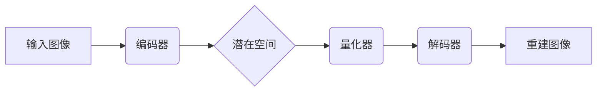
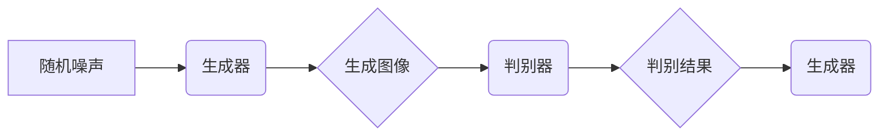

                 

## VQVAE和VQGAN：AI生成模型的革新

> 关键词：VQVAE, VQGAN, 扩散模型, 生成对抗网络, 离散表示, 潜空间, 图像生成, AI艺术

## 1. 背景介绍

近年来，人工智能领域取得了令人瞩目的进展，尤其是在生成模型方面。传统的生成模型，如生成对抗网络（GAN）和变分自编码器（VAE），在图像、文本、音频等多种模态的生成任务中取得了成功。然而，这些模型通常依赖于连续的潜在空间，这限制了其生成高质量、多样化的内容的能力。

为了克服这一限制，**VQ-VAE（Vector Quantized Variational Autoencoder）** 和 **VQ-GAN（Vector Quantized Generative Adversarial Network）** 应运而生。它们引入了一种离散的潜空间表示，通过将连续的潜在向量量化为离散的代码本，从而提高了生成模型的表达能力和生成质量。

## 2. 核心概念与联系

### 2.1 VQVAE

VQ-VAE 是一种基于变分自编码器的生成模型，它将潜在空间离散化，并通过量化来实现。其核心思想是将连续的潜在向量编码为离散的代码本，代码本由预先训练好的字典表组成。

**架构：**



**核心概念：**

* **编码器:** 将输入图像编码为连续的潜在向量。
* **量化器:** 将连续的潜在向量量化为离散的代码本。
* **解码器:** 将离散的代码本解码为重建图像。

### 2.2 VQGAN

VQ-GAN 则是在 GAN 的基础上引入 VQ 的思想。它将生成器和判别器的潜在空间也离散化，从而提高了生成图像的质量和多样性。

**架构：**



**核心概念：**

* **生成器:** 从随机噪声生成图像，并将其潜在空间离散化。
* **判别器:** 区分真实图像和生成图像，并对生成器的潜在空间进行反馈。

## 3. 核心算法原理 & 具体操作步骤

### 3.1 算法原理概述

VQ-VAE 和 VQ-GAN 的核心原理是将连续的潜在空间离散化，并通过量化来实现。量化过程将连续的潜在向量映射到离散的代码本中，代码本由预先训练好的字典表组成。

**量化过程：**

1. 计算每个潜在向量的欧氏距离与字典表中每个代码本的距离。
2. 选择距离最近的代码本作为该潜在向量的量化结果。

### 3.2 算法步骤详解

**VQ-VAE:**

1. **训练编码器:** 使用输入图像训练编码器，使其能够将图像编码为连续的潜在向量。
2. **训练量化器:** 使用编码器生成的潜在向量训练量化器，使其能够将潜在向量量化为离散的代码本。
3. **训练解码器:** 使用量化后的代码本训练解码器，使其能够将代码本解码为重建图像。

**VQ-GAN:**

1. **训练生成器:** 使用随机噪声训练生成器，使其能够生成图像。
2. **训练判别器:** 使用真实图像和生成器生成的图像训练判别器，使其能够区分真实图像和生成图像。
3. **联合训练:** 将生成器和判别器联合训练，生成器不断生成新的图像，判别器不断学习区分真实图像和生成图像，最终生成器能够生成逼真的图像。

### 3.3 算法优缺点

**优点:**

* **提高生成质量:** 离散的潜空间表示能够更好地捕捉图像的结构和特征，从而提高生成图像的质量。
* **增强多样性:** 离散的潜空间表示能够生成更多样化的图像。
* **易于训练:** VQ-VAE 和 VQ-GAN 的训练过程相对简单，易于实现。

**缺点:**

* **计算成本高:** 量化过程需要计算每个潜在向量的欧氏距离，这会增加计算成本。
* **代码本大小限制:** 代码本的大小会限制生成图像的复杂度。

### 3.4 算法应用领域

VQ-VAE 和 VQ-GAN 在图像生成、图像编辑、图像检索等领域都有广泛的应用。

* **图像生成:** 生成逼真的图像，例如人物、场景、物体等。
* **图像编辑:** 对图像进行编辑，例如修复图像、改变图像风格等。
* **图像检索:** 根据图像内容检索相关图像。

## 4. 数学模型和公式 & 详细讲解 & 举例说明

### 4.1 数学模型构建

VQ-VAE 的数学模型可以概括为以下公式：

$$
\begin{aligned}
z &= \text{Encoder}(x) \\
c &= \text{Quantizer}(z) \\
\hat{x} &= \text{Decoder}(c)
\end{aligned}
$$

其中：

* $x$ 是输入图像。
* $z$ 是编码器输出的潜在向量。
* $c$ 是量化器输出的离散代码本。
* $\hat{x}$ 是解码器输出的重建图像。

### 4.2 公式推导过程

VQ-VAE 的训练目标是最小化重建图像与输入图像之间的差异，以及量化过程中的损失。

**重建损失:**

$$
L_{recon} = ||x - \hat{x}||^2
$$

**量化损失:**

$$
L_{quant} = \sum_{i=1}^{N} ||z_i - c_i||^2
$$

其中：

* $N$ 是潜在向量的数量。
* $z_i$ 是第 $i$ 个潜在向量。
* $c_i$ 是第 $i$ 个潜在向量的量化结果。

**总损失:**

$$
L = L_{recon} + \lambda L_{quant}
$$

其中：

* $\lambda$ 是权重参数，用于平衡重建损失和量化损失。

### 4.3 案例分析与讲解

假设我们有一个输入图像，编码器将其编码为一个潜在向量 $z$。然后，量化器将 $z$ 量化为一个离散代码本 $c$。最后，解码器将 $c$ 解码为一个重建图像 $\hat{x}$。

如果重建图像 $\hat{x}$ 与输入图像 $x$ 相似，则重建损失 $L_{recon}$ 小。如果量化后的代码本 $c$ 与原始潜在向量 $z$ 相近，则量化损失 $L_{quant}$ 小。

通过最小化总损失 $L$，VQ-VAE 可以学习到一个能够将图像编码为离散代码本的编码器，以及一个能够将离散代码本解码为重建图像的解码器。

## 5. 项目实践：代码实例和详细解释说明

### 5.1 开发环境搭建

* Python 3.7+
* PyTorch 1.7+
* CUDA 10.2+ (可选)

### 5.2 源代码详细实现

```python
import torch
import torch.nn as nn

# 编码器
class Encoder(nn.Module):
    def __init__(self):
        super(Encoder, self).__init__()
        # ...

    def forward(self, x):
        # ...

# 量化器
class Quantizer(nn.Module):
    def __init__(self, codebook_size):
        super(Quantizer, self).__init__()
        self.codebook = nn.Embedding(codebook_size, embedding_dim)
        # ...

    def forward(self, z):
        # ...

# 解码器
class Decoder(nn.Module):
    def __init__(self):
        super(Decoder, self).__init__()
        # ...

    def forward(self, c):
        # ...

# VQ-VAE 模型
class VQVAE(nn.Module):
    def __init__(self, encoder, quantizer, decoder):
        super(VQVAE, self).__init__()
        self.encoder = encoder
        self.quantizer = quantizer
        self.decoder = decoder

    def forward(self, x):
        z = self.encoder(x)
        c = self.quantizer(z)
        x_hat = self.decoder(c)
        return x_hat

```

### 5.3 代码解读与分析

* 编码器：将输入图像编码为连续的潜在向量。
* 量化器：将连续的潜在向量量化为离散的代码本。
* 解码器：将离散的代码本解码为重建图像。
* VQ-VAE 模型：将编码器、量化器和解码器组合在一起，形成完整的 VQ-VAE 模型。

### 5.4 运行结果展示

运行 VQ-VAE 模型后，可以得到重建图像，并与输入图像进行比较。

## 6. 实际应用场景

VQ-VAE 和 VQ-GAN 在图像生成、图像编辑、图像检索等领域都有广泛的应用。

### 6.1 图像生成

VQ-VAE 和 VQ-GAN 可以生成逼真的图像，例如人物、场景、物体等。

### 6.2 图像编辑

VQ-VAE 和 VQ-GAN 可以对图像进行编辑，例如修复图像、改变图像风格等。

### 6.3 图像检索

VQ-VAE 和 VQ-GAN 可以根据图像内容检索相关图像。

### 6.4 未来应用展望

VQ-VAE 和 VQ-GAN 的未来应用前景广阔，例如：

* **个性化内容生成:** 根据用户的喜好生成个性化的图像、视频等内容。
* **虚拟现实和增强现实:** 生成逼真的虚拟场景和增强现实体验。
* **医疗图像分析:** 用于医学图像的分析和诊断。

## 7. 工具和资源推荐

### 7.1 学习资源推荐

* **论文:**

    * "Vector Quantized Variational Autoencoders" (https://arxiv.org/abs/1711.00947)
    * "VQ-GAN: High-Quality Image Synthesis with Vector Quantization" (https://arxiv.org/abs/1912.05841)

* **博客:**

    * https://blog.openai.com/vqvae/
    * https://towardsdatascience.com/vqgan-explained-a-comprehensive-guide-to-vector-quantized-generative-adversarial-networks-48890701619a

### 7.2 开发工具推荐

* **PyTorch:** https://pytorch.org/
* **TensorFlow:** https://www.tensorflow.org/

### 7.3 相关论文推荐

* **Diffusion Models Beat GANs on Image Synthesis** (https://arxiv.org/abs/2006.11239)
* **DALL-E 2: Hierarchical Text-Conditional Image Generation with CLIP Latents** (https://arxiv.org/abs/2112.10752)

## 8. 总结：未来发展趋势与挑战

### 8.1 研究成果总结

VQ-VAE 和 VQ-GAN 作为一种新的生成模型，取得了显著的成果，在图像生成、图像编辑等领域展现出强大的潜力。

### 8.2 未来发展趋势

* **更高效的量化方法:** 研究更有效的量化方法，降低计算成本，提高生成效率。
* **更大的代码本:** 使用更大的代码本，提高生成图像的复杂度和多样性。
* **多模态生成:** 将 VQ-VAE 和 VQ-GAN 应用于多模态生成，例如文本到图像、图像到文本等。

### 8.3 面临的挑战

* **训练复杂度:** VQ-VAE 和 VQ-GAN 的训练过程相对复杂，需要大量的计算资源和时间。
* **代码本设计:** 代码本的设计对生成图像的质量有很大影响，需要进行精心设计和优化。
* **伦理问题:** 随着生成模型的不断发展，其伦理问题也日益突出，需要引起重视和探讨。

### 8.4 研究展望

未来，VQ-VAE 和 VQ-GAN 将继续发展，并应用于更多领域，为人工智能的发展做出更大的贡献。


## 9. 附录：常见问题与解答

**Q1: VQ-VAE 和 VQ-GAN 的区别是什么？**

**A1:** VQ-VAE 是基于变分自编码器的生成模型，而 VQ-GAN 是基于生成对抗网络的生成模型。两者都引入了一种离散的潜空间表示，但 VQ-GAN 采用了对抗训练机制，从而能够生成更高质量的图像。

**Q2: VQ-VAE 和 VQ-GAN 的训练过程如何？**

**A2:** VQ-VAE 的训练目标是最小化重建图像与输入图像之间的差异，以及量化过程中的损失。VQ-GAN 的训练目标是让生成器生成的图像能够欺骗判别器，从而生成逼真的图像。

**Q3: VQ-VAE 和 VQ-GAN 的应用场景有哪些？**

**A3:** VQ-VAE 和 VQ-GAN 在图像生成、图像编辑、图像检索等领域都有广泛的应用。

**Q4: 如何选择合适的代码本大小？**

**A4:** 代码本的大小会影响生成图像的复杂度和多样性。通常情况下，更大的代码本可以生成更复杂的图像，但也会增加计算成本。

**Q5: VQ-VAE 和 VQ-GAN 的伦理问题有哪些？**

**A5:** 随着生成模型的不断发展，其伦理问题也日益突出，例如：

* **深度伪造:** 生成模型可以生成逼真的虚假图像，可能被用于传播虚假信息。
* **版权问题:** 生成模型生成的图像是否侵犯了原作者的版权？
* **就业问题:** 生成模型可能会取代一些人工工作，导致就业问题。


作者：禅与计算机程序设计艺术 / Zen and the Art of Computer Programming<end_of_turn>

