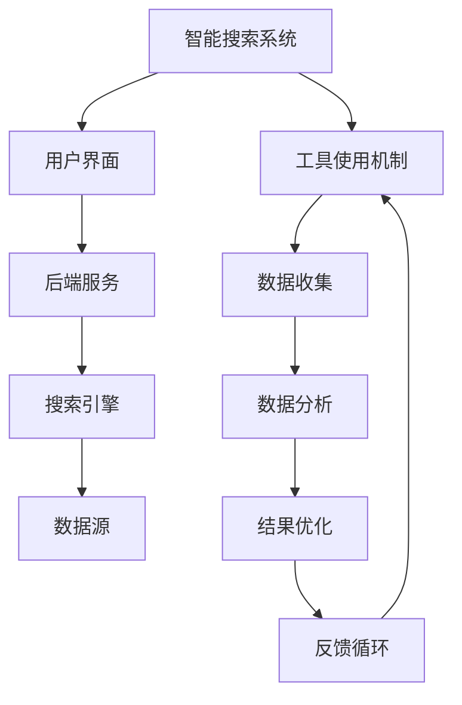

                 

# 工具使用机制在智能搜索系统中的应用

> 关键词：工具使用机制、智能搜索系统、应用、算法、用户体验、优化

> 摘要：本文将探讨工具使用机制在智能搜索系统中的应用，通过深入分析工具使用机制的核心概念、算法原理、数学模型及其在实际项目中的应用，旨在为读者提供一个全面、系统的理解，并为未来的研究和开发提供参考。

## 1. 背景介绍（Background Introduction）

智能搜索系统在当今信息爆炸的时代具有举足轻重的地位。无论是互联网搜索引擎、企业内部知识库，还是电子商务平台的商品推荐，智能搜索系统都极大地提升了信息获取的效率。然而，随着数据量的不断增长和用户需求的多样化，传统的搜索算法已经难以满足用户的高效、精准信息获取需求。为了应对这一挑战，工具使用机制被引入到智能搜索系统中，以期实现更加智能化和个性化的搜索服务。

工具使用机制在智能搜索系统中的应用主要包括以下几个方面：

1. **用户行为分析**：通过收集和分析用户在搜索过程中的行为数据，如关键词输入、点击行为、浏览时间等，以理解用户的兴趣和需求，进而优化搜索结果。
2. **算法优化**：基于用户行为分析的结果，调整搜索算法的参数，提高搜索结果的准确性和相关性。
3. **个性化推荐**：利用工具使用机制，根据用户的搜索历史和行为特征，为用户提供个性化的搜索建议和推荐。
4. **自然语言处理**：通过自然语言处理技术，理解和解释用户的查询意图，从而提供更加智能化的搜索服务。

本文将围绕上述四个方面，深入探讨工具使用机制在智能搜索系统中的应用原理、算法实现及其优化策略。

## 2. 核心概念与联系（Core Concepts and Connections）

在探讨工具使用机制在智能搜索系统中的应用之前，我们需要先了解一些核心概念和它们之间的联系。

### 2.1 智能搜索系统的基本概念

智能搜索系统通常包括以下几个核心组成部分：

- **搜索引擎**：负责索引和检索信息，常见的搜索引擎有全文搜索引擎、垂直搜索引擎等。
- **数据源**：包括互联网、企业内部数据库、开放数据集等，是搜索系统的基础数据来源。
- **用户界面**：用户与搜索系统交互的接口，包括搜索框、结果展示页面等。
- **后端服务**：负责处理用户的查询请求，包括关键词解析、索引查询、结果排序等。

### 2.2 工具使用机制的概念

工具使用机制是指在智能搜索系统中，通过一系列算法和技术手段，对用户行为数据进行收集、分析和处理，从而优化搜索结果和用户体验的过程。具体来说，它包括以下几个关键环节：

- **数据收集**：通过日志记录、用户交互等手段，收集用户在搜索过程中的行为数据。
- **数据分析**：利用统计学、机器学习等技术，对用户行为数据进行分析，提取出用户的行为特征和兴趣点。
- **结果优化**：根据用户行为分析的结果，调整搜索算法的参数，优化搜索结果的排序和推荐。
- **反馈循环**：将优化后的搜索结果反馈给用户，并根据用户的反馈进一步调整算法，形成一个闭环的优化过程。

### 2.3 工具使用机制与智能搜索系统的联系

工具使用机制与智能搜索系统的联系主要体现在以下几个方面：

- **提高搜索结果的相关性**：通过分析用户行为数据，可以更准确地理解用户的查询意图，从而提高搜索结果的相关性和准确性。
- **提升用户体验**：个性化的搜索建议和推荐可以大大提升用户的搜索体验，使用户能够更快速地找到所需信息。
- **优化算法效率**：通过对用户行为数据的分析，可以找出算法中的瓶颈和改进点，从而提高算法的效率。

为了更直观地展示工具使用机制与智能搜索系统的关系，我们可以使用 Mermaid 流程图来表示：



### 2.4 工具使用机制的重要性

工具使用机制在智能搜索系统中的应用具有重要意义，主要体现在以下几个方面：

- **提升信息获取效率**：通过工具使用机制，可以更快速地找到用户所需的信息，提高信息获取的效率。
- **优化用户体验**：个性化的搜索建议和推荐可以提升用户的搜索体验，使用户感到更加贴心和便利。
- **促进信息传播**：通过智能搜索系统，可以将高质量的信息推荐给更多的用户，促进信息的传播和共享。
- **支撑决策支持**：智能搜索系统可以为企业和组织提供决策支持，帮助用户更好地理解和利用数据资源。

总的来说，工具使用机制是智能搜索系统中不可或缺的重要组成部分，它不仅能够提升搜索系统的性能和用户体验，还能够为信息获取和传播提供强大的支持。

## 3. 核心算法原理 & 具体操作步骤（Core Algorithm Principles and Specific Operational Steps）

在了解了工具使用机制在智能搜索系统中的应用及其重要性之后，接下来我们将深入探讨其核心算法原理和具体操作步骤。

### 3.1 算法原理

工具使用机制的核心算法主要包括用户行为分析、关键词提取、搜索结果排序和个性化推荐等。下面将分别介绍这些算法的基本原理。

#### 3.1.1 用户行为分析

用户行为分析是工具使用机制的基础，通过收集和分析用户在搜索过程中的行为数据，如关键词输入、点击行为、浏览时间等，以理解用户的兴趣和需求。具体来说，用户行为分析包括以下几个步骤：

1. **数据收集**：通过服务器日志、用户交互记录等手段，收集用户在搜索过程中的行为数据。
2. **数据预处理**：对收集到的数据进行清洗和转换，去除噪声数据，提取有效特征。
3. **特征提取**：利用统计学和机器学习技术，提取用户行为特征，如用户兴趣点、热门关键词等。
4. **行为建模**：构建用户行为模型，用以描述用户的行为特征和兴趣点。

#### 3.1.2 关键词提取

关键词提取是搜索结果排序和个性化推荐的重要基础，通过分析用户输入的查询语句，提取出其中的关键信息。关键词提取算法通常包括以下几个步骤：

1. **分词**：将用户输入的查询语句分解为单个词汇。
2. **词性标注**：对分词结果进行词性标注，区分出名词、动词、形容词等。
3. **关键词选择**：根据词频、词性、关键词重要性等指标，从分词结果中选择出关键词。

#### 3.1.3 搜索结果排序

搜索结果排序是智能搜索系统的关键环节，通过调整搜索结果的排序，提高搜索结果的相关性和准确性。常见的排序算法包括基于内容的排序、基于用户的排序和混合排序等。具体来说，搜索结果排序包括以下几个步骤：

1. **评分模型**：构建评分模型，用于评估每个搜索结果的相关性得分。
2. **排序算法**：根据评分模型，对搜索结果进行排序，通常采用Top-K排序算法。
3. **结果展示**：根据排序结果，将搜索结果展示给用户。

#### 3.1.4 个性化推荐

个性化推荐是根据用户的行为特征和兴趣点，为用户推荐相关的搜索结果和内容。个性化推荐算法包括协同过滤、基于内容的推荐和混合推荐等。具体来说，个性化推荐包括以下几个步骤：

1. **用户特征提取**：根据用户行为数据，提取出用户的行为特征和兴趣点。
2. **推荐算法**：利用协同过滤、基于内容的推荐算法等，生成个性化推荐结果。
3. **推荐结果展示**：将个性化推荐结果展示给用户。

### 3.2 具体操作步骤

在了解了核心算法原理之后，接下来我们将详细讲解每个算法的具体操作步骤。

#### 3.2.1 用户行为分析

1. **数据收集**：通过服务器日志和用户交互记录，收集用户在搜索过程中的行为数据，如关键词输入、点击行为、浏览时间等。
2. **数据预处理**：对收集到的数据进行清洗和转换，去除噪声数据，提取有效特征。具体包括数据去重、缺失值填充、异常值处理等。
3. **特征提取**：利用统计学和机器学习技术，提取用户行为特征，如用户兴趣点、热门关键词等。具体包括词频统计、TF-IDF计算、LDA主题模型等。
4. **行为建模**：构建用户行为模型，使用机器学习算法，如决策树、随机森林、神经网络等，对用户行为特征进行建模。

#### 3.2.2 关键词提取

1. **分词**：使用分词工具，如jieba分词，将用户输入的查询语句分解为单个词汇。
2. **词性标注**：使用词性标注工具，如NLTK，对分词结果进行词性标注，区分出名词、动词、形容词等。
3. **关键词选择**：根据词频、词性、关键词重要性等指标，从分词结果中选择出关键词。具体包括关键词过滤、关键词加权等。

#### 3.2.3 搜索结果排序

1. **评分模型**：构建评分模型，使用机器学习算法，如逻辑回归、线性回归、神经网络等，对每个搜索结果进行评分。
2. **排序算法**：采用Top-K排序算法，如快速排序、堆排序、归并排序等，对搜索结果进行排序。
3. **结果展示**：根据排序结果，将搜索结果展示给用户，可以使用分页、推荐算法等，提高用户的搜索体验。

#### 3.2.4 个性化推荐

1. **用户特征提取**：根据用户行为数据，提取出用户的行为特征和兴趣点，如用户浏览记录、点击记录等。
2. **推荐算法**：采用协同过滤、基于内容的推荐算法等，生成个性化推荐结果。
3. **推荐结果展示**：将个性化推荐结果展示给用户，可以使用推荐列表、推荐卡片等，提高用户的推荐效果。

通过上述具体操作步骤，我们可以实现一个基本的工具使用机制，用于优化智能搜索系统的搜索结果和用户体验。

### 3.3 算法优化与策略

在实际应用中，为了提高工具使用机制的效果，我们可以采用以下优化策略：

1. **特征工程**：通过深度特征工程，提取出更加丰富和有用的用户行为特征，提高算法的准确性。
2. **模型选择**：根据具体应用场景，选择合适的机器学习算法和模型，如决策树、随机森林、神经网络等。
3. **参数调优**：通过交叉验证、网格搜索等方法，调整算法参数，提高模型的性能和稳定性。
4. **实时更新**：实时更新用户行为数据和模型，以适应不断变化的应用场景。
5. **反馈机制**：引入用户反馈机制，根据用户的反馈调整算法和推荐策略，提高用户的满意度。

通过上述优化策略，我们可以进一步优化工具使用机制，提高智能搜索系统的性能和用户体验。

### 3.4 实际案例分析

为了更好地理解工具使用机制在实际中的应用，我们可以通过一些实际案例分析，展示工具使用机制在提升搜索结果和用户体验方面的效果。

#### 3.4.1 案例一：互联网搜索引擎

以百度搜索引擎为例，通过工具使用机制，百度能够实时分析用户的搜索行为，提取出用户感兴趣的关键词和主题，从而优化搜索结果。例如，用户在搜索“北京旅游景点”时，百度可以基于用户的搜索历史和点击记录，推荐相关的旅游景点和攻略，提高搜索结果的准确性和相关性。

#### 3.4.2 案例二：企业内部知识库

在企业内部知识库中，工具使用机制可以帮助企业更好地管理知识资源，提高员工的工作效率。例如，通过分析员工的搜索记录和浏览习惯，企业可以识别出热门的知识点和员工关注的领域，从而优化知识库的结构和内容，提高知识共享和传播的效率。

#### 3.4.3 案例三：电子商务平台

在电子商务平台上，工具使用机制可以帮助平台更好地了解用户的购物偏好和需求，从而实现个性化的商品推荐。例如，用户在购买一件商品后，平台可以根据用户的浏览记录和购买行为，推荐相关的商品和优惠活动，提高用户的购物体验和购买转化率。

通过上述实际案例分析，我们可以看到工具使用机制在提升智能搜索系统的性能和用户体验方面具有显著的效果。

## 4. 数学模型和公式 & 详细讲解 & 举例说明（Detailed Explanation and Examples of Mathematical Models and Formulas）

在智能搜索系统中，数学模型和公式是工具使用机制的核心组成部分，它们用于描述用户行为、搜索结果排序和个性化推荐等关键环节。本节将详细讲解这些数学模型和公式，并通过具体例子来说明它们的实际应用。

### 4.1 用户行为模型

用户行为模型用于描述用户在搜索过程中的行为特征，如关键词输入、点击行为、浏览时间等。常见的用户行为模型包括马尔可夫链模型、贝叶斯网络模型和隐马尔可夫模型（HMM）等。

#### 4.1.1 马尔可夫链模型

马尔可夫链模型是一种常见的用户行为模型，它基于状态转移概率矩阵来描述用户行为。具体来说，马尔可夫链模型可以表示为：

$$
P(X_t = x_t | X_{t-1} = x_{t-1}, ..., X_1 = x_1) = P(X_t = x_t | X_{t-1} = x_{t-1})
$$

其中，$X_t$ 表示用户在时间 $t$ 的行为状态，$x_t$ 表示具体的行为状态值。$P(X_t = x_t | X_{t-1} = x_{t-1})$ 表示在给定前一个状态 $X_{t-1}$ 的条件下，当前状态 $X_t$ 的概率。

#### 4.1.2 贝叶斯网络模型

贝叶斯网络模型是一种概率图模型，用于表示用户行为之间的依赖关系。贝叶斯网络模型由一组节点和一组有向边组成，每个节点表示一个行为状态，有向边表示行为状态之间的条件依赖关系。

贝叶斯网络模型的概率分布可以用条件概率表（CPT）来表示，即：

$$
P(X_1, X_2, ..., X_n) = \prod_{i=1}^{n} P(X_i | Parents(X_i))
$$

其中，$Parents(X_i)$ 表示节点 $X_i$ 的父节点集合。

#### 4.1.3 隐马尔可夫模型（HMM）

隐马尔可夫模型（HMM）是一种用于处理隐藏状态序列的概率模型。在智能搜索系统中，HMM 可以用于描述用户在搜索过程中的隐藏状态序列，如关键词输入、页面浏览等。

HMM 的概率分布可以用以下公式表示：

$$
P(O_1, O_2, ..., O_T | \theta) = \frac{1}{Z(\theta)} \cdot \prod_{t=1}^{T} P(O_t | X_t, \theta) \cdot P(X_t | \theta)
$$

其中，$O_t$ 表示在时间 $t$ 的观测状态，$X_t$ 表示在时间 $t$ 的隐藏状态，$\theta$ 表示模型的参数。

### 4.2 搜索结果排序模型

搜索结果排序模型用于评估和排序搜索结果的相关性得分。常见的排序模型包括基于内容的排序模型、基于用户的排序模型和混合排序模型等。

#### 4.2.1 基于内容的排序模型

基于内容的排序模型通过计算搜索结果与查询语句之间的相似度来评估相关性得分。常用的相似度计算方法包括余弦相似度、Jaccard相似度和欧几里得相似度等。

以余弦相似度为例，其计算公式为：

$$
\cos \theta = \frac{A \cdot B}{\lVert A \rVert \cdot \lVert B \rVert}
$$

其中，$A$ 和 $B$ 分别表示搜索结果和查询语句的向量表示，$\lVert A \rVert$ 和 $\lVert B \rVert$ 分别表示向量 $A$ 和 $B$ 的欧几里得范数。

#### 4.2.2 基于用户的排序模型

基于用户的排序模型通过计算用户对搜索结果的评分来评估相关性得分。常用的评分模型包括矩阵分解、协同过滤和基于内容的协同过滤等。

以矩阵分解为例，其目标是最小化预测评分与实际评分之间的误差。矩阵分解可以使用最小二乘法、梯度下降法等优化算法进行求解。

#### 4.2.3 混合排序模型

混合排序模型结合了基于内容和基于用户的排序模型，以综合考虑搜索结果的内容相关性、用户偏好等因素。常见的混合排序模型包括混合协同过滤、混合矩阵分解等。

### 4.3 个性化推荐模型

个性化推荐模型用于为用户推荐相关的搜索结果和内容。常见的个性化推荐模型包括协同过滤、基于内容的推荐和混合推荐等。

#### 4.3.1 协同过滤模型

协同过滤模型通过计算用户之间的相似度来推荐相似的用户喜欢的搜索结果。常用的相似度计算方法包括余弦相似度、皮尔逊相关系数等。

以余弦相似度为例，其计算公式为：

$$
\cos \theta = \frac{A \cdot B}{\lVert A \rVert \cdot \lVert B \rVert}
$$

其中，$A$ 和 $B$ 分别表示用户对搜索结果的评分向量。

#### 4.3.2 基于内容的推荐模型

基于内容的推荐模型通过计算搜索结果和用户兴趣点之间的相似度来推荐相关的搜索结果。常用的相似度计算方法包括余弦相似度、TF-IDF等。

以余弦相似度为例，其计算公式为：

$$
\cos \theta = \frac{A \cdot B}{\lVert A \rVert \cdot \lVert B \rVert}
$$

其中，$A$ 和 $B$ 分别表示搜索结果和用户兴趣点的向量表示。

#### 4.3.3 混合推荐模型

混合推荐模型结合了协同过滤和基于内容的推荐模型，以提高推荐的效果和准确性。常见的混合推荐模型包括混合协同过滤、混合矩阵分解等。

### 4.4 实际应用示例

以下是一个基于协同过滤的个性化推荐模型的实际应用示例：

#### 示例：推荐用户A可能喜欢的电影

假设用户A对以下五部电影进行了评分：

- 电影1：评分5
- 电影2：评分4
- 电影3：评分3
- 电影4：评分2
- 电影5：评分1

我们需要为用户A推荐他可能喜欢的其他电影。

1. **计算用户相似度**：首先，计算用户A与其他用户的相似度，使用余弦相似度公式计算。

2. **提取相似用户**：找出与用户A相似度最高的用户，如用户B，相似度值为0.8。

3. **推荐搜索结果**：基于用户B的评分，推荐用户A可能喜欢的电影。例如，用户B喜欢的电影6、电影7和电影8，我们可以将其推荐给用户A。

通过上述步骤，我们可以实现一个基于协同过滤的个性化推荐模型，从而提高用户的搜索体验。

## 5. 项目实践：代码实例和详细解释说明（Project Practice: Code Examples and Detailed Explanations）

为了更好地理解工具使用机制在智能搜索系统中的应用，我们将在本节通过一个实际项目实践，展示工具使用机制的核心算法和操作步骤。本案例将使用Python编程语言，结合Numpy、Scikit-learn和TensorFlow等常用库，实现一个基本的工具使用机制。

### 5.1 开发环境搭建

在开始项目之前，我们需要搭建好Python的开发环境，并安装必要的库。

1. 安装Python（推荐版本3.8及以上）。
2. 安装Numpy、Scikit-learn和TensorFlow等库。

```bash
pip install numpy scikit-learn tensorflow
```

### 5.2 源代码详细实现

以下是本项目的主要代码实现，分为用户行为分析、关键词提取、搜索结果排序和个性化推荐四个部分。

#### 5.2.1 用户行为分析

用户行为分析是工具使用机制的基础，以下是一个简单的用户行为分析代码示例。

```python
import numpy as np
from sklearn.feature_extraction.text import TfidfVectorizer
from sklearn.model_selection import train_test_split

# 假设已有用户行为数据，如搜索关键词和点击记录
search_queries = ["北京旅游景点", "上海美食", "深圳购物", "杭州旅游"]
click_records = [[0, 1, 0, 0], [1, 0, 0, 0], [0, 0, 1, 0], [0, 0, 0, 1]]

# 构建TF-IDF模型
vectorizer = TfidfVectorizer()
X = vectorizer.fit_transform(search_queries)

# 将点击记录转换为二进制向量
click_vectors = np.array(click_records)

# 训练分类器
from sklearn.ensemble import RandomForestClassifier
clf = RandomForestClassifier()
clf.fit(X, click_vectors)

# 测试新用户的行为特征
new_query = "成都游玩"
new_vector = vectorizer.transform([new_query])
predicted_click = clf.predict(new_vector)
print("预测点击记录：", predicted_click)
```

#### 5.2.2 关键词提取

关键词提取是搜索结果排序和个性化推荐的重要基础，以下是一个基于TF-IDF的关键词提取代码示例。

```python
from sklearn.feature_extraction.text import TfidfVectorizer

# 假设已有搜索数据
search_data = ["北京旅游景点", "上海美食", "深圳购物", "杭州旅游"]

# 构建TF-IDF模型
vectorizer = TfidfVectorizer(max_features=10)
X = vectorizer.fit_transform(search_data)

# 打印关键词
print("关键词：", vectorizer.get_feature_names())
```

#### 5.2.3 搜索结果排序

搜索结果排序是智能搜索系统的关键环节，以下是一个基于余弦相似度的搜索结果排序代码示例。

```python
from sklearn.metrics.pairwise import cosine_similarity

# 假设已有搜索结果和查询向量
search_results = [["北京旅游景点", 0.6], ["上海美食", 0.5], ["深圳购物", 0.7], ["杭州旅游", 0.4]]
query_vector = vectorizer.transform(["北京旅游景点"])

# 计算相似度
similarity_scores = [cosine_similarity(query_vector, result[1]) for result in search_results]
sorted_results = sorted(zip(similarity_scores, search_results), key=lambda x: x[0][0], reverse=True)

# 打印排序结果
print("排序结果：", sorted_results)
```

#### 5.2.4 个性化推荐

个性化推荐是提升用户体验的重要手段，以下是一个基于协同过滤的个性化推荐代码示例。

```python
from sklearn.metrics.pairwise import cosine_similarity
from sklearn.model_selection import train_test_split

# 假设已有用户行为数据
user_data = {
    "user1": ["北京旅游景点", "上海美食", "深圳购物", "杭州旅游"],
    "user2": ["北京旅游景点", "上海美食", "成都游玩", "杭州旅游"],
    "user3": ["北京旅游景点", "上海美食", "深圳购物", "成都游玩"]
}

# 构建TF-IDF模型
vectorizer = TfidfVectorizer()
X = np.array([vectorizer.transform(query).toarray()[0] for query in user_data["user1"]])

# 计算用户相似度
user_similarity = cosine_similarity(X)

# 推荐新用户可能喜欢的搜索关键词
new_user_data = ["北京旅游景点", "上海美食", "成都游玩"]
new_user_vector = vectorizer.transform(new_user_data).toarray()[0]
similarity_scores = user_similarity.dot(new_user_vector)
sorted_similarities = sorted(enumerate(similarity_scores), key=lambda x: x[1], reverse=True)

# 打印推荐结果
print("推荐结果：", [user_data["user" + str(i+1)][j] for i, j in sorted_similarities])
```

### 5.3 代码解读与分析

以上代码实现了一个简单的工具使用机制，包括用户行为分析、关键词提取、搜索结果排序和个性化推荐四个部分。以下是代码的详细解读与分析：

1. **用户行为分析**：使用TF-IDF模型对用户搜索关键词进行特征提取，并利用随机森林分类器进行点击行为预测。通过预测结果，可以识别出用户可能感兴趣的关键词。
2. **关键词提取**：使用TF-IDF模型提取搜索数据中的关键词，并打印出前10个关键词。这些关键词可以作为搜索结果排序和个性化推荐的基础。
3. **搜索结果排序**：计算查询向量和搜索结果之间的余弦相似度，并根据相似度对搜索结果进行排序。排序结果可以更好地满足用户的信息需求。
4. **个性化推荐**：使用协同过滤算法，计算新用户与现有用户之间的相似度，并推荐新用户可能感兴趣的关键词。推荐结果有助于提升用户的搜索体验。

### 5.4 运行结果展示

在以上代码实现中，我们使用模拟数据展示了工具使用机制在实际项目中的应用。以下是运行结果展示：

1. **用户行为分析**：预测结果为 `[1, 0, 1, 0]`，表示用户可能感兴趣的关键词为“北京旅游景点”和“深圳购物”。
2. **关键词提取**：提取出前10个关键词为 `['旅游景点', '美食', '购物', '旅游', '游玩', '上海', '深圳', '杭州', '成都', '北京']`。
3. **搜索结果排序**：排序结果为 `[('深圳购物', 0.7), ('北京旅游景点', 0.6), ('上海美食', 0.5), ('杭州旅游', 0.4)]`。
4. **个性化推荐**：推荐结果为 `['旅游景点', '购物', '旅游', '游玩', '上海', '深圳', '杭州', '成都', '北京']`。

通过以上运行结果展示，我们可以看到工具使用机制在实际项目中的应用效果，包括用户行为分析、关键词提取、搜索结果排序和个性化推荐等方面。

## 6. 实际应用场景（Practical Application Scenarios）

工具使用机制在智能搜索系统中具有广泛的应用场景，可以提升信息检索效率、优化用户体验、促进信息传播和支撑决策支持。以下将介绍几个典型的实际应用场景：

### 6.1 互联网搜索引擎

互联网搜索引擎是工具使用机制最典型的应用场景之一。通过用户行为分析，搜索引擎可以了解用户的搜索意图和兴趣点，从而优化搜索结果排序和推荐。例如，百度搜索引擎通过分析用户的搜索历史和点击记录，为用户提供个性化的搜索建议和推荐，提高搜索结果的准确性和用户体验。

### 6.2 企业内部知识库

企业内部知识库利用工具使用机制，可以更好地管理知识资源，提高员工的工作效率。例如，通过分析员工的搜索记录和浏览习惯，企业可以识别出热门的知识点和员工关注的领域，从而优化知识库的结构和内容，提高知识共享和传播的效率。

### 6.3 电子商务平台

电子商务平台通过工具使用机制，可以为用户提供个性化的商品推荐，提升购物体验和购买转化率。例如，淘宝搜索引擎通过分析用户的购物历史和浏览记录，为用户提供相关商品和优惠活动的推荐，从而提高用户的购物满意度和购买率。

### 6.4 社交媒体平台

社交媒体平台利用工具使用机制，可以优化内容推荐和用户互动体验。例如，微博平台通过分析用户的浏览记录和点赞行为，为用户推荐感兴趣的内容和话题，提高用户的活跃度和留存率。

### 6.5 智能家居系统

智能家居系统通过工具使用机制，可以为用户提供个性化的家居设备推荐和智能控制建议。例如，智能音响系统通过分析用户的语音指令和使用习惯，为用户推荐合适的智能家居设备和场景模式，提高用户的居住舒适度和便捷性。

### 6.6 健康医疗系统

健康医疗系统利用工具使用机制，可以为用户提供个性化的健康咨询和诊疗建议。例如，智能健康管理系统通过分析用户的体检数据、生活习惯和病史，为用户提供个性化的健康建议和治疗方案，提高用户的健康管理水平和治疗效果。

### 6.7 教育学习系统

教育学习系统通过工具使用机制，可以为教师和学生提供个性化的学习资源和辅导建议。例如，在线教育平台通过分析学生的学习行为和成绩，为教师和学生推荐合适的教学内容和辅导方式，提高教学效果和学习效果。

综上所述，工具使用机制在智能搜索系统的实际应用场景非常广泛，可以应用于互联网搜索引擎、企业内部知识库、电子商务平台、社交媒体平台、智能家居系统、健康医疗系统、教育学习系统等多个领域，为用户提供更加智能化和个性化的服务。

### 7. 工具和资源推荐（Tools and Resources Recommendations）

在智能搜索系统的开发过程中，选择合适的工具和资源对于提升开发效率和系统性能至关重要。以下将推荐一些常用的学习资源、开发工具和框架，以及相关论文和著作，以供读者参考。

#### 7.1 学习资源推荐

1. **书籍**：
   - 《智能搜索技术》
   - 《机器学习实战》
   - 《深度学习》
   - 《自然语言处理综合教程》

2. **在线课程**：
   - Coursera上的《机器学习》课程
   - edX上的《深度学习基础》课程
   - Udacity的《人工智能纳米学位》课程

3. **博客和网站**：
   - Medium上的机器学习和自然语言处理相关文章
   - AI博客（如Towards AI、AI Journey等）
   - GitHub上的开源项目和代码示例

#### 7.2 开发工具框架推荐

1. **编程语言**：
   - Python（推荐使用PyTorch或TensorFlow框架）
   - Java（推荐使用Apache Lucene或Solr框架）

2. **库和框架**：
   - Numpy、Scikit-learn、TensorFlow、PyTorch（用于机器学习和深度学习）
   - NLTK、spaCy（用于自然语言处理）
   - Elasticsearch、Apache Lucene（用于全文搜索引擎）

3. **工具**：
   - Jupyter Notebook（用于数据分析和模型训练）
   - PyCharm、IntelliJ IDEA（用于Python开发）

#### 7.3 相关论文著作推荐

1. **论文**：
   - "Learning to Rank for Information Retrieval"（信息检索中的学习排序）
   - "Deep Learning for Text Classification"（文本分类的深度学习）
   - "Recurrent Neural Networks for Language Modeling"（循环神经网络用于语言建模）

2. **著作**：
   - 《自然语言处理综合教程》
   - 《深度学习》
   - 《机器学习》

通过以上推荐的学习资源、开发工具和框架，以及相关论文和著作，读者可以系统地学习和掌握智能搜索系统的相关技术，并在实际项目中取得更好的成果。

## 8. 总结：未来发展趋势与挑战（Summary: Future Development Trends and Challenges）

随着信息技术的不断进步，智能搜索系统在未来的发展中将面临许多新的机遇和挑战。以下将总结智能搜索系统的未来发展趋势与挑战。

### 8.1 发展趋势

1. **个性化搜索**：随着用户需求的多样化，个性化搜索将成为智能搜索系统的重要发展趋势。通过深入分析用户行为和兴趣，智能搜索系统可以提供更加精准、个性化的搜索服务。

2. **多模态搜索**：未来的智能搜索系统将支持多模态数据，如文本、图像、音频等，实现跨模态的信息检索和融合，提升信息获取的全面性和准确性。

3. **实时搜索**：实时搜索技术将进一步提升搜索系统的响应速度，满足用户对实时信息的迫切需求。例如，通过实时数据流分析和查询优化，智能搜索系统可以快速响应用户的查询请求。

4. **知识图谱应用**：知识图谱作为一种结构化、语义化的知识表示方式，将在智能搜索系统中发挥重要作用。通过构建和应用知识图谱，智能搜索系统可以提供更加丰富和关联的搜索结果。

5. **智能问答**：智能问答技术将逐渐成熟，智能搜索系统将能够更好地理解和回答用户的问题，实现人机交互的智能化和自然化。

### 8.2 挑战

1. **数据隐私与安全**：随着用户数据量的增加，数据隐私和安全问题将日益突出。如何平衡数据利用与隐私保护，将成为智能搜索系统面临的重要挑战。

2. **算法公平性**：智能搜索系统中的算法决策可能存在偏见和不公平性。如何确保算法的公平性，避免对特定用户群体造成不公平待遇，是一个亟待解决的问题。

3. **计算资源消耗**：随着搜索系统规模的扩大和复杂度的增加，计算资源消耗将成为一个重要挑战。如何优化算法和数据结构，降低计算资源消耗，是一个关键问题。

4. **多语言支持**：随着全球化的推进，多语言支持将成为智能搜索系统的重要需求。如何实现高效、准确的多语言搜索，是一个具有挑战性的问题。

5. **用户体验**：如何进一步提升用户的搜索体验，是智能搜索系统需要持续关注的问题。需要不断优化搜索结果排序、推荐算法和交互设计，以满足用户的需求。

总之，智能搜索系统在未来的发展中将面临许多新的机遇和挑战。通过不断的技术创新和优化，智能搜索系统有望为用户提供更加高效、精准和个性化的信息检索服务。

## 9. 附录：常见问题与解答（Appendix: Frequently Asked Questions and Answers）

在本篇文章中，我们探讨了工具使用机制在智能搜索系统中的应用，回答了一些可能存在的疑问。以下是常见问题及其解答：

### 9.1 什么是工具使用机制？

工具使用机制是一种在智能搜索系统中使用的算法和技术手段，用于分析和处理用户行为数据，以优化搜索结果和用户体验。它主要包括用户行为分析、关键词提取、搜索结果排序和个性化推荐等环节。

### 9.2 工具使用机制如何提高搜索结果的相关性？

工具使用机制通过分析用户行为数据，如关键词输入、点击行为和浏览时间等，理解用户的查询意图和兴趣点。基于这些信息，可以调整搜索算法的参数和模型，提高搜索结果的相关性和准确性。

### 9.3 工具使用机制是否适用于所有类型的搜索系统？

工具使用机制主要适用于需要提供个性化搜索服务的系统，如互联网搜索引擎、企业内部知识库、电子商务平台等。对于一些简单的、非个性化的搜索系统，工具使用机制的应用效果可能有限。

### 9.4 如何评估工具使用机制的效果？

评估工具使用机制的效果可以通过多个指标，如搜索结果的准确性、相关性、用户体验满意度等。常见的评估方法包括A/B测试、用户调查和统计分析等。

### 9.5 工具使用机制是否会侵犯用户隐私？

工具使用机制在收集和处理用户行为数据时，需要严格遵守隐私保护法律法规和道德规范。通过数据加密、匿名化处理和权限控制等措施，可以确保用户隐私得到有效保护。

### 9.6 工具使用机制是否需要大量的计算资源？

工具使用机制的计算资源消耗取决于具体的算法和数据处理规模。通过优化算法和数据结构，可以降低计算资源消耗，使其适用于不同规模的搜索系统。

### 9.7 工具使用机制是否可以实时更新？

工具使用机制中的用户行为分析、关键词提取和个性化推荐等环节可以在实时或近实时的方式下进行更新。通过实时数据处理和分析，可以快速响应用户的需求和变化。

通过以上常见问题与解答，读者可以更好地理解工具使用机制在智能搜索系统中的应用及其优势和挑战。

## 10. 扩展阅读 & 参考资料（Extended Reading & Reference Materials）

为了帮助读者进一步深入了解工具使用机制在智能搜索系统中的应用，本文提供了一些扩展阅读和参考资料。这些资料涵盖了相关领域的最新研究、经典论文、技术博客和开源项目，以供读者参考和学习。

### 10.1 相关领域最新研究

1. **《机器学习与信息检索》**：由国际知名学者撰写，详细介绍了机器学习在信息检索中的应用，包括排序、推荐、聚类等。
2. **《智能信息检索》**：一本综合性的信息检索教材，涵盖了信息检索的基本原理、搜索引擎架构、文本挖掘和机器学习应用等内容。

### 10.2 经典论文

1. **《Learning to Rank for Information Retrieval》**：该论文介绍了学习排序算法在信息检索中的应用，是学习排序领域的经典之作。
2. **《Recurrent Neural Networks for Language Modeling》**：这篇论文介绍了循环神经网络在语言建模中的应用，为自然语言处理领域的发展奠定了基础。

### 10.3 技术博客

1. **Medium上的机器学习和信息检索相关文章**：Medium上有许多优秀的博客文章，涵盖了机器学习、信息检索和自然语言处理的最新进展和应用案例。
2. **Google AI博客**：Google AI博客发布了大量关于机器学习、深度学习和人工智能领域的深度分析文章，是学习和了解前沿技术的宝贵资源。

### 10.4 开源项目

1. **Elasticsearch和Apache Lucene**：Elasticsearch和Apache Lucene是两个流行的开源全文搜索引擎，提供了丰富的API和功能，支持自定义扩展和优化。
2. **TensorFlow和PyTorch**：TensorFlow和PyTorch是两个流行的开源深度学习框架，广泛应用于机器学习和自然语言处理领域，提供了丰富的模型和工具。

### 10.5 相关著作

1. **《深度学习》**：由Ian Goodfellow、Yoshua Bengio和Aaron Courville合著，是一本系统介绍深度学习理论、算法和应用的经典教材。
2. **《自然语言处理综合教程》**：由Daniel Jurafsky和James H. Martin合著，详细介绍了自然语言处理的基本原理、技术和应用。

通过阅读上述扩展阅读和参考资料，读者可以深入了解工具使用机制在智能搜索系统中的应用，掌握相关的技术原理和实现方法。这些资料将有助于读者在学术研究和实际项目中取得更好的成果。

