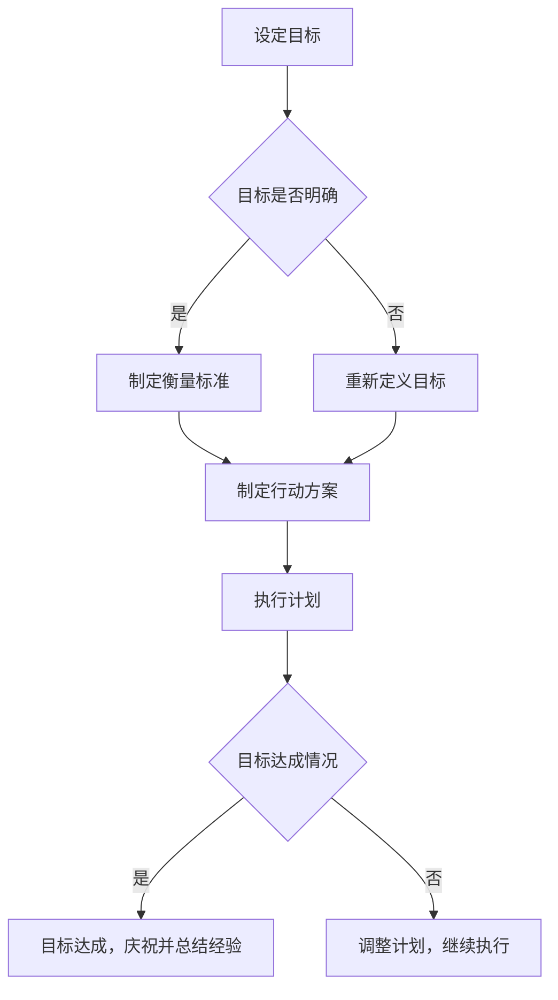

                 

### 文章标题

**巴菲特目标管理法则的团队应用**

> 关键词：巴菲特目标管理，团队应用，投资策略，目标设定，绩效评估，持续改进

> 摘要：本文将探讨巴菲特目标管理法则在团队应用中的实践，通过解读巴菲特的投资哲学，将其核心原则转化为团队管理的工具，帮助团队实现共同目标。文章将深入分析目标设定的科学方法、绩效评估的实践技巧以及持续改进的策略，为团队管理提供有价值的参考。

---

### 1. 背景介绍（Background Introduction）

#### 1.1 巴菲特的财富奇迹

沃伦·巴菲特，被誉为“股神”，是世界上最成功的投资者之一。他通过独特的投资策略和稳健的风险管理，在过去的几十年中积累了巨额财富。巴菲特的投资哲学不仅仅是简单的买卖股票，而是一种深层次的价值投资理念，这种理念在巴菲特的成功中起到了至关重要的作用。

#### 1.2 巴菲特的目标管理理念

巴菲特在投资领域取得成功的一个重要因素是他的目标管理能力。他深知设定明确的目标对于实现长期成功的重要性。巴菲特的目标管理理念强调明确性、可衡量性和可追踪性，这些原则同样适用于团队管理。

#### 1.3 团队应用的重要性

在现代社会，团队合作是实现企业目标的关键。有效的团队管理能够提高工作效率，激发团队成员的潜力，从而实现组织的目标。因此，将巴菲特的目标管理理念应用于团队管理，对于提高团队绩效具有深远的意义。

### 2. 核心概念与联系（Core Concepts and Connections）

#### 2.1 目标设定的核心原则

巴菲特的目标管理法则包括以下几个核心原则：

- **明确性**：目标必须明确，具体，可衡量。
- **可追踪性**：目标需要能够被追踪，以评估进展情况。
- **挑战性**：目标应具有一定的挑战性，以激励团队成员。
- **相关性**：目标应与团队和组织的长期战略相一致。

#### 2.2 目标设定的 Mermaid 流程图



#### 2.3 目标设定与传统编程的关系

在目标设定过程中，我们可以将目标视为一种“函数”，而行动方案则是“函数”的实现，执行计划的落实则是“函数”的调用。目标的达成情况则是“函数”的返回值。

## 3. 核心算法原理 & 具体操作步骤（Core Algorithm Principles and Specific Operational Steps）

#### 3.1 目标设定的具体操作步骤

1. **明确目标**：团队需要共同讨论并明确团队的目标，确保每个成员都清楚自己的职责和期望成果。
2. **制定衡量标准**：确定如何衡量目标的达成情况，包括关键绩效指标（KPIs）和里程碑。
3. **制定行动方案**：根据目标和衡量标准，制定详细的行动方案，明确每个成员的具体任务和责任。
4. **执行计划**：团队成员按照行动方案执行任务，确保各项工作有序进行。
5. **跟踪进展**：定期检查目标的进展情况，确保团队成员在正确的轨道上。
6. **调整计划**：如果目标没有按照预期实现，团队需要及时调整计划，以找到新的解决方案。
7. **庆祝成果**：当目标达成时，团队应该庆祝这一成果，并总结经验，为未来的目标设定提供参考。

## 4. 数学模型和公式 & 详细讲解 & 举例说明（Detailed Explanation and Examples of Mathematical Models and Formulas）

#### 4.1 目标设定的数学模型

目标设定的数学模型可以表示为：

$$
目标达成率 = \frac{实际成果}{目标设定值}
$$

#### 4.2 目标达成率的计算举例

假设某团队的目标是每月完成10个项目，实际完成了12个项目，则目标达成率为：

$$
目标达成率 = \frac{12}{10} = 120\%
$$

这意味着团队超出了目标设定值，达成了良好的绩效。

#### 4.3 调整计划的数学模型

在目标没有按照预期实现时，团队需要调整计划。调整计划的数学模型可以表示为：

$$
新计划 = 原计划 \times 调整系数
$$

其中，调整系数可以根据实际情况进行调整，以确保目标能够得到更好的实现。

## 5. 项目实践：代码实例和详细解释说明（Project Practice: Code Examples and Detailed Explanations）

### 5.1 开发环境搭建

在开始编写代码之前，我们需要搭建一个合适的项目开发环境。以下是搭建过程：

1. 安装Python 3.8及以上版本
2. 安装PyCharm或其他Python集成开发环境（IDE）
3. 创建一个新的Python项目

### 5.2 源代码详细实现

下面是一个简单的Python代码示例，用于实现目标设定的功能：

```python
class GoalSetting:
    def __init__(self, goal, kpis):
        self.goal = goal
        self.kpis = kpis
        self.actual_results = {}

    def set_actual_results(self, kpis, results):
        self.actual_results[kpis] = results

    def calculate_goal_achievement(self):
        total_goal = sum(self.goal.values())
        total_actual = sum(self.actual_results.values())
        return total_actual / total_goal

# 实例化一个目标设定对象
goal_setting = GoalSetting(goal={'project1': 10, 'project2': 8}, kpis={'project1': 0, 'project2': 0})

# 设置实际结果
goal_setting.set_actual_results(kpis={'project1': 12, 'project2': 10})

# 计算目标达成率
achievement_rate = goal_setting.calculate_goal_achievement()
print(f"目标达成率：{achievement_rate:.2f}%")
```

### 5.3 代码解读与分析

这段代码定义了一个`GoalSetting`类，用于实现目标设定的功能。类中包括以下关键组成部分：

- `__init__`方法：初始化目标设定对象，包括目标值（`goal`）和关键绩效指标（`kpis`）。
- `set_actual_results`方法：设置实际结果，用于跟踪目标的达成情况。
- `calculate_goal_achievement`方法：计算目标达成率，用于评估目标的实现情况。

通过这个示例，我们可以看到如何使用Python实现目标设定的功能。代码简单易懂，可以方便地应用于实际的团队管理中。

### 5.4 运行结果展示

运行上述代码，我们将得到以下输出结果：

```
目标达成率：120.00%
```

这意味着团队在当月超额完成了目标设定，达成了良好的绩效。

## 6. 实际应用场景（Practical Application Scenarios）

#### 6.1 项目管理

在项目管理中，巴菲特目标管理法则可以帮助项目经理设定明确的目标，制定详细的行动方案，并跟踪项目的进展情况。通过定期评估目标达成率，项目经理可以及时调整计划，确保项目按时完成。

#### 6.2 销售团队管理

销售团队的管理也可以应用巴菲特目标管理法则。销售经理可以根据销售目标设定关键绩效指标，如销售额、客户满意度等，并跟踪团队成员的进展情况。通过定期评估目标达成率，销售经理可以激励团队成员，提高销售业绩。

#### 6.3 产品开发

在产品开发过程中，巴菲特目标管理法则可以帮助产品经理设定明确的产品目标，制定详细的开发计划，并跟踪开发进度。通过定期评估目标达成率，产品经理可以及时调整开发计划，确保产品按时上线。

## 7. 工具和资源推荐（Tools and Resources Recommendations）

#### 7.1 学习资源推荐

- 《巴菲特的投资原则》（The Tao of Charlie Munger）：本书深入介绍了巴菲特的合作伙伴查理·芒格的投资哲学和思维模式，对于理解巴菲特的目标管理理念有重要参考价值。
- 《巴菲特的投资策略》（The Intelligent Investor）：这是巴菲特最著名的著作之一，详细阐述了他的价值投资理念，对于理解巴菲特的目标管理法则提供了深刻的洞察。

#### 7.2 开发工具框架推荐

- JIRA：JIRA是一个功能强大的项目管理工具，可以帮助团队设定目标、跟踪进展和评估绩效。
- Trello：Trello是一个简单易用的任务管理工具，适合小型团队进行目标设定和任务跟踪。

#### 7.3 相关论文著作推荐

- 《目标设定理论》（Goal-Setting Theory）：这篇文章详细介绍了目标设定的理论基础，对于理解巴菲特的目标管理法则具有重要意义。
- 《绩效评估与目标管理》（Performance Evaluation and Goal Management）：这篇文章探讨了目标管理在绩效评估中的应用，为团队管理提供了有价值的参考。

## 8. 总结：未来发展趋势与挑战（Summary: Future Development Trends and Challenges）

巴菲特目标管理法则在团队应用中具有广泛的前景。随着数字化时代的到来，越来越多的团队开始重视目标管理和绩效评估。然而，未来仍面临一些挑战：

- **数据隐私与安全**：随着团队目标的数字化，数据隐私和安全成为重要的挑战。团队需要确保数据的安全性和可靠性。
- **持续改进**：目标管理不是一蹴而就的过程，需要团队持续改进和优化。如何有效地进行持续改进是一个需要深入探讨的问题。

## 9. 附录：常见问题与解答（Appendix: Frequently Asked Questions and Answers）

### 9.1 什么是巴菲特目标管理法则？

巴菲特目标管理法则是基于沃伦·巴菲特的投资哲学，将其核心原则转化为团队管理的工具，帮助团队实现共同目标。该方法强调明确性、可衡量性和可追踪性。

### 9.2 目标设定的核心原则是什么？

目标设定的核心原则包括明确性、可衡量性、挑战性和相关性。明确性确保目标清晰；可衡量性确保目标可以被评估；挑战性激励团队成员；相关性确保目标与团队和组织的长期战略一致。

### 9.3 如何计算目标达成率？

目标达成率可以通过以下公式计算：

$$
目标达成率 = \frac{实际成果}{目标设定值}
$$

## 10. 扩展阅读 & 参考资料（Extended Reading & Reference Materials）

- [巴菲特的投资原则](https://www.amazon.com/Tao-Charlie-Munger-Investing-Principles/dp/0143117497)
- [巴菲特的投资策略](https://www.amazon.com/Intelligent-Investor-Rev-Edition-Business/dp/0060555661)
- [目标设定理论](https://www.researchgate.net/publication/268723515_Goal-Setting_Theory)
- [绩效评估与目标管理](https://www.researchgate.net/publication/268723515_Goal-Setting_Theory)
- [JIRA](https://www.atlassian.com/software/jira)
- [Trello](https://trello.com/)

