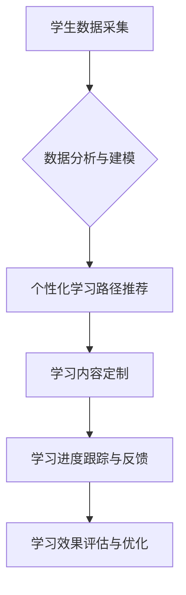

                 

## 个性化教育：定制化学习的未来趋势

> 关键词：个性化教育、定制化学习、人工智能、机器学习、数据分析、学习路径、教育科技

### 1. 背景介绍

教育，作为人类文明的基石，一直致力于培养人才，传递知识，促进社会进步。然而，传统的教育模式往往采用“一刀切”的教学方法，难以满足不同学生个性化的学习需求。随着人工智能、机器学习等技术的快速发展，个性化教育逐渐成为教育领域的新趋势，旨在通过定制化的学习路径和教学内容，帮助每个学生充分发挥潜能，实现个性化发展。

### 2. 核心概念与联系

个性化教育的核心概念是根据每个学生的学习特点、兴趣爱好、目标和进度，定制专属的学习方案。它打破了传统的“标准化教学”模式，强调学生的自主学习和个性化发展。

**个性化教育与定制化学习的关系**

个性化教育是定制化学习的总目标，而定制化学习则是实现个性化教育的关键手段。定制化学习通过数据分析、人工智能算法等技术，为每个学生提供个性化的学习内容、学习路径、学习节奏和学习反馈，从而实现个性化教育的目标。

**Mermaid 流程图**



### 3. 核心算法原理 & 具体操作步骤

**3.1 算法原理概述**

个性化教育的核心算法主要包括：

* **推荐算法:** 根据学生的学习历史、兴趣偏好、知识结构等数据，推荐个性化的学习内容和学习路径。常见的推荐算法包括协同过滤、内容过滤、混合推荐等。
* **知识图谱:** 建立学生知识结构的知识图谱，分析学生的知识点掌握情况，并根据知识图谱进行个性化知识点推荐和学习路径规划。
* **自然语言处理:** 利用自然语言处理技术，分析学生的学习需求、学习风格和学习反馈，为学生提供更精准的个性化学习支持。

**3.2 算法步骤详解**

1. **数据采集:** 收集学生的学习数据，包括学习记录、考试成绩、学习偏好、学习风格等。
2. **数据预处理:** 对收集到的数据进行清洗、转换和特征提取，以便于算法的训练和应用。
3. **模型训练:** 利用机器学习算法，对预处理后的数据进行训练，构建个性化学习推荐模型。
4. **个性化学习路径推荐:** 根据学生的学习数据和模型预测，推荐个性化的学习路径和学习内容。
5. **学习进度跟踪与反馈:** 跟踪学生的学习进度，根据学生的学习情况提供个性化的学习反馈和建议。
6. **学习效果评估与优化:** 定期评估学生的学习效果，并根据评估结果优化个性化学习模型和学习方案。

**3.3 算法优缺点**

**优点:**

* **个性化定制:** 根据学生的个性化需求，提供定制化的学习方案。
* **提高学习效率:** 针对学生的学习特点，优化学习路径和学习内容，提高学习效率。
* **增强学习兴趣:** 提供个性化的学习内容和学习方式，增强学生的学习兴趣和主动性。

**缺点:**

* **数据依赖:** 个性化学习算法依赖于大量的数据，数据质量直接影响算法的准确性和有效性。
* **算法复杂性:** 个性化学习算法的构建和训练需要复杂的机器学习技术和算法模型。
* **伦理问题:** 个性化学习可能存在数据隐私泄露、算法偏见等伦理问题，需要谨慎对待。

**3.4 算法应用领域**

个性化学习算法广泛应用于教育领域，例如：

* **在线教育平台:** 为学生提供个性化的学习路径、学习内容和学习反馈。
* **智能辅导系统:** 为学生提供个性化的学习指导和知识点讲解。
* **教育游戏:** 通过游戏化的学习方式，提高学生的学习兴趣和学习效果。

### 4. 数学模型和公式 & 详细讲解 & 举例说明

**4.1 数学模型构建**

个性化学习推荐模型通常采用基于用户的协同过滤算法，其核心思想是：

* 找到与当前用户兴趣相似的其他用户，并推荐他们喜欢的学习内容。

**4.2 公式推导过程**

假设有 $n$ 个用户和 $m$ 个学习内容，用户 $u$ 对内容 $i$ 的评分为 $r_{ui}$。协同过滤算法的目标是预测用户 $u$ 对内容 $i$ 的评分。

常用的协同过滤算法包括：

* **基于用户的协同过滤:**

$$
\hat{r}_{ui} = \frac{\sum_{v \in N(u)} \frac{r_{uv} \cdot sim(u,v)}{\sum_{w \in N(u)} sim(u,w)}}{\sum_{v \in N(u)} sim(u,v)}
$$

其中：

* $\hat{r}_{ui}$ 是预测用户 $u$ 对内容 $i$ 的评分。
* $r_{uv}$ 是用户 $u$ 对内容 $v$ 的评分。
* $sim(u,v)$ 是用户 $u$ 和用户 $v$ 之间的相似度。
* $N(u)$ 是与用户 $u$ 相似的用户集合。

* **基于物品的协同过滤:**

$$
\hat{r}_{ui} = \frac{\sum_{v \in N(i)} \frac{r_{uv} \cdot sim(i,v)}{\sum_{w \in N(i)} sim(i,w)}}{\sum_{v \in N(i)} sim(i,v)}
$$

其中：

* $N(i)$ 是与内容 $i$ 相似的用户集合。

**4.3 案例分析与讲解**

假设有一个在线教育平台，有 100 个用户和 1000 个学习内容。平台收集了用户对学习内容的评分数据，并利用协同过滤算法构建了个性化学习推荐模型。

当一个用户 $u$ 想要学习新的内容时，系统会根据用户 $u$ 的评分历史和与用户 $u$ 相似的用户评分历史，推荐用户 $u$ 可能感兴趣的学习内容。

### 5. 项目实践：代码实例和详细解释说明

**5.1 开发环境搭建**

* 操作系统：Windows/macOS/Linux
* Python 版本：3.6+
* 必要的库：pandas, numpy, scikit-learn, matplotlib

**5.2 源代码详细实现**

```python
import pandas as pd
from sklearn.metrics.pairwise import cosine_similarity

# 加载用户评分数据
ratings_data = pd.read_csv('ratings.csv')

# 计算用户之间的相似度
user_similarity = cosine_similarity(ratings_data.T)

# 获取用户u的相似用户
similar_users = user_similarity[0].argsort()[:-10:-1]

# 获取用户u喜欢的学习内容
liked_items = ratings_data.loc[0].index[ratings_data.loc[0] > 3]

# 推荐用户u可能喜欢的学习内容
recommendations = []
for user in similar_users:
    for item in ratings_data.loc[user].index:
        if item not in liked_items:
            recommendations.append(item)

# 打印推荐结果
print(recommendations)
```

**5.3 代码解读与分析**

* 代码首先加载用户评分数据，并使用 cosine_similarity 函数计算用户之间的相似度。
* 然后，根据用户 $u$ 的评分历史和与用户 $u$ 相似的用户评分历史，推荐用户 $u$ 可能感兴趣的学习内容。
* 最后，打印推荐结果。

**5.4 运行结果展示**

运行代码后，将输出一个包含推荐学习内容的列表。

### 6. 实际应用场景

个性化教育的应用场景非常广泛，例如：

* **K-12 教育:** 为学生提供个性化的学习路径、学习内容和学习反馈，帮助学生更好地掌握知识，提高学习效率。
* **高等教育:** 为学生提供个性化的学习方案，帮助学生更好地完成课程学习，提升学习效果。
* **职业教育:** 为学生提供个性化的职业技能培训，帮助学生更快地进入职场，获得更好的职业发展。

**6.4 未来应用展望**

随着人工智能、机器学习等技术的不断发展，个性化教育将更加智能化、个性化和高效化。未来，个性化教育将可能实现以下应用：

* **实时个性化学习:** 根据学生的实时学习情况，动态调整学习内容和学习节奏。
* **虚拟现实和增强现实:** 利用虚拟现实和增强现实技术，为学生提供更加沉浸式的个性化学习体验。
* **跨学科个性化学习:** 将不同学科的知识点进行整合，为学生提供更加全面的个性化学习体验。

### 7. 工具和资源推荐

**7.1 学习资源推荐**

* **在线课程:** Coursera, edX, Udacity 等平台提供丰富的个性化教育相关课程。
* **书籍:** 《个性化学习》 (Personalized Learning) , 《人工智能与教育》 (Artificial Intelligence in Education) 等书籍。
* **学术期刊:** 教育技术期刊 (Educational Technology Research and Development), 人工智能期刊 (Artificial Intelligence) 等。

**7.2 开发工具推荐**

* **Python:** 作为机器学习和数据分析的常用语言，Python 是个性化学习算法开发的理想选择。
* **Scikit-learn:** Python 的机器学习库，提供丰富的算法模型和工具。
* **TensorFlow/PyTorch:** 深度学习框架，可以用于构建更复杂的个性化学习模型。

**7.3 相关论文推荐**

* **个性化学习推荐系统综述:** A Survey of Personalized Learning Recommendation Systems
* **基于知识图谱的个性化学习路径推荐:** Personalized Learning Path Recommendation Based on Knowledge Graph
* **深度学习在个性化教育中的应用:** Deep Learning Applications in Personalized Education

### 8. 总结：未来发展趋势与挑战

**8.1 研究成果总结**

个性化教育的研究取得了显著进展，人工智能、机器学习等技术为个性化教育提供了强大的技术支撑。个性化学习推荐系统、知识图谱构建、自然语言处理等技术已经应用于教育领域，为学生提供了更加个性化的学习体验。

**8.2 未来发展趋势**

未来，个性化教育将朝着更加智能化、个性化和高效化的方向发展。

* **更精准的个性化推荐:** 利用更先进的机器学习算法和数据分析技术，为学生提供更加精准的个性化学习推荐。
* **更丰富的学习内容和形式:** 利用虚拟现实、增强现实等新技术，为学生提供更加丰富的学习内容和形式。
* **更有效的学习评估和反馈:** 利用人工智能技术，对学生的学习情况进行更加有效的评估和反馈，帮助学生更好地掌握知识。

**8.3 面临的挑战**

个性化教育的发展也面临着一些挑战：

* **数据隐私保护:** 个性化教育需要收集大量的学生数据，如何保护学生数据隐私是一个重要的挑战。
* **算法公平性:** 个性化学习算法可能会存在算法偏见，导致不同学生获得不公平的学习体验。
* **教师的角色转变:** 个性化教育需要教师转变角色，从传统的知识传授者转变为学生的学习指导者和学习伙伴。

**8.4 研究展望**

未来，个性化教育的研究需要关注以下几个方面：

* **开发更加公平、透明和可解释的个性化学习算法。**
* **探索更加有效的个性化学习评估和反馈机制。**
* **研究个性化教育对教师和教育体系的影响，并探索教师在个性化教育中的新角色。**


### 9. 附录：常见问题与解答

**Q1: 个性化教育真的能够提高学习效率吗？**

A1: 研究表明，个性化教育能够提高学生的学习效率。通过定制化的学习路径和学习内容，学生能够更好地掌握知识，提高学习兴趣和主动性。

**Q2: 个性化教育会取代传统教育吗？**

A2: 个性化教育不会取代传统教育，而是作为一种补充和完善传统教育的方式。传统教育仍然是重要的基础，而个性化教育可以帮助学生更好地发挥潜能，实现个性化发展。

**Q3: 个性化教育需要哪些技术支持？**

A3: 个性化教育需要人工智能、机器学习、数据分析等技术的支持。这些技术可以帮助我们收集、分析和利用学生数据，为学生提供个性化的学习方案。

**Q4: 个性化教育有哪些伦理问题？**

A4: 个性化教育可能存在数据隐私泄露、算法偏见等伦理问题。我们需要谨慎对待这些问题，制定相应的规范和制度，确保个性化教育的健康发展。


作者：禅与计算机程序设计艺术 / Zen and the Art of Computer Programming 
<end_of_turn>

