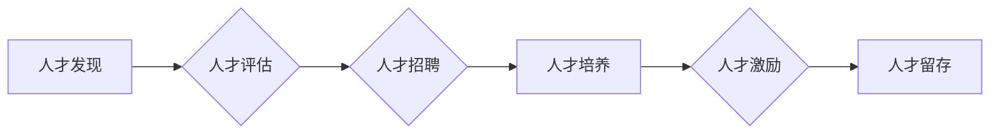

                 

## 人才管理：吸引和留住顶尖人才的策略

> 关键词：人才管理、顶尖人才、吸引人才、留住人才、技术公司、企业文化、薪酬福利、职业发展、人才培养

### 1. 背景介绍

在当今科技飞速发展的时代，人才已成为企业最重要的资产。尤其是在技术领域，拥有顶尖人才的企业才能在激烈的市场竞争中保持领先地位。然而，吸引和留住顶尖人才并非易事，这需要企业制定科学合理的策略，并不断优化和完善。

近年来，全球范围内涌现出许多技术巨头，它们都高度重视人才管理，并建立了完善的人才体系。例如，谷歌、微软、亚马逊等公司都拥有强大的招聘体系、丰厚的薪酬福利和丰富的职业发展机会，吸引了大量优秀人才。

然而，并非所有技术公司都具备像这些巨头一样的资源和实力。中小技术公司如何在人才竞争中脱颖而出，吸引和留住顶尖人才，成为一个亟待解决的问题。

### 2. 核心概念与联系

人才管理的核心在于理解人才的价值，并制定相应的策略来吸引、留住和发展人才。

**人才价值链**

人才价值链是一个描述人才价值从发现到实现的过程的模型。它包括以下几个关键环节：

* **人才发现:** 通过各种渠道，例如招聘网站、校园招聘、人才库等，发现潜在的优秀人才。
* **人才评估:** 对候选人进行全面的评估，包括技能、经验、性格、价值观等方面。
* **人才招聘:** 选择最合适的候选人，并进行有效的招聘工作。
* **人才培养:** 为员工提供培训和发展机会，帮助他们提升技能和知识水平。
* **人才激励:** 通过薪酬福利、晋升机会、职业发展规划等方式，激励员工发挥潜能。
* **人才留存:** 构建良好的工作环境和企业文化，提高员工的归属感和满意度，降低员工流失率。

**人才管理流程图**



### 3. 核心算法原理 & 具体操作步骤

**3.1 算法原理概述**

人才管理的核心算法可以看作是一个动态平衡的过程，需要根据企业的发展战略、市场环境和人才需求，不断调整和优化人才策略。

**3.2 算法步骤详解**

1. **数据收集和分析:** 收集员工数据，包括技能、经验、绩效、薪酬、离职原因等，并进行分析，了解人才现状和需求。
2. **人才需求预测:** 基于企业发展战略和市场趋势，预测未来人才需求，确定人才招聘方向和数量。
3. **人才招聘策略制定:** 根据人才需求，制定相应的招聘策略，包括招聘渠道、招聘流程、薪酬福利等。
4. **人才评估和筛选:** 对候选人进行全面的评估，筛选出最合适的候选人。
5. **人才培养计划设计:** 为员工制定个性化的培养计划，帮助他们提升技能和知识水平。
6. **人才激励机制构建:** 设计合理的薪酬福利、晋升机制、职业发展规划等，激励员工发挥潜能。
7. **人才留存策略实施:** 构建良好的工作环境和企业文化，提高员工的归属感和满意度，降低员工流失率。
8. **人才管理体系评估和优化:** 定期评估人才管理体系的成效，并根据实际情况进行调整和优化。

**3.3 算法优缺点**

* **优点:** 

    * 数据驱动，决策更科学合理。
    * 能够有效预测人才需求，避免人才短缺。
    * 能够提高人才招聘和留存效率。

* **缺点:** 

    * 需要收集和分析大量数据，数据质量对算法效果至关重要。
    * 算法模型需要不断更新和优化，适应不断变化的市场环境。
    * 算法无法完全替代人的主观判断，需要结合实际情况进行决策。

**3.4 算法应用领域**

人才管理算法广泛应用于各个行业，例如：

* 科技公司：招聘、留存、培养顶尖人才。
* 金融机构：招聘、培训、评估金融人才。
* 教育机构：学生招生、人才培养、教师招聘。
* 政府部门：人才引进、人才培养、人才服务。

### 4. 数学模型和公式 & 详细讲解 & 举例说明

**4.1 数学模型构建**

人才价值可以看作是一个多维度的概念，可以用数学模型来量化。例如，可以构建一个人才价值评估模型，将人才的技能、经验、绩效、潜力等因素作为输入变量，通过权重计算和评分机制，得到人才的综合价值得分。

**4.2 公式推导过程**

假设一个人才价值评估模型，包含以下几个因素：

* **技能得分 (S):** 根据人才的技能水平，赋予相应的得分。
* **经验得分 (E):** 根据人才的从业经验，赋予相应的得分。
* **绩效得分 (P):** 根据人才的过去绩效表现，赋予相应的得分。
* **潜力得分 (T):** 根据人才的学习能力和发展潜力，赋予相应的得分。

人才价值得分 (V) 可以通过以下公式计算：

$$V = w_S * S + w_E * E + w_P * P + w_T * T$$

其中，$w_S$, $w_E$, $w_P$, $w_T$ 分别是技能、经验、绩效、潜力四个因素的权重系数。

**4.3 案例分析与讲解**

假设一个公司需要招聘一名软件工程师，该公司的招聘团队制定了以下权重系数：

* $w_S = 0.4$
* $w_E = 0.3$
* $w_P = 0.2$
* $w_T = 0.1$

对于两位候选人，A 和 B，他们的得分如下：

* A: S = 80, E = 70, P = 90, T = 80
* B: S = 90, E = 60, P = 80, T = 70

根据公式，我们可以计算出两位候选人的人才价值得分：

* A: V = 0.4 * 80 + 0.3 * 70 + 0.2 * 90 + 0.1 * 80 = 59.2
* B: V = 0.4 * 90 + 0.3 * 60 + 0.2 * 80 + 0.1 * 70 = 57.4

根据计算结果，候选人 A 的人才价值得分更高，因此公司更倾向于选择 A。

### 5. 项目实践：代码实例和详细解释说明

**5.1 开发环境搭建**

为了实现人才管理算法，需要搭建相应的开发环境。可以使用 Python 语言和相关的库，例如 Pandas、Scikit-learn 等。

**5.2 源代码详细实现**

```python
import pandas as pd
from sklearn.linear_model import LinearRegression

# 加载人才数据
data = pd.read_csv("talent_data.csv")

# 选择特征变量和目标变量
features = ["skill", "experience", "performance", "potential"]
target = "value"

# 训练线性回归模型
model = LinearRegression()
model.fit(data[features], data[target])

# 预测新人才的价值
new_talent = pd.DataFrame({
    "skill": [80],
    "experience": [70],
    "performance": [90],
    "potential": [80]
})
predicted_value = model.predict(new_talent)

# 打印预测结果
print(f"预测人才价值: {predicted_value[0]}")
```

**5.3 代码解读与分析**

这段代码首先加载人才数据，然后选择特征变量和目标变量。接着，使用线性回归模型训练算法，并预测新人才的价值。

**5.4 运行结果展示**

运行代码后，会输出新人才的预测价值。

### 6. 实际应用场景

人才管理算法在实际应用场景中具有广泛的应用前景。例如：

* **招聘:** 根据人才需求，筛选出最合适的候选人。
* **留存:** 识别高价值人才，并制定相应的留存策略。
* **培养:** 为员工制定个性化的培养计划，帮助他们提升技能和知识水平。
* **薪酬管理:** 根据人才价值和市场行情，制定合理的薪酬福利制度。

**6.4 未来应用展望**

随着人工智能技术的不断发展，人才管理算法将更加智能化和个性化。例如，可以利用大数据分析和机器学习技术，更精准地预测人才需求和人才价值，并制定更加个性化的人才管理策略。

### 7. 工具和资源推荐

**7.1 学习资源推荐**

* **书籍:**

    * 人才管理：吸引和留住顶尖人才的策略
    * 人才战略与管理
    * 人才管理的艺术

* **在线课程:**

    * Coursera: 人才管理
    * edX: 人才管理
    * Udemy: 人才管理

**7.2 开发工具推荐**

* **Python:** 人工智能和数据分析的常用语言。
* **Pandas:** 数据分析和处理库。
* **Scikit-learn:** 机器学习库。
* **TensorFlow:** 深度学习框架。

**7.3 相关论文推荐**

* 人才管理算法研究进展
* 人才价值评估模型构建
* 人才流失预测模型

### 8. 总结：未来发展趋势与挑战

**8.1 研究成果总结**

人才管理算法的研究取得了显著进展，为企业吸引、留住和发展人才提供了新的思路和方法。

**8.2 未来发展趋势**

未来，人才管理算法将更加智能化、个性化和数据化。

* **智能化:** 利用人工智能技术，自动完成人才招聘、评估、培养等工作。
* **个性化:** 根据每个员工的个性化需求，制定个性化的发展计划。
* **数据化:** 利用大数据分析技术，更精准地预测人才需求和人才价值。

**8.3 面临的挑战**

人才管理算法也面临着一些挑战，例如：

* 数据质量问题：算法效果依赖于数据质量，需要保证数据的准确性和完整性。
* 算法模型的局限性：现有的算法模型可能无法完全满足企业的需求，需要不断改进和优化。
* 人工智能伦理问题：需要确保人工智能技术在人才管理中的应用符合伦理道德规范。

**8.4 研究展望**

未来，人才管理算法的研究将继续深入，探索更智能、更个性化、更有效的解决方案。


### 9. 附录：常见问题与解答

**9.1 如何评估人才价值？**

人才价值评估是一个复杂的过程，需要综合考虑多个因素，例如技能、经验、绩效、潜力等。可以使用定量和定性方法进行评估，例如技能测试、绩效考核、面试评估等。

**9.2 如何留住高价值人才？**

留住高价值人才需要提供良好的工作环境、丰厚的薪酬福利、丰富的职业发展机会等。

**9.3 如何利用人工智能技术进行人才管理？**

人工智能技术可以应用于人才招聘、评估、培养、留存等各个环节，提高人才管理的效率和精准度。

**9.4 人才管理算法有哪些局限性？**

人才管理算法目前还存在一些局限性，例如数据质量问题、算法模型的局限性、人工智能伦理问题等。

**9.5 未来人才管理的发展趋势是什么？**

未来人才管理将更加智能化、个性化和数据化。


作者：禅与计算机程序设计艺术 / Zen and the Art of Computer Programming 
<end_of_turn>

