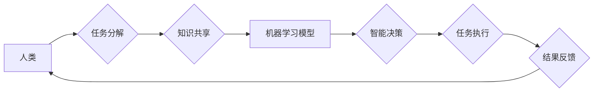

                 

## 人机协作新篇章：共创智能未来新时代

> 关键词： 人机协作、人工智能、协同智能、智能未来、算法、机器学习、深度学习、自然语言处理、计算机视觉

### 1. 背景介绍

人工智能（AI）技术近年来发展迅速，已渗透到生活的方方面面。从智能语音助手到自动驾驶汽车，AI正在改变着我们的世界。然而，当前的AI技术仍然存在局限性，例如缺乏泛化能力、难以理解复杂场景等。因此，如何更好地将人类的智慧与机器的智能相结合，成为推动AI发展的重要课题。

人机协作，即人类与人工智能系统共同完成任务，已成为解决AI技术局限性的重要途径。通过结合人类的创造力、洞察力和决策能力，以及机器的计算能力、数据处理能力和执行效率，人机协作能够实现协同智能，从而创造更大的价值。

### 2. 核心概念与联系

**2.1 人机协作的本质**

人机协作的核心在于建立一种高效、灵活、互补的合作关系。人类和机器各自发挥优势，共同完成复杂任务。

**2.2 协同智能的实现**

协同智能的实现需要以下关键要素：

* **共享信息:** 人类和机器需要能够共享任务信息、知识和数据，以便更好地理解彼此的意图和需求。
* **协同决策:** 人类和机器需要能够共同参与决策过程，并根据彼此的判断和分析做出最佳选择。
* **灵活适应:** 人机协作系统需要能够根据任务变化和环境变化，灵活调整合作模式和策略。

**2.3 人机协作的架构**



**2.4 人机协作的优势**

* **提高效率:** 人机协作能够将人类和机器的优势结合起来，提高任务完成效率。
* **增强创新:** 人类和机器的合作能够激发新的创意和解决方案。
* **降低风险:** 人机协作能够将风险分散，降低决策错误的可能性。

### 3. 核心算法原理 & 具体操作步骤

**3.1 算法原理概述**

人机协作的核心算法通常基于机器学习和深度学习技术。这些算法能够帮助机器学习人类的行为模式、知识和决策规则，从而实现与人类的有效交互和合作。

**3.2 算法步骤详解**

1. **数据收集和预处理:** 收集人类和机器交互的数据，并进行预处理，例如清洗、转换和特征提取。
2. **模型训练:** 使用机器学习算法训练模型，使模型能够学习人类的行为模式和知识。
3. **任务分配:** 根据任务需求和机器模型的能力，将任务分配给人类或机器。
4. **信息交互:** 人类和机器之间进行信息交互，例如共享任务信息、知识和数据。
5. **协同决策:** 人类和机器共同参与决策过程，并根据彼此的判断和分析做出最佳选择。
6. **任务执行:** 根据决策结果，人类或机器执行相应的任务。
7. **结果反馈:** 任务执行结果反馈给人类和机器，用于模型更新和优化。

**3.3 算法优缺点**

* **优点:** 提高效率、增强创新、降低风险。
* **缺点:** 需要大量数据训练、模型复杂度高、解释性差。

**3.4 算法应用领域**

* **医疗保健:** 辅助医生诊断疾病、制定治疗方案。
* **金融服务:** 识别欺诈交易、提供个性化金融建议。
* **教育:** 提供个性化学习辅导、评估学生学习进度。
* **制造业:** 自动化生产流程、优化生产效率。

### 4. 数学模型和公式 & 详细讲解 & 举例说明

**4.1 数学模型构建**

人机协作的数学模型通常基于概率论和统计学，用于描述人类和机器的决策行为和交互模式。例如，可以使用贝叶斯网络模型来表示人类和机器之间的知识和信念，并根据任务信息和数据更新模型参数。

**4.2 公式推导过程**

假设人类和机器分别对某个任务的完成概率为 $P_h$ 和 $P_m$，则人机协作完成任务的概率可以表示为：

$$P_{hm} = P_h \cdot P_m + (1 - P_h) \cdot (1 - P_m)$$

其中，$P_{hm}$ 表示人机协作完成任务的概率。

**4.3 案例分析与讲解**

例如，在医疗诊断任务中，假设人类医生对疾病的诊断概率为 80%，机器学习模型对疾病的诊断概率为 70%。则人机协作完成诊断任务的概率为：

$$P_{hm} = 0.8 \cdot 0.7 + (1 - 0.8) \cdot (1 - 0.7) = 0.56 + 0.06 = 0.62$$

可见，人机协作能够提高诊断的准确率。

### 5. 项目实践：代码实例和详细解释说明

**5.1 开发环境搭建**

* 操作系统: Ubuntu 20.04
* Python 版本: 3.8
* 必要的库: TensorFlow, PyTorch, scikit-learn

**5.2 源代码详细实现**

```python
# 人机协作模型
class HumanMachineCollaboration:
    def __init__(self, human_model, machine_model):
        self.human_model = human_model
        self.machine_model = machine_model

    def predict(self, data):
        human_prediction = self.human_model.predict(data)
        machine_prediction = self.machine_model.predict(data)
        # 融合人类和机器的预测结果
        collaborative_prediction = self.combine_predictions(human_prediction, machine_prediction)
        return collaborative_prediction

    def combine_predictions(self, human_prediction, machine_prediction):
        # 根据任务类型和模型性能，选择不同的融合策略
        # 例如，可以使用加权平均法或投票法
        # ...
        return collaborative_prediction
```

**5.3 代码解读与分析**

* `HumanMachineCollaboration` 类代表人机协作模型。
* `human_model` 和 `machine_model` 分别代表人类模型和机器模型。
* `predict` 方法接收数据作为输入，并返回人机协作的预测结果。
* `combine_predictions` 方法负责融合人类和机器的预测结果，可以选择不同的融合策略。

**5.4 运行结果展示**

通过在实际任务场景中测试人机协作模型，可以评估模型的性能和效果。例如，在医疗诊断任务中，可以比较人机协作模型的诊断准确率与人类医生的诊断准确率。

### 6. 实际应用场景

**6.1 医疗保健**

* 辅助医生诊断疾病: 人机协作系统可以分析患者的病历、影像数据和实验室结果，并结合医生的经验判断，辅助医生做出更准确的诊断。
* 制定个性化治疗方案: 人机协作系统可以根据患者的基因信息、生活习惯和病史，制定个性化的治疗方案。
* 远程医疗: 人机协作系统可以帮助医生远程诊断和治疗患者，提高医疗服务的覆盖范围。

**6.2 金融服务**

* 识别欺诈交易: 人机协作系统可以分析交易数据，识别异常交易行为，并及时报警。
* 提供个性化金融建议: 人机协作系统可以根据用户的财务状况和风险偏好，提供个性化的投资建议。
* 自动化理财: 人机协作系统可以自动执行用户的投资指令，帮助用户实现财富管理。

**6.3 教育**

* 提供个性化学习辅导: 人机协作系统可以根据学生的学习进度和能力，提供个性化的学习辅导。
* 评估学生学习进度: 人机协作系统可以自动评估学生的学习成果，并及时反馈给学生和老师。
* 自动化批改作业: 人机协作系统可以自动批改学生的作业，节省老师的时间和精力。

**6.4 未来应用展望**

人机协作技术将在未来广泛应用于各个领域，例如：

* 自动驾驶: 人机协作系统可以帮助自动驾驶汽车更好地感知周围环境，并做出更安全的决策。
* 智能制造: 人机协作系统可以提高制造业的效率和自动化程度。
* 科学研究: 人机协作系统可以帮助科学家更快地发现新的知识和解决复杂问题。

### 7. 工具和资源推荐

**7.1 学习资源推荐**

* **书籍:**
    * 人机协作：理论与实践
    * 人工智能：一种现代方法
* **在线课程:**
    * Coursera: 人工智能
    * edX: 人机协作

**7.2 开发工具推荐**

* **机器学习框架:** TensorFlow, PyTorch
* **自然语言处理库:** NLTK, spaCy
* **计算机视觉库:** OpenCV

**7.3 相关论文推荐**

* 人机协作中的信任和解释性
* 人机协作中的决策支持系统
* 人机协作中的情感计算

### 8. 总结：未来发展趋势与挑战

**8.1 研究成果总结**

人机协作技术取得了显著的进展，在医疗保健、金融服务、教育等领域取得了成功应用。

**8.2 未来发展趋势**

* **更智能的协作伙伴:** 人机协作系统将更加智能，能够更好地理解人类的需求和意图。
* **更广泛的应用场景:** 人机协作技术将应用于更多领域，例如自动驾驶、智能制造、科学研究等。
* **更人性化的交互方式:** 人机协作系统将采用更自然、更直观的交互方式，例如语音交互、手势识别等。

**8.3 面临的挑战**

* **算法的复杂性:** 人机协作算法的复杂性仍然是一个挑战，需要进一步研究和优化。
* **数据安全和隐私保护:** 人机协作系统需要处理大量的数据，因此数据安全和隐私保护是一个重要的课题。
* **伦理问题:** 人机协作技术的发展也带来了一些伦理问题，例如责任归属、算法偏见等，需要认真思考和解决。

**8.4 研究展望**

未来，人机协作技术将继续发展，并与其他新兴技术，例如虚拟现实、增强现实等相结合，创造更加智能、更加便捷、更加美好的未来。

### 9. 附录：常见问题与解答

**9.1 如何选择合适的协作策略？**

选择合适的协作策略取决于具体的任务类型和模型性能。例如，对于需要高准确率的任务，可以采用加权平均法融合预测结果；对于需要快速响应的任务，可以采用投票法融合预测结果。

**9.2 如何解决人机协作中的信任问题？**

可以通过以下方式解决人机协作中的信任问题：

* **提高模型透明度:** 使模型的决策过程更加透明，以便人类能够理解模型的判断依据。
* **提供模型性能评估:** 对模型的性能进行评估，并向人类展示模型的准确率、召回率等指标。
* **建立反馈机制:** 建立人机协作反馈机制，允许人类对模型的预测结果进行反馈，并根据反馈进行模型优化。


作者：禅与计算机程序设计艺术 / Zen and the Art of Computer Programming 
<end_of_turn>

