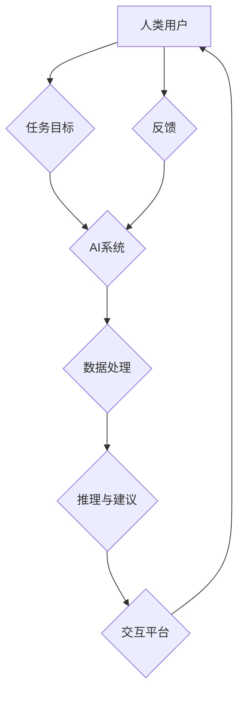

                 

## 人类-AI协作：增强人类智慧与AI能力的融合展望

> 关键词：人工智能、协作、人类智慧、AI能力、融合、未来趋势、应用场景

### 1. 背景介绍

人工智能（AI）技术近年来发展迅速，已渗透到各个领域，从自动驾驶到医疗诊断，从金融交易到个性化推荐，AI正在深刻地改变着我们的生活。然而，AI技术的发展也引发了人们对未来工作模式、社会结构和人类自身价值的思考。

当前，AI技术主要集中在数据处理、模式识别和决策优化等方面，但其在创造性思维、复杂问题解决和伦理判断等方面仍存在局限性。人类拥有丰富的经验、创造力和情感智能，而AI则擅长处理海量数据和进行逻辑推理。因此，将人类智慧与AI能力相结合，实现人类-AI协作，成为未来科技发展的重要方向。

### 2. 核心概念与联系

**2.1 人类-AI协作的本质**

人类-AI协作是指人类和人工智能系统在共同目标下进行合作，发挥各自优势，共同完成任务的过程。这种合作并非简单的“人机替代”，而是建立在互补和增强的基础上。

**2.2 协作模式**

人类-AI协作模式多种多样，主要包括：

* **监督式协作:** 人类提供指导和反馈，AI系统根据反馈进行学习和改进。
* **自主式协作:** AI系统独立完成任务，并在遇到问题时寻求人类的帮助。
* **混合式协作:** 人类和AI系统共同参与任务，分工合作，协同完成。

**2.3 协作架构**

人类-AI协作的架构通常包括以下几个关键组件：

* **人类用户:** 提供任务目标、知识和决策。
* **AI系统:** 处理数据、进行推理和提供建议。
* **交互平台:** 作为人类和AI系统之间沟通的桥梁。
* **反馈机制:** 收集人类反馈，用于AI系统学习和改进。

**Mermaid 流程图**



### 3. 核心算法原理 & 具体操作步骤

**3.1 算法原理概述**

人类-AI协作的核心算法通常基于机器学习、深度学习和自然语言处理等技术。这些算法能够帮助AI系统理解人类语言、识别模式、进行预测和决策。

**3.2 算法步骤详解**

1. **数据收集和预处理:** 收集与任务相关的各种数据，并进行清洗、转换和格式化。
2. **模型训练:** 使用机器学习算法训练AI模型，使其能够从数据中学习并建立预测模型。
3. **模型评估和优化:** 对训练好的模型进行评估，并根据评估结果进行调整和优化。
4. **部署和应用:** 将训练好的模型部署到实际应用场景中，并与人类用户进行交互。

**3.3 算法优缺点**

* **优点:** 能够自动学习和改进，提高效率和准确性。
* **缺点:** 需要大量数据进行训练，对数据质量要求高，且可能存在偏差和误差。

**3.4 算法应用领域**

* **医疗诊断:** AI系统可以辅助医生诊断疾病，提高诊断准确率。
* **金融风险管理:** AI系统可以分析金融数据，识别潜在风险，帮助金融机构进行风险控制。
* **个性化教育:** AI系统可以根据学生的学习情况提供个性化的学习内容和建议。

### 4. 数学模型和公式 & 详细讲解 & 举例说明

**4.1 数学模型构建**

人类-AI协作的数学模型通常基于概率论、统计学和决策论等理论。例如，在监督式协作中，可以使用贝叶斯定理来描述人类和AI系统对任务结果的预测概率。

**4.2 公式推导过程**

假设人类对任务结果的预测概率为 $P(H)$，AI系统对任务结果的预测概率为 $P(A)$，则根据贝叶斯定理，人类-AI协作的预测概率为：

$$P(H|A) = \frac{P(A|H)P(H)}{P(A)}$$

其中，$P(A|H)$ 表示AI系统在人类预测结果为H的情况下，预测结果为A的概率，$P(A)$ 表示AI系统预测结果为A的概率。

**4.3 案例分析与讲解**

例如，在医疗诊断场景中，假设人类医生对患者患有某种疾病的预测概率为 $P(H) = 0.6$，AI系统对患者患有该疾病的预测概率为 $P(A) = 0.7$，并且AI系统在人类预测结果为患病的情况下，预测结果为患病的概率为 $P(A|H) = 0.8$。

根据上述公式，人类-AI协作的预测概率为：

$$P(H|A) = \frac{0.8 \times 0.6}{0.7} \approx 0.686$$

可见，人类-AI协作的预测概率高于人类单独预测的概率，表明协作能够提高诊断准确率。

### 5. 项目实践：代码实例和详细解释说明

**5.1 开发环境搭建**

* Python 3.x
* TensorFlow 或 PyTorch
* Jupyter Notebook

**5.2 源代码详细实现**

```python
import tensorflow as tf

# 定义模型
model = tf.keras.models.Sequential([
    tf.keras.layers.Dense(128, activation='relu', input_shape=(10,)),
    tf.keras.layers.Dense(64, activation='relu'),
    tf.keras.layers.Dense(1, activation='sigmoid')
])

# 编译模型
model.compile(optimizer='adam', loss='binary_crossentropy', metrics=['accuracy'])

# 训练模型
model.fit(X_train, y_train, epochs=10)

# 评估模型
loss, accuracy = model.evaluate(X_test, y_test)
print('Loss:', loss)
print('Accuracy:', accuracy)
```

**5.3 代码解读与分析**

这段代码实现了简单的机器学习模型训练。

* `tf.keras.models.Sequential` 定义了一个顺序模型，即层级结构的模型。
* `tf.keras.layers.Dense` 定义了全连接层，每个神经元都连接到上一层的每个神经元。
* `activation='relu'` 指定了激活函数为ReLU函数，用于引入非线性。
* `input_shape=(10,)` 指定了输入数据的形状为10维向量。
* `optimizer='adam'` 指定了优化算法为Adam算法，用于更新模型参数。
* `loss='binary_crossentropy'` 指定了损失函数为二分类交叉熵函数，用于衡量模型预测结果与真实结果之间的差异。
* `metrics=['accuracy']` 指定了评估指标为准确率。

**5.4 运行结果展示**

训练完成后，模型会输出训练损失和准确率。

### 6. 实际应用场景

**6.1 医疗诊断辅助**

AI系统可以辅助医生诊断疾病，例如识别肿瘤、预测患者的病情发展趋势等。

**6.2 金融风险管理**

AI系统可以分析金融数据，识别潜在风险，例如欺诈交易、信用风险等。

**6.3 个性化教育**

AI系统可以根据学生的学习情况提供个性化的学习内容和建议，提高学习效率。

**6.4 未来应用展望**

随着AI技术的不断发展，人类-AI协作将在更多领域得到应用，例如：

* **科学研究:** AI系统可以辅助科学家进行数据分析、模型构建和实验设计。
* **艺术创作:** AI系统可以与人类艺术家合作，创作出新的艺术作品。
* **社会治理:** AI系统可以辅助政府部门进行决策分析、资源分配和公共服务管理。

### 7. 工具和资源推荐

**7.1 学习资源推荐**

* **在线课程:** Coursera、edX、Udacity 等平台提供丰富的AI课程。
* **书籍:** 《深度学习》、《人工智能：一种现代方法》等书籍。
* **开源项目:** TensorFlow、PyTorch 等开源项目提供丰富的代码示例和学习资源。

**7.2 开发工具推荐**

* **Python:** 作为AI开发的主要编程语言。
* **Jupyter Notebook:** 用于代码编写、数据分析和可视化。
* **TensorFlow/PyTorch:** 深度学习框架。

**7.3 相关论文推荐**

* **Attention Is All You Need:** 提出Transformer模型， revolutionized natural language processing.
* **BERT: Pre-training of Deep Bidirectional Transformers for Language Understanding:** 提出BERT模型，大幅提升了自然语言理解任务的性能。

### 8. 总结：未来发展趋势与挑战

**8.1 研究成果总结**

人类-AI协作领域取得了显著进展，AI系统在数据处理、模式识别和决策优化等方面展现出强大的能力。

**8.2 未来发展趋势**

* **更强的泛化能力:** AI系统需要能够适应更多不同的任务和场景。
* **更强的解释性:** AI系统的决策过程需要更加透明和可解释。
* **更强的安全性:** AI系统需要能够抵御攻击和恶意使用。

**8.3 面临的挑战**

* **数据获取和隐私保护:** AI系统需要大量数据进行训练，如何获取高质量数据并保护用户隐私是一个挑战。
* **算法偏见:** AI系统可能存在算法偏见，导致不公平的结果。
* **伦理问题:** AI系统的应用可能引发伦理问题，例如责任归属、就业影响等。

**8.4 研究展望**

未来研究将重点关注以下几个方面:

* **开发更安全、更可靠的AI系统。**
* **解决AI系统算法偏见问题。**
* **探索人类-AI协作的伦理边界。**

### 9. 附录：常见问题与解答

**9.1 如何评估AI系统的性能？**

AI系统的性能可以通过多种指标进行评估，例如准确率、召回率、F1-score等。

**9.2 如何避免AI系统出现算法偏见？**

可以通过以下方法避免AI系统出现算法偏见：

* 使用多样化的训练数据。
* 对训练数据进行预处理，消除潜在的偏见。
* 使用公平性评估指标，评估模型的公平性。

**9.3 人类-AI协作会取代人类工作吗？**

人类-AI协作不会取代人类工作，而是会改变工作模式，提高工作效率和质量。人类仍然需要发挥创造力、解决复杂问题和进行伦理判断等方面的优势。


作者：禅与计算机程序设计艺术 / Zen and the Art of Computer Programming 
<end_of_turn>

