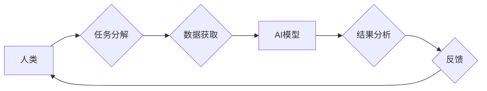

                 

## 人类-AI协作：增强人类潜能与AI能力的合作

> 关键词：人工智能、协作、人类潜能、AI能力、算法、模型、应用场景、未来趋势

### 1. 背景介绍

人工智能（AI）技术近年来发展迅速，已渗透到各个领域，从自动驾驶到医疗诊断，从金融分析到艺术创作，AI正在改变着我们的生活方式和工作模式。然而，AI技术的发展也引发了人们对未来工作格局、社会结构和伦理道德等方面的思考。

当前，AI技术仍处于发展初期，其能力主要集中在数据处理、模式识别和决策优化等方面。而人类拥有创造力、批判性思维、情感智能和复杂问题解决能力等独特的优势。因此，将人类和AI的优势结合起来，实现协同合作，是未来发展的重要方向。

### 2. 核心概念与联系

**2.1 人类-AI协作的定义**

人类-AI协作是指人类和人工智能系统在共同目标下，相互补充、协同工作，发挥各自优势，实现更高效、更智能的成果。

**2.2 协作模式**

人类-AI协作模式多种多样，主要包括：

* **人类在控制地位:** 人类制定目标和策略，AI提供数据分析、决策支持等辅助功能。
* **AI在控制地位:** AI根据预设规则和算法自动执行任务，人类进行监督、调整和决策。
* **协同决策:** 人类和AI共同参与决策过程，权衡利弊，最终达成共识。

**2.3 协作架构**



**2.4 协作优势**

* **增强人类能力:** AI可以帮助人类处理大量数据、识别复杂模式，提高工作效率和决策准确性。
* **拓展AI能力:** 人类可以为AI提供更丰富的知识、经验和情感理解，帮助AI更好地理解和应对复杂场景。
* **创造新价值:** 人类和AI的协作可以产生新的创意、解决方案和商业模式，推动社会进步。

### 3. 核心算法原理 & 具体操作步骤

**3.1 算法原理概述**

人类-AI协作的核心算法通常基于机器学习、深度学习和自然语言处理等技术。这些算法可以帮助AI系统学习人类知识、理解人类语言和行为，并与人类进行有效交互。

**3.2 算法步骤详解**

1. **数据收集和预处理:** 收集与任务相关的各种数据，并进行清洗、转换和格式化等预处理工作。
2. **模型选择和训练:** 根据任务需求选择合适的机器学习模型，并利用训练数据训练模型参数。
3. **模型评估和优化:** 对训练好的模型进行评估，并根据评估结果进行模型优化，提高模型性能。
4. **模型部署和应用:** 将训练好的模型部署到实际应用场景中，并与人类进行交互，完成协作任务。

**3.3 算法优缺点**

* **优点:** 能够学习和适应复杂环境，提高协作效率和准确性。
* **缺点:** 需要大量数据进行训练，训练过程耗时且资源消耗大，模型解释性和可信度仍有待提高。

**3.4 算法应用领域**

* **医疗诊断:** AI辅助医生诊断疾病，提高诊断准确率和效率。
* **金融风险管理:** AI识别金融风险，帮助金融机构进行风险控制和决策。
* **教育教学:** AI个性化教学，帮助学生提高学习效率和效果。
* **客户服务:** AI智能客服，提供快速、高效的客户服务。

### 4. 数学模型和公式 & 详细讲解 & 举例说明

**4.1 数学模型构建**

人类-AI协作过程可以抽象为一个优化问题，目标是找到最佳的协作策略，以实现共同目标。

**4.2 公式推导过程**

假设人类和AI的贡献分别为 $h$ 和 $a$，协作目标函数为 $f(h,a)$，则可以构建以下优化问题：

$$
\max_{h,a} f(h,a)
$$

其中，$h$ 和 $a$ 的取值范围受各自的限制条件约束。

**4.3 案例分析与讲解**

例如，在医疗诊断领域，人类医生和AI模型可以协同工作，共同诊断疾病。

* 人类医生提供临床经验、病史信息和患者沟通等方面的贡献。
* AI模型提供影像分析、数据挖掘和疾病预测等方面的贡献。

目标函数可以定义为诊断准确率，优化问题就是找到最佳的协作策略，使得诊断准确率达到最大。

### 5. 项目实践：代码实例和详细解释说明

**5.1 开发环境搭建**

* 操作系统: Ubuntu 20.04
* Python 版本: 3.8
* 必要的库: TensorFlow, PyTorch, scikit-learn

**5.2 源代码详细实现**

```python
# 人类-AI协作模型
class HumanAIModel:
    def __init__(self, human_model, ai_model):
        self.human_model = human_model
        self.ai_model = ai_model

    def predict(self, data):
        human_prediction = self.human_model.predict(data)
        ai_prediction = self.ai_model.predict(data)
        # 融合人类和AI的预测结果
        final_prediction = self.combine_predictions(human_prediction, ai_prediction)
        return final_prediction

    def combine_predictions(self, human_prediction, ai_prediction):
        # 根据具体任务需求，融合预测结果
        # 例如，可以采用加权平均法
        return (human_prediction * 0.7 + ai_prediction * 0.3)

# 实例化人类和AI模型
human_model = HumanModel()
ai_model = AIModel()
human_ai_model = HumanAIModel(human_model, ai_model)

# 使用模型进行预测
data = ...
prediction = human_ai_model.predict(data)
```

**5.3 代码解读与分析**

* `HumanAIModel` 类封装了人类和AI模型的协作逻辑。
* `predict` 方法接收数据，调用人类和AI模型进行预测，并融合预测结果。
* `combine_predictions` 方法根据具体任务需求，融合人类和AI的预测结果。

**5.4 运行结果展示**

运行结果展示可以根据具体任务和模型选择进行调整。例如，可以展示预测准确率、召回率、F1-score等指标，以及人类和AI模型的贡献度等信息。

### 6. 实际应用场景

**6.1 医疗诊断辅助**

AI可以辅助医生分析医学影像、识别病症，提高诊断准确率和效率。

**6.2 金融风险管理**

AI可以分析金融数据，识别潜在风险，帮助金融机构进行风险控制和决策。

**6.3 教育个性化教学**

AI可以根据学生的学习情况，提供个性化的学习内容和辅导，提高学习效率和效果。

**6.4 客户服务智能化**

AI可以提供智能客服，快速、高效地解答客户问题，提升客户服务体验。

**6.5 未来应用展望**

随着AI技术的不断发展，人类-AI协作将在更多领域得到应用，例如：

* **科学研究:** AI可以辅助科学家进行数据分析、模型构建和实验设计，加速科学发现。
* **艺术创作:** AI可以与艺术家合作，创作出新的艺术作品，拓展艺术的边界。
* **社会治理:** AI可以辅助政府部门进行决策分析、资源分配和公共服务管理，提高社会治理效率。

### 7. 工具和资源推荐

**7.1 学习资源推荐**

* **书籍:**
    * 《深度学习》
    * 《人工智能：一种现代方法》
    * 《机器学习实战》
* **在线课程:**
    * Coursera: 人工智能课程
    * edX: 深度学习课程
    * Udacity: 机器学习工程师课程

**7.2 开发工具推荐**

* **Python:** 广泛应用于AI开发，拥有丰富的库和框架。
* **TensorFlow:** Google开发的开源深度学习框架。
* **PyTorch:** Facebook开发的开源深度学习框架。
* **scikit-learn:** Python机器学习库。

**7.3 相关论文推荐**

* **《Attention Is All You Need》**
* **《BERT: Pre-training of Deep Bidirectional Transformers for Language Understanding》**
* **《Generative Adversarial Networks》**

### 8. 总结：未来发展趋势与挑战

**8.1 研究成果总结**

人类-AI协作领域取得了显著进展，在医疗诊断、金融风险管理、教育教学等领域取得了成功应用。

**8.2 未来发展趋势**

* **更智能的AI模型:** 发展更强大的AI模型，能够更好地理解人类语言和行为，并进行更复杂的决策。
* **更有效的协作机制:** 研究更有效的协作机制，使得人类和AI能够更有效地合作，发挥各自优势。
* **更广泛的应用场景:** 将人类-AI协作应用到更多领域，例如科学研究、艺术创作、社会治理等。

**8.3 面临的挑战**

* **算法解释性和可信度:** 提高AI模型的解释性和可信度，让人类能够更好地理解AI的决策过程。
* **数据安全和隐私保护:** 确保人类数据在AI协作过程中得到安全保护。
* **伦理道德问题:** 关注人类-AI协作带来的伦理道德问题，例如算法偏见、责任归属等。

**8.4 研究展望**

未来，人类-AI协作将继续是一个重要的研究方向，需要多学科交叉融合，共同推动该领域的发展。


### 9. 附录：常见问题与解答

**9.1 如何选择合适的协作模式？**

选择协作模式需要根据具体任务需求和人类和AI的能力特点进行综合考虑。

**9.2 如何评估协作效果？**

协作效果可以根据任务目标、效率、准确率等指标进行评估。

**9.3 如何解决算法偏见问题？**

可以通过数据预处理、算法设计和模型调优等方法来解决算法偏见问题。


作者：禅与计算机程序设计艺术 / Zen and the Art of Computer Programming 
<end_of_turn>

