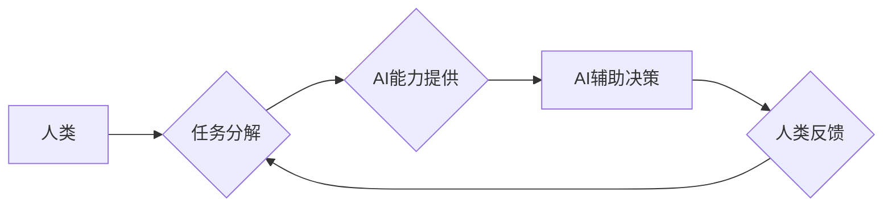

                 

## 人类-AI协作：增强人类潜能与AI能力的融合发展趋势与挑战

> 关键词：人工智能、人类-AI协作、协同智能、增强人类潜能、AI能力提升、融合发展趋势、挑战与机遇

### 1. 背景介绍

人工智能（AI）技术近年来取得了飞速发展，从语音识别、图像识别到自然语言处理等领域取得了突破性进展。AI技术的广泛应用正在深刻地改变着人类的生活方式和工作模式。然而，AI技术本身也存在局限性，例如缺乏人类的创造力、批判性思维和情感理解能力。因此，如何更好地将AI技术与人类智慧相结合，发挥两者优势，共同创造更美好的未来，成为一个重要的研究方向。

人类-AI协作，即人类与人工智能系统共同完成任务，是实现AI与人类智慧融合发展的重要途径。这种协作模式强调的是人类和AI的互补性，通过将人类的优势与AI的优势相结合，可以实现比单独行动更优的协作效果。

### 2. 核心概念与联系

**2.1 核心概念**

* **人类智慧:** 指人类的认知能力、创造力、批判性思维、情感理解和社会交互能力等。
* **人工智能:** 指能够模拟人类智能行为的计算机系统，包括学习、推理、决策、感知和语言理解等能力。
* **协同智能:** 指人类和AI系统共同完成任务的智能系统，强调的是人类和AI的互补性和协作性。

**2.2 架构图**



**2.3 联系**

人类-AI协作的核心是将人类的智慧与AI的能力相结合，实现任务的协同完成。

* 人类负责制定目标、分析问题、提供创意和进行最终决策。
* AI负责提供数据分析、模型预测、自动化执行等方面的支持，帮助人类更高效地完成任务。

人类和AI之间通过反馈机制进行交互，不断优化协作流程，最终实现共同目标。

### 3. 核心算法原理 & 具体操作步骤

**3.1 算法原理概述**

人类-AI协作的核心算法原理是基于**强化学习**和**图灵测试**的思想。

* **强化学习:** AI系统通过与环境交互，学习最佳的行动策略，以获得最大化的奖励。
* **图灵测试:** 用于评估AI系统是否能够表现出与人类相似的智能行为。

通过结合这两个原理，AI系统可以学习人类的决策模式，并根据人类的反馈不断改进自己的行为，最终达到与人类协同工作的目标。

**3.2 算法步骤详解**

1. **任务分解:** 将复杂的任务分解成多个子任务，并分配给人类和AI系统分别负责。
2. **数据收集与预处理:** 收集相关数据，并进行预处理，以便AI系统进行学习和分析。
3. **模型训练:** 利用强化学习算法，训练AI系统，使其能够根据人类的指令和反馈，做出最佳的决策。
4. **AI辅助决策:** AI系统根据训练结果，提供决策建议和支持，帮助人类做出更明智的决策。
5. **人类反馈:** 人类根据AI系统的建议和自身经验，进行反馈和修正，帮助AI系统不断学习和改进。
6. **迭代优化:** 重复上述步骤，不断迭代优化人类-AI协作流程，提高协作效率和效果。

**3.3 算法优缺点**

* **优点:**
    * 能够充分发挥人类和AI的优势，实现协同工作。
    * 提高工作效率和决策质量。
    * 促进人类智慧和AI能力的共同发展。
* **缺点:**
    * 需要建立完善的人机交互机制。
    * 需要解决数据安全和隐私保护问题。
    * 需要不断完善算法模型，提高AI系统的智能水平。

**3.4 算法应用领域**

* **医疗保健:** AI辅助医生诊断疾病、制定治疗方案。
* **金融服务:** AI辅助金融分析师进行风险评估、投资决策。
* **教育培训:** AI辅助教师个性化教学、学生学习辅导。
* **制造业:** AI辅助机器人协同工作，提高生产效率。

### 4. 数学模型和公式 & 详细讲解 & 举例说明

**4.1 数学模型构建**

人类-AI协作过程可以抽象为一个马尔可夫决策过程（MDP），其中：

* 状态空间：表示任务执行过程中系统所处的状态。
* 动作空间：表示人类和AI系统可以采取的行动。
* 转移概率：表示从一个状态到另一个状态的概率。
* 奖励函数：表示在某个状态采取某个行动获得的奖励。

**4.2 公式推导过程**

目标是找到一个策略π，使得在MDP中获得最大的累积奖励。可以使用动态规划算法或强化学习算法来求解最优策略。

**Bellman方程:**

$$
V^{\pi}(s) = \max_a \sum_{s'} P(s'|s,a) [R(s,a,s') + \gamma V^{\pi}(s')]
$$

其中：

* $V^{\pi}(s)$ 表示在状态 $s$ 下，按照策略 $\pi$ 获得的累积奖励。
* $P(s'|s,a)$ 表示从状态 $s$ 采取行动 $a$ 到达状态 $s'$ 的概率。
* $R(s,a,s')$ 表示在状态 $s$ 采取行动 $a$ 到达状态 $s'$ 时获得的奖励。
* $\gamma$ 表示折扣因子，控制未来奖励的权重。

**4.3 案例分析与讲解**

例如，在医疗诊断领域，AI系统可以根据患者的症状、病史和检查结果，预测疾病的可能性。人类医生可以根据AI系统的预测结果，结合自身经验和患者的具体情况，做出最终的诊断和治疗方案。

### 5. 项目实践：代码实例和详细解释说明

**5.1 开发环境搭建**

* Python 3.x
* TensorFlow 或 PyTorch
* Jupyter Notebook

**5.2 源代码详细实现**

```python
# 导入必要的库
import tensorflow as tf

# 定义模型结构
model = tf.keras.models.Sequential([
    tf.keras.layers.Dense(128, activation='relu', input_shape=(input_dim,)),
    tf.keras.layers.Dense(64, activation='relu'),
    tf.keras.layers.Dense(1, activation='sigmoid')
])

# 编译模型
model.compile(optimizer='adam', loss='binary_crossentropy', metrics=['accuracy'])

# 训练模型
model.fit(X_train, y_train, epochs=10, batch_size=32)

# 评估模型
loss, accuracy = model.evaluate(X_test, y_test)
print('Loss:', loss)
print('Accuracy:', accuracy)
```

**5.3 代码解读与分析**

* 该代码示例展示了如何使用TensorFlow框架构建一个简单的分类模型。
* 模型结构包括三个全连接层，分别拥有128、64和1个神经元。
* 激活函数使用ReLU函数，输出层使用sigmoid函数进行二分类。
* 模型使用Adam优化器，损失函数使用二分类交叉熵损失函数，评估指标使用准确率。
* 模型训练使用训练集X_train和y_train，并进行10个epochs的训练，每次训练32个样本。
* 训练完成后，使用测试集X_test和y_test评估模型的性能。

**5.4 运行结果展示**

运行结果会显示训练过程中的损失值和准确率，以及测试集上的损失值和准确率。

### 6. 实际应用场景

**6.1 医疗诊断辅助**

AI系统可以辅助医生诊断疾病，例如根据患者的影像数据预测肿瘤的类型和大小，帮助医生制定更精准的治疗方案。

**6.2 金融风险评估**

AI系统可以分析海量金融数据，识别潜在的风险，帮助金融机构进行更有效的风险管理。

**6.3 自动驾驶**

AI系统可以感知周围环境，做出驾驶决策，帮助实现自动驾驶汽车的普及。

**6.4 个性化教育**

AI系统可以根据学生的学习进度和特点，提供个性化的学习内容和辅导，提高学生的学习效率。

**6.5 未来应用展望**

随着AI技术的不断发展，人类-AI协作将在更多领域得到应用，例如：

* **科学研究:** AI可以辅助科学家进行数据分析和模型构建，加速科学发现。
* **艺术创作:** AI可以与艺术家合作，创作出新的艺术作品。
* **社会治理:** AI可以辅助政府部门进行决策分析和资源分配，提高社会治理效率。

### 7. 工具和资源推荐

**7.1 学习资源推荐**

* **书籍:**
    * 《深度学习》
    * 《人工智能：一种现代方法》
    * 《机器学习》
* **在线课程:**
    * Coursera
    * edX
    * Udacity

**7.2 开发工具推荐**

* **Python:** 
    * TensorFlow
    * PyTorch
    * scikit-learn
* **云平台:**
    * AWS
    * Azure
    * Google Cloud

**7.3 相关论文推荐**

* **《Attention Is All You Need》**
* **《Generative Pre-trained Transformer 3》**
* **《Deep Reinforcement Learning: An Overview》**

### 8. 总结：未来发展趋势与挑战

**8.1 研究成果总结**

人类-AI协作领域取得了显著的进展，例如在医疗诊断、金融风险评估、自动驾驶等领域取得了突破性成果。

**8.2 未来发展趋势**

* **更智能的AI系统:** AI系统将更加智能，能够更好地理解人类的需求和意图。
* **更完善的人机交互:** 人机交互方式将更加自然和便捷，例如语音交互、体感交互等。
* **更广泛的应用场景:** 人类-AI协作将应用于更多领域，例如教育、艺术、社会治理等。

**8.3 面临的挑战**

* **数据安全和隐私保护:** 人类-AI协作需要处理大量个人数据，因此数据安全和隐私保护是一个重要的挑战。
* **算法偏见:** AI算法可能存在偏见，导致不公平的结果，需要进行算法公平性评估和改进。
* **伦理问题:** 人类-AI协作引发的伦理问题，例如责任归属、决策透明度等，需要进行深入探讨和解决。

**8.4 研究展望**

未来，人类-AI协作研究将更加注重以下方面：

* **开发更安全、更可靠的AI系统。**
* **设计更人性化的交互方式。**
* **解决人类-AI协作带来的伦理问题。**

### 9. 附录：常见问题与解答

**9.1 如何确保AI系统的安全性？**

* 使用安全的机器学习算法和模型。
* 对训练数据进行严格的清洗和筛选。
* 对AI系统进行安全测试和评估。
* 建立完善的监控和报警机制。

**9.2 如何解决AI算法的偏见问题？**

* 使用多样化的训练数据，减少数据偏差。
* 使用公平性评估指标，检测算法偏见。
* 开发算法公平性改进方法，例如对抗训练、正则化等。

**9.3 人类-AI协作会取代人类的工作吗？**

人类-AI协作旨在增强人类的能力，而不是取代人类的工作。AI系统可以帮助人类完成重复性、繁琐的工作，释放人类的创造力和智力，从而提高工作效率和生活质量。


作者：禅与计算机程序设计艺术 / Zen and the Art of Computer Programming 
<end_of_turn>

