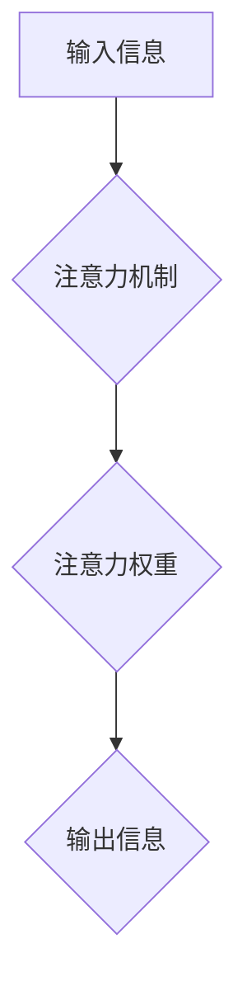

                 

## 人类注意力增强：提升专注力和注意力在教育中的技巧

> 关键词：注意力、专注力、深度学习、神经网络、认知科学、教育技术、脑机接口、增强现实

## 1. 背景介绍

在当今信息爆炸的时代，人类的注意力面临着前所未有的挑战。来自手机、社交媒体、电子邮件等各种信息源的干扰，使得人们难以集中精力完成任务，学习效率也随之降低。注意力力的下降不仅影响个人的学习和工作，也对社会整体的生产力和创新能力构成威胁。

教育领域也深受注意力问题困扰。传统的教学模式往往难以满足学生多元化的学习需求，学生容易分心，难以深入理解知识。因此，如何提升学生的注意力，帮助他们更好地学习和思考，成为教育界亟待解决的重要问题。

## 2. 核心概念与联系

### 2.1 注意力机制

注意力机制是近年来深度学习领域取得的重要突破。它模拟了人类大脑在处理信息时选择性关注特定内容的能力，并将其应用于各种机器学习任务，例如自然语言处理、计算机视觉等。

注意力机制的核心思想是通过学习一个“注意力权重”来决定模型对输入信息的关注程度。这些权重可以根据输入信息的 relevance 和 importance 进行调整，从而使模型能够更加有效地提取关键信息。

### 2.2 注意力与认知科学

注意力与认知科学有着密切的联系。认知科学研究人类的思维、学习、记忆等认知过程，而注意力是认知过程的基础之一。

认知科学研究表明，注意力是一个复杂的认知功能，它受多种因素的影响，例如个体差异、环境刺激、任务难度等。

### 2.3 注意力增强技术

注意力增强技术旨在通过各种方法提升人类的注意力能力。这些方法包括：

* **认知训练:** 通过专门的训练程序，锻炼大脑的注意力控制能力。
* **生物反馈:** 利用生物反馈技术，帮助用户了解自己的注意力状态，并通过调整行为来改善注意力。
* **技术辅助:** 利用科技手段，例如增强现实、虚拟现实等，创造沉浸式的学习环境，帮助用户集中注意力。

**Mermaid 流程图**



## 3. 核心算法原理 & 具体操作步骤

### 3.1 算法原理概述

注意力机制的核心算法原理是通过学习一个注意力权重来决定模型对输入信息的关注程度。

注意力权重可以根据输入信息的 relevance 和 importance 进行调整，从而使模型能够更加有效地提取关键信息。

常见的注意力机制算法包括：

* **自注意力机制 (Self-Attention):**  用于处理序列数据，例如文本，可以捕捉序列中不同元素之间的关系。
* **交叉注意力机制 (Cross-Attention):** 用于处理多个序列数据，例如文本和图像，可以捕捉不同模态之间的关系。

### 3.2 算法步骤详解

**自注意力机制的具体操作步骤如下：**

1. **计算查询 (Query)、键 (Key) 和值 (Value) 向量:** 将输入序列中的每个元素映射到三个不同的向量空间，分别称为查询空间、键空间和值空间。
2. **计算注意力权重:** 使用查询向量和键向量之间的相似度计算注意力权重。
3. **加权求和:** 使用注意力权重对值向量进行加权求和，得到输出向量。

**交叉注意力机制的具体操作步骤如下：**

1. **计算查询、键和值向量:** 将两个序列分别映射到三个不同的向量空间。
2. **计算注意力权重:** 使用一个序列的查询向量和另一个序列的键向量之间的相似度计算注意力权重。
3. **加权求和:** 使用注意力权重对另一个序列的值向量进行加权求和，得到输出向量。

### 3.3 算法优缺点

**注意力机制的优点:**

* 可以有效地捕捉输入信息中的关键信息。
* 可以处理长序列数据。
* 可以应用于多种机器学习任务。

**注意力机制的缺点:**

* 计算复杂度较高。
* 训练数据量较大。
* 容易受到噪声数据的影响。

### 3.4 算法应用领域

注意力机制在机器学习领域有着广泛的应用，例如：

* **自然语言处理:** 机器翻译、文本摘要、问答系统等。
* **计算机视觉:** 图像分类、目标检测、图像 captioning 等。
* **语音识别:** 语音转文本、语音合成等。

## 4. 数学模型和公式 & 详细讲解 & 举例说明

### 4.1 数学模型构建

注意力机制的数学模型可以表示为以下公式：

$$
\text{Attention}(Q, K, V) = \text{softmax}\left(\frac{Q K^T}{\sqrt{d_k}}\right) V
$$

其中：

* $Q$ 是查询向量。
* $K$ 是键向量。
* $V$ 是值向量。
* $d_k$ 是键向量的维度。
* $\text{softmax}$ 是一个归一化函数，用于计算注意力权重。

### 4.2 公式推导过程

注意力权重计算公式的推导过程如下：

1. 计算查询向量 $Q$ 和键向量 $K$ 之间的点积：

$$
QK^T
$$

2. 对点积结果进行缩放，以避免梯度爆炸问题：

$$
\frac{QK^T}{\sqrt{d_k}}
$$

3. 使用 softmax 函数对缩放后的点积结果进行归一化，得到注意力权重：

$$
\text{softmax}\left(\frac{QK^T}{\sqrt{d_k}}\right)
$$

4. 将注意力权重与值向量 $V$ 进行加权求和，得到输出向量：

$$
\text{Attention}(Q, K, V) = \text{softmax}\left(\frac{QK^T}{\sqrt{d_k}}\right) V
$$

### 4.3 案例分析与讲解

假设我们有一个句子 "The cat sat on the mat"，我们想使用自注意力机制来计算每个词对其他词的注意力权重。

1. 将每个词映射到查询、键和值向量空间。
2. 计算每个词的查询向量与其他词的键向量之间的点积。
3. 对点积结果进行缩放和归一化，得到每个词对其他词的注意力权重。
4. 将注意力权重与每个词的值向量进行加权求和，得到每个词的输出向量。

通过分析每个词的输出向量，我们可以了解每个词在句子中的重要性以及与其他词之间的关系。

## 5. 项目实践：代码实例和详细解释说明

### 5.1 开发环境搭建

* Python 3.6+
* TensorFlow 或 PyTorch

### 5.2 源代码详细实现

```python
import tensorflow as tf

# 定义自注意力机制
def self_attention(query, key, value, mask=None):
    # 计算注意力权重
    attention_weights = tf.matmul(query, key, transpose_b=True) / tf.math.sqrt(tf.cast(key.shape[-1], tf.float32))
    if mask is not None:
        attention_weights += (mask * -1e9)
    attention_weights = tf.nn.softmax(attention_weights, axis=-1)
    # 加权求和
    output = tf.matmul(attention_weights, value)
    return output

# 示例代码
query = tf.random.normal([3, 4, 64])
key = tf.random.normal([3, 4, 64])
value = tf.random.normal([3, 4, 64])

output = self_attention(query, key, value)
print(output.shape)
```

### 5.3 代码解读与分析

* `self_attention` 函数实现了一个基本的自注意力机制。
* `query`, `key`, `value` 分别代表查询向量、键向量和值向量。
* `mask` 用于屏蔽某些注意力权重，例如在机器翻译中，屏蔽已经翻译过的词。
* `tf.matmul` 函数用于计算矩阵乘法。
* `tf.nn.softmax` 函数用于计算注意力权重。
* `tf.cast` 函数用于将数据类型转换为浮点数。

### 5.4 运行结果展示

运行上述代码，输出结果为 `(3, 4, 64)`，表示注意力机制的输出向量维度与值向量维度相同。

## 6. 实际应用场景

### 6.1 教育领域

* **个性化学习:** 根据学生的注意力水平和学习风格，定制个性化的学习内容和节奏。
* **注意力训练:** 通过游戏化和互动化的训练方式，帮助学生提高注意力控制能力。
* **远程教育:** 利用注意力增强技术，提高远程教育的参与度和学习效果。

### 6.2 其他领域

* **医疗保健:** 帮助医生更好地关注患者的病情和症状。
* **交通安全:** 帮助驾驶员提高注意力，避免交通事故。
* **工作效率:** 帮助员工集中注意力，提高工作效率。

### 6.4 未来应用展望

随着人工智能技术的不断发展，注意力增强技术将有更广泛的应用场景。例如：

* **脑机接口:** 通过脑机接口技术，直接读取用户的注意力状态，并提供相应的反馈和帮助。
* **增强现实:** 利用增强现实技术，创造沉浸式的学习环境，帮助用户更好地集中注意力。
* **虚拟现实:** 利用虚拟现实技术，模拟真实世界的场景，帮助用户在虚拟环境中进行注意力训练。

## 7. 工具和资源推荐

### 7.1 学习资源推荐

* **书籍:**
    * 《深度学习》
    * 《Attention Is All You Need》
* **在线课程:**
    * Coursera: 深度学习
    * Udacity: 自然语言处理
* **博客:**
    * Jay Alammar's Blog: https://jalammar.github.io/

### 7.2 开发工具推荐

* **TensorFlow:** https://www.tensorflow.org/
* **PyTorch:** https://pytorch.org/

### 7.3 相关论文推荐

* **Attention Is All You Need:** https://arxiv.org/abs/1706.03762
* **BERT: Pre-training of Deep Bidirectional Transformers for Language Understanding:** https://arxiv.org/abs/1810.04805

## 8. 总结：未来发展趋势与挑战

### 8.1 研究成果总结

注意力机制在机器学习领域取得了显著的成果，并在自然语言处理、计算机视觉等领域得到了广泛应用。

### 8.2 未来发展趋势

未来注意力机制的研究将朝着以下方向发展：

* **更有效的注意力机制:** 设计更有效的注意力机制，提高模型的性能和效率。
* **跨模态注意力机制:** 研究跨模态注意力机制，例如文本和图像、音频和视频之间的关系。
* **可解释性注意力机制:** 研究可解释性注意力机制，使模型的注意力机制更加透明和可理解。

### 8.3 面临的挑战

注意力机制也面临着一些挑战：

* **计算复杂度:** 某些注意力机制的计算复杂度较高，难以在资源有限的设备上运行。
* **数据依赖性:** 注意力机制的性能依赖于训练数据的质量和数量。
* **泛化能力:** 注意力机制的泛化能力需要进一步提高，使其能够更好地应用于新的任务和领域。

### 8.4 研究展望

尽管面临着挑战，但注意力机制仍然是一个非常有前景的研究方向。随着人工智能技术的不断发展，注意力机制将继续发挥重要作用，并为我们带来更多创新和突破。

## 9. 附录：常见问题与解答

* **什么是注意力机制？**

注意力机制是一种模拟人类大脑选择性关注特定内容的能力的机器学习技术。

* **注意力机制有哪些应用场景？**

注意力机制在机器学习领域有着广泛的应用，例如自然语言处理、计算机视觉、语音识别等。

* **如何实现注意力机制？**

注意力机制的实现需要使用矩阵运算和 softmax 函数。

* **注意力机制的优缺点是什么？**

注意力机制的优点是能够有效地捕捉输入信息中的关键信息，并可以应用于多种机器学习任务。缺点是计算复杂度较高，训练数据量较大，容易受到噪声数据的影响。


作者：禅与计算机程序设计艺术 / Zen and the Art of Computer Programming 
<end_of_turn>

