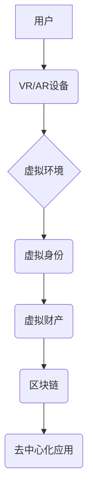

                 

## 元宇宙中的虚拟家园:数字移民的栖息地

> 关键词：元宇宙、虚拟现实、数字身份、虚拟家园、数字移民、区块链、NFT、Web3

## 1. 背景介绍

随着科技的飞速发展，元宇宙的概念逐渐从科幻小说走向现实。元宇宙被定义为一个由虚拟现实、增强现实和互联网连接而成的沉浸式数字世界，它将打破物理世界的限制，为人们提供全新的交互体验和生活方式。在这个虚拟世界中，人们可以拥有虚拟身份、虚拟财产，甚至虚拟家园。

数字移民是指将部分或全部生活迁移到元宇宙中的人群。他们可能出于对现实世界的厌倦、对新体验的渴望，或者对元宇宙中更自由、更平等的社会模式的追求。随着元宇宙的不断发展，数字移民将会成为一种越来越普遍的现象。

## 2. 核心概念与联系

### 2.1 元宇宙的核心概念

元宇宙的核心概念包括：

* **虚拟现实 (VR):** 通过头戴式设备等硬件，创造沉浸式的虚拟环境，让人们能够身临其境地体验虚拟世界。
* **增强现实 (AR):** 在现实世界中叠加虚拟元素，增强现实世界的感知和交互体验。
* **区块链:**  提供安全、透明、不可篡改的去中心化数据存储和交易平台，保障虚拟资产和身份的安全性。
* **NFT (不可替代代币):** 代表虚拟物品的唯一数字资产，可以用于交易和拥有虚拟财产。
* **Web3:** 基于区块链技术的下一代互联网，强调去中心化、用户拥有和数据隐私。

### 2.2 元宇宙架构



**图 2.1 元宇宙架构**

## 3. 核心算法原理 & 具体操作步骤

### 3.1 算法原理概述

元宇宙中的虚拟家园构建需要多种算法协同工作，包括：

* **3D建模算法:** 用于创建虚拟环境和虚拟家园的3D模型。
* **物理模拟算法:** 用于模拟虚拟环境中的物理现象，例如重力、碰撞和流体运动。
* **人工智能算法:** 用于实现虚拟家园中的智能交互，例如虚拟助手、NPC和游戏AI。
* **网络传输算法:** 用于高效地传输虚拟环境数据和用户交互信息。

### 3.2 算法步骤详解

1. **场景设计:** 首先需要根据用户的需求和喜好设计虚拟家园的场景，包括房屋结构、家具摆设、环境氛围等。
2. **3D建模:** 使用3D建模软件创建虚拟家园的3D模型，并添加材质、纹理和灯光效果。
3. **物理模拟:** 使用物理模拟算法模拟虚拟环境中的物理现象，例如物体碰撞、重力影响和流体运动。
4. **人工智能集成:** 将人工智能算法集成到虚拟家园中，实现虚拟助手、NPC和游戏AI等功能。
5. **网络传输:** 使用网络传输算法将虚拟环境数据和用户交互信息高效地传输到用户设备。
6. **用户交互:** 用户可以使用VR/AR设备或其他设备与虚拟家园进行交互，例如移动、旋转、缩放虚拟物体，与NPC对话，执行任务等。

### 3.3 算法优缺点

**优点:**

* **沉浸式体验:** 虚拟家园可以提供高度沉浸式的体验，让人们仿佛身临其境。
* **个性化定制:** 用户可以根据自己的喜好定制虚拟家园的场景、家具和装饰。
* **无限可能性:** 元宇宙中的虚拟家园可以实现各种创意和功能，例如虚拟社交、虚拟教育、虚拟娱乐等。

**缺点:**

* **技术门槛:** 构建虚拟家园需要掌握复杂的3D建模、物理模拟和人工智能算法。
* **硬件成本:** 使用VR/AR设备体验虚拟家园需要一定的硬件成本。
* **伦理问题:** 元宇宙中的虚拟家园可能引发一些伦理问题，例如虚拟身份的隐私保护、虚拟财产的合法性等。

### 3.4 算法应用领域

* **游戏:** 虚拟家园可以作为游戏中的场景，提供沉浸式的游戏体验。
* **社交:** 用户可以在虚拟家园中与朋友和家人进行社交互动。
* **教育:** 虚拟家园可以作为教育工具，提供互动式的学习体验。
* **医疗:** 虚拟家园可以用于医疗培训和治疗，例如模拟手术和治疗场景。
* **商业:** 商家可以在虚拟家园中展示产品和服务，与用户进行互动。

## 4. 数学模型和公式 & 详细讲解 & 举例说明

### 4.1 数学模型构建

虚拟家园的构建需要多种数学模型来描述虚拟环境的几何形状、物理特性和用户交互行为。

* **3D几何模型:** 使用向量、矩阵和坐标系来描述虚拟环境中的物体形状和位置。
* **物理模型:** 使用牛顿运动定律、万有引力定律等物理定律来模拟虚拟环境中的物理现象。
* **用户行为模型:** 使用统计模型和机器学习算法来预测用户的行为模式和交互方式。

### 4.2 公式推导过程

例如，为了模拟虚拟环境中的物体碰撞，可以使用以下公式：

$$
F = m * a
$$

其中：

* $F$ 是物体受到的力
* $m$ 是物体的质量
* $a$ 是物体的加速度

### 4.3 案例分析与讲解

假设两个虚拟物体 A 和 B 在虚拟环境中碰撞，它们的质量分别为 $m_A$ 和 $m_B$，碰撞时的速度分别为 $v_{A}$ 和 $v_{B}$。碰撞后，它们的最终速度分别为 $v_{A}'$ 和 $v_{B}'$。

可以使用牛顿碰撞定律来计算碰撞后的速度：

$$
m_A * v_{A} + m_B * v_{B} = m_A * v_{A}' + m_B * v_{B}'
$$

同时，碰撞过程中动量守恒，因此：

$$
m_A * v_{A} - m_A * v_{A}' = m_B * v_{B}' - m_B * v_{B}
$$

通过解这两个方程，可以得到碰撞后的速度 $v_{A}'$ 和 $v_{B}'$。

## 5. 项目实践：代码实例和详细解释说明

### 5.1 开发环境搭建

构建虚拟家园的开发环境需要以下软件和硬件：

* **操作系统:** Windows、macOS 或 Linux
* **编程语言:** C++、C# 或 Python
* **3D建模软件:** Blender、Maya 或 3ds Max
* **游戏引擎:** Unity 或 Unreal Engine
* **VR/AR设备:** Oculus Rift、HTC Vive 或 ARKit/ARCore

### 5.2 源代码详细实现

以下是一个简单的虚拟家园代码示例，使用Python语言和Pygame库实现：

```python
import pygame

# 初始化 Pygame
pygame.init()

# 设置窗口大小
screen_width = 800
screen_height = 600
screen = pygame.display.set_mode((screen_width, screen_height))

# 设置标题
pygame.display.set_caption("虚拟家园")

# 加载背景图片
background_image = pygame.image.load("background.png").convert()

# 创建虚拟房屋
house_image = pygame.image.load("house.png").convert_alpha()
house_x = 300
house_y = 200

# 游戏循环
running = True
while running:
    # 处理事件
    for event in pygame.event.get():
        if event.type == pygame.QUIT:
            running = False

    # 绘制背景
    screen.blit(background_image, (0, 0))

    # 绘制虚拟房屋
    screen.blit(house_image, (house_x, house_y))

    # 更新显示
    pygame.display.flip()

# 退出 Pygame
pygame.quit()
```

### 5.3 代码解读与分析

这段代码实现了一个简单的虚拟家园，包含以下功能：

* 初始化 Pygame 库
* 设置窗口大小和标题
* 加载背景图片和虚拟房屋图片
* 在窗口中绘制背景图片和虚拟房屋
* 处理用户退出事件

### 5.4 运行结果展示

运行这段代码后，将会在窗口中显示一个简单的虚拟家园，包含背景图片和虚拟房屋。

## 6. 实际应用场景

### 6.1 数字移民的栖息地

元宇宙中的虚拟家园可以为数字移民提供一个新的生活空间，让他们可以逃离现实世界的压力和束缚，享受虚拟世界的自由和平等。

### 6.2 虚拟社交平台

虚拟家园可以作为虚拟社交平台，人们可以在虚拟家园中与朋友和家人进行互动，举办虚拟聚会，体验新的社交方式。

### 6.3 虚拟教育和培训

虚拟家园可以用于虚拟教育和培训，例如模拟真实场景进行教学，提供沉浸式的学习体验。

### 6.4 未来应用展望

随着元宇宙技术的不断发展，虚拟家园将会更加丰富多彩，并应用于更多领域，例如虚拟旅游、虚拟商业、虚拟医疗等。

## 7. 工具和资源推荐

### 7.1 学习资源推荐

* **书籍:** 《元宇宙：下一代互联网》
* **网站:** Meta, Decentraland, Sandbox
* **课程:** Coursera, Udemy

### 7.2 开发工具推荐

* **3D建模软件:** Blender, Maya, 3ds Max
* **游戏引擎:** Unity, Unreal Engine
* **区块链平台:** Ethereum, Polygon

### 7.3 相关论文推荐

* **《元宇宙：概念、技术和应用》**
* **《区块链技术在元宇宙中的应用》**

## 8. 总结：未来发展趋势与挑战

### 8.1 研究成果总结

元宇宙中的虚拟家园是一个充满潜力的概念，它将改变人们的生活方式和工作方式。

### 8.2 未来发展趋势

* **更加沉浸式的体验:** 未来虚拟家园将会更加逼真、更加沉浸式，让人们能够更加真实地体验虚拟世界。
* **更加个性化的定制:** 用户将能够更加个性化地定制虚拟家园，使其更加符合自己的喜好和需求。
* **更加丰富的功能:** 虚拟家园将会提供更加丰富的功能，例如虚拟社交、虚拟教育、虚拟娱乐等。

### 8.3 面临的挑战

* **技术挑战:** 构建虚拟家园需要克服许多技术挑战，例如高性能计算、实时渲染、网络传输等。
* **伦理挑战:** 元宇宙中的虚拟家园可能引发一些伦理问题，例如虚拟身份的隐私保护、虚拟财产的合法性等。
* **社会挑战:** 元宇宙的普及可能会对现实社会产生一些影响，例如人们对虚拟世界的沉迷、虚拟和现实世界的界限模糊等。

### 8.4 研究展望

未来，我们需要继续研究元宇宙中的虚拟家园，探索其潜力，解决其挑战，并将其应用于更多领域，为人类创造更加美好的未来。

## 9. 附录：常见问题与解答

### 9.1 如何进入元宇宙？

目前，可以通过VR/AR设备或电脑浏览器进入元宇宙。

### 9.2 元宇宙中的虚拟财产如何获得？

虚拟财产可以通过购买、交易、创作等方式获得。

### 9.3 元宇宙中的虚拟身份如何保护？

虚拟身份的保护需要依赖于区块链技术的安全性，以及用户自身的防范意识。


作者：禅与计算机程序设计艺术 / Zen and the Art of Computer Programming 
<end_of_turn>

