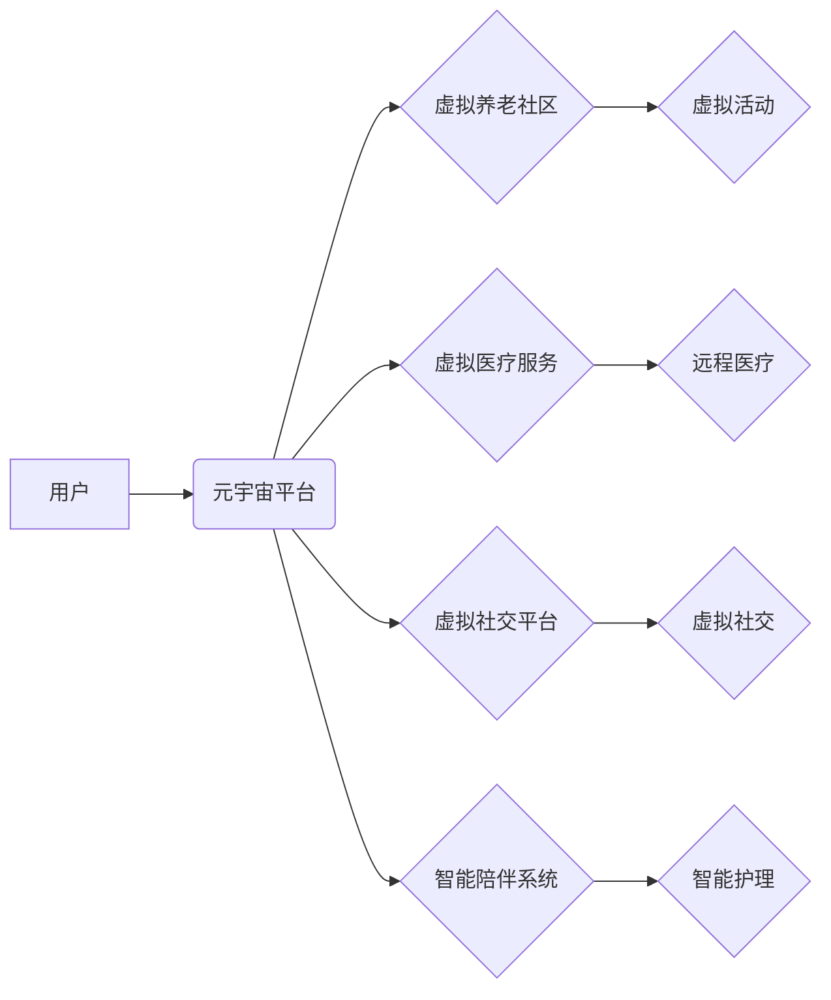

                 

## 元宇宙养老规划:数字化老年生活的质量提升

> 关键词：元宇宙、养老规划、数字化生活、老年人健康、虚拟现实、人工智能、远程医疗、社交互动

## 1. 背景介绍

随着全球人口老龄化进程的加速，养老问题日益凸显。传统养老模式面临着资源短缺、服务质量参差不齐等挑战。元宇宙作为一种新兴技术，以其沉浸式体验、虚拟社交、远程互动等特点，为养老服务提供了全新的可能性。

元宇宙养老规划旨在利用元宇宙技术，构建一个虚拟空间，为老年人提供个性化、便捷、高质量的养老服务，提升老年人的生活质量和幸福感。

### 1.1 老年人口增长与养老服务需求

世界人口老龄化趋势不可阻挡，预计到2050年，全球65岁及以上人口将达到16%以上。中国作为世界人口最多的国家，老龄化进程更为迅速。随着老年人口的增加，养老服务需求量将大幅增长，传统养老模式难以满足日益增长的需求。

### 1.2 元宇宙技术与养老服务

元宇宙技术融合了虚拟现实、增强现实、人工智能、大数据等前沿技术，能够构建一个虚拟世界，用户可以通过虚拟身份在其中生活、工作、娱乐。元宇宙的沉浸式体验、虚拟社交、远程互动等特点，为养老服务提供了新的思路和解决方案。

## 2. 核心概念与联系

元宇宙养老规划的核心概念包括：

* **元宇宙:**  一个基于互联网的虚拟世界，用户可以通过虚拟身份在其中进行交互、体验和创造。
* **数字化养老:** 利用数字化技术，为老年人提供个性化、便捷、高质量的养老服务。
* **虚拟现实 (VR):**  一种模拟真实环境的沉浸式体验技术，可以帮助老年人体验虚拟旅游、虚拟社交等活动。
* **增强现实 (AR):**  一种将虚拟信息叠加到现实世界中的技术，可以帮助老年人识别物品、获取信息等。
* **人工智能 (AI):**  一种能够模拟人类智能的计算机技术，可以用于智能陪伴、远程医疗、个性化服务等领域。

元宇宙养老规划的架构可以概括为：



## 3. 核心算法原理 & 具体操作步骤

### 3.1  算法原理概述

元宇宙养老规划的核心算法包括：

* **个性化推荐算法:** 根据老年人的兴趣爱好、健康状况等信息，推荐个性化的虚拟活动、服务和内容。
* **虚拟环境生成算法:**  根据老年人的需求，生成虚拟环境，模拟真实场景，提供沉浸式体验。
* **智能陪伴算法:** 利用人工智能技术，开发智能陪伴系统，为老年人提供情感支持、生活帮助等服务。
* **远程医疗算法:**  利用远程医疗技术，为老年人提供远程诊断、治疗、康复等服务。

### 3.2  算法步骤详解

**个性化推荐算法:**

1. 收集老年人的个人信息，包括兴趣爱好、健康状况、生活习惯等。
2. 利用机器学习算法，分析老年人的数据，构建用户画像。
3. 根据用户画像，推荐个性化的虚拟活动、服务和内容。

**虚拟环境生成算法:**

1. 确定虚拟环境的主题和场景。
2. 利用3D建模技术，构建虚拟环境的模型。
3. 添加虚拟物品、角色和交互功能。
4. 优化虚拟环境的性能和体验。

**智能陪伴算法:**

1. 开发基于自然语言处理和机器学习的智能聊天机器人。
2. 训练智能聊天机器人，使其能够理解老年人的需求和情感。
3. 提供情感支持、生活帮助、陪伴聊天等服务。

**远程医疗算法:**

1. 利用远程医疗设备，收集老年人的健康数据。
2. 利用人工智能算法，分析健康数据，进行远程诊断。
3. 提供远程治疗、康复等服务。

### 3.3  算法优缺点

**优点:**

* 个性化服务:  根据老年人的需求，提供个性化的服务和内容。
* 沉浸式体验:  利用虚拟现实技术，提供沉浸式体验，丰富老年人的生活。
* 远程互动:  打破地域限制，方便老年人与家人朋友进行远程互动。
* 智能化服务:  利用人工智能技术，提供智能陪伴、远程医疗等服务，提升服务效率和质量。

**缺点:**

* 技术门槛:  元宇宙技术复杂，开发和应用需要一定的技术门槛。
* 硬件成本:  虚拟现实设备等硬件成本较高，可能存在普及性问题。
* 数据安全:  收集和存储老年人的个人信息需要保障数据安全。
* 伦理问题:  元宇宙养老规划涉及到伦理问题，需要进行深入探讨和规范。

### 3.4  算法应用领域

元宇宙养老规划的算法可以应用于以下领域:

* **虚拟养老社区:**  为老年人提供虚拟社交、娱乐、学习等服务。
* **虚拟医疗服务:**  提供远程诊断、治疗、康复等服务。
* **智能陪伴系统:**  为老年人提供情感支持、生活帮助等服务。
* **个性化养老服务:**  根据老年人的需求，提供个性化的服务和内容。

## 4. 数学模型和公式 & 详细讲解 & 举例说明

### 4.1  数学模型构建

元宇宙养老规划的数学模型可以基于以下几个方面构建:

* **用户行为模型:**  利用马尔科夫链或其他概率模型，预测老年用户的虚拟行为，例如虚拟活动选择、社交互动频率等。
* **虚拟环境优化模型:**  利用线性规划或其他优化算法，优化虚拟环境的布局、交互设计等，以提高用户体验。
* **个性化推荐模型:**  利用协同过滤、内容过滤等推荐算法，根据用户的兴趣爱好、健康状况等信息，推荐个性化的虚拟服务和内容。

### 4.2  公式推导过程

**用户行为预测模型:**

假设用户在虚拟环境中进行的活动有n种，状态转移概率矩阵为P，其中P(i,j)表示用户从状态i转移到状态j的概率。用户行为序列可以表示为：

$$
S = (s_1, s_2, ..., s_t)
$$

其中，$s_i$表示用户在第i个时间步的状态。用户行为预测模型的目标是预测用户在未来时间步的状态。

根据马尔科夫假设，用户在当前时间步的状态只依赖于前一个时间步的状态，因此可以利用状态转移概率矩阵P预测用户在未来时间步的状态：

$$
P(s_{t+1}|S_t) = P(s_{t+1}|s_t)
$$

### 4.3  案例分析与讲解

**虚拟环境优化模型:**

假设虚拟环境中存在多个活动区域，每个区域的面积和用户流量不同。利用线性规划模型，可以优化虚拟环境的布局，使得每个区域的用户流量均衡，提高用户体验。

**目标函数:**

$$
Minimize \sum_{i=1}^{n} (U_i - \bar{U})^2
$$

其中，$U_i$表示第i个区域的用户流量，$\bar{U}$表示平均用户流量。

**约束条件:**

* 每个区域的面积不能超过最大限制。
* 虚拟环境中所有区域的总面积不能超过总面积限制。

## 5. 项目实践：代码实例和详细解释说明

### 5.1  开发环境搭建

元宇宙养老规划项目可以使用Unity3D、Unreal Engine等游戏引擎进行开发。开发环境搭建需要安装相应的软件和工具，例如：

* Unity3D/Unreal Engine
* C#/.NET Framework
* Visual Studio
* Git

### 5.2  源代码详细实现

以下是一个简单的虚拟养老社区代码示例，使用Unity3D开发：

```csharp
using UnityEngine;

public class VirtualCommunity : MonoBehaviour
{
    public GameObject[] avatars; // 虚拟居民角色

    void Start()
    {
        // 初始化虚拟居民角色
        foreach (GameObject avatar in avatars)
        {
            avatar.SetActive(true);
        }
    }

    void Update()
    {
        // 虚拟居民角色的移动和交互逻辑
    }
}
```

### 5.3  代码解读与分析

* `avatars` 数组存储虚拟居民角色的 GameObject 对象。
* `Start()` 方法在场景加载时执行，用于初始化虚拟居民角色。
* `Update()` 方法在每一帧更新时执行，用于处理虚拟居民角色的移动和交互逻辑。

### 5.4  运行结果展示

运行该代码后，虚拟社区场景中将出现多个虚拟居民角色，可以自由移动和交互。

## 6. 实际应用场景

元宇宙养老规划可以应用于以下实际场景:

* **虚拟养老社区:** 为老年人提供虚拟社交、娱乐、学习等服务，缓解孤独感，丰富生活。
* **虚拟医疗服务:**  为老年人提供远程诊断、治疗、康复等服务，方便老年人获得医疗资源。
* **智能陪伴系统:** 为老年人提供情感支持、生活帮助等服务，提高老年人的生活质量。
* **虚拟旅游:**  为老年人提供虚拟旅游体验，让他们在家中也能感受世界各地风光。

### 6.4  未来应用展望

未来，元宇宙养老规划将更加智能化、个性化、沉浸式。

* **更智能的陪伴系统:**  利用人工智能技术，开发更智能的陪伴系统，能够理解老年人的情感需求，提供更精准的陪伴服务。
* **更丰富的虚拟体验:**  利用增强现实、虚拟现实等技术，为老年人提供更丰富的虚拟体验，例如虚拟博物馆、虚拟公园等。
* **更便捷的远程医疗服务:**  利用远程医疗技术，为老年人提供更便捷的远程医疗服务，例如远程诊断、远程手术等。

## 7. 工具和资源推荐

### 7.1  学习资源推荐

* **元宇宙技术相关书籍:**  《元宇宙：下一代互联网》
* **虚拟现实开发相关教程:**  Unity3D官方教程、Unreal Engine官方教程
* **人工智能技术相关课程:**  Coursera、edX等在线学习平台

### 7.2  开发工具推荐

* **游戏引擎:**  Unity3D、Unreal Engine
* **编程语言:**  C#、C++
* **3D建模软件:**  Blender、Maya

### 7.3  相关论文推荐

* **元宇宙养老规划相关论文:**  可通过学术搜索引擎（如Google Scholar、IEEE Xplore）搜索相关论文。

## 8. 总结：未来发展趋势与挑战

### 8.1  研究成果总结

元宇宙养老规划是一个新兴领域，近年来取得了显著进展。

* **技术方面:**  虚拟现实、增强现实、人工智能等技术不断发展，为元宇宙养老规划提供了技术支撑。
* **应用方面:**  元宇宙养老规划已在一些国家和地区开始应用，取得了一定的效果。

### 8.2  未来发展趋势

* **更加智能化:**  利用人工智能技术，开发更智能的虚拟陪伴系统、医疗服务系统等。
* **更加个性化:**  根据老年人的个性需求，提供定制化的虚拟服务和内容。
* **更加沉浸式:**  利用增强现实、虚拟现实等技术，为老年人提供更沉浸式的虚拟体验。

### 8.3  面临的挑战

* **技术挑战:**  元宇宙技术复杂，开发和应用需要克服技术难题。
* **成本挑战:**  虚拟现实设备等硬件成本较高，可能存在普及性问题。
* **伦理挑战:**  元宇宙养老规划涉及到伦理问题，需要进行深入探讨和规范。

### 8.4  研究展望

未来，元宇宙养老规划将继续发展，为老年人提供更优质的养老服务，提升老年人的生活质量和幸福感。

## 9. 附录：常见问题与解答

* **元宇宙养老规划是否会取代传统养老模式?**

元宇宙养老规划并非取代传统养老模式，而是补充和完善传统养老模式，为老年人提供更多选择。

* **元宇宙养老规划的安全性和隐私性如何保障?**

元宇宙养老规划需要严格保障用户数据安全和隐私，采用加密技术、匿名技术等措施，防止数据泄露和滥用。

* **元宇宙养老规划的成本如何控制?**

元宇宙养老规划的成本需要通过政府补贴、社会保险、商业模式等多种方式共同承担，降低老年人负担。


作者：禅与计算机程序设计艺术 / Zen and the Art of Computer Programming 
<end_of_turn>

