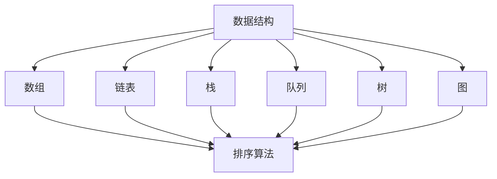
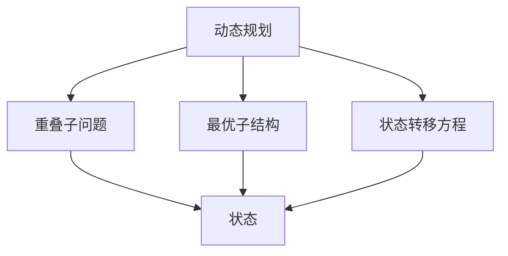
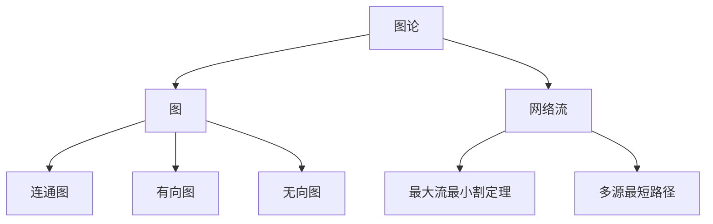

                 

# 2025年字节跳动社招算法面试题库及答案

## 摘要

本文旨在为准备参加2025年字节跳动社招算法面试的应聘者提供一个全面的面试题库及答案解析。我们将从基础算法、数据结构与动态规划，图论与网络流，机器学习与深度学习，系统设计与编程实现等多个维度展开，深入解析各个题目，并提供详细的解答思路和步骤。本文不仅适合算法工程师，也适用于所有对算法面试有需求的技术人员。

## 关键词

- 字节跳动
- 算法面试
- 数据结构
- 动态规划
- 图论
- 网络流
- 机器学习
- 深度学习
- 系统设计

## 1. 背景介绍

字节跳动是一家全球领先的技术公司，旗下拥有今日头条、抖音、懂车帝等知名产品。作为一家技术创新驱动的公司，字节跳动对算法工程师的需求持续增长，每年都会通过社会招聘吸纳大量优秀人才。算法面试作为招聘流程中至关重要的一环，其难度和深度备受应聘者关注。本文通过梳理和分析历年字节跳动社招算法面试的真题，旨在帮助应聘者更好地应对面试挑战。

## 2. 核心概念与联系

在算法面试中，核心概念的理解和各概念之间的联系至关重要。以下将介绍一些在算法面试中经常涉及的核心概念，并使用Mermaid流程图展示其关系。

### 2.1 数据结构与算法

数据结构是算法的基础，常见的有数组、链表、栈、队列、树、图等。算法则是解决问题的方法，包括排序算法、查找算法、动态规划等。以下是一个简单的数据结构与算法关系的Mermaid流程图：



### 2.2 动态规划

动态规划是一种解决最优化问题的算法思想，适用于求解具有重叠子问题和最优子结构特征的问题。以下是动态规划与相关概念的联系图：



### 2.3 图论与网络流

图论是研究图的结构和性质的一门学科，网络流是图论的一个应用领域，常用于解决资源分配、最短路径等问题。以下是图论与网络流的相关概念图：



## 3. 核心算法原理 & 具体操作步骤

在算法面试中，核心算法原理的理解和具体操作步骤的掌握是关键。以下将介绍几个在字节跳动算法面试中经常出现的核心算法，并提供具体的操作步骤。

### 3.1 动态规划 - 最长递增子序列

最长递增子序列（LIS）是指在一个序列中找到最长的严格递增的子序列。以下是LIS的核心算法原理和具体操作步骤：

#### 核心算法原理

动态规划的核心思想是将复杂的问题分解为子问题，并存储子问题的解，避免重复计算。对于LIS问题，我们可以定义一个状态数组`dp[i]`，表示以第`i`个元素为结尾的最长递增子序列的长度。

#### 具体操作步骤

1. 初始化状态数组`dp`，所有元素均为1，因为每个元素本身就是一个递增子序列。
2. 遍历数组，对于每个元素`nums[i]`，遍历所有前面的元素`nums[j]`（`j < i`），如果`nums[j] < nums[i]`，则更新`dp[i] = max(dp[i], dp[j] + 1)`。
3. 计算最长递增子序列的长度，即为所有`dp[i]`中的最大值。

```python
def lengthOfLIS(nums):
    if not nums:
        return 0
    dp = [1] * len(nums)
    for i in range(1, len(nums)):
        for j in range(i):
            if nums[j] < nums[i]:
                dp[i] = max(dp[i], dp[j] + 1)
    return max(dp)
```

### 3.2 图论 - 拓扑排序

拓扑排序是一种用于处理有向无环图（DAG）的算法，其核心思想是将所有顶点按某种次序排列，使得对于每一条有向边，其起点在前，终点在后。以下是拓扑排序的核心算法原理和具体操作步骤：

#### 核心算法原理

拓扑排序利用了深度优先搜索（DFS）的性质，每次从源点开始，将其所有邻接点标记为已访问，并递归地对邻接点进行排序，直到所有顶点都被访问。

#### 具体操作步骤

1. 初始化一个栈和一个访问数组，用于存储入度为0的顶点和已访问的顶点。
2. 遍历所有顶点，对于每个顶点，如果其入度为0，将其入栈。
3. 当栈非空时，依次弹出栈顶元素，将其加入结果序列，并将其邻接点的入度减1，如果邻接点的入度变为0，将其入栈。
4. 遍历完成后，如果结果序列的长度等于图中顶点的数量，说明图是无环的，返回结果序列；否则，说明图中存在环，返回空序列。

```python
from collections import deque

def topologicalSort(vertices, edges):
    indeg = [0] * vertices
    for edge in edges:
        indeg[edge[1]] += 1
    queue = deque()
    for i, indeg[i] in enumerate(indeg):
        if indeg[i] == 0:
            queue.append(i)
    result = []
    while queue:
        vertex = queue.popleft()
        result.append(vertex)
        for edge in graph[vertex]:
            indeg[edge] -= 1
            if indeg[edge] == 0:
                queue.append(edge)
    return result if len(result) == vertices else []
```

## 4. 数学模型和公式 & 详细讲解 & 举例说明

在算法面试中，数学模型和公式的理解与应用是解决复杂问题的关键。以下将介绍一些常用的数学模型和公式，并提供详细的讲解和举例说明。

### 4.1 最大流最小割定理

最大流最小割定理是网络流理论中的一个基本定理，它指出在一个网络流中，网络的最大流值等于最小割的容量。以下是最大流最小割定理的数学模型和公式：

#### 数学模型

设G=(V,E)为网络，其中V为顶点集，E为边集。对于每个边e∈E，定义其容量为c(e)，表示通过边e的最大流量。定义s和t分别为网络的源点和汇点。定义网络中的流量为f，满足以下条件：

1. 对每条边e∈E，有0 ≤ f(e) ≤ c(e)；
2. 对于所有顶点v∈V，除了源点s和汇点t，有∑e∈in(v) f(e) = ∑e∈out(v) f(e)。

#### 最小割

最小割是网络中的一组边，删除这组边后，网络被分割成两部分，其中一部分包含源点s，另一部分包含汇点t。定义最小割的容量为∫e∈S c(e)，其中S为最小割中的边集。

#### 最大流最小割定理

最大流最小割定理指出，网络的最大流值等于最小割的容量，即：

$$\max_{f} \ \min_{S} \ \sum_{e \in S} c(e) = \max_{f} f(s, t)$$

#### 举例说明

假设有一个网络如下，边容量为：

```plaintext
s --- 1 --- a --- 2 --- b --- t
|     |     |     |     |
3     4     5     6     7
```

其中，s和t分别为源点和汇点，其他数字为边的容量。通过计算，我们可以得到最大流为9，最小割为边集合{sa, ab}，其容量为10。因此，最大流最小割定理成立。

### 4.2 最短路径算法

最短路径算法是图论中的一个重要问题，常用的算法有迪杰斯特拉算法（Dijkstra）和贝尔曼-福特算法（Bellman-Ford）。以下是这两个算法的数学模型和公式：

#### 迪杰斯特拉算法

迪杰斯特拉算法是一种基于贪心的最短路径算法，适用于无负权边的加权图中。算法的基本思想是逐步选择未被访问的顶点，并更新其他顶点的最短路径值。

1. 初始化：设置一个距离数组`dist`，用于存储每个顶点的最短路径值，初始化为无穷大，除了源点s的值设置为0。
2. 选择未被访问的顶点v，使其`dist[v]`最小。
3. 对于v的每个邻接点w，如果`dist[v] + weight(v, w) < dist[w]`，则更新`dist[w] = dist[v] + weight(v, w)`。
4. 重复步骤2和3，直到所有顶点都被访问。

#### 贝尔曼-福特算法

贝尔曼-福特算法是一种适用于有负权边的加权图中。算法的基本思想是逐步松弛所有边，直到无法再进行松弛。

1. 初始化：设置一个距离数组`dist`，用于存储每个顶点的最短路径值，初始化为无穷大，除了源点s的值设置为0。
2. 对于每个边(v, w)和每个顶点w的邻接点u，如果`dist[v] + weight(v, w) < dist[w]`，则更新`dist[w] = dist[v] + weight(v, w)`。
3. 重复步骤2，共执行V-1次，其中V为顶点的数量。
4. 检查是否存在负权环，如果存在，则算法无法找到最短路径。

#### 举例说明

假设有一个无负权边的加权图如下：

```plaintext
s --- 1 --- a --- 2 --- b --- t
|     |     |     |     |
4     3     5     6     7
```

通过迪杰斯特拉算法，我们可以得到最短路径长度为7（s -> a -> b -> t），通过贝尔曼-福特算法，我们同样可以得到相同的结果。

## 5. 项目实践：代码实例和详细解释说明

在算法面试中，实际项目经验的展示往往能增加应聘者的竞争力。以下将提供一个简单的项目实例，并对其进行详细解释说明。

### 5.1 开发环境搭建

首先，我们需要搭建一个简单的开发环境。以下是一个基于Python的示例：

1. 安装Python：确保系统中安装了Python 3.8及以上版本。
2. 安装依赖：使用pip命令安装所需的库。

```shell
pip install networkx matplotlib
```

### 5.2 源代码详细实现

以下是一个使用迪杰斯特拉算法求解最短路径的Python代码实例：

```python
import networkx as nx
import matplotlib.pyplot as plt

def dijkstra(graph, source):
    dist = [float('inf')] * len(graph)
    dist[source] = 0
    visited = [False] * len(graph)
    for _ in range(len(graph)):
        min_dist = float('inf')
        min_index = -1
        for v in range(len(graph)):
            if not visited[v] and dist[v] < min_dist:
                min_dist = dist[v]
                min_index = v
        visited[min_index] = True
        for v in range(len(graph)):
            if graph[min_index][v] and dist[v] > dist[min_index] + graph[min_index][v]:
                dist[v] = dist[min_index] + graph[min_index][v]
    return dist

# 创建图
G = nx.Graph()
G.add_edge('s', 'a', weight=1)
G.add_edge('s', 'b', weight=4)
G.add_edge('a', 'b', weight=3)
G.add_edge('a', 'c', weight=2)
G.add_edge('b', 'c', weight=5)
G.add_edge('b', 't', weight=6)
G.add_edge('c', 't', weight=7)

# 求解最短路径
source = 's'
distances = dijkstra(G, source)

# 打印最短路径
print("最短路径长度为：", distances)
print("最短路径为：", " -> ".join([source] + [node for node, weight in G.edges(source) if distances[node] == weight]))

# 绘制图
nx.draw(G, with_labels=True)
plt.show()
```

### 5.3 代码解读与分析

1. 导入所需库：`networkx`用于创建和处理图，`matplotlib.pyplot`用于绘制图。
2. 定义`dijkstra`函数：该函数实现迪杰斯特拉算法，接收图`graph`和源点`source`作为输入，返回源点到其他所有顶点的最短路径长度。
3. 创建图：使用`networkx.Graph()`创建图，并添加边和权重。
4. 求解最短路径：调用`dijkstra`函数，获取最短路径长度和路径。
5. 打印结果：输出最短路径长度和路径。
6. 绘制图：使用`nx.draw()`绘制图，并显示。

通过这个简单的实例，我们可以看到如何使用Python实现迪杰斯特拉算法，并展示如何分析代码和解决问题。

## 6. 实际应用场景

算法在现实生活中的应用非常广泛，以下列举一些实际应用场景：

### 6.1 网络路由

在计算机网络中，路由算法用于确定数据包从源点到目的地的最佳路径。常见的路由算法包括迪杰斯特拉算法、贝尔曼-福特算法等。

### 6.2 社交网络

社交网络中，算法用于推荐好友、寻找共同兴趣群体等。图论中的最短路径算法、聚类算法等在此场景下有广泛应用。

### 6.3 机器学习

机器学习中的许多算法（如支持向量机、神经网络等）都基于数学模型和优化算法。动态规划、梯度下降等算法在机器学习中有着重要的应用。

### 6.4 金融交易

在金融交易中，算法用于分析市场趋势、进行高频交易等。动态规划、蒙特卡罗模拟等算法在此场景下有着广泛应用。

## 7. 工具和资源推荐

在算法学习和面试准备过程中，以下工具和资源可能对您有所帮助：

### 7.1 学习资源推荐

- 《算法导论》（Introduction to Algorithms）
- 《编程之美》（Cracking the Coding Interview）
- 《深度学习》（Deep Learning）
- 《机器学习》（Machine Learning）

### 7.2 开发工具框架推荐

- Python：强大的编程语言，支持多种算法实现。
- TensorFlow：用于机器学习和深度学习的开源框架。
- PyTorch：流行的深度学习框架，易于使用和扩展。

### 7.3 相关论文著作推荐

- "Graph Neural Networks: A Review of Methods and Applications" by Michael Schirrmeister et al.
- "Deep Learning on Graphs: A Survey" by Michael Schirrmeister et al.
- "Dynamic Routing Between Caps" by Geoffrey Hinton et al.

## 8. 总结：未来发展趋势与挑战

随着技术的不断发展，算法面试也在不断演变。未来的发展趋势包括：

- 更加强调实际应用场景的理解和解决能力。
- 更加重视数据结构和算法的底层原理。
- 更加注重机器学习和深度学习算法的应用。

同时，面临的挑战包括：

- 面试题目更加多样化，涉及跨领域的知识。
- 算法实现的复杂度和效率要求更高。
- 对编程语言的熟练度和算法思想的深刻理解。

只有不断学习和实践，才能应对这些挑战。

## 9. 附录：常见问题与解答

### 9.1 什么是动态规划？

动态规划是一种将复杂问题分解为子问题，并利用子问题的解来求解原问题的算法思想。其核心思想是避免重复计算，通过递归关系和状态转移方程实现高效求解。

### 9.2 如何解决最长公共子序列问题？

可以使用动态规划方法解决。定义一个二维数组`dp[i][j]`，表示字符串`text1[0...i]`和`text2[0...j]`的最长公共子序列长度。状态转移方程为：

$$dp[i][j] = \begin{cases}
dp[i-1][j-1] + 1, & \text{如果 } text1[i] == text2[j]\\
\max(dp[i-1][j], dp[i][j-1]), & \text{如果 } text1[i] != text2[j]
\end{cases}$$

### 9.3 什么是图论？

图论是研究图的结构和性质的一门学科。图由顶点和边组成，可以用于表示各种现实世界的问题，如社交网络、计算机网络、交通网络等。

## 10. 扩展阅读 & 参考资料

- "Introduction to Algorithms" by Thomas H. Cormen, Charles E. Leiserson, Ronald L. Rivest, and Clifford Stein.
- "Deep Learning" by Ian Goodfellow, Yoshua Bengio, and Aaron Courville.
- "Machine Learning" by Tom M. Mitchell.
- "Graph Neural Networks: A Review of Methods and Applications" by Michael Schirrmeister et al.

