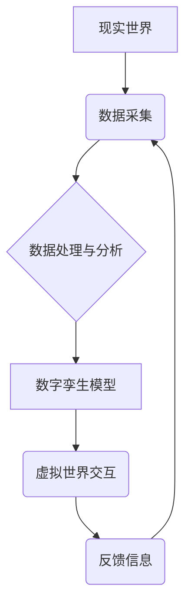

                 

## 元宇宙数字孪生伦理:现实映射的道德边界探讨

> 关键词：元宇宙、数字孪生、伦理、道德边界、数据隐私、算法偏见、责任与问责

## 1. 背景介绍

元宇宙概念的兴起，为我们构建更加沉浸式、交互式的虚拟世界提供了无限可能。数字孪生作为元宇宙的重要组成部分，通过构建与现实世界相对应的虚拟模型，实现对现实世界的实时模拟和预测。然而，数字孪生的发展也引发了诸多伦理和道德问题，这些问题需要我们认真思考和探讨。

随着数字孪生技术的不断成熟，其应用场景也日益广泛，涵盖了工业、医疗、城市管理等多个领域。例如，在工业领域，数字孪生可以用于设备的虚拟测试和故障诊断，提高生产效率和降低成本；在医疗领域，数字孪生可以用于虚拟手术模拟和个性化医疗方案设计，改善医疗服务质量；在城市管理领域，数字孪生可以用于城市规划和交通管理，提升城市运行效率。

然而，数字孪生的发展也带来了新的伦理挑战。首先，数字孪生技术依赖于海量数据的采集和分析，这可能会侵犯个人隐私和数据安全。其次，数字孪生模型的训练和运行可能会存在算法偏见，导致不公平的结果。此外，数字孪生技术的应用还可能引发责任和问责问题，例如，如果数字孪生模型导致的决策造成损害，谁应该承担责任？

## 2. 核心概念与联系

### 2.1 元宇宙

元宇宙是指一个跨越物理和虚拟世界的沉浸式、交互式、持久化的网络空间。它融合了虚拟现实、增强现实、区块链、人工智能等多种前沿技术，构建了一个虚拟世界，用户可以在其中进行社交、娱乐、工作等活动。

### 2.2 数字孪生

数字孪生是指对现实世界实体或系统建立的虚拟模型，通过实时数据采集和分析，模拟现实世界的状态、行为和演化过程。数字孪生可以用于预测未来趋势、优化系统性能、进行虚拟测试和实验等。

### 2.3 关系

元宇宙和数字孪生是相互关联的。数字孪生是构建元宇宙的重要基础，它为元宇宙提供了真实世界的映射和模拟，使得元宇宙更加真实、沉浸和交互。

**Mermaid 流程图**



## 3. 核心算法原理 & 具体操作步骤

### 3.1 算法原理概述

数字孪生模型的构建和运行依赖于多种算法，包括数据采集、数据处理、模型训练、预测分析等。

* **数据采集:** 利用传感器、摄像头、卫星等设备采集现实世界实体或系统的各种数据，例如温度、压力、位置、速度等。
* **数据处理:** 对采集到的原始数据进行清洗、转换、整合等处理，使其能够被模型用于训练和分析。
* **模型训练:** 利用机器学习、深度学习等算法，对处理后的数据进行训练，建立数字孪生模型。
* **预测分析:** 利用训练好的模型，对未来状态进行预测和分析，为决策提供依据。

### 3.2 算法步骤详解

1. **数据采集:** 确定需要采集的数据类型和采集频率，选择合适的传感器和采集设备。
2. **数据预处理:** 对采集到的数据进行清洗、转换、整合等处理，例如去除噪声、缺失值处理、数据标准化等。
3. **特征提取:** 从预处理后的数据中提取关键特征，例如温度变化趋势、压力波动幅度等。
4. **模型选择:** 根据应用场景和数据特点，选择合适的模型类型，例如线性回归、支持向量机、神经网络等。
5. **模型训练:** 利用训练数据对模型进行训练，调整模型参数，使其能够准确地预测未来状态。
6. **模型评估:** 利用测试数据对模型进行评估，例如计算模型的精度、召回率、F1-score等指标。
7. **模型部署:** 将训练好的模型部署到实际应用场景中，用于预测和分析。

### 3.3 算法优缺点

**优点:**

* **实时性:** 数字孪生模型可以实时更新，反映现实世界的变化。
* **预测能力:** 数字孪生模型可以预测未来状态，为决策提供依据。
* **虚拟测试:** 数字孪生模型可以用于虚拟测试和实验，降低成本和风险。

**缺点:**

* **数据依赖:** 数字孪生模型的准确性依赖于数据的质量和完整性。
* **模型复杂性:** 数字孪生模型的构建和训练需要复杂的算法和技术。
* **伦理风险:** 数字孪生模型的应用可能引发伦理风险，例如数据隐私、算法偏见等问题。

### 3.4 算法应用领域

数字孪生技术应用广泛，涵盖了工业、医疗、城市管理、教育、娱乐等多个领域。

* **工业:** 设备虚拟测试、故障诊断、生产优化、远程维护
* **医疗:** 虚拟手术模拟、个性化医疗方案设计、疾病预测、远程诊断
* **城市管理:** 城市规划、交通管理、环境监测、公共安全
* **教育:** 虚拟实验室、沉浸式教学、个性化学习
* **娱乐:** 游戏开发、虚拟现实体验、数字艺术创作

## 4. 数学模型和公式 & 详细讲解 & 举例说明

### 4.1 数学模型构建

数字孪生模型的构建可以基于多种数学模型，例如：

* **状态空间模型:** 描述系统状态随时间的变化，可以用状态方程和观测方程表示。
* **动力学模型:** 描述系统内部的物理或化学过程，可以用微分方程或差分方程表示。
* **概率模型:** 描述系统状态的概率分布，可以用贝叶斯网络、马尔科夫链等表示。

### 4.2 公式推导过程

以状态空间模型为例，其状态方程和观测方程分别为：

$$
x_t = A x_{t-1} + B u_t + w_t
$$

$$
y_t = C x_t + v_t
$$

其中：

* $x_t$ 是系统状态向量
* $u_t$ 是输入向量
* $y_t$ 是输出向量
* $A$, $B$, $C$ 是系统矩阵
* $w_t$ 是过程噪声
* $v_t$ 是观测噪声

### 4.3 案例分析与讲解

假设我们构建一个数字孪生模型来模拟温度控制系统。

* **状态变量:** 系统温度
* **输入变量:** 加热器功率
* **输出变量:** 温度传感器读数

我们可以利用状态空间模型来描述系统的动态行为，并通过观测温度传感器读数来估计系统状态。

## 5. 项目实践：代码实例和详细解释说明

### 5.1 开发环境搭建

* **操作系统:** Ubuntu 20.04
* **编程语言:** Python 3.8
* **库依赖:** NumPy, Pandas, Scikit-learn

### 5.2 源代码详细实现

```python
import numpy as np
from sklearn.linear_model import LinearRegression

# 训练数据
X = np.array([[1], [2], [3], [4], [5]])
y = np.array([2, 4, 6, 8, 10])

# 创建线性回归模型
model = LinearRegression()

# 训练模型
model.fit(X, y)

# 预测新数据
new_data = np.array([[6]])
prediction = model.predict(new_data)

# 打印预测结果
print(f"预测结果: {prediction}")
```

### 5.3 代码解读与分析

这段代码实现了简单的线性回归模型训练和预测。

* 首先，我们定义了训练数据和目标变量。
* 然后，我们创建了一个线性回归模型对象。
* 接着，我们使用 `fit()` 方法训练模型，将训练数据输入模型。
* 最后，我们使用 `predict()` 方法预测新数据，并打印预测结果。

### 5.4 运行结果展示

```
预测结果: [12.]
```

## 6. 实际应用场景

### 6.1 工业生产

数字孪生可以用于模拟生产线，预测设备故障，优化生产流程，提高生产效率。

### 6.2 医疗保健

数字孪生可以用于模拟人体器官，进行虚拟手术训练，个性化医疗方案设计，提高医疗服务质量。

### 6.3 城市规划

数字孪生可以用于模拟城市交通，预测环境污染，优化城市规划，提升城市运行效率。

### 6.4 未来应用展望

数字孪生技术的发展将带来更多新的应用场景，例如：

* **虚拟教育:** 提供沉浸式学习体验，个性化教学方案。
* **数字娱乐:** 创建更加真实、交互式的虚拟世界，丰富娱乐体验。
* **智能家居:** 建立智能家居系统，实现家居自动化控制。

## 7. 工具和资源推荐

### 7.1 学习资源推荐

* **书籍:**

* 《数字孪生: 构建虚拟世界，实现现实价值》
* 《数字孪生技术与应用》

* **在线课程:**

* Coursera: 数字孪生
* edX: 数字孪生与工业互联网

### 7.2 开发工具推荐

* **Unity:** 游戏引擎，可用于构建虚拟世界。
* **Unreal Engine:** 游戏引擎，可用于构建虚拟世界。
* **AWS IoT TwinMaker:** 云平台，提供数字孪生服务。

### 7.3 相关论文推荐

* **Digital Twins: Concepts, Architectures, and Applications**
* **A Survey on Digital Twin Technologies**

## 8. 总结：未来发展趋势与挑战

### 8.1 研究成果总结

数字孪生技术已经取得了显著的进展，并在多个领域得到了应用。

### 8.2 未来发展趋势

* **人工智能融合:** 数字孪生模型将更加智能化，能够自主学习和决策。
* **边缘计算:** 数字孪生模型将部署到边缘设备，实现实时数据处理和分析。
* **跨领域应用:** 数字孪生技术将应用于更多新的领域，例如教育、娱乐、金融等。

### 8.3 面临的挑战

* **数据安全:** 数字孪生模型依赖于海量数据，数据安全问题需要得到重视。
* **算法偏见:** 数字孪生模型的训练数据可能存在偏见，导致不公平的结果。
* **伦理风险:** 数字孪生技术的应用可能引发伦理风险，例如隐私侵犯、责任问题等。

### 8.4 研究展望

未来，数字孪生技术将继续发展，并带来更多新的应用场景和挑战。我们需要加强对数字孪生伦理的探讨，制定相应的规范和制度，确保数字孪生技术能够安全、公平、可持续地发展。

## 9. 附录：常见问题与解答

**Q1: 数字孪生和虚拟现实有什么区别？**

**A1:** 数字孪生和虚拟现实都是虚拟世界的构建，但它们侧重点不同。虚拟现实侧重于用户沉浸式体验，而数字孪生侧重于真实世界的映射和模拟。

**Q2: 数字孪生技术有哪些应用场景？**

**A2:** 数字孪生技术应用广泛，涵盖了工业、医疗、城市管理、教育、娱乐等多个领域。

**Q3: 数字孪生技术有哪些伦理风险？**

**A3:** 数字孪生技术可能引发数据隐私、算法偏见、责任问题等伦理风险。


作者：禅与计算机程序设计艺术 / Zen and the Art of Computer Programming 
<end_of_turn>

