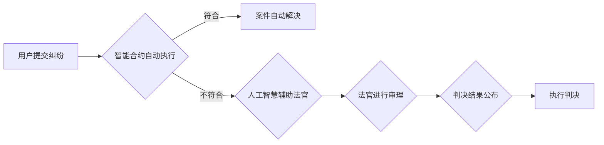

                 

## 元宇宙法庭:跨国纠纷解决的虚拟司法平台

> 关键词：元宇宙、虚拟司法、跨国纠纷、区块链、智能合约、人工智慧、法庭流程、数字证据

## 1. 背景介绍

随着元宇宙概念的兴起，虚拟世界与现实世界之间的界限逐渐模糊。人们在元宇宙中进行工作、娱乐、社交，甚至进行商业交易。然而，元宇宙的蓬勃发展也带来了新的法律挑战，例如虚拟财产的归属权、虚拟犯罪的追究责任、跨境数据监管等。跨国纠纷在元宇宙中更加复杂，涉及不同国家和地区的法律法规，难以协调和解决。

传统司法体系面临着处理元宇宙纠纷的诸多难题：

* **地理限制:** 传统法庭的线下运作模式难以适应元宇宙的跨境特性。
* **效率低下:** 传统诉讼流程冗长复杂，耗时耗力，难以满足元宇宙快速发展的节奏。
* **成本高昂:** 传统诉讼需要大量的律师费用、庭审费用等，对当事人造成沉重经济负担。
* **缺乏透明度:** 传统诉讼过程的透明度不足，容易出现信息不对称和司法不公。

为了解决这些问题，元宇宙法庭应运而生。它是一个基于区块链、人工智能等技术的虚拟司法平台，旨在为元宇宙用户提供高效、公平、透明的跨国纠纷解决机制。

## 2. 核心概念与联系

元宇宙法庭的核心概念包括：

* **虚拟法庭:** 基于虚拟现实（VR）和增强现实（AR）技术的虚拟空间，模拟真实的线下法庭环境，提供沉浸式的诉讼体验。
* **智能合约:** 基于区块链技术的自动执行合同，用于规范元宇宙中虚拟财产的交易和使用，并自动执行相关法律条款。
* **人工智慧:** 利用机器学习、自然语言处理等人工智能技术，辅助法官进行案件分析、证据审查、法律判决等工作，提高效率和准确性。
* **去中心化:** 元宇宙法庭采用去中心化的架构，由多个节点组成，避免单点故障，确保平台的稳定性和安全性。

**元宇宙法庭架构流程图:**



## 3. 核心算法原理 & 具体操作步骤

### 3.1  算法原理概述

元宇宙法庭的核心算法包括：

* **证据识别与验证算法:** 利用人工智能技术识别和验证元宇宙中的数字证据，例如虚拟资产交易记录、聊天记录、虚拟场景截图等。
* **法律规则推理算法:** 基于自然语言处理技术，对法律法规进行分析和理解，并根据案件事实进行法律规则推理，辅助法官做出判决。
* **智能合约执行算法:** 基于区块链技术，自动执行智能合约中的条款，确保虚拟财产的归属权和交易安全。

### 3.2  算法步骤详解

**证据识别与验证算法:**

1. 收集元宇宙中的数字证据。
2. 利用机器学习模型对证据进行分类和识别，例如识别虚拟资产交易记录、聊天记录、虚拟场景截图等。
3. 对识别出的证据进行验证，确保其真实性和完整性。

**法律规则推理算法:**

1. 将案件事实转化为法律规则推理所需的逻辑表达形式。
2. 利用知识图谱和规则引擎对法律法规进行分析和理解。
3. 根据案件事实和法律法规，进行法律规则推理，得出可能的判决结果。

**智能合约执行算法:**

1. 根据案件判决结果，生成相应的智能合约。
2. 将智能合约部署到区块链网络中。
3. 智能合约自动执行，实现虚拟财产的归属权转移和交易安全。

### 3.3  算法优缺点

**优点:**

* **提高效率:** 自动化处理案件，减少人工干预，提高诉讼效率。
* **降低成本:** 减少律师费用、庭审费用等，降低诉讼成本。
* **提高公平性:** 基于算法和数据进行判决，减少人为因素的影响，提高司法公平性。
* **增强透明度:** 整个诉讼过程可追溯，提高透明度和可信度。

**缺点:**

* **算法偏差:** 算法训练数据可能存在偏差，导致算法判决结果存在不公平性。
* **技术复杂性:** 开发和维护元宇宙法庭需要高水平的技术人才和资源。
* **法律法规适应性:** 元宇宙法庭需要不断适应不断变化的法律法规，进行技术更新和迭代。

### 3.4  算法应用领域

元宇宙法庭的核心算法可以应用于以下领域：

* **虚拟财产纠纷解决:** 处理虚拟资产的归属权、交易安全等纠纷。
* **虚拟犯罪追究责任:** 利用人工智能技术识别和分析虚拟犯罪证据，追究犯罪责任。
* **跨境数据监管:** 帮助各国政府监管元宇宙中的跨境数据流，保护个人隐私和数据安全。

## 4. 数学模型和公式 & 详细讲解 & 举例说明

### 4.1  数学模型构建

元宇宙法庭的算法模型可以基于概率论、统计学和机器学习等数学工具构建。例如，证据识别与验证算法可以利用贝叶斯定理计算证据的真实性概率，法律规则推理算法可以利用决策树或支持向量机等机器学习模型进行法律规则推理。

### 4.2  公式推导过程

**贝叶斯定理:**

$$P(A|B) = \frac{P(B|A)P(A)}{P(B)}$$

其中：

* $P(A|B)$ 是事件 A 在事件 B 发生条件下的概率。
* $P(B|A)$ 是事件 B 在事件 A 发生条件下的概率。
* $P(A)$ 是事件 A 的概率。
* $P(B)$ 是事件 B 的概率。

**举例说明:**

假设我们有一个元宇宙法庭系统，需要识别虚拟资产交易记录的真实性。我们可以利用贝叶斯定理计算交易记录的真实性概率。

* $A$：交易记录是真实的。
* $B$：交易记录满足特定特征（例如交易时间、交易金额、交易地址等）。

我们可以根据历史数据统计出 $P(A)$、$P(B|A)$ 和 $P(B)$ 的值，然后利用贝叶斯定理计算 $P(A|B)$，即交易记录真实性的概率。

### 4.3  案例分析与讲解

元宇宙法庭可以应用于以下案例分析：

* **虚拟土地纠纷:** 

假设两个用户在元宇宙中争夺一块虚拟土地的归属权。元宇宙法庭可以利用区块链技术验证土地的交易记录，并根据相关法律法规进行判决。

* **虚拟物品盗窃:** 

假设一个用户在元宇宙中盗窃了另一个用户的虚拟物品。元宇宙法庭可以利用人工智能技术分析虚拟场景的监控记录，识别盗窃行为，并追究犯罪责任。

## 5. 项目实践：代码实例和详细解释说明

### 5.1  开发环境搭建

元宇宙法庭的开发环境需要包含以下软件：

* **区块链平台:** 

例如以太坊、波卡等。
* **虚拟现实平台:** 

例如Unity、Unreal Engine等。
* **人工智能平台:** 

例如TensorFlow、PyTorch等。
* **数据库:** 

例如MySQL、MongoDB等。

### 5.2  源代码详细实现

由于篇幅限制，这里只提供部分代码示例，具体实现细节请参考相关开源项目或技术文档。

**智能合约代码示例 (以太坊 Solidity):**

```solidity
pragma solidity ^0.8.0;

contract VirtualLandOwnership {

    address public owner;
    mapping(uint256 => address) public landOwners;

    constructor() {
        owner = msg.sender;
    }

    function buyLand(uint256 landId) public payable {
        require(landOwners[landId] == address(0), "Land already owned");
        landOwners[landId] = msg.sender;
    }

    function transferLand(uint256 landId, address newOwner) public {
        require(landOwners[landId] == msg.sender, "Not the owner of the land");
        landOwners[landId] = newOwner;
    }
}
```

**证据识别算法代码示例 (Python):**

```python
import tensorflow as tf

# 加载预训练模型
model = tf.keras.applications.MobileNetV2(weights='imagenet')

# 预处理图像
image = tf.keras.preprocessing.image.load_img('image.jpg', target_size=(224, 224))
image = tf.keras.preprocessing.image.img_to_array(image)
image = tf.expand_dims(image, axis=0)

# 进行图像分类
predictions = model.predict(image)

# 获取预测结果
predicted_class = tf.math.argmax(predictions[0]).numpy()

# 根据预测结果判断图像类型
if predicted_class == 0:
    print('This is a virtual asset transaction record.')
else:
    print('This is not a virtual asset transaction record.')
```

### 5.3  代码解读与分析

以上代码示例仅供参考，具体实现细节需要根据实际需求进行调整。

### 5.4  运行结果展示

运行结果展示需要根据具体代码实现和测试数据进行分析。

## 6. 实际应用场景

元宇宙法庭可以应用于以下实际场景：

* **虚拟游戏平台:** 处理虚拟游戏中的财产纠纷、虚拟犯罪案件等。
* **虚拟社交平台:** 处理虚拟社交平台中的名誉侵权、网络欺凌等案件。
* **虚拟商业平台:** 处理虚拟商业平台中的合同纠纷、知识产权侵权等案件。

### 6.4  未来应用展望

随着元宇宙的不断发展，元宇宙法庭将发挥越来越重要的作用，为元宇宙用户提供更加安全、高效、公平的法律保障。未来，元宇宙法庭可能还会发展出以下功能：

* **虚拟法庭审判:** 利用VR技术，让当事人可以在虚拟法庭中进行远程诉讼。
* **智能化法律咨询:** 利用人工智能技术，为用户提供智能化的法律咨询服务。
* **跨境法律合作:** 建立跨境法律合作机制，解决跨国纠纷。

## 7. 工具和资源推荐

### 7.1  学习资源推荐

* **区块链技术:**

Ethereum.org, Hyperledger Fabric
* **虚拟现实技术:**

Unity Learn, Unreal Engine Documentation
* **人工智能技术:**

TensorFlow Tutorials, PyTorch Tutorials

### 7.2  开发工具推荐

* **区块链开发工具:**

Truffle Suite, Remix IDE
* **虚拟现实开发工具:**

Unity, Unreal Engine
* **人工智能开发工具:**

TensorFlow, PyTorch, Keras

### 7.3  相关论文推荐

* **元宇宙法律问题:**

"The Legal Challenges of the Metaverse" by Cathy O'Neil
* **区块链技术在司法领域的应用:**

"Blockchain Technology in the Legal Field: A Review" by Michael J. Casey
* **人工智能技术在司法领域的应用:**

"Artificial Intelligence in the Legal Profession: Opportunities and Challenges" by Richard Susskind

## 8. 总结：未来发展趋势与挑战

### 8.1  研究成果总结

元宇宙法庭是一个具有巨大潜力的创新项目，它利用区块链、人工智能等新技术，为元宇宙用户提供高效、公平、透明的法律保障。

### 8.2  未来发展趋势

元宇宙法庭的发展趋势包括：

* **更加智能化:** 利用更先进的人工智能技术，实现更智能化的法律服务。
* **更加去中心化:** 采用更完善的去中心化架构，提高平台的安全性、透明度和可信度。
* **更加国际化:** 建立跨境法律合作机制，解决跨国纠纷。

### 8.3  面临的挑战

元宇宙法庭面临的挑战包括：

* **技术挑战:** 开发和维护元宇宙法庭需要高水平的技术人才和资源。
* **法律法规挑战:** 元宇宙法庭需要不断适应不断变化的法律法规，进行技术更新和迭代。
* **社会接受度挑战:** 元宇宙法庭需要获得社会各界的认可和支持。

### 8.4  研究展望

未来，元宇宙法庭的研究将继续深入，探索更先进的技术解决方案，解决更多元宇宙中的法律问题，为元宇宙的健康发展提供法律保障。

## 9. 附录：常见问题与解答

**常见问题:**

* **元宇宙法庭是否会取代传统法庭?**

元宇宙法庭是一个补充传统法庭的新型司法平台，它不会取代传统法庭，而是为用户提供更加便捷、高效的法律服务。

* **元宇宙法庭的判决结果是否具有法律效力?**

元宇宙法庭的判决结果需要得到相关政府部门的认可和执行，才能具有法律效力。

* **元宇宙法庭如何保证公平公正?**

元宇宙法庭的算法模型需要经过严格的测试和验证，确保其公平公正。同时，元宇宙法庭也会建立相应的监督机制，防止算法偏差和人为干预。


作者：禅与计算机程序设计艺术 / Zen and the Art of Computer Programming 
<end_of_turn>

