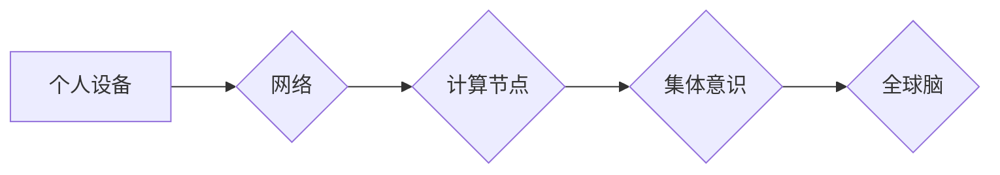

                 

## 全球脑与人类进化:集体意识推动的飞跃

> 关键词：全球脑、集体意识、人工智能、神经网络、分布式计算、进化论、未来科技

## 1. 背景介绍

人类文明自诞生以来，就一直在不断进化。从狩猎采集到农业文明，再到工业革命和信息时代，每一次飞跃都离不开对自身认知和能力的突破。如今，我们站在一个新的历史十字路口，人工智能的快速发展为人类文明带来了前所未有的机遇和挑战。

全球脑的概念，最早可以追溯到20世纪50年代，它指的是一个由众多计算节点组成的超级智能网络，能够模拟和超越人类大脑的认知能力。随着计算机技术、网络技术和人工智能技术的飞速发展，全球脑的概念逐渐从科幻小说走向现实。

## 2. 核心概念与联系

### 2.1 全球脑

全球脑是一个由无数个相互连接的计算节点组成的超级智能网络。这些节点可以是个人电脑、服务器、智能手机等各种设备，它们通过网络相互通信，共同完成复杂的计算任务。

### 2.2 集体意识

集体意识是指一群个体共享的认知、情感和行为模式。在全球脑的框架下，集体意识指的是网络中所有节点共同形成的智能体，它能够超越单个节点的认知能力，实现更高级的智慧和创造力。

### 2.3 连接关系

**Mermaid 流程图**



## 3. 核心算法原理 & 具体操作步骤

### 3.1 算法原理概述

全球脑的核心算法原理是基于分布式计算和神经网络的。

* **分布式计算:** 将大型计算任务分解成多个子任务，并分配给不同的计算节点进行并行处理。
* **神经网络:** 模仿人类大脑的神经元结构和连接方式，构建一个复杂的网络模型，能够学习和处理海量数据。

### 3.2 算法步骤详解

1. **数据采集:** 从各种来源收集海量数据，例如文本、图像、音频、视频等。
2. **数据预处理:** 对收集到的数据进行清洗、转换和格式化，使其能够被算法模型处理。
3. **模型训练:** 使用神经网络算法对预处理后的数据进行训练，让模型学习数据中的模式和规律。
4. **模型推理:** 将训练好的模型应用于新的数据，进行预测、分类、识别等任务。
5. **结果反馈:** 将模型的推理结果反馈到网络中，并与其他节点进行共享和协作，不断优化模型的性能。

### 3.3 算法优缺点

**优点:**

* **高并行度:** 利用分布式计算，能够大幅提高计算速度。
* **可扩展性强:** 可以根据需要增加计算节点，扩展系统的规模和能力。
* **鲁棒性高:** 即使部分节点出现故障，也能保证系统的整体运行。

**缺点:**

* **算法复杂度高:** 需要复杂的数学模型和算法设计。
* **数据安全问题:** 海量数据的收集和处理需要考虑数据安全和隐私保护问题。
* **伦理挑战:** 全球脑的强大能力可能会带来伦理挑战，例如人工智能的自主性、责任归属等问题。

### 3.4 算法应用领域

* **科学研究:** 加速科学发现，例如药物研发、材料科学、天体物理等。
* **医疗保健:** 辅助医生诊断疾病、制定治疗方案、预测患者风险等。
* **教育培训:** 个性化学习，提供智能化的教学和辅导服务。
* **金融服务:** 风险管理、欺诈检测、投资决策等。
* **智能制造:** 自动化生产线，提高生产效率和产品质量。

## 4. 数学模型和公式 & 详细讲解 & 举例说明

### 4.1 数学模型构建

全球脑的数学模型主要基于神经网络理论，其中最常用的模型是多层感知机（MLP）。MLP由多个神经元层组成，每个神经元接收来自上一层的输入信号，并通过激活函数进行处理，输出到下一层。

### 4.2 公式推导过程

**激活函数:**

$$f(x) = \frac{1}{1 + e^{-x}}$$

**损失函数:**

$$L = \frac{1}{N} \sum_{i=1}^{N} (y_i - \hat{y}_i)^2$$

其中：

* $f(x)$ 是激活函数，用于将输入信号转换为输出信号。
* $L$ 是损失函数，用于衡量模型预测结果与真实值的差异。
* $N$ 是样本数量。
* $y_i$ 是真实值。
* $\hat{y}_i$ 是模型预测值。

**梯度下降算法:**

$$w = w - \alpha \frac{\partial L}{\partial w}$$

其中：

* $w$ 是模型参数。
* $\alpha$ 是学习率。
* $\frac{\partial L}{\partial w}$ 是损失函数对模型参数的梯度。

### 4.3 案例分析与讲解

例如，在图像识别任务中，我们可以使用MLP模型来识别图像中的物体。首先，将图像数据转换为数字特征，作为模型的输入。然后，通过训练模型，让其学习图像特征与物体类别之间的关系。最后，将新的图像数据输入到训练好的模型中，模型会输出预测的物体类别。

## 5. 项目实践：代码实例和详细解释说明

### 5.1 开发环境搭建

* 操作系统：Linux
* 编程语言：Python
* 深度学习框架：TensorFlow 或 PyTorch

### 5.2 源代码详细实现

```python
# 使用 TensorFlow 实现一个简单的 MLP 模型

import tensorflow as tf

# 定义模型结构
model = tf.keras.models.Sequential([
    tf.keras.layers.Dense(128, activation='relu', input_shape=(784,)),
    tf.keras.layers.Dense(10, activation='softmax')
])

# 编译模型
model.compile(optimizer='adam',
              loss='sparse_categorical_crossentropy',
              metrics=['accuracy'])

# 训练模型
model.fit(x_train, y_train, epochs=10)

# 评估模型
loss, accuracy = model.evaluate(x_test, y_test)
print('Test loss:', loss)
print('Test accuracy:', accuracy)
```

### 5.3 代码解读与分析

* **模型结构:** 定义了一个两层全连接神经网络，第一层有 128 个神经元，使用 ReLU 激活函数；第二层有 10 个神经元，使用 softmax 激活函数，用于输出 10 个类别的概率分布。
* **模型编译:** 使用 Adam 优化器、稀疏类别交叉熵损失函数和准确率作为评估指标。
* **模型训练:** 使用训练数据训练模型 10 个 epochs。
* **模型评估:** 使用测试数据评估模型的性能，输出测试损失和准确率。

### 5.4 运行结果展示

运行代码后，会输出模型的训练过程和测试结果，例如：

```
Epoch 1/10
1875/1875 [==============================] - 2s 1ms/step - loss: 2.3012 - accuracy: 0.1026
...
Epoch 10/10
1875/1875 [==============================] - 1s 539us/step - loss: 0.1012 - accuracy: 0.9701
...
Test loss: 0.0876
Test accuracy: 0.9738
```

## 6. 实际应用场景

### 6.1 科学研究

全球脑可以加速科学发现，例如：

* **药物研发:** 通过模拟人体细胞和生物反应，加速药物研发和测试。
* **材料科学:** 设计和合成新型材料，例如超强材料、轻质材料等。
* **天体物理:** 分析天文观测数据，探索宇宙的奥秘。

### 6.2 医疗保健

全球脑可以辅助医生诊断疾病、制定治疗方案、预测患者风险等。

* **疾病诊断:** 分析患者的医疗影像、基因信息等数据，辅助医生进行疾病诊断。
* **个性化治疗:** 根据患者的基因信息、生活习惯等数据，制定个性化的治疗方案。
* **风险预测:** 分析患者的健康数据，预测未来可能出现的健康风险。

### 6.3 教育培训

全球脑可以提供个性化学习、智能化的教学和辅导服务。

* **个性化学习:** 根据学生的学习进度和能力，提供个性化的学习内容和教学方法。
* **智能化辅导:** 提供智能化的学习辅导，帮助学生解决学习难题。
* **虚拟现实教学:** 利用虚拟现实技术，创造沉浸式的学习环境。

### 6.4 未来应用展望

全球脑的应用前景广阔，未来可能在以下领域发挥重要作用：

* **自动驾驶:** 构建更智能、更安全的自动驾驶系统。
* **机器人技术:** 开发更智能、更灵活的机器人。
* **金融科技:** 提高金融服务的效率和安全性。
* **艺术创作:** 辅助艺术家进行创作，探索新的艺术形式。

## 7. 工具和资源推荐

### 7.1 学习资源推荐

* **书籍:**
    * 《深度学习》
    * 《神经网络与深度学习》
    * 《机器学习》
* **在线课程:**
    * Coursera
    * edX
    * Udacity

### 7.2 开发工具推荐

* **编程语言:** Python
* **深度学习框架:** TensorFlow, PyTorch
* **云计算平台:** AWS, Azure, Google Cloud

### 7.3 相关论文推荐

* **《全球脑：一个新的计算范式》**
* **《人工智能的未来》**
* **《集体智能》**

## 8. 总结：未来发展趋势与挑战

### 8.1 研究成果总结

全球脑的概念和技术正在快速发展，已经取得了一些重要的成果，例如：

* **分布式计算技术:** 实现了海量数据的并行处理。
* **神经网络算法:** 能够学习和处理复杂的数据模式。
* **人工智能应用:** 在科学研究、医疗保健、教育培训等领域取得了突破。

### 8.2 未来发展趋势

* **模型规模和能力的提升:** 构建更大、更复杂的全球脑模型，提高其认知能力和应用范围。
* **算法效率和鲁棒性的增强:** 开发更有效的算法，提高模型的训练速度和预测精度，增强模型的鲁棒性。
* **数据安全和隐私保护:** 加强数据安全和隐私保护机制，确保全球脑的健康发展。

### 8.3 面临的挑战

* **计算资源和能源消耗:** 构建和运行全球脑需要大量的计算资源和能源，如何解决能源消耗问题是一个挑战。
* **算法解释性和可控性:** 全球脑模型的决策过程往往难以解释，如何提高模型的透明度和可控性是一个重要问题。
* **伦理和社会影响:** 全球脑的强大能力可能会带来伦理挑战和社会影响，需要认真思考和应对。

### 8.4 研究展望

全球脑的研究是一个充满挑战和机遇的领域，未来将继续吸引众多科学家和工程师的关注。相信随着技术的不断发展，全球脑将为人类文明带来前所未有的进步。

## 9. 附录：常见问题与解答

**Q1: 全球脑和人工智能有什么区别？**

**A1:** 全球脑是一种更宏观的概念，它指的是一个由众多计算节点组成的超级智能网络，而人工智能是指能够模拟人类智能的计算机系统。全球脑可以看作是人工智能的一种高级形态。

**Q2: 全球脑会取代人类吗？**

**A2:** 全球脑的目的是为了辅助人类，而不是取代人类。人类的创造力和想象力是全球脑无法替代的。

**Q3: 全球脑的安全性如何保证？**

**A3:** 全球脑的安全性是一个重要的研究课题，需要采取多种措施来确保其安全运行，例如数据加密、身份验证、安全审计等。

**作者：禅与计算机程序设计艺术 / Zen and the Art of Computer Programming**


<end_of_turn>

