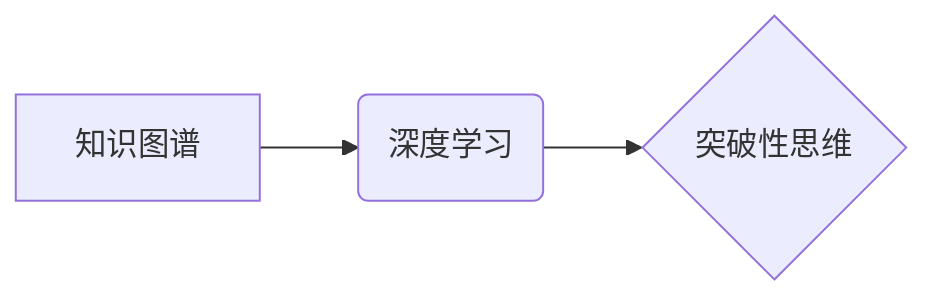

                 

## 创造力与知识：突破性思维的基础

> 关键词：创造力、知识图谱、深度学习、人工智能、突破性思维、算法、模型、应用场景

## 1. 背景介绍

在当今数据爆炸的时代，人类面临着前所未有的信息量。如何从海量数据中提取有价值的知识，并将其转化为创新和突破性的解决方案，成为一个至关重要的挑战。创造力，作为人类思维的最高体现，在解决复杂问题、推动科技进步和塑造未来社会中扮演着至关重要的角色。然而，创造力并非凭空而来，它与知识的积累、深度理解和敏锐的洞察力密不可分。

传统的知识获取方式主要依赖于人类的经验和学习，而人工智能技术的快速发展为我们提供了全新的视角和工具。深度学习算法能够从海量数据中自动学习模式和规律，构建知识图谱，并为人类提供更深入的知识理解和洞察。

## 2. 核心概念与联系

**2.1 知识图谱**

知识图谱是一种基于知识表示的结构化数据模型，它将知识表示为实体、关系和属性的网络结构。通过构建知识图谱，我们可以将分散的知识点连接起来，形成一个完整的知识体系，并方便地进行知识推理、查询和分析。

**2.2 深度学习**

深度学习是一种机器学习的子领域，它利用多层神经网络来模拟人类大脑的学习过程。深度学习算法能够从海量数据中自动学习特征和模式，并进行复杂的知识表示和推理。

**2.3 突破性思维**

突破性思维是指能够跳出既有思维模式，提出创新和颠覆性的想法的能力。它需要对知识有深刻的理解，并能够进行跨领域联想和思维碰撞。

**2.4 核心概念关系**



**2.5 核心概念原理**

* 知识图谱为深度学习提供结构化的知识基础，帮助其更好地理解和处理信息。
* 深度学习算法能够从知识图谱中学习知识关系和模式，并进行知识推理和泛化。
* 突破性思维需要深度理解知识，并能够利用深度学习的知识表示能力进行跨领域联想和创新。

## 3. 核心算法原理 & 具体操作步骤

**3.1 算法原理概述**

本文将介绍一种基于知识图谱和深度学习的突破性思维算法，该算法通过以下步骤实现：

1. **知识图谱构建:** 从公开数据和专家知识中构建知识图谱，包含实体、关系和属性。
2. **深度学习模型训练:** 利用深度学习算法对知识图谱进行训练，学习知识关系和模式。
3. **知识推理和泛化:** 利用训练好的深度学习模型进行知识推理和泛化，生成新的知识和洞察。
4. **突破性思维生成:** 基于生成的知识和洞察，利用启发式算法和创意生成技术，生成突破性思维。

**3.2 算法步骤详解**

1. **知识图谱构建:**

   * **数据收集:** 从公开数据库、文献、专家访谈等渠道收集相关数据。
   * **实体识别:** 利用自然语言处理技术识别知识图谱中的实体。
   * **关系抽取:** 利用机器学习算法识别实体之间的关系。
   * **属性提取:** 从数据中提取实体的属性信息。
   * **知识图谱存储:** 将构建好的知识图谱存储在知识图谱数据库中。

2. **深度学习模型训练:**

   * **模型选择:** 选择合适的深度学习模型，例如图卷积网络 (Graph Convolutional Network, GCN) 或知识图谱嵌入 (Knowledge Graph Embedding, KGE)。
   * **数据预处理:** 对知识图谱数据进行预处理，例如实体嵌入和关系编码。
   * **模型训练:** 利用训练数据对深度学习模型进行训练，学习知识关系和模式。
   * **模型评估:** 利用测试数据评估模型的性能，例如准确率、召回率和F1-score。

3. **知识推理和泛化:**

   * **知识补全:** 利用训练好的模型进行知识补全，预测缺失的实体和关系。
   * **知识关联:** 利用模型学习到的知识关系，发现实体之间的关联关系。
   * **知识泛化:** 将已知知识应用于新的领域或问题，进行知识泛化。

4. **突破性思维生成:**

   * **启发式算法:** 利用启发式算法，例如关联规则挖掘和逆向推理，从知识推理结果中生成新的想法和假设。
   * **创意生成技术:** 利用创意生成技术，例如文本生成和图像生成，将生成的思想和假设转化为具体的创意和解决方案。

**3.3 算法优缺点**

**优点:**

* **能够从海量数据中自动学习知识:** 深度学习算法能够从海量数据中自动学习知识关系和模式，构建更完整的知识体系。
* **能够进行知识推理和泛化:** 深度学习模型能够进行知识推理和泛化，生成新的知识和洞察。
* **能够支持突破性思维的生成:** 通过启发式算法和创意生成技术，能够从知识推理结果中生成新的想法和解决方案。

**缺点:**

* **需要大量的训练数据:** 深度学习算法需要大量的训练数据才能达到良好的性能。
* **模型训练成本高:** 深度学习模型的训练成本较高，需要强大的计算资源。
* **解释性较差:** 深度学习模型的决策过程较为复杂，解释性较差。

**3.4 算法应用领域**

* **科学研究:** 帮助科学家发现新的科学规律和知识。
* **技术创新:** 促进技术创新，开发新的产品和服务。
* **商业决策:** 帮助企业进行更精准的商业决策。
* **教育教学:** 提升教育教学效率，个性化学习。

## 4. 数学模型和公式 & 详细讲解 & 举例说明

**4.1 数学模型构建**

知识图谱可以表示为一个三元组的集合： (h, r, t)，其中 h 是主语实体，r 是关系，t 是宾语实体。

**4.2 公式推导过程**

深度学习模型可以利用图卷积网络 (GCN) 来学习知识图谱中的知识关系。GCN 的核心思想是通过对图结构进行卷积操作，学习节点之间的特征表示。

GCN 的更新公式如下：

$$
h_i^{(l+1)} = \sigma(A^{1/2} \cdot \tilde{W}^{(l)} \cdot A^{1/2} \cdot h_i^{(l)})
$$

其中：

* $h_i^{(l)}$ 是节点 i 在第 l 层的特征表示。
* $A$ 是图的邻接矩阵。
* $\tilde{W}^{(l)}$ 是第 l 层的权重矩阵。
* $\sigma$ 是激活函数。

**4.3 案例分析与讲解**

假设我们有一个知识图谱，包含实体 "苹果"、"香蕉" 和 "水果"，以及关系 "是"。我们可以使用 GCN 学习到 "苹果" 和 "香蕉" 都是 "水果" 的知识关系。

## 5. 项目实践：代码实例和详细解释说明

**5.1 开发环境搭建**

* Python 3.6+
* TensorFlow 2.0+
* PyTorch 1.0+
* Jupyter Notebook

**5.2 源代码详细实现**

```python
import tensorflow as tf

# 定义图卷积网络模型
class GCN(tf.keras.Model):
    def __init__(self, num_features, num_classes):
        super(GCN, self).__init__()
        self.conv1 = tf.keras.layers.GraphConv(num_features, activation='relu')
        self.conv2 = tf.keras.layers.GraphConv(num_classes, activation='softmax')

    def call(self, inputs):
        x = self.conv1(inputs)
        x = self.conv2(x)
        return x

# 构建知识图谱数据
# ...

# 创建 GCN 模型实例
model = GCN(num_features=64, num_classes=2)

# 编译模型
model.compile(optimizer='adam', loss='sparse_categorical_crossentropy', metrics=['accuracy'])

# 训练模型
model.fit(x_train, y_train, epochs=10)

# 评估模型
loss, accuracy = model.evaluate(x_test, y_test)
print('Loss:', loss)
print('Accuracy:', accuracy)
```

**5.3 代码解读与分析**

* 代码首先定义了一个 GCN 模型类，包含两个 GraphConv 层。
* 然后构建知识图谱数据，并创建 GCN 模型实例。
* 接着编译模型，并使用 Adam 优化器、交叉熵损失函数和准确率指标进行训练。
* 最后评估模型的性能，打印损失和准确率。

**5.4 运行结果展示**

运行结果将显示模型的训练过程和最终的性能指标，例如损失值和准确率。

## 6. 实际应用场景

**6.1 科学研究**

* **药物研发:** 利用知识图谱和深度学习算法，从海量生物数据中发现新的药物靶点和候选药物。
* **疾病诊断:** 建立疾病知识图谱，辅助医生进行疾病诊断和治疗方案制定。

**6.2 技术创新**

* **人工智能助手:** 开发更智能的人工智能助手，能够理解自然语言、进行知识推理和提供个性化服务。
* **自动驾驶:** 利用知识图谱和深度学习算法，构建自动驾驶系统的知识库，提高其安全性、可靠性和智能化水平。

**6.3 商业决策**

* **市场分析:** 分析市场数据，预测市场趋势和消费者需求，帮助企业制定更有效的营销策略。
* **风险管理:** 建立风险知识图谱，识别和评估潜在风险，帮助企业进行风险控制和管理。

**6.4 未来应用展望**

随着人工智能技术的不断发展，基于知识图谱和深度学习的突破性思维算法将有更广泛的应用场景，例如：

* **个性化教育:** 根据学生的学习情况和兴趣，提供个性化的学习方案和内容。
* **创意设计:** 利用算法生成新的创意和设计方案，推动艺术和设计领域的创新。
* **科学探索:** 帮助科学家解决复杂科学问题，探索宇宙的奥秘。

## 7. 工具和资源推荐

**7.1 学习资源推荐**

* **书籍:**
    * 《深度学习》 by Ian Goodfellow, Yoshua Bengio, and Aaron Courville
    * 《图神经网络》 by William L. Hamilton, Rex Ying, and Jure Leskovec
* **在线课程:**
    * Coursera: Deep Learning Specialization
    * Udacity: Deep Learning Nanodegree
* **博客和网站:**
    * Towards Data Science
    * Machine Learning Mastery

**7.2 开发工具推荐**

* **Python:** 广泛应用于机器学习和深度学习开发。
* **TensorFlow:** 开源深度学习框架，提供丰富的工具和资源。
* **PyTorch:** 开源深度学习框架，以其灵活性和易用性而闻名。
* **Jupyter Notebook:** 用于交互式编程和数据可视化的工具。

**7.3 相关论文推荐**

* 《Graph Convolutional Networks》 by Thomas N. Kipf and Max Welling
* 《Knowledge Graph Embedding: A Survey》 by  Xiangnan He, Lizi Liao, Hanwang Zhang, et al.

## 8. 总结：未来发展趋势与挑战

**8.1 研究成果总结**

基于知识图谱和深度学习的突破性思维算法取得了显著的进展，在科学研究、技术创新和商业决策等领域展现出巨大的潜力。

**8.2 未来发展趋势**

* **模型的增强:** 开发更强大的深度学习模型，能够更好地学习复杂知识关系和模式。
* **数据的多样化:** 收集和整合更多样化的数据，丰富知识图谱的内容和深度。
* **解释性的提升:** 研究更有效的解释性方法，提高算法的透明度和可解释性。
* **应用场景的拓展:** 将算法应用于更多新的领域，推动科技进步和社会发展。

**8.3 面临的挑战**

* **数据质量:** 知识图谱数据质量问题，例如不完整、不一致和错误信息，会影响算法的性能。
* **计算资源:** 训练大型深度学习模型需要大量的计算资源，成本较高。
* **伦理问题:** 突破性思维算法的应用可能引发伦理问题，例如算法偏见和数据隐私。

**8.4 研究展望**

未来，我们将继续致力于开发更强大、更智能、更可解释的突破性思维算法，推动人工智能技术向更广泛的应用领域拓展，并为人类社会创造更大的价值。

## 9. 附录：常见问题与解答

**9.1 如何构建知识图谱？**

构建知识图谱需要收集相关数据、识别实体和关系、进行数据清洗和整合等步骤。可以使用自然语言处理技术、机器学习算法和专家知识进行辅助。

**9.2 如何选择合适的深度学习模型？**

选择合适的深度学习模型需要根据具体应用场景和数据特点进行考虑。常见的深度学习模型包括图卷积网络 (GCN)、知识图谱嵌入 (KGE) 等。

**9.3 如何评估突破性思维算法的性能？**

评估突破性思维算法的性能需要根据具体应用场景设计相应的指标，例如创意质量、创新性、实用性等。

**9.4 突破性思维算法有哪些伦理问题？**

突破性思维算法的应用可能引发算法偏见、数据隐私等伦理问题，需要谨慎考虑和规避。


作者：禅与计算机程序设计艺术 / Zen and the Art of Computer Programming<end_of_turn>

