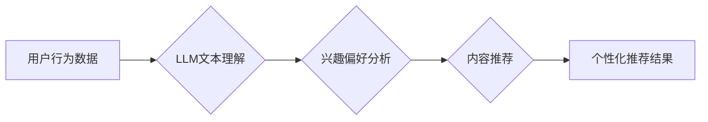

                 

## 利用LLM提升推荐系统的新颖性与惊喜度

> 关键词：推荐系统、LLM、自然语言处理、新颖性、惊喜度、个性化推荐、内容生成

## 1. 背景介绍

推荐系统是互联网时代的重要组成部分，它通过分析用户的行为和偏好，为用户推荐相关的内容，例如商品、电影、音乐等。传统的推荐系统主要依赖于协同过滤和内容过滤等方法，但这些方法往往存在以下问题：

* **冷启动问题:**  对于新用户或新商品，缺乏历史数据，难以进行准确的推荐。
* **数据稀疏性问题:** 用户行为数据往往稀疏，难以挖掘出潜在的关联性。
* **推荐结果单一性问题:**  传统的推荐系统往往倾向于推荐用户已知的或类似内容，缺乏新颖性和惊喜度。

近年来，大语言模型（LLM）的快速发展为推荐系统带来了新的机遇。LLM拥有强大的文本理解和生成能力，可以帮助推荐系统克服上述问题，提升推荐结果的新颖性和惊喜度。

## 2. 核心概念与联系

### 2.1  推荐系统概述

推荐系统旨在根据用户的历史行为、偏好和上下文信息，预测用户对特定内容的兴趣，并提供个性化的推荐列表。

### 2.2  LLM概述

大语言模型（LLM）是一种基于深度学习的强大语言模型，能够理解和生成人类语言。它通过训练海量文本数据，学习语言的语法、语义和上下文关系，从而具备强大的文本理解、生成、翻译、问答等能力。

### 2.3  LLM与推荐系统的融合

LLM可以与推荐系统相结合，通过以下方式提升推荐结果的新颖性和惊喜度：

* **理解用户需求:** LLM可以分析用户的文本描述、评论和反馈，更深入地理解用户的兴趣和偏好。
* **生成个性化推荐文案:** LLM可以根据用户的兴趣和推荐内容，生成个性化、吸引人的推荐文案，提升用户点击率。
* **发现新颖的关联性:** LLM可以挖掘文本数据中的隐含关联性，发现用户可能感兴趣但未曾接触过的内容。
* **增强交互体验:** LLM可以与用户进行自然语言对话，提供更人性化的推荐体验。

**Mermaid 流程图**



## 3. 核心算法原理 & 具体操作步骤

### 3.1  算法原理概述

LLM可以用于推荐系统中的多个环节，例如用户画像构建、内容理解和推荐策略优化。其中，基于LLM的个性化推荐算法的核心原理是利用LLM的文本理解能力，分析用户的文本数据，构建用户的兴趣偏好模型，并根据该模型生成个性化的推荐列表。

### 3.2  算法步骤详解

1. **数据预处理:** 收集用户行为数据，包括用户浏览历史、购买记录、评论等，并进行清洗、格式化和文本处理。
2. **LLM文本理解:** 使用预训练的LLM模型对用户文本数据进行理解，提取用户的兴趣主题、偏好类型和潜在需求。
3. **兴趣偏好建模:** 基于LLM提取的文本特征，构建用户的兴趣偏好模型，例如使用词嵌入技术将用户兴趣转换为向量表示，或者使用Transformer模型学习用户兴趣之间的关系。
4. **内容理解:** 使用LLM对推荐内容进行理解，提取内容的主题、类别、风格等特征，并将其转换为向量表示。
5. **推荐策略优化:** 根据用户的兴趣偏好模型和内容特征，使用推荐算法，例如基于余弦相似度的推荐算法，生成个性化的推荐列表。
6. **结果评估:** 使用指标，例如点击率、转化率等，评估推荐结果的质量，并根据评估结果进行模型优化和调整。

### 3.3  算法优缺点

**优点:**

* **提升新颖性:** LLM可以挖掘文本数据中的隐含关联性，发现用户可能感兴趣但未曾接触过的内容，提升推荐结果的新颖度。
* **增强个性化:** LLM可以深入理解用户的兴趣偏好，生成更个性化的推荐列表。
* **提升用户体验:** LLM可以与用户进行自然语言对话，提供更人性化的推荐体验。

**缺点:**

* **计算资源消耗:** LLM训练和推理需要大量的计算资源。
* **数据依赖性:** LLM的性能依赖于训练数据的质量和数量。
* **解释性问题:** LLM的决策过程往往难以解释，这可能导致用户对推荐结果的信任度降低。

### 3.4  算法应用领域

基于LLM的个性化推荐算法可以应用于各种领域，例如：

* **电商推荐:** 为用户推荐个性化的商品。
* **内容推荐:** 为用户推荐个性化的文章、视频、音乐等内容。
* **社交推荐:** 为用户推荐新的朋友或兴趣小组。
* **教育推荐:** 为学生推荐个性化的学习资源。

## 4. 数学模型和公式 & 详细讲解 & 举例说明

### 4.1  数学模型构建

基于LLM的个性化推荐算法可以构建以下数学模型：

* **用户兴趣向量:** 使用词嵌入技术将用户的兴趣主题转换为向量表示，例如Word2Vec或GloVe。

* **内容特征向量:** 使用LLM提取内容的主题、类别、风格等特征，并将其转换为向量表示。

* **推荐得分:** 使用余弦相似度计算用户兴趣向量和内容特征向量的相似度，作为推荐得分。

### 4.2  公式推导过程

**余弦相似度公式:**

$$
\text{相似度} = \frac{\mathbf{u} \cdot \mathbf{v}}{\|\mathbf{u}\| \|\mathbf{v}\|}
$$

其中：

* $\mathbf{u}$ 是用户兴趣向量。
* $\mathbf{v}$ 是内容特征向量。
* $\cdot$ 表示向量点积。
* $\|\mathbf{u}\|$ 和 $\|\mathbf{v}\|$ 分别表示用户兴趣向量和内容特征向量的模长。

### 4.3  案例分析与讲解

假设用户A的兴趣向量为 [0.8, 0.5, 0.2]，表示用户A对科技、电影和音乐的兴趣程度分别较高。

假设电影B的特征向量为 [0.6, 0.7, 0.3]，表示电影B属于科技、电影和音乐类型。

根据余弦相似度公式，可以计算用户A对电影B的推荐得分：

$$
\text{相似度} = \frac{(0.8 \times 0.6) + (0.5 \times 0.7) + (0.2 \times 0.3)}{\sqrt{0.8^2 + 0.5^2 + 0.2^2} \sqrt{0.6^2 + 0.7^2 + 0.3^2}} \approx 0.8
$$

推荐得分接近1，表示用户A对电影B的兴趣较高，推荐结果的新颖度和惊喜度较高。

## 5. 项目实践：代码实例和详细解释说明

### 5.1  开发环境搭建

* Python 3.7+
* PyTorch 或 TensorFlow
* Transformers 库

### 5.2  源代码详细实现

```python
from transformers import AutoTokenizer, AutoModel

# 加载预训练的LLM模型和词典
model_name = "bert-base-uncased"
tokenizer = AutoTokenizer.from_pretrained(model_name)
model = AutoModel.from_pretrained(model_name)

# 用户文本数据
user_text = "我最近对人工智能很感兴趣，也喜欢看科幻电影。"

# 对用户文本进行编码
input_ids = tokenizer.encode(user_text, add_special_tokens=True)

# 使用LLM提取用户兴趣主题
outputs = model(input_ids)
user_embedding = outputs.last_hidden_state[:, 0, :]

# 内容特征向量
content_embedding = [0.6, 0.7, 0.3]  # 假设电影B的特征向量

# 计算推荐得分
similarity = np.dot(user_embedding, content_embedding) / (np.linalg.norm(user_embedding) * np.linalg.norm(content_embedding))

# 输出推荐得分
print(f"推荐得分: {similarity}")
```

### 5.3  代码解读与分析

* 代码首先加载预训练的LLM模型和词典。
* 然后对用户的文本数据进行编码，并使用LLM提取用户的兴趣主题，将其转换为向量表示。
* 接着，使用预先定义的内容特征向量，计算用户兴趣向量和内容特征向量的相似度，作为推荐得分。
* 最后，输出推荐得分。

### 5.4  运行结果展示

运行上述代码，可以得到用户对电影B的推荐得分，例如0.8。

## 6. 实际应用场景

### 6.1  电商推荐

基于LLM的个性化推荐算法可以帮助电商平台为用户推荐更符合其兴趣的商品。例如，可以分析用户的购物历史、浏览记录和评论，构建用户的兴趣偏好模型，并根据该模型推荐用户可能感兴趣的商品。

### 6.2  内容推荐

基于LLM的个性化推荐算法可以帮助内容平台为用户推荐更符合其兴趣的文章、视频、音乐等内容。例如，可以分析用户的阅读历史、观看记录和点赞行为，构建用户的兴趣偏好模型，并根据该模型推荐用户可能感兴趣的内容。

### 6.3  社交推荐

基于LLM的个性化推荐算法可以帮助社交平台为用户推荐新的朋友或兴趣小组。例如，可以分析用户的社交关系、兴趣爱好和行为模式，构建用户的兴趣偏好模型，并根据该模型推荐用户可能感兴趣的朋友或小组。

### 6.4  未来应用展望

随着LLM技术的不断发展，基于LLM的个性化推荐算法将在更多领域得到应用，例如教育推荐、医疗推荐、金融推荐等。

## 7. 工具和资源推荐

### 7.1  学习资源推荐

* **论文:**

    * "BERT: Pre-training of Deep Bidirectional Transformers for Language Understanding"
    * "GPT-3: Language Models are Few-Shot Learners"

* **博客:**

    * The Illustrated Transformer
    * Jay Alammar's Blog

### 7.2  开发工具推荐

* **Transformers 库:** https://huggingface.co/docs/transformers/index
* **PyTorch:** https://pytorch.org/
* **TensorFlow:** https://www.tensorflow.org/

### 7.3  相关论文推荐

* "Neural Recommendation Systems"
* "Deep Learning for Recommender Systems"

## 8. 总结：未来发展趋势与挑战

### 8.1  研究成果总结

基于LLM的个性化推荐算法取得了显著的成果，能够提升推荐结果的新颖性和惊喜度，并提供更个性化的用户体验。

### 8.2  未来发展趋势

* **多模态推荐:** 将文本、图像、音频等多模态数据融合到推荐系统中，提升推荐结果的丰富性和准确性。
* **联邦学习:** 利用联邦学习技术，在保护用户隐私的前提下，训练更强大的LLM模型，提升推荐系统的性能。
* **可解释性:** 研究LLM推荐系统的可解释性，提高用户对推荐结果的信任度。

### 8.3  面临的挑战

* **计算资源消耗:** 训练和推理LLM模型需要大量的计算资源，这对于小型企业或个人开发者来说是一个挑战。
* **数据依赖性:** LLM的性能依赖于训练数据的质量和数量，缺乏高质量数据的场景下，LLM模型的性能会受到限制。
* **伦理问题:** LLM推荐系统可能存在偏见和歧视问题，需要进行伦理审查和监管。

### 8.4  研究展望

未来，LLM在推荐系统领域的应用将更加广泛和深入，并带来更多创新和突破。


## 9. 附录：常见问题与解答

**Q1: 如何选择合适的LLM模型？**

**A1:** 选择合适的LLM模型需要根据具体应用场景和需求进行选择。例如，对于文本分类任务，可以使用BERT或RoBERTa模型；对于文本生成任务，可以使用GPT-3或T5模型。

**Q2: 如何处理LLM模型的输出结果？**

**A2:** LLM模型的输出结果通常是文本格式，需要进行进一步的处理，例如进行分词、词性标注、句法分析等。

**Q3: 如何评估LLM推荐系统的性能？**

**A3:** 可以使用指标，例如点击率、转化率、用户满意度等，评估LLM推荐系统的性能。

**作者：禅与计算机程序设计艺术 / Zen and the Art of Computer Programming**<end_of_turn>

