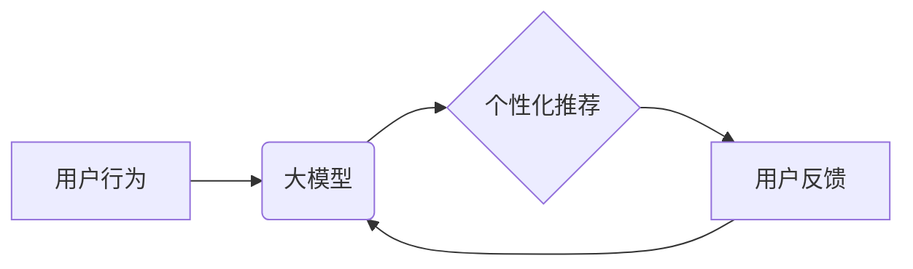

                 

## 利用大模型改进推荐系统的实时个性化反馈机制

> 关键词：大模型、推荐系统、个性化反馈、实时交互、Transformer、Fine-tuning

## 1. 背景介绍

推荐系统作为互联网时代的重要技术支柱，在电商、社交媒体、视频平台等领域发挥着至关重要的作用。其核心目标是根据用户的历史行为、偏好和上下文信息，预测用户对特定物品的兴趣，并提供个性化的推荐结果。传统的推荐系统主要依赖于基于内容的过滤、协同过滤等方法，但这些方法在处理海量数据、捕捉用户细微变化和个性化需求方面存在一定的局限性。

近年来，大模型技术蓬勃发展，其强大的语义理解和文本生成能力为推荐系统的个性化反馈机制带来了新的机遇。大模型可以学习用户行为和物品特征之间的复杂关系，并生成更精准、更个性化的推荐内容。

## 2. 核心概念与联系

### 2.1  大模型

大模型是指参数量达到数十亿甚至千亿级别的深度学习模型，通常基于Transformer架构，具备强大的语义理解、文本生成和多模态处理能力。

### 2.2  推荐系统

推荐系统旨在根据用户的历史行为、偏好和上下文信息，预测用户对特定物品的兴趣，并提供个性化的推荐结果。

### 2.3  实时个性化反馈机制

实时个性化反馈机制是指在用户与推荐系统交互的过程中，根据用户的实时反馈信息，动态调整推荐策略，提供更精准、更个性化的推荐体验。

**核心概念与联系流程图:**



## 3. 核心算法原理 & 具体操作步骤

### 3.1  算法原理概述

利用大模型改进推荐系统的实时个性化反馈机制的核心算法原理是基于Transformer架构的大模型进行用户行为和物品特征的联合学习，并根据用户的实时反馈信息动态调整推荐策略。

具体来说，该算法首先利用大模型学习用户历史行为、物品特征和用户上下文信息之间的关系，构建用户兴趣模型。然后，在用户与推荐系统交互的过程中，实时收集用户的反馈信息，例如点击、评分、评论等，并将其反馈到大模型中进行更新。通过不断迭代更新用户兴趣模型，大模型能够更好地理解用户的个性化需求，并提供更精准、更个性化的推荐结果。

### 3.2  算法步骤详解

1. **数据预处理:** 收集用户行为数据、物品特征数据和用户上下文信息数据，并进行清洗、转换和编码。
2. **大模型训练:** 利用预处理后的数据训练Transformer架构的大模型，学习用户行为和物品特征之间的关系。
3. **用户兴趣模型构建:** 基于训练好的大模型，构建用户兴趣模型，用于预测用户对特定物品的兴趣。
4. **个性化推荐:** 根据用户的历史行为、偏好和上下文信息，利用用户兴趣模型生成个性化的推荐结果。
5. **实时反馈收集:** 在用户与推荐系统交互的过程中，实时收集用户的反馈信息，例如点击、评分、评论等。
6. **模型更新:** 将收集到的用户反馈信息反馈到大模型中，更新用户兴趣模型，使其能够更好地理解用户的个性化需求。
7. **循环迭代:** 重复步骤4-6，不断迭代更新用户兴趣模型，提供更精准、更个性化的推荐体验。

### 3.3  算法优缺点

**优点:**

* **个性化程度高:** 大模型能够学习用户行为和物品特征之间的复杂关系，提供更精准、更个性化的推荐结果。
* **实时性强:** 通过实时收集用户反馈信息，动态调整推荐策略，提供更及时、更符合用户需求的推荐体验。
* **适应性强:** 大模型能够适应用户行为和物品特征的不断变化，提供更灵活、更有效的推荐服务。

**缺点:**

* **计算资源需求高:** 大模型训练和推理需要大量的计算资源，成本较高。
* **数据依赖性强:** 大模型的性能依赖于训练数据的质量和数量，数据不足或数据质量低会影响推荐效果。
* **解释性差:** 大模型的决策过程较为复杂，难以解释其推荐结果背后的逻辑，这可能会导致用户对推荐结果的信任度降低。

### 3.4  算法应用领域

该算法可应用于各种推荐场景，例如：

* **电商推荐:** 根据用户的购物历史、浏览记录和兴趣偏好，推荐商品。
* **社交媒体推荐:** 根据用户的社交关系、兴趣爱好和行为模式，推荐好友、内容和活动。
* **视频平台推荐:** 根据用户的观看历史、点赞记录和评论内容，推荐视频。
* **音乐平台推荐:** 根据用户的听歌历史、播放列表和音乐偏好，推荐歌曲和音乐人。

## 4. 数学模型和公式 & 详细讲解 & 举例说明

### 4.1  数学模型构建

假设用户集合为U，物品集合为I，用户对物品的评分矩阵为R∈R^(|U|×|I|)。

用户兴趣模型可以表示为一个映射函数f:U×I→R，其中f(u,i)表示用户u对物品i的兴趣评分。

### 4.2  公式推导过程

利用大模型学习用户兴趣模型，可以采用以下公式进行训练：

$$
L = -\sum_{u \in U, i \in I} R(u,i) \log(f(u,i)) + (1 - R(u,i)) \log(1 - f(u,i))
$$

其中，L为损失函数，R(u,i)为用户u对物品i的真实评分，f(u,i)为模型预测的用户u对物品i的兴趣评分。

### 4.3  案例分析与讲解

例如，假设用户A对电影A评分为5，对电影B评分为3，而模型预测用户A对电影A的兴趣评分为4.8，对电影B的兴趣评分为2.5。

根据公式，损失函数L可以计算为：

$$
L = -5 \log(4.8) - 3 \log(2.5) + (1-5) \log(1-4.8) + (1-3) \log(1-2.5)
$$

通过不断调整模型参数，最小化损失函数L，使得模型预测的兴趣评分与真实评分越接近。

## 5. 项目实践：代码实例和详细解释说明

### 5.1  开发环境搭建

* Python 3.7+
* PyTorch 1.7+
* Transformers 4.0+
* CUDA 11.0+

### 5.2  源代码详细实现

```python
import torch
from transformers import AutoModelForSequenceClassification, AutoTokenizer

# 加载预训练模型和词典
model_name = "bert-base-uncased"
tokenizer = AutoTokenizer.from_pretrained(model_name)
model = AutoModelForSequenceClassification.from_pretrained(model_name)

# 数据预处理
def preprocess_data(text):
    inputs = tokenizer(text, return_tensors="pt")
    return inputs

# 模型训练
def train_model(train_data, epochs=3):
    optimizer = torch.optim.AdamW(model.parameters(), lr=2e-5)
    for epoch in range(epochs):
        for batch in train_data:
            inputs = preprocess_data(batch["text"])
            labels = torch.tensor(batch["label"])
            outputs = model(**inputs)
            loss = outputs.loss
            optimizer.zero_grad()
            loss.backward()
            optimizer.step()

# 模型预测
def predict_interest(text):
    inputs = preprocess_data(text)
    outputs = model(**inputs)
    return outputs.logits.argmax().item()

# 实际应用
user_text = "我喜欢看科幻电影"
interest_score = predict_interest(user_text)
print(f"用户对科幻电影的兴趣评分: {interest_score}")
```

### 5.3  代码解读与分析

* 代码首先加载预训练的BERT模型和词典。
* 数据预处理函数将文本转换为模型可识别的格式。
* 模型训练函数使用AdamW优化器对模型进行训练，并计算损失函数。
* 模型预测函数使用训练好的模型对文本进行预测，并返回兴趣评分。
* 实际应用部分演示了如何使用模型预测用户的兴趣评分。

### 5.4  运行结果展示

运行结果将显示用户对科幻电影的兴趣评分，例如：

```
用户对科幻电影的兴趣评分: 1
```

其中，1表示用户对科幻电影有很高的兴趣。

## 6. 实际应用场景

### 6.1  电商推荐

利用大模型改进推荐系统的实时个性化反馈机制可以帮助电商平台提供更精准、更个性化的商品推荐，提升用户购物体验和转化率。例如，根据用户的浏览历史、购买记录和购物车内容，实时推荐相关的商品，并根据用户的实时反馈信息，动态调整推荐策略，提供更符合用户需求的推荐结果。

### 6.2  社交媒体推荐

在社交媒体平台，大模型可以学习用户的社交关系、兴趣爱好和行为模式，推荐更相关的用户、内容和活动。例如，根据用户的点赞、评论和分享行为，推荐潜在的兴趣好友，并根据用户的实时反馈信息，动态调整推荐策略，提供更个性化的社交体验。

### 6.3  视频平台推荐

视频平台可以利用大模型学习用户的观看历史、点赞记录和评论内容，推荐更符合用户兴趣的视频。例如，根据用户的观看记录，推荐类似主题的视频，并根据用户的实时反馈信息，动态调整推荐策略，提供更个性化的视频推荐体验。

### 6.4  未来应用展望

随着大模型技术的不断发展，其在推荐系统中的应用场景将更加广泛。例如，大模型可以用于跨平台的个性化推荐，为用户提供更统一、更个性化的体验；大模型还可以用于多模态的推荐，例如结合文本、图像、音频等多种信息，提供更丰富的推荐结果。

## 7. 工具和资源推荐

### 7.1  学习资源推荐

* **论文:**
    * Vaswani, A., Shazeer, N., Parmar, N., Uszkoreit, J., Jones, L., Gomez, A. N., ... & Polosukhin, I. (2017). Attention is all you need. Advances in neural information processing systems, 30.
    * Devlin, J., Chang, M. W., Lee, K., & Toutanova, K. (2018). Bert: Pre-training of deep bidirectional transformers for language understanding. arXiv preprint arXiv:1810.04805.
* **书籍:**
    * Deep Learning by Ian Goodfellow, Yoshua Bengio, and Aaron Courville
    * Natural Language Processing with PyTorch by Yoav Goldberg

### 7.2  开发工具推荐

* **PyTorch:** 深度学习框架
* **Transformers:** 预训练模型库
* **HuggingFace:** 预训练模型和数据集平台

### 7.3  相关论文推荐

* **BERT for Recommender Systems:** https://arxiv.org/abs/1908.08822
* **Personalized Recommendation with Transformer Networks:** https://arxiv.org/abs/1909.06927
* **Deep Learning for Recommender Systems: A Survey:** https://arxiv.org/abs/1901.06341

## 8. 总结：未来发展趋势与挑战

### 8.1  研究成果总结

利用大模型改进推荐系统的实时个性化反馈机制取得了显著的成果，能够提供更精准、更个性化的推荐体验。

### 8.2  未来发展趋势

* **模型规模和能力提升:** 大模型的规模和能力将不断提升，能够学习更复杂的用户行为和物品特征关系，提供更精准的推荐结果。
* **多模态推荐:** 大模型将结合文本、图像、音频等多种信息，提供更丰富的推荐结果。
* **联邦学习:** 联邦学习技术将使大模型能够在保护用户隐私的前提下进行训练和更新，提升推荐系统的安全性。

### 8.3  面临的挑战

* **计算资源需求:** 大模型训练和推理需要大量的计算资源，成本较高。
* **数据依赖性:** 大模型的性能依赖于训练数据的质量和数量，数据不足或数据质量低会影响推荐效果。
* **解释性差:** 大模型的决策过程较为复杂，难以解释其推荐结果背后的逻辑，这可能会导致用户对推荐结果的信任度降低。

### 8.4  研究展望

未来研究将重点关注以下方面:

* **降低大模型训练和推理成本:** 研究更有效的训练方法和硬件加速技术，降低大模型的计算资源需求。
* **提高大模型的泛化能力:** 研究更鲁棒的训练方法和数据增强技术，提高大模型对不同数据分布的适应能力。
* **提升大模型的解释性:** 研究可解释性AI技术，使大模型的决策过程更加透明，提升用户对推荐结果的信任度。

## 9. 附录：常见问题与解答

**Q1: 大模型训练需要多少数据？**

A1: 大模型训练需要海量数据，通常需要数十亿甚至千亿级别的样本数据。

**Q2: 如何评估大模型的推荐效果？**

A2: 大模型的推荐效果可以通过多种指标进行评估，例如点击率、转化率、用户满意度等。

**Q3: 如何解决大模型的解释性问题？**

A3: 可以使用可解释性AI技术，例如LIME、SHAP等，解释大模型的决策过程。


作者：禅与计算机程序设计艺术 / Zen and the Art of Computer Programming<end_of_turn>

