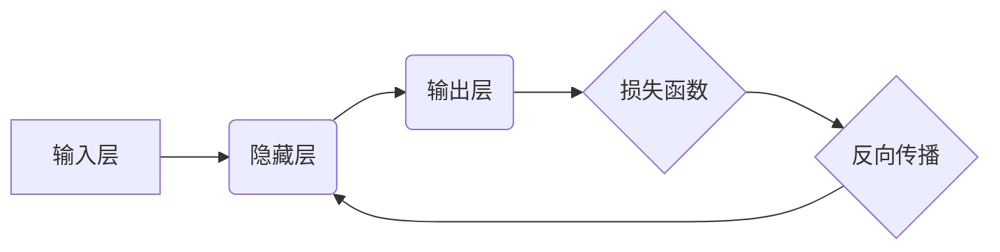

                 

## 反向传播算法详解：深度学习的核心

> 关键词：反向传播、深度学习、神经网络、梯度下降、优化算法、损失函数、激活函数

## 1. 背景介绍

深度学习作为机器学习领域的一颗璀璨明珠，近年来在图像识别、自然语言处理、语音识别等领域取得了突破性的进展。其核心在于人工神经网络（Artificial Neural Network，ANN）的深度结构，而反向传播算法（Backpropagation Algorithm）则是训练深度神经网络的关键技术。

传统的机器学习算法通常依赖于手工提取特征，而深度学习则能够自动学习特征，从而提升模型的表达能力和泛化能力。然而，深度神经网络的学习过程十分复杂，需要大量的训练数据和计算资源。反向传播算法正是为了解决这一难题而诞生的。

## 2. 核心概念与联系

反向传播算法的核心思想是利用链式法则对损失函数进行反向求导，从而计算出每个神经元的权重和偏置的梯度。这些梯度可以用来更新神经网络的参数，最终使得模型的预测结果更加准确。

**Mermaid 流程图:**



**核心概念:**

* **神经网络:** 由多个层级的神经元组成，每个神经元接收来自上一层的输入，并通过激活函数进行处理，输出到下一层。
* **损失函数:** 用于衡量模型预测结果与真实值的差距，反向传播算法的目标是通过最小化损失函数来训练模型。
* **梯度下降:** 一种优化算法，用于更新神经网络的参数，使其朝着损失函数最小化的方向前进。
* **链式法则:** 用于计算复合函数的导数，在反向传播算法中用于计算每个神经元的梯度。

## 3. 核心算法原理 & 具体操作步骤

### 3.1  算法原理概述

反向传播算法的核心思想是利用链式法则对损失函数进行反向求导，从而计算出每个神经元的权重和偏置的梯度。这些梯度可以用来更新神经网络的参数，最终使得模型的预测结果更加准确。

具体来说，反向传播算法的步骤如下：

1. **前向传播:** 将输入数据传递到神经网络中，计算每个神经元的输出值。
2. **损失函数计算:** 计算模型预测结果与真实值的差距，即损失函数的值。
3. **反向传播:** 利用链式法则对损失函数进行反向求导，计算出每个神经元的梯度。
4. **参数更新:** 使用梯度下降算法更新神经网络的参数，使其朝着损失函数最小化的方向前进。

### 3.2  算法步骤详解

1. **前向传播:**

   * 输入数据首先进入神经网络的输入层。
   * 每个神经元接收来自上一层的输入，并将其与自身的权重相乘，然后加上偏置项。
   * 对该值应用激活函数，得到该神经元的输出值。
   * 输出值作为下一层的输入，依次传递到下一层神经元。
   * 最后，输出层的神经元输出最终的预测结果。

2. **损失函数计算:**

   * 将模型的预测结果与真实值进行比较，计算两者之间的差距。
   * 常见的损失函数包括均方误差（MSE）、交叉熵损失（Cross-Entropy Loss）等。

3. **反向传播:**

   * 从输出层开始，利用链式法则对损失函数进行反向求导。
   * 计算出每个神经元的梯度，即损失函数对该神经元权重和偏置的偏导数。
   * 梯度信息沿着神经网络的反向传播，直到计算出输入层的梯度。

4. **参数更新:**

   * 使用梯度下降算法更新神经网络的参数，例如权重和偏置。
   * 梯度下降算法的基本思想是沿着梯度的负方向更新参数，从而使得损失函数的值减小。
   * 常见的梯度下降算法包括随机梯度下降（SGD）、动量梯度下降（Momentum）等。

### 3.3  算法优缺点

**优点:**

* **高效性:** 反向传播算法能够有效地利用链式法则，计算出所有神经元的梯度，从而实现参数的批量更新。
* **通用性:** 反向传播算法可以应用于各种类型的深度神经网络，例如卷积神经网络（CNN）、循环神经网络（RNN）等。
* **可解释性:** 反向传播算法的原理相对简单，易于理解和解释。

**缺点:**

* **梯度消失/爆炸问题:** 在训练深层神经网络时，梯度可能会在反向传播过程中逐渐消失或爆炸，导致训练难以收敛。
* **局部最优解:** 梯度下降算法容易陷入局部最优解，从而导致模型性能不佳。
* **计算复杂度:** 反向传播算法的计算复杂度较高，需要大量的计算资源。

### 3.4  算法应用领域

反向传播算法广泛应用于各种深度学习领域，例如：

* **图像识别:** 用于识别图像中的物体、场景、人脸等。
* **自然语言处理:** 用于机器翻译、文本摘要、情感分析等。
* **语音识别:** 用于将语音转换为文本。
* **药物发现:** 用于预测药物的活性、毒性等。
* **金融预测:** 用于预测股票价格、风险评估等。

## 4. 数学模型和公式 & 详细讲解 & 举例说明

### 4.1  数学模型构建

假设我们有一个深度神经网络，包含输入层、隐藏层和输出层。每个神经元接收来自上一层的输入，并将其与自身的权重相乘，然后加上偏置项。对该值应用激活函数，得到该神经元的输出值。

**输入层:**

* 输入数据为 $x = [x_1, x_2, ..., x_n]$

**隐藏层:**

* 隐藏层的神经元个数为 $m$，每个神经元的权重为 $w_{ij}$，偏置项为 $b_j$，激活函数为 $f(x)$。
* 隐藏层的输出为 $h = [h_1, h_2, ..., h_m]$，其中 $h_j = f( \sum_{i=1}^{n} w_{ij}x_i + b_j)$

**输出层:**

* 输出层的输出为 $y = [y_1, y_2, ..., y_k]$，其中 $y_i = f( \sum_{j=1}^{m} w_{ji}h_j + b_i)$

### 4.2  公式推导过程

损失函数用于衡量模型预测结果与真实值的差距。常见的损失函数包括均方误差（MSE）和交叉熵损失（Cross-Entropy Loss）。

**均方误差 (MSE):**

$$
L = \frac{1}{2} \sum_{i=1}^{k} (y_i - t_i)^2
$$

其中，$y_i$ 为模型的预测值，$t_i$ 为真实值。

**交叉熵损失 (Cross-Entropy Loss):**

$$
L = - \sum_{i=1}^{k} t_i \log(y_i)
$$

其中，$t_i$ 为真实值，$y_i$ 为模型的预测值。

利用链式法则，我们可以对损失函数进行反向求导，计算出每个神经元的梯度。

**梯度下降算法:**

$$
\theta_{t+1} = \theta_t - \eta \nabla L(\theta_t)
$$

其中，$\theta$ 为神经网络的参数，$\eta$ 为学习率，$\nabla L(\theta)$ 为损失函数对参数的梯度。

### 4.3  案例分析与讲解

假设我们有一个简单的单层神经网络，用于预测房价。输入数据包括房屋面积、房间数量等特征，输出为房屋价格。

我们可以使用反向传播算法训练这个神经网络，使得模型能够学习到房价与特征之间的关系。

在训练过程中，我们会不断地调整神经网络的参数，例如权重和偏置，使其朝着损失函数最小化的方向前进。

最终，训练好的神经网络能够根据输入的房屋特征，预测出相应的房价。

## 5. 项目实践：代码实例和详细解释说明

### 5.1  开发环境搭建

* **操作系统:** Linux/macOS/Windows
* **编程语言:** Python
* **深度学习框架:** TensorFlow/PyTorch
* **其他工具:** Jupyter Notebook/VS Code

### 5.2  源代码详细实现

```python
import tensorflow as tf

# 定义模型
model = tf.keras.models.Sequential([
  tf.keras.layers.Dense(64, activation='relu', input_shape=(4,)),
  tf.keras.layers.Dense(1)
])

# 编译模型
model.compile(optimizer='adam', loss='mse')

# 训练模型
model.fit(x_train, y_train, epochs=100)

# 评估模型
loss = model.evaluate(x_test, y_test)
print('Loss:', loss)

# 预测
predictions = model.predict(x_new)
print('Predictions:', predictions)
```

### 5.3  代码解读与分析

* **定义模型:** 使用 TensorFlow 的 `keras` API 定义一个简单的单层神经网络，包含一个隐藏层和一个输出层。
* **编译模型:** 使用 Adam 优化器和均方误差损失函数编译模型。
* **训练模型:** 使用 `fit` 方法训练模型，输入训练数据和指定训练轮数。
* **评估模型:** 使用 `evaluate` 方法评估模型在测试数据上的性能。
* **预测:** 使用 `predict` 方法对新数据进行预测。

### 5.4  运行结果展示

训练完成后，我们可以查看模型的损失值和预测结果。

## 6. 实际应用场景

反向传播算法在深度学习领域有着广泛的应用场景，例如：

* **图像识别:** 用于识别图像中的物体、场景、人脸等。
* **自然语言处理:** 用于机器翻译、文本摘要、情感分析等。
* **语音识别:** 用于将语音转换为文本。
* **药物发现:** 用于预测药物的活性、毒性等。
* **金融预测:** 用于预测股票价格、风险评估等。

### 6.4  未来应用展望

随着深度学习技术的不断发展，反向传播算法的应用场景将会更加广泛。

例如，在自动驾驶领域，反向传播算法可以用于训练车辆识别道路、障碍物和行人的模型。

在医疗领域，反向传播算法可以用于辅助医生诊断疾病、预测患者的病情发展等。

## 7. 工具和资源推荐

### 7.1  学习资源推荐

* **书籍:**
    * 《深度学习》 - Ian Goodfellow, Yoshua Bengio, Aaron Courville
    * 《神经网络与深度学习》 - Michael Nielsen
* **在线课程:**
    * Coursera: Deep Learning Specialization
    * Udacity: Deep Learning Nanodegree
    * fast.ai: Practical Deep Learning for Coders

### 7.2  开发工具推荐

* **深度学习框架:** TensorFlow, PyTorch, Keras
* **编程语言:** Python
* **IDE:** Jupyter Notebook, VS Code

### 7.3  相关论文推荐

* **《Gradient-Based Learning Applied to Document Recognition》** - LeCun et al. (1998)
* **《Backpropagation: A Critical Appraisal》** - Hochreiter & Schmidhuber (1997)
* **《Deep Learning》** - Goodfellow et al. (2016)

## 8. 总结：未来发展趋势与挑战

### 8.1  研究成果总结

反向传播算法是深度学习的核心技术，其发展推动了深度学习的蓬勃发展。

近年来，在反向传播算法的基础上，出现了许多改进算法，例如：

* **随机梯度下降 (SGD):** 随机选择一小批数据进行梯度更新，提高训练效率。
* **动量梯度下降 (Momentum):** 利用动量项加速梯度更新，避免震荡。
* **Adam 优化器:** 结合了动量和自适应学习率，进一步提高训练效率。

### 8.2  未来发展趋势

未来，反向传播算法的研究方向将集中在以下几个方面：

* **提高训练效率:** 探索更有效的梯度更新算法，减少训练时间和计算资源消耗。
* **解决梯度消失/爆炸问题:** 研究新的激活函数和网络结构，缓解梯度消失/爆炸问题。
* **增强模型解释性:** 开发新的方法，使得模型的决策过程更加透明可解释。

### 8.3  面临的挑战

反向传播算法也面临着一些挑战，例如：

* **训练数据依赖性:** 深度学习模型的性能很大程度上依赖于训练数据的质量和数量。
* **计算资源需求:** 训练深层神经网络需要大量的计算资源，这对于资源有限的场景是一个挑战。
* **模型泛化能力:** 深度学习模型容易过拟合训练数据，泛化能力不足。

### 8.4  研究展望

尽管面临着挑战，但反向传播算法仍然是深度学习领域最重要的技术之一。

未来，随着人工智能技术的不断发展，反向传播算法将会继续发挥重要作用，推动深度学习的进步，并应用于更多领域。

## 9. 附录：常见问题与解答

**问题 1:** 反向传播算法为什么能够有效地训练深度神经网络？

**解答:** 反向传播算法能够有效地训练深度神经网络，是因为它利用了链式法则，能够计算出每个神经元的梯度，从而实现参数的批量更新。

**问题 2:** 梯度消失/爆炸问题是什么？如何解决？

**解答:** 梯度消失/爆炸问题是指在训练深层神经网络时，梯度可能会在反向传播过程中逐渐消失或爆炸，导致训练难以收敛。

解决方法包括：

* 使用ReLU等非线性激活函数。
* 使用动量梯度下降等优化算法。
* 使用残差连接等网络结构。

**问题 3:** 如何选择合适的损失函数？

**解答:** 损失函数的选择取决于具体的应用场景。

常见的损失函数包括均方误差 (MSE) 和交叉熵损失 (Cross-Entropy Loss)。

MSE 常用于回归问题，而交叉熵损失常用于分类问题。


作者：禅与计算机程序设计艺术 / Zen and the Art of Computer Programming<end_of_turn>

