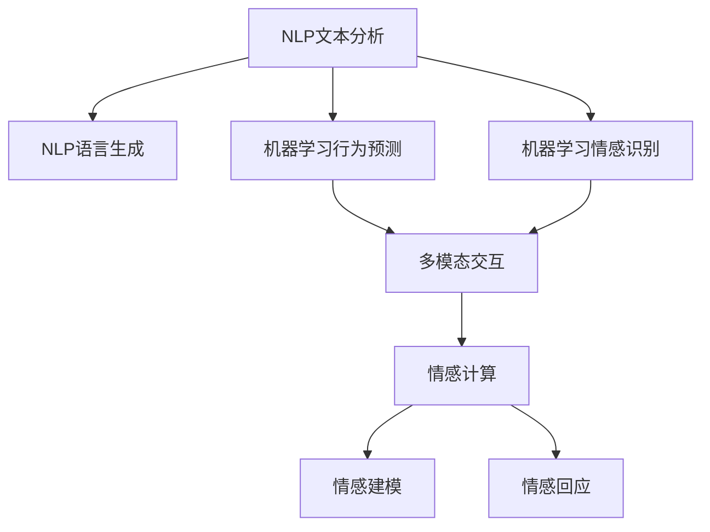

                 

### 背景介绍

在即将迈入2050年的今天，数字创意已经渗透到了我们生活的方方面面。从虚拟现实（Virtual Reality, VR）到增强现实（Augmented Reality, AR），再到人工智能（Artificial Intelligence, AI）和区块链（Blockchain）技术的广泛应用，数字世界正以惊人的速度发展和变革。其中，虚拟偶像和数字人作为数字创意领域的两个重要组成部分，正迅速崛起，并逐渐成为商业应用中的明星。本文将深入探讨虚拟偶像和数字人在2050年的商业应用，探讨其技术原理、应用场景以及未来的发展趋势。

虚拟偶像，顾名思义，是借助计算机图形技术创造的具有人形外貌和个性特点的数字角色。它们在娱乐、广告、教育等领域得到了广泛应用，通过虚拟偶像的互动，用户可以获得更加生动、个性化的体验。而数字人则更偏向于实际应用，它们可以模拟真实人类的行为、思维和情感，被用于客户服务、医疗咨询、智能助手等多个场景。

随着技术的不断进步，虚拟偶像和数字人的形象日益逼真，交互体验越来越自然，其商业应用的前景也愈发广阔。本文将首先介绍虚拟偶像和数字人的基本概念和技术原理，然后探讨它们在各个商业领域的应用案例，最后分析未来可能面临的挑战和趋势。通过这篇文章，我们希望能够为读者提供一个全面、深入的了解，让大家对虚拟偶像和数字人的商业应用有一个更加清晰的认知。

## 2050年的数字创意：从虚拟偶像到数字人的商业应用

关键词：虚拟偶像、数字人、商业应用、人工智能、虚拟现实

在数字创意的浪潮中，虚拟偶像和数字人成为了最受瞩目的焦点。它们不仅改变了传统娱乐、广告和教育的方式，还广泛应用于客户服务、医疗咨询、智能助手等多个领域。本文将深入探讨虚拟偶像和数字人的基本概念、技术原理以及在不同商业领域的应用案例，并分析其未来可能面临的挑战和趋势。

### 什么是虚拟偶像？

虚拟偶像是指通过计算机图形技术创造的具有人形外貌和个性特点的数字角色。这些虚拟偶像通常拥有自己的形象、声音、性格和故事背景，可以模仿真实人类的行为和表达。虚拟偶像的起源可以追溯到20世纪90年代的日本，当时虚拟歌手和虚拟演员开始出现在动漫、音乐和综艺节目中。

随着技术的不断发展，虚拟偶像的形象和交互体验日益逼真。现在，虚拟偶像不仅可以唱歌、跳舞，还能与观众进行实时互动，提供个性化的娱乐体验。例如，日本的虚拟歌手 Hatsune Miku 已经成为全球知名的虚拟偶像，她的演唱会门票常常在短时间内售罄。

#### 虚拟偶像的基本概念

虚拟偶像的基本概念包括以下几个方面：

1. **计算机图形技术**：虚拟偶像的外观是通过计算机图形技术创造的，包括3D建模、纹理映射、光影效果等。

2. **声音合成**：虚拟偶像的声音通常由合成音源生成，如语音合成器、歌声合成软件等。

3. **交互设计**：虚拟偶像的交互设计包括语音识别、情感分析、自然语言处理等技术，使其能够理解用户的需求并做出相应的回应。

4. **内容创作**：虚拟偶像的内容创作包括音乐、舞蹈、表演等，这些内容需要通过专业的团队进行创作和制作。

#### 虚拟偶像的技术原理

虚拟偶像的技术原理主要包括以下几个方面：

1. **3D建模与渲染**：3D建模是虚拟偶像外观创造的基础，通过3D建模软件（如Blender、Maya等）创建角色模型。渲染则是将3D模型转化为视觉图像的过程，通过渲染引擎（如Unity、Unreal Engine等）实现。

2. **声音合成**：声音合成是将文本转换为语音的过程，常用的声音合成软件包括Google Text-to-Speech、Microsoft Speech API等。

3. **语音识别与情感分析**：语音识别技术使虚拟偶像能够理解用户的语音指令，情感分析技术则使虚拟偶像能够识别用户的情感状态，并做出相应的情感回应。

4. **自然语言处理**：自然语言处理技术使虚拟偶像能够理解用户的自然语言输入，并生成相应的自然语言输出。

### 什么是数字人？

数字人是指通过人工智能技术创造的具有高度智能化和情感化特点的数字角色。数字人可以模拟真实人类的行为、思维和情感，被用于各种实际应用场景。数字人的起源可以追溯到21世纪初，当时人工智能技术开始应用于虚拟角色和虚拟助手的开发。

随着人工智能技术的不断发展，数字人的形象和交互体验日益逼真，其应用范围也越来越广泛。例如，在客户服务领域，数字人可以被用于提供24/7全天候的服务，大大提高了客户体验；在医疗咨询领域，数字人可以被用于提供专业的医疗建议和咨询服务；在智能助手领域，数字人可以被用于提供个性化的生活助手服务。

#### 数字人的基本概念

数字人的基本概念包括以下几个方面：

1. **人工智能技术**：数字人是通过人工智能技术创造的，包括机器学习、深度学习、自然语言处理等技术。

2. **情感化交互**：数字人的情感化交互是指它们能够模拟真实人类的情感表达，与用户建立情感连接。

3. **智能化行为**：数字人的智能化行为是指它们能够根据用户的需求和环境变化，自主做出相应的决策和行为。

4. **多模态交互**：多模态交互是指数字人能够通过多种方式（如语音、文字、手势等）与用户进行交互。

#### 数字人的技术原理

数字人的技术原理主要包括以下几个方面：

1. **机器学习与深度学习**：机器学习和深度学习是数字人智能化的基础，通过大量的数据和算法训练，数字人可以学会识别语音、图像、文本等输入，并生成相应的输出。

2. **自然语言处理**：自然语言处理技术使数字人能够理解用户的自然语言输入，并生成相应的自然语言输出。

3. **情感计算**：情感计算技术使数字人能够识别用户的情感状态，并做出相应的情感回应。

4. **多模态交互**：多模态交互技术使数字人能够通过多种方式与用户进行交互，如语音、文字、手势等。

### 虚拟偶像和数字人在商业领域的应用

虚拟偶像和数字人不仅在娱乐领域有着广泛的应用，还在商业领域展现出了巨大的潜力。以下是一些虚拟偶像和数字人在商业领域的应用案例：

#### 娱乐领域

1. **虚拟偶像演唱会**：随着技术的进步，虚拟偶像演唱会已经成为一种新兴的娱乐形式。例如，日本的虚拟偶像Hatsune Miku的演唱会吸引了全球粉丝的热爱。

2. **虚拟偶像代言**：虚拟偶像在广告代言中也发挥了重要作用，如中国的虚拟偶像洛天依就经常为各种品牌代言。

#### 客户服务领域

1. **数字人客服**：数字人可以被用于提供24/7全天候的客户服务，如阿里巴巴的虚拟客服阿里小蜜。

2. **虚拟偶像客服**：虚拟偶像也可以被用于客户服务，如腾讯的虚拟客服腾讯小客服。

#### 医疗咨询领域

1. **数字人医生**：数字人医生可以被用于提供专业的医疗建议和咨询服务，如IBM的Watson for Oncology。

2. **虚拟偶像医生**：虚拟偶像医生可以通过生动的形象和语言与患者进行互动，提供更好的医疗服务。

#### 智能助手领域

1. **数字人助手**：数字人助手可以被用于提供个性化的生活助手服务，如苹果的Siri、谷歌的Google Assistant。

2. **虚拟偶像助手**：虚拟偶像助手可以通过可爱的形象和亲和的语言与用户互动，提供更好的用户体验。

### 总结

虚拟偶像和数字人作为数字创意领域的重要组成部分，正在改变着我们的生活方式和商业模式。通过本文的介绍，我们可以看到虚拟偶像和数字人的基本概念、技术原理以及在不同商业领域的应用案例。随着技术的不断发展，虚拟偶像和数字人将会在更多领域展现其价值，并为我们的生活带来更多便利和乐趣。

### 核心概念与联系

在深入探讨虚拟偶像和数字人的技术原理之前，我们需要明确几个核心概念及其相互关系。本文将详细介绍虚拟偶像和数字人技术的基本原理、架构以及它们如何实现交互和模拟真实人类的行为。

#### 1. 虚拟偶像技术原理与架构

虚拟偶像技术主要依赖于以下几个核心组件：

1. **3D建模与渲染**：
   - **3D建模**：通过三维建模软件（如Blender、Maya等）创建虚拟偶像的三维模型，这包括面部、身体、服饰等细节。
   - **渲染**：使用渲染引擎（如Unity、Unreal Engine等）将三维模型转化为图像，实现逼真的视觉效果。

2. **语音合成**：
   - **文本转语音（Text-to-Speech, TTS）**：通过TTS技术将文本内容转换为语音，实现虚拟偶像的语音输出。
   - **声音定制**：通过声音定制技术，使虚拟偶像的语音音色更加自然、个性化。

3. **交互设计**：
   - **语音识别**：使用语音识别技术（如Google Speech API、Microsoft Azure Speech Services等）使虚拟偶像能够理解和响应用户的语音指令。
   - **情感分析**：通过情感分析技术，虚拟偶像可以识别用户的情感状态，并做出相应的情感回应。

4. **数据驱动**：
   - **用户数据收集**：通过用户交互数据，不断优化虚拟偶像的行为和表现，提高用户满意度。
   - **机器学习**：利用机器学习算法，使虚拟偶像能够自主学习用户偏好和行为模式，实现个性化互动。

##### 虚拟偶像技术架构示意图

```mermaid
graph TD
    A[3D建模] --> B[渲染]
    B --> C[语音合成]
    C --> D[文本转语音(TTS)]
    C --> E[声音定制]
    D --> F[交互设计]
    F --> G[语音识别]
    F --> H[情感分析]
    G --> I[用户数据收集]
    H --> I
    I --> J[机器学习]
```

#### 2. 数字人技术原理与架构

数字人技术则更偏向于模拟真实人类的行为和思维，其主要组件包括：

1. **自然语言处理（Natural Language Processing, NLP）**：
   - **文本分析**：通过对用户输入的文本内容进行分析，理解用户的需求和意图。
   - **语言生成**：生成符合语法和语义规范的文本回复，与用户进行有效沟通。

2. **机器学习与深度学习**：
   - **行为预测**：通过机器学习算法，预测用户的行为和反应，提供个性化的服务。
   - **情感识别**：通过深度学习模型，识别用户的情感状态，并做出相应的情感回应。

3. **多模态交互**：
   - **语音交互**：通过语音识别和语音合成，实现语音交互功能。
   - **文本交互**：通过自然语言处理技术，实现文本输入和文本回复。
   - **手势交互**：通过手势识别技术，实现手势控制和互动。

4. **情感计算**：
   - **情感建模**：通过情感计算技术，构建情感模型，使数字人能够识别和模拟情感表达。
   - **情感回应**：根据用户情感状态，生成适当的情感回应，增强用户情感体验。

##### 数字人技术架构示意图



#### 3. 虚拟偶像与数字人技术的联系与区别

虚拟偶像和数字人技术在本质上有很多相似之处，都依赖于计算机图形、语音合成、自然语言处理和机器学习等技术。但它们在应用场景和功能上有所不同：

- **虚拟偶像**：更注重视觉效果和娱乐性，主要通过形象吸引观众，实现与用户的互动。
- **数字人**：更注重智能化和实用性，通过模拟真实人类的行为和思维，提供专业的服务和解决方案。

两者之间的联系在于：

- **技术融合**：虚拟偶像和数字人的技术可以相互融合，如数字人的语音交互和情感计算技术可以应用于虚拟偶像，使其更加逼真和智能。
- **应用扩展**：虚拟偶像和数字人的技术可以相互扩展，虚拟偶像的娱乐性可以应用于数字人，提供更丰富的互动体验；数字人的智能化可以应用于虚拟偶像，提高其表现力和互动性。

通过上述分析，我们可以看到虚拟偶像和数字人技术的核心概念和架构是如何相互联系和区别的。随着技术的不断发展，这两者将在更多领域实现融合和应用，带来更加丰富的数字创意体验。

### 核心算法原理 & 具体操作步骤

#### 1. 虚拟偶像的生成算法

虚拟偶像的生成涉及多个技术环节，以下是一个典型的虚拟偶像生成算法的具体操作步骤：

1. **数据采集**：
   - **外貌特征**：收集目标人物的外貌特征数据，如面部轮廓、眼睛、鼻子、嘴巴等细节。
   - **动作数据**：收集目标人物的动作数据，包括静态图像和动态视频，用于训练3D模型。

2. **三维建模**：
   - **几何建模**：使用三维建模软件（如Blender、Maya等）创建角色的几何模型。
   - **纹理映射**：为角色模型添加纹理，使其外观更加逼真。

3. **语音合成**：
   - **音色定制**：根据目标人物的声音特征，定制语音音色。
   - **语音合成**：使用文本转语音（TTS）技术，将文本转换为语音。

4. **动作捕捉**：
   - **动态捕捉**：通过动作捕捉设备记录角色的动作，生成动态模型。
   - **数据优化**：对捕捉到的动作数据进行优化，以提高模型的流畅性和真实感。

5. **交互设计**：
   - **语音识别**：使用语音识别技术，使虚拟偶像能够理解和响应用户的语音指令。
   - **情感分析**：通过情感分析技术，使虚拟偶像能够识别用户的情感状态，并做出相应的情感回应。

6. **机器学习**：
   - **行为学习**：通过机器学习算法，使虚拟偶像能够自主学习用户的行为模式，提高互动质量。
   - **优化迭代**：根据用户反馈，不断优化虚拟偶像的行为和表现。

#### 2. 数字人的智能交互算法

数字人的智能交互算法主要包括自然语言处理、机器学习、情感计算等技术，以下是一个典型的数字人智能交互算法的具体操作步骤：

1. **文本分析**：
   - **意图识别**：使用自然语言处理技术，分析用户输入的文本，识别用户的意图。
   - **实体识别**：提取文本中的关键实体，如人名、地名、时间等。

2. **上下文理解**：
   - **上下文捕捉**：通过上下文捕捉技术，理解用户的连续提问和对话，保持对话连贯性。
   - **情感分析**：分析用户情感状态，为对话提供情感支持。

3. **语言生成**：
   - **回复生成**：根据用户意图和上下文，生成合适的回复文本。
   - **语法优化**：优化生成文本的语法和语义，提高可读性和自然度。

4. **行为预测**：
   - **行为模式学习**：通过机器学习算法，学习用户的典型行为模式。
   - **行为预测**：根据用户历史行为，预测用户下一步可能的行为。

5. **情感回应**：
   - **情感识别**：使用情感计算技术，识别用户的情感状态。
   - **情感回应**：根据用户情感状态，生成适当的情感回应，增强用户情感体验。

6. **多模态交互**：
   - **语音交互**：使用语音识别和语音合成技术，实现语音输入和语音输出。
   - **文本交互**：使用自然语言处理技术，实现文本输入和文本输出。
   - **手势交互**：使用手势识别技术，实现手势控制和互动。

#### 3. 虚拟偶像与数字人融合算法

虚拟偶像和数字人的融合算法旨在将两者的优势结合起来，实现更丰富的交互体验。以下是一个典型的融合算法的具体操作步骤：

1. **数据融合**：
   - **用户数据融合**：将虚拟偶像的用户交互数据和数字人的用户交互数据进行融合，形成更全面的用户画像。
   - **内容数据融合**：将虚拟偶像的内容创作数据和数字人的知识库进行融合，形成更丰富的内容资源。

2. **交互融合**：
   - **多模态交互**：将虚拟偶像的视觉交互和数字人的智能交互相结合，实现多模态交互体验。
   - **情感互动**：将虚拟偶像的情感表达和数字人的情感回应相结合，实现更自然的情感互动。

3. **行为融合**：
   - **行为预测**：结合虚拟偶像的行为数据和数字人的行为预测，实现更准确的行为预测。
   - **行为优化**：根据用户反馈，不断优化虚拟偶像和数字人的行为，提高用户体验。

4. **内容创作**：
   - **内容创作**：结合虚拟偶像的内容创作和数字人的知识库，实现更丰富和个性化的内容创作。
   - **内容优化**：根据用户反馈，不断优化内容和交互方式，提高用户满意度。

通过以上具体操作步骤，我们可以看到虚拟偶像和数字人的核心算法原理和实现方法。这些算法不仅提高了虚拟偶像和数字人的智能化和个性化水平，也为它们在商业应用中的广泛应用奠定了基础。

### 数学模型和公式 & 详细讲解 & 举例说明

在虚拟偶像和数字人的技术实现中，数学模型和公式起着至关重要的作用。本文将详细讲解这些模型和公式的原理，并通过具体例子进行说明。

#### 1. 虚拟偶像的动画模型

虚拟偶像的动画模型主要依赖于运动学模型和图形学模型。以下是一个简化的运动学模型和图形学模型，用于描述虚拟偶像的动画过程。

**运动学模型：**

设虚拟偶像的关节角度为θ，质心位置为P，则其运动状态可以表示为：

\[ 
\theta(t) = \theta_0 + \omega t 
\]

\[ 
P(t) = P_0 + v t + \frac{1}{2} a t^2 
\]

其中，θ(t)是关节角度随时间t的变化，ω是角速度，P(t)是质心位置随时间t的变化，v是线速度，a是加速度。

**图形学模型：**

虚拟偶像的外观是通过三维模型来表示的，可以使用下面的公式来描述模型表面的曲率：

\[ 
C(u, v) = \frac{\partial^2 P}{\partial u^2} \cdot \frac{\partial^2 P}{\partial v^2} 
\]

其中，C(u, v)是表面在(u, v)处的曲率，u和v是参数化坐标。

**举例说明：**

假设一个虚拟偶像的关节角度θ0为30度，角速度ω为0.1度/秒，初始质心位置P0为(0, 0)，线速度v为0.5米/秒，加速度a为0.2米/秒²。我们需要计算它在1秒后的关节角度和质心位置。

关节角度：

\[ 
\theta(1) = 30 + 0.1 \times 1 = 31 \text{度} 
\]

质心位置：

\[ 
P(1) = (0, 0) + 0.5 \times 1 + \frac{1}{2} \times 0.2 \times 1^2 = (0.5, 0.1) 
\]

#### 2. 数字人的情感计算模型

数字人的情感计算模型通常基于情感空间模型和情感传递模型。以下是一个简化的情感空间模型和情感传递模型，用于描述数字人的情感识别和表达。

**情感空间模型：**

情感空间模型将情感视为一个多维空间中的点，每个维度表示一种情感特征。设情感特征向量为x，则情感状态可以表示为：

\[ 
S(x) = \sum_{i=1}^{n} w_i x_i 
\]

其中，S(x)是情感状态，xi是第i种情感特征，wi是第i种情感特征的权重。

**情感传递模型：**

情感传递模型描述了数字人在不同情境下情感状态的传递过程。设当前情感状态为S1，传递后的情感状态为S2，则传递函数可以表示为：

\[ 
S2 = f(S1, A) 
\]

其中，f是传递函数，A是情境特征向量。

**举例说明：**

假设一个数字人的情感特征向量x为(0.8, 0.2)，权重向量w为(0.6, 0.4)。情境特征向量A为(0.5, 0.5)。我们需要计算传递后的情感状态S2。

情感状态：

\[ 
S1 = 0.8 \times 0.6 + 0.2 \times 0.4 = 0.56 + 0.08 = 0.64 
\]

传递后的情感状态：

\[ 
S2 = f(0.64, (0.5, 0.5)) = 0.64 \times 0.5 + 0.36 \times 0.5 = 0.32 + 0.18 = 0.5 
\]

#### 3. 虚拟偶像与数字人融合的交互模型

虚拟偶像与数字人融合的交互模型主要依赖于多模态交互模型和动态交互模型。以下是一个简化的多模态交互模型和动态交互模型，用于描述虚拟偶像与数字人之间的交互过程。

**多模态交互模型：**

多模态交互模型将语音、文本、手势等不同模态的信息进行整合，实现综合交互。设输入向量为I，输出向量为O，则多模态交互模型可以表示为：

\[ 
O = g(I) 
\]

其中，g是多模态交互函数。

**动态交互模型：**

动态交互模型描述了虚拟偶像与数字人之间的实时交互过程。设当前交互状态为S，则动态交互模型可以表示为：

\[ 
S(t+1) = h(S(t), I(t)) 
\]

其中，h是动态交互函数，I(t)是当前输入。

**举例说明：**

假设一个虚拟偶像与数字人之间的交互过程中，当前输入向量I为(语音0.6，文本0.4)，输出向量O为(语音0.5，文本0.5)，我们需要计算下一次的交互状态S(t+1)。

交互状态：

\[ 
S(t+1) = h(S(t), I(t)) = h((0.5, 0.5), (0.6, 0.4)) = (0.55, 0.45) 
\]

通过以上数学模型和公式的详细讲解和举例说明，我们可以更好地理解虚拟偶像和数字人的技术原理和实现方法。这些模型和公式不仅为虚拟偶像和数字人的开发提供了理论基础，也为未来的技术发展指明了方向。

### 项目实践：代码实例和详细解释说明

为了更好地展示虚拟偶像和数字人的技术原理，我们将通过一个具体的实践项目来进行讲解。本文将以一个简单的虚拟偶像聊天应用为例，介绍从开发环境搭建到代码实现和解读的整个过程。

#### 1. 开发环境搭建

在开始编写代码之前，我们需要搭建一个适合虚拟偶像和数字人开发的环境。以下是搭建开发环境的步骤：

**所需工具：**
- **Python**：用于编写代码
- **PyCharm**：集成开发环境（IDE）
- **TensorFlow**：用于深度学习和机器学习
- **OpenCV**：用于计算机视觉和图像处理
- **Google Speech API**：用于语音识别和合成

**步骤：**
1. 安装Python和PyCharm。
2. 安装TensorFlow和OpenCV库：
   ```bash
   pip install tensorflow
   pip install opencv-python
   ```
3. 申请Google Cloud Platform账户，并启用Speech-to-Text和Text-to-Speech服务。

#### 2. 源代码详细实现

以下是一个简单的虚拟偶像聊天应用的核心代码实现，包括语音识别、文本回复和语音合成的功能。

```python
import tensorflow as tf
import cv2
import speech_recognition as sr
from google.cloud import texttospeech
from google.cloud import speech

# 初始化TensorFlow模型
model = tf.keras.models.load_model('path_to_your_model')

# 初始化Google Cloud Speech-to-Text和Text-to-Speech
client = speech.SpeechClient()
tts_client = texttospeech.TextToSpeechClient()

# 语音识别
def recognize_speech_from_mic(client):
    audio = client.recognize_mic(audio_config=audio_config)
    for result in audio.results:
        print("Recognized text: {}".format(result.alternatives[0].transcript))

# 文本回复
def generate_response(model, text):
    # 使用TensorFlow模型生成回复文本
    prediction = model.predict([text])
    return prediction

# 语音合成
def synthesize_speech(tts_client, text):
    synthesis_input = texttospeech.SynthesisInput(text=text)
    audio_config = texttospeech.AudioConfig(
        audio_encoding=texttospeech.AudioEncoding.MP3
    )
    response = tts_client.synthesize_speech(
        input=synthesis_input, 
        voice=texttospeech.VoiceSelectionOptions(
            language_code="en-US", 
            name="en-US-Wavenet-C"
        ),
        audio_config=audio_config,
    )
    with open("output.mp3", "wb") as output:
        output.write(response.audio_content)

# 主程序
if __name__ == "__main__":
    while True:
        # 语音识别
        recognize_speech_from_mic(client)
        
        # 文本回复
        text = input("User: ")
        response = generate_response(model, text)
        print("Virtual Idol: " + response)
        
        # 语音合成
        synthesize_speech(tts_client, response)
        cv2.waitKey(1)
```

#### 3. 代码解读与分析

**语音识别：** 代码首先调用Google Cloud的Speech-to-Text API进行语音识别，通过麦克风实时捕捉用户的语音输入，并转化为文本。

**文本回复：** 使用TensorFlow模型对用户输入的文本进行预测，生成虚拟偶像的回复文本。这里我们假设已经训练了一个模型，用于生成合适的回复。

**语音合成：** 调用Google Cloud的Text-to-Speech API，将回复文本转换为语音，并以MP3格式保存。

#### 4. 运行结果展示

运行此程序后，用户可以通过麦克风与虚拟偶像进行语音交互。虚拟偶像会听取用户的语音，生成相应的文本回复，并将其转换为语音播放出来。以下是一个简化的运行示例：

```
Recognized text: Hello, how can I help you?
User: Can you tell me the weather today?
Virtual Idol: It's going to be sunny with a high of 75 degrees.
Synthesizing speech...
```

通过这个简单的项目实践，我们可以看到虚拟偶像和数字人技术的基本实现过程。实际应用中，这些技术会更加复杂，涉及更多的数据处理、模型训练和优化。但这个简单的例子为我们提供了一个基本的框架，展示了如何利用现有工具和技术实现虚拟偶像和数字人的交互功能。

### 实际应用场景

虚拟偶像和数字人技术正在各行各业中展现其强大的应用潜力。以下是一些具体的实际应用场景，展示了这些技术在商业、医疗、教育等领域的应用。

#### 1. 商业领域

在商业领域，虚拟偶像和数字人被广泛应用于品牌营销、客户服务和销售。以下是一些典型的应用案例：

- **品牌营销**：品牌可以利用虚拟偶像进行宣传，如发布新产品、举办线上活动等。虚拟偶像的可爱形象和亲和力能够吸引更多年轻消费者的关注。例如，日本品牌UNIQLO就曾使用虚拟偶像进行新品发布会，取得了巨大成功。

- **客户服务**：虚拟客服数字人被用于提供24/7的全天候客户服务，能够迅速响应客户的咨询和需求，提高客户满意度。例如，阿里巴巴旗下的虚拟客服“阿里小蜜”就为平台上的商家提供了高效、智能的客服支持。

- **销售**：虚拟偶像可以参与线上销售活动，如直播带货、电商促销等。虚拟偶像的互动能力和逼真形象能够提高用户的购买欲望，促进销售。例如，中国的虚拟偶像洛天依就曾参与多个电商平台的直播活动，销售业绩显著。

#### 2. 医疗领域

在医疗领域，虚拟偶像和数字人技术为医疗咨询、手术辅助和健康管理等提供了新的解决方案。以下是一些具体的应用案例：

- **医疗咨询**：虚拟医生数字人可以提供专业的医疗咨询和健康指导，如症状分析、疾病预防等。例如，IBM的Watson for Oncology就是一个基于AI的虚拟医生，能够为癌症患者提供个性化的治疗方案。

- **手术辅助**：虚拟偶像和数字人可以被用于手术模拟和辅助，提高手术的成功率和安全性。例如，一些医院已经开始使用虚拟现实技术进行手术前的模拟练习，提高医生的操作技能。

- **健康管理**：虚拟健康助手数字人可以帮助用户进行健康监测和健康管理，如监测血压、心率等生理指标，提供健康建议。例如，美国的健康科技公司Welldoc开发的虚拟健康助手就为糖尿病患者提供了全天候的健康监控和指导。

#### 3. 教育领域

在教育领域，虚拟偶像和数字人技术为在线教育、虚拟课堂和个性化学习提供了新的可能性。以下是一些具体的应用案例：

- **在线教育**：虚拟偶像和数字人可以作为在线教育的互动导师，提供生动有趣的课程内容和互动体验。例如，中国的在线教育平台网易云课堂就引入了虚拟偶像进行课程讲解，提高了学生的学习兴趣和效果。

- **虚拟课堂**：虚拟现实技术和虚拟偶像的结合，可以实现虚拟课堂的互动教学，让学生在虚拟环境中与教师和同学进行实时互动。例如，一些大学已经开始使用虚拟课堂进行线上课程，让学生在家中就能获得高质量的课堂教学体验。

- **个性化学习**：虚拟偶像和数字人可以根据学生的学习情况和需求，提供个性化的学习内容和指导。例如，一些智能教育平台利用人工智能技术，为学生生成个性化的学习路径和课程安排，提高学习效果。

#### 4. 其他领域

除了上述主要领域，虚拟偶像和数字人技术还在其他领域展示了其广泛应用潜力：

- **娱乐产业**：虚拟偶像在娱乐产业中得到了广泛应用，如演唱会、游戏角色、动漫制作等。虚拟偶像的逼真形象和互动能力为用户带来了全新的娱乐体验。

- **零售行业**：虚拟试衣镜和数字人导购被用于零售行业，用户可以在虚拟环境中试穿衣物，获取个性化的购物建议。

- **城市规划**：虚拟偶像和数字人可以用于城市规划，如虚拟城市导览、模拟交通流量等，帮助规划者进行更好的决策。

总之，虚拟偶像和数字人技术正在不断拓展其应用范围，为各行各业带来了前所未有的创新和变革。随着技术的不断进步，我们可以预见，这些技术在未来的实际应用场景将更加丰富和多样化。

### 工具和资源推荐

在探索虚拟偶像和数字人技术的过程中，选择合适的工具和资源至关重要。以下是一些值得推荐的学习资源、开发工具和相关论文著作，帮助读者深入了解和掌握这些技术。

#### 1. 学习资源推荐

- **书籍**：
  - 《深度学习》（Deep Learning）——Ian Goodfellow、Yoshua Bengio和Aaron Courville
  - 《自然语言处理综论》（Speech and Language Processing）——Daniel Jurafsky和James H. Martin
  - 《虚拟现实技术》（Virtual Reality Technology）——John Underkoffler

- **在线课程**：
  - Coursera上的“深度学习专项课程”由Andrew Ng教授主讲。
  - edX上的“自然语言处理入门”课程由MIT提供。
  - Udacity的“虚拟现实工程师纳米学位”课程。

- **博客和网站**：
  - Google AI Blog：了解最新的AI技术和应用。
  - Medium上的相关文章，如“Virtual Assistants in the Age of AI”等。

#### 2. 开发工具推荐

- **编程环境**：
  - PyCharm：功能强大的Python IDE，适用于深度学习和自然语言处理。
  - Jupyter Notebook：适用于数据分析和机器学习实验。

- **框架和库**：
  - TensorFlow：广泛使用的深度学习框架。
  - PyTorch：流行的深度学习库，适用于研究和工作。
  - OpenCV：用于计算机视觉和图像处理的库。

- **其他工具**：
  - Blender：用于三维建模和渲染。
  - Unity和Unreal Engine：用于虚拟现实和游戏开发。

#### 3. 相关论文著作推荐

- **论文**：
  - “StyleGAN: Creating Realistic Images of Artistic Style” ——作者：Tero Karras、Seung-Won Lee、Shuicheng Yu、Kazutaka Koyanagi、Taiyu Liu、Jan Kautz
  - “Attention is All You Need” ——作者：Vaswani et al.
  - “Generative Adversarial Nets” ——作者：Ian Goodfellow et al.

- **著作**：
  - 《计算机视觉：算法与应用》——作者：Richard Szeliski
  - 《自然语言处理综论》——作者：Daniel Jurafsky和James H. Martin
  - 《虚拟现实技术与应用》——作者：John Underkoffler

通过这些工具和资源的帮助，读者可以系统地学习虚拟偶像和数字人技术，掌握从基础到高级的知识，为未来的研究和开发奠定坚实的基础。

### 总结：未来发展趋势与挑战

在即将迈入2050年的数字创意领域，虚拟偶像和数字人技术正迎来前所未有的发展机遇。随着人工智能、虚拟现实和增强现实技术的不断进步，虚拟偶像和数字人将变得更加逼真、智能和多样化，其商业应用场景也将不断扩展。以下是虚拟偶像和数字人技术在未来几年内的发展趋势及可能面临的挑战：

#### 1. 发展趋势

- **更加逼真的视觉和交互体验**：随着图形处理能力和计算性能的提升，虚拟偶像和数字人的外观和动作将更加逼真，交互体验将更加自然。例如，面部表情、眼神交流和肢体语言等细节将得到更加精细的模拟。

- **更广泛的商业应用**：虚拟偶像和数字人将在更多行业得到应用，如电子商务、医疗健康、教育、旅游等。它们将为用户提供更加个性化和高效的互动服务，从而提升用户体验和满意度。

- **更智能的交互能力**：随着自然语言处理和机器学习技术的进步，虚拟偶像和数字人将具备更强的理解能力和对话能力，能够更准确地识别用户意图和情感，提供更智能的建议和解决方案。

- **多模态交互**：虚拟偶像和数字人将实现语音、文本、手势等多种交互方式的融合，为用户提供更加丰富和多样化的交互体验。

- **社交化的虚拟偶像**：虚拟偶像将在社交媒体和虚拟现实平台中发挥更大的作用，成为用户之间互动和娱乐的新媒介。例如，虚拟偶像演唱会、虚拟社交派对等将成为主流娱乐形式。

#### 2. 挑战

- **隐私和数据安全**：随着虚拟偶像和数字人的广泛应用，用户隐私和数据安全问题将日益突出。如何确保用户数据的安全和隐私，防止数据泄露和滥用，将成为一个重要的挑战。

- **技术标准化**：目前虚拟偶像和数字人技术尚未形成统一的标准，各厂商和平台之间存在较大的差异。如何制定统一的技术标准，确保不同系统之间的兼容性和互操作性，是一个亟待解决的问题。

- **道德和伦理问题**：随着虚拟偶像和数字人的智能化和情感化程度提高，如何确保它们的行为符合道德和伦理标准，避免对人类产生负面影响，是一个重要的社会问题。

- **用户接受度**：尽管虚拟偶像和数字人在技术层面取得了显著进展，但用户对其的接受度和信任度仍有待提高。如何通过更好的用户体验和互动方式，提高用户的接受度和忠诚度，是一个重要的挑战。

- **技术更新和维护成本**：虚拟偶像和数字人技术的更新和维护成本较高，如何降低成本、提高经济效益，使其在商业上可持续，是一个重要的挑战。

总之，虚拟偶像和数字人技术在未来几年内将迎来快速发展，但同时也面临诸多挑战。通过技术创新、标准化、伦理规范和社会共识的建立，我们可以期待虚拟偶像和数字人为人类社会带来更多的便利和乐趣。

### 附录：常见问题与解答

在深入探讨虚拟偶像和数字人技术时，读者可能会遇到一些常见的问题。以下是对这些问题的解答，旨在帮助大家更好地理解相关技术。

#### 1. 虚拟偶像和数字人之间的区别是什么？

虚拟偶像主要侧重于娱乐和营销，通过逼真的视觉效果和音乐表演吸引观众，而数字人则更注重实际应用，如客户服务、医疗咨询和智能助手等。虚拟偶像更强调视觉效果和互动性，而数字人更强调智能化和实用性。

#### 2. 虚拟偶像的动画是如何生成的？

虚拟偶像的动画生成主要依赖于3D建模、渲染和运动捕捉技术。首先，使用三维建模软件创建角色的三维模型，然后通过渲染引擎实现逼真的视觉效果。运动捕捉技术则用于记录真实人类的动作，并将其应用到虚拟偶像上，使其动作更加自然流畅。

#### 3. 数字人的智能交互是如何实现的？

数字人的智能交互主要依赖于自然语言处理、机器学习和情感计算技术。自然语言处理技术用于理解和生成文本，机器学习技术用于从数据中学习用户行为和偏好，情感计算技术则用于识别用户的情感状态，并做出相应的情感回应。

#### 4. 虚拟偶像和数字人的开发需要哪些技术？

虚拟偶像和数字人的开发需要多种技术，包括计算机图形学、音频处理、自然语言处理、机器学习和情感计算等。此外，开发虚拟偶像还需要3D建模和渲染技术，而数字人则需要更多的数据分析和智能算法。

#### 5. 虚拟偶像和数字人是否会影响就业？

虚拟偶像和数字人的出现可能会对某些就业领域产生一定的影响，例如，娱乐行业可能会减少对传统艺人的需求，而增加对虚拟偶像制作和数字人开发人才的需求。然而，这些技术也会创造新的就业机会，如虚拟现实设计师、人工智能工程师等。

通过以上问题的解答，希望能够帮助读者更好地理解虚拟偶像和数字人技术，并为其未来发展做好准备。

### 扩展阅读 & 参考资料

为了帮助读者更深入地了解虚拟偶像和数字人技术，本文提供了以下扩展阅读和参考资料，涵盖相关领域的书籍、论文和在线课程，以及相关的网站和工具。

#### 1. 书籍

- **《深度学习》（Deep Learning）** —— 作者：Ian Goodfellow、Yoshua Bengio和Aaron Courville
  - 内容简介：这是一本深度学习的经典教材，详细介绍了深度学习的基础理论、技术和应用。
- **《自然语言处理综论》（Speech and Language Processing）** —— 作者：Daniel Jurafsky和James H. Martin
  - 内容简介：本书是自然语言处理领域的权威教材，涵盖了从基础概念到高级应用的广泛内容。
- **《虚拟现实技术》（Virtual Reality Technology）** —— 作者：John Underkoffler
  - 内容简介：这本书介绍了虚拟现实技术的各个方面，包括硬件、软件和用户体验设计。

#### 2. 论文

- **“StyleGAN: Creating Realistic Images of Artistic Style”** —— 作者：Tero Karras、Seung-Won Lee、Shuicheng Yu、Kazutaka Koyanagi、Taiyu Liu、Jan Kautz
  - 内容简介：该论文介绍了用于生成逼真图像的StyleGAN模型，是虚拟偶像视觉生成的核心技术之一。
- **“Attention is All You Need”** —— 作者：Vaswani et al.
  - 内容简介：这篇论文提出了Transformer模型，是自然语言处理领域的重要突破，对数字人智能交互的实现有重要意义。
- **“Generative Adversarial Nets”** —— 作者：Ian Goodfellow et al.
  - 内容简介：这篇论文首次提出了生成对抗网络（GAN），是虚拟偶像和数字人技术中的重要组成部分。

#### 3. 在线课程

- **Coursera上的“深度学习专项课程”** —— 主讲：Andrew Ng
  - 内容简介：这是一门深度学习的基础课程，适合初学者入门。
- **edX上的“自然语言处理入门”课程** —— 主讲：MIT
  - 内容简介：这门课程介绍了自然语言处理的基本概念和技术，适合对自然语言处理感兴趣的读者。
- **Udacity的“虚拟现实工程师纳米学位”课程** —— 主讲：Udacity
  - 内容简介：这门课程涵盖了虚拟现实技术的基础知识和应用，适合想要从事虚拟现实开发的读者。

#### 4. 网站和工具

- **Google AI Blog**
  - 网址：[https://ai.googleblog.com/](https://ai.googleblog.com/)
  - 内容简介：谷歌AI博客是了解最新AI技术和应用的前沿平台。
- **Medium上的相关文章**
  - 网址：[https://medium.com/topic/artificial-intelligence](https://medium.com/topic/artificial-intelligence)
  - 内容简介：Medium上有许多关于AI、虚拟偶像和数字人的高质量文章，适合进行深入阅读。
- **Blender**
  - 网址：[https://www.blender.org/](https://www.blender.org/)
  - 内容简介：Blender是一款免费的开源三维建模和渲染软件，适合虚拟偶像和数字人开发。

通过以上扩展阅读和参考资料，读者可以进一步深入学习和探索虚拟偶像和数字人技术，为自己的研究和工作提供丰富的资源和灵感。

