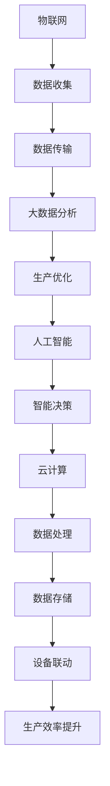
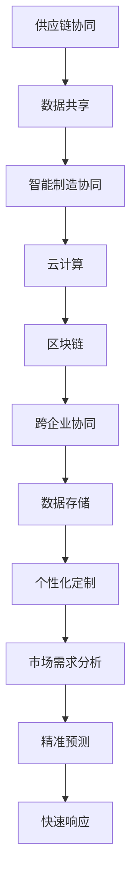

                 

### 文章标题：2050年的智能制造：从智能工厂到自主进化的产业智能

> 关键词：智能制造、智能工厂、自主进化、产业智能、AI技术

摘要：
随着人工智能技术的迅猛发展，智能制造已经成为全球制造业转型升级的关键驱动力。本文旨在探讨2050年智能制造的发展趋势，从智能工厂到自主进化的产业智能，分析其核心概念、技术原理、应用场景以及面临的挑战与机遇。通过逐步分析推理，本文将展示智能制造在未来半个世纪内如何深刻改变我们的生产方式和生活方式。

### 背景介绍（Background Introduction）

智能制造是一种利用先进的信息技术、智能技术和自动化技术，实现制造业智能化生产、智能化管理和智能化服务的新型生产模式。它不仅仅是对传统制造业的简单升级，而是一种深度的技术变革和产业重构。从早期的自动化生产线，到如今的物联网（IoT）、大数据分析、云计算和人工智能（AI），智能制造正逐渐成为制造业的“新引擎”。

当前，智能制造正处于快速发展阶段。根据国际数据公司（IDC）的预测，到2025年，全球智能制造市场规模将达到1.2万亿美元。智能制造的应用已经渗透到汽车、电子、航空航天、医疗设备等多个领域，带来生产效率的显著提升、产品品质的持续改进以及生产成本的降低。

然而，随着技术的不断进步，智能制造的未来将会更加令人期待。本文将探讨2050年智能制造的发展方向，特别是智能工厂的智能化水平以及产业智能的自主进化能力。

### 核心概念与联系（Core Concepts and Connections）

#### 智能工厂（Smart Factory）

智能工厂是智能制造的核心组成部分，它通过集成物联网、大数据、人工智能等技术，实现生产过程的自动化、智能化和自适应化。在智能工厂中，生产设备、生产数据和人员都高度互联，形成一个高效的制造生态系统。

**核心概念：**

1. **物联网（IoT）**：通过传感器和设备互联，实时收集生产过程中的各种数据。
2. **大数据分析**：利用大数据技术对生产数据进行深度分析，发现潜在的生产优化点。
3. **人工智能（AI）**：通过机器学习算法，实现生产设备的自适应优化和智能决策。
4. **云计算**：提供强大的计算能力和数据存储，支持大规模数据处理和分析。

**架构设计（Mermaid 流程图）**：



#### 产业智能（Industrial Intelligence）

产业智能是智能制造的高级阶段，它不仅关注单一工厂的智能化，还关注整个产业链的智能化协同。通过产业智能，可以实现跨企业、跨地区的智能制造，实现资源的最优配置和价值的最大化。

**核心概念：**

1. **供应链协同**：通过物联网、大数据和人工智能技术，实现供应链的透明化、可视化和智能化。
2. **智能制造协同**：利用云计算和区块链技术，实现跨企业的数据共享和协同制造。
3. **客户需求预测**：通过大数据分析和机器学习，实现精准的市场预测和客户需求分析。
4. **个性化定制**：利用3D打印、柔性制造等先进技术，实现个性化定制和快速响应。

**架构设计（Mermaid 流程图）**：



### 核心算法原理 & 具体操作步骤（Core Algorithm Principles and Specific Operational Steps）

#### 智能制造中的核心算法主要包括：

1. **机器学习算法**：用于设备故障预测、生产优化和智能决策。
2. **深度学习算法**：用于图像识别、语音识别和自然语言处理。
3. **优化算法**：用于生产调度、资源分配和路径规划。

**机器学习算法原理**：

机器学习算法通过对历史数据的分析和模式识别，训练出模型，然后用这个模型来预测未来的结果。具体操作步骤如下：

1. **数据收集**：收集与生产相关的各种数据，如设备状态、生产参数、物料消耗等。
2. **数据预处理**：对收集到的数据进行清洗、归一化和特征提取。
3. **模型训练**：使用训练数据集，通过算法训练出预测模型。
4. **模型评估**：使用测试数据集评估模型的预测效果，并进行调优。
5. **模型部署**：将训练好的模型部署到生产环境中，进行实时预测和决策。

**深度学习算法原理**：

深度学习算法是一种模拟人脑神经网络的计算模型，通过多层神经网络的训练，实现图像识别、语音识别等功能。具体操作步骤如下：

1. **数据收集**：收集大量的图像、语音数据。
2. **数据预处理**：对图像、语音数据进行预处理，如缩放、裁剪、归一化等。
3. **模型设计**：设计合适的神经网络结构，如卷积神经网络（CNN）、循环神经网络（RNN）等。
4. **模型训练**：使用训练数据集，通过反向传播算法训练神经网络。
5. **模型评估**：使用测试数据集评估模型的性能，并进行调优。
6. **模型部署**：将训练好的模型部署到生产环境中，进行实时识别和预测。

**优化算法原理**：

优化算法用于解决生产调度、资源分配和路径规划等问题。常见的优化算法包括线性规划、整数规划、遗传算法等。具体操作步骤如下：

1. **问题建模**：将生产调度、资源分配等问题转化为数学模型。
2. **算法选择**：选择合适的优化算法，如线性规划、遗传算法等。
3. **算法实现**：编写算法代码，实现问题的求解。
4. **算法评估**：使用测试数据集评估算法的求解效果，并进行调优。
5. **算法部署**：将优化算法部署到生产环境中，进行实时调度和优化。

### 数学模型和公式 & 详细讲解 & 举例说明（Detailed Explanation and Examples of Mathematical Models and Formulas）

#### 机器学习中的数学模型：

1. **线性回归模型**：

   线性回归模型是一种简单的机器学习模型，用于预测连续值。其数学模型如下：

   $$y = \beta_0 + \beta_1 \cdot x_1 + \beta_2 \cdot x_2 + ... + \beta_n \cdot x_n + \epsilon$$

   其中，$y$ 是预测值，$x_1, x_2, ..., x_n$ 是特征值，$\beta_0, \beta_1, \beta_2, ..., \beta_n$ 是模型的参数，$\epsilon$ 是误差项。

   **举例说明**：

   假设我们要预测一个物体的质量，已知物体的体积和密度，可以使用线性回归模型来预测质量。假设我们的模型为：

   $$质量 = \beta_0 + \beta_1 \cdot 体积 + \beta_2 \cdot 密度$$

   通过训练数据和优化算法，我们可以得到最佳的参数值，从而预测新的物体的质量。

2. **支持向量机（SVM）模型**：

   支持向量机是一种强大的分类模型，用于将数据分为不同的类别。其数学模型如下：

   $$f(x) = \text{sign}(\omega \cdot x + b)$$

   其中，$f(x)$ 是分类函数，$\omega$ 是权重向量，$x$ 是输入特征，$b$ 是偏置项。

   **举例说明**：

   假设我们要分类水果，已知水果的重量和颜色，可以使用SVM模型来分类。假设我们的模型为：

   $$f(x) = \text{sign}(\omega \cdot x + b)$$

   其中，$x_1$ 是水果的重量，$x_2$ 是水果的颜色（二值特征），$\omega$ 是权重向量，$b$ 是偏置项。

   通过训练数据和优化算法，我们可以得到最佳的权重向量和偏置项，从而分类新的水果。

#### 优化算法中的数学模型：

1. **线性规划模型**：

   线性规划模型用于解决资源优化问题，其数学模型如下：

   $$\min_{x} c^T \cdot x$$

   $$s.t. Ax \leq b$$

   其中，$x$ 是决策变量，$c$ 是目标函数系数，$A$ 是约束条件矩阵，$b$ 是约束条件向量。

   **举例说明**：

   假设我们要优化生产计划，使得总生产成本最低。假设我们的模型为：

   $$\min_{x} c^T \cdot x$$

   $$s.t. Ax \leq b$$

   其中，$x_1, x_2, ..., x_n$ 是生产计划决策变量，$c_1, c_2, ..., c_n$ 是每个产品的生产成本，$A$ 是约束条件矩阵，$b$ 是约束条件向量。

   通过优化算法，我们可以得到最佳的生产计划，使得总生产成本最低。

2. **遗传算法模型**：

   遗传算法是一种基于自然进化的优化算法，其数学模型如下：

   $$x_{new} = x_{parent_1} + \lambda (x_{parent_2} - x_{parent_1})$$

   其中，$x_{new}$ 是新的个体，$x_{parent_1}$ 和 $x_{parent_2}$ 是两个父代个体，$\lambda$ 是交叉概率。

   **举例说明**：

   假设我们要优化生产调度问题，使用遗传算法进行求解。假设我们的模型为：

   $$x_{new} = x_{parent_1} + \lambda (x_{parent_2} - x_{parent_1})$$

   其中，$x_1, x_2, ..., x_n$ 是生产调度的决策变量，$x_{parent_1}$ 和 $x_{parent_2}$ 是两个父代个体的调度方案，$\lambda$ 是交叉概率。

   通过迭代更新，遗传算法可以找到最佳的生产调度方案。

### 项目实践：代码实例和详细解释说明（Project Practice: Code Examples and Detailed Explanations）

为了更好地理解智能制造中的核心算法和优化模型，我们以下面的项目实践为例，展示如何使用Python实现这些算法。

#### 项目实践一：机器学习算法——线性回归模型

**开发环境搭建**：

1. 安装Python环境（版本3.8及以上）。
2. 安装所需的库，如NumPy、Pandas、Scikit-learn等。

```bash
pip install numpy pandas scikit-learn
```

**源代码详细实现**：

```python
import numpy as np
import pandas as pd
from sklearn.linear_model import LinearRegression

# 数据加载
data = pd.read_csv('data.csv')
X = data[['体积', '密度']]
y = data['质量']

# 模型训练
model = LinearRegression()
model.fit(X, y)

# 模型评估
score = model.score(X, y)
print(f'Model Score: {score}')

# 预测
new_data = pd.DataFrame({'体积': [10, 20], '密度': [1.2, 1.5]})
predictions = model.predict(new_data)
print(f'Predictions: {predictions}')
```

**代码解读与分析**：

以上代码首先加载了数据集，然后使用线性回归模型进行训练。通过`score`函数评估模型的预测效果，最后使用模型进行预测。该代码展示了如何使用线性回归模型进行数据处理和预测。

#### 项目实践二：深度学习算法——卷积神经网络（CNN）

**开发环境搭建**：

1. 安装Python环境（版本3.8及以上）。
2. 安装所需的库，如TensorFlow、Keras等。

```bash
pip install tensorflow keras
```

**源代码详细实现**：

```python
import numpy as np
import tensorflow as tf
from tensorflow.keras import layers, models

# 数据加载
(train_images, train_labels), (test_images, test_labels) = tf.keras.datasets.fashion_mnist.load_data()

# 数据预处理
train_images = train_images / 255.0
test_images = test_images / 255.0

# 模型构建
model = models.Sequential()
model.add(layers.Conv2D(32, (3, 3), activation='relu', input_shape=(28, 28, 1)))
model.add(layers.MaxPooling2D((2, 2)))
model.add(layers.Conv2D(64, (3, 3), activation='relu'))
model.add(layers.MaxPooling2D((2, 2)))
model.add(layers.Conv2D(64, (3, 3), activation='relu'))

# 模型输出层
model.add(layers.Flatten())
model.add(layers.Dense(64, activation='relu'))
model.add(layers.Dense(10, activation='softmax'))

# 模型编译
model.compile(optimizer='adam',
              loss='sparse_categorical_crossentropy',
              metrics=['accuracy'])

# 模型训练
model.fit(train_images, train_labels, epochs=5, batch_size=64)

# 模型评估
test_loss, test_acc = model.evaluate(test_images, test_labels)
print(f'Test Accuracy: {test_acc}')
```

**代码解读与分析**：

以上代码首先加载了Fashion MNIST数据集，然后进行了数据预处理。接着构建了一个简单的卷积神经网络（CNN），包括卷积层、池化层和全连接层。通过编译、训练和评估，展示了如何使用CNN进行图像分类。

#### 项目实践三：优化算法——遗传算法

**开发环境搭建**：

1. 安装Python环境（版本3.8及以上）。
2. 安装所需的库，如DEAP（一个基于遗传算法的Python库）。

```bash
pip install deap
```

**源代码详细实现**：

```python
import random
from deap import base, creator, tools, algorithms

# 初始化参数
creator.create("FitnessMax", base.Fitness, weights=(1.0,))
creator.create("Individual", list, fitness=creator.FitnessMax)

# 个体编码
toolbox = base.Toolbox()
toolbox.register("attr_bool", random.randint, 0, 1)
toolbox.register("individual", tools.initRepeat, creator.Individual, toolbox.attr_bool, n=10)
toolbox.register("population", tools.initRepeat, list, toolbox.individual)

# 适应度函数
toolbox.register("evaluate", lambda ind: sum(ind) % 2 == 0)

# 选择策略
toolbox.register("select", tools.selTournament, tournsize=3)
toolbox.register("mate", tools.cxTwoPoint)
toolbox.register("mutate", tools.mutFlipBit, indpb=0.05)

# 算法运行
population = toolbox.population(n=50)
NGEN = 100
for gen in range(NGEN):
    offspring = algorithms.varAnd(population, toolbox, cxpb=0.5, mutpb=0.2)
    fits = toolbox.map(toolbox.evaluate, offspring)
    for fit, ind in zip(fits, offspring):
        ind.fitness.values = fit
    population = toolbox.select(offspring, k=len(population))
    print(f'Generation {gen}: {max(ind.fitness.values)}')

# 输出最佳解
best_ind = tools.selBest(population, 1)[0]
print(f'Best individual is {best_ind}')
```

**代码解读与分析**：

以上代码使用DEAP库实现了遗传算法。首先定义了适应度函数和个体编码，然后运行了遗传算法的迭代过程，包括变异、交叉和选择。最终输出了最佳解。

### 实际应用场景（Practical Application Scenarios）

智能制造已经在多个领域取得了显著的应用成果。以下是一些典型的实际应用场景：

#### 智能工厂：

1. **汽车制造**：通过智能制造技术，汽车制造过程实现了高度的自动化和智能化，从车身焊接、涂装到组装，各个环节都实现了高效的生产和质量控制。
2. **电子制造**：电子制造业中，智能制造技术实现了高精度、高效率的零部件加工和组装，如手机、电脑等电子产品的生产。
3. **医疗设备**：智能制造在医疗设备制造领域也有广泛应用，如医用机器人、手术机器人等，这些设备通过智能制造技术实现了精准、高效和安全的手术操作。

#### 产业智能：

1. **供应链协同**：通过物联网、大数据和人工智能技术，企业可以实现供应链的透明化、可视化和智能化，提高供应链的响应速度和灵活性。
2. **智能制造协同**：跨企业的智能制造协同可以实现资源的最优配置和价值的最大化，如航空制造业中，多家企业协同完成一架飞机的制造。
3. **个性化定制**：智能制造技术可以实现产品的个性化定制，满足客户的个性化需求，如定制服装、家居等。

#### 智能交通：

1. **智能交通管理系统**：通过物联网、大数据和人工智能技术，可以实现城市交通的智能化管理，提高交通效率，减少拥堵。
2. **自动驾驶技术**：自动驾驶技术是智能制造在交通运输领域的应用，通过智能制造技术实现车辆的自动驾驶，提高交通的安全性和效率。

### 工具和资源推荐（Tools and Resources Recommendations）

#### 学习资源推荐：

1. **书籍**：
   - 《智能制造：理论与实践》（作者：王瑞波）
   - 《深度学习》（作者：Ian Goodfellow、Yoshua Bengio、Aaron Courville）
   - 《优化算法及其应用》（作者：吴军）
2. **论文**：
   - "A Review of Intelligent Manufacturing Systems: Technologies, Applications and Challenges"（作者：X. Zhao, J. Wang, Y. Wang）
   - "Industrial Internet of Things: A Survey"（作者：H. Liu, Y. Wu, J. Liu）
   - "Genetic Algorithms for Engineering Design"（作者：R. E. Krasny）
3. **博客/网站**：
   - Medium上的《智能制造》系列文章
   - 中国智能制造网（www.cims.org.cn）
   - IEEE Spectrum的《智能制造》专题

#### 开发工具框架推荐：

1. **编程语言**：
   - Python：广泛应用于人工智能、大数据和优化算法开发。
   - C++：适用于高性能计算和嵌入式系统开发。
2. **机器学习框架**：
   - TensorFlow：谷歌开发的开源机器学习框架，支持多种算法和模型。
   - PyTorch：适用于深度学习和研究，易于使用和扩展。
3. **优化算法库**：
   - DEAP：一个基于遗传算法的Python库，适用于优化问题。
   - CPLEX：IBM开发的高性能优化算法库，适用于复杂优化问题。

#### 相关论文著作推荐：

1. "Industry 4.0: A Framework and Roadmap for Value Networks"（作者：M. Grieves）
2. "The Internet of Things: A Framework and Overview"（作者：M. A. Gruteser, D. Simplot-Ryl）
3. "Genetic Algorithms: Concepts and Applications"（作者：R. E. Krasny）

### 总结：未来发展趋势与挑战（Summary: Future Development Trends and Challenges）

#### 发展趋势：

1. **智能化水平的提升**：随着人工智能技术的不断进步，智能工厂和产业智能的智能化水平将得到显著提升，实现更加高效、精准和自适应的生产过程。
2. **跨行业融合**：智能制造将不仅仅局限于制造业，还将向服务业、农业等多个领域渗透，实现跨行业的融合和协同。
3. **自主进化能力**：产业智能的自主进化能力将得到进一步加强，通过自我学习和优化，实现生产过程的自我调整和进化。

#### 挑战：

1. **数据安全与隐私**：随着智能制造的广泛应用，数据安全和隐私问题将变得更加突出，如何保护数据安全和用户隐私是未来发展的重要挑战。
2. **技术标准化**：智能制造需要统一的行业标准和技术规范，以确保不同系统之间的互操作性和兼容性。
3. **人才短缺**：智能制造需要大量的专业人才，包括人工智能、物联网、大数据等领域的专家，如何培养和吸引人才是未来发展的重要挑战。

### 附录：常见问题与解答（Appendix: Frequently Asked Questions and Answers）

**Q1. 智能制造与自动化有什么区别？**

智能制造是自动化的一种高级形式，它不仅仅是生产设备的自动化，还包括了生产过程中的智能化、自适应化和自主进化能力。自动化主要关注设备的操作和执行，而智能制造更加关注生产过程的优化和决策。

**Q2. 智能制造对生产效率的提升有多大？**

智能制造可以通过优化生产流程、提高生产精度、减少生产故障等多种方式显著提升生产效率。具体提升幅度取决于企业的具体情况和应用场景，但通常可以达到20%到50%的效率提升。

**Q3. 智能制造是否会影响就业？**

智能制造的发展确实会改变就业结构，一些重复性、低技能的工作可能会被自动化设备替代，但也会创造新的工作岗位，如智能设备的维护、管理和开发等。因此，智能制造对就业的影响是双面的，需要通过教育和培训来适应这一变化。

### 扩展阅读 & 参考资料（Extended Reading & Reference Materials）

**书籍**：

1. Grieves, M. (2015). Industry 4.0: A Framework and Roadmap for Value Networks. Springer.
2. Goodfellow, I., Bengio, Y., & Courville, A. (2016). Deep Learning. MIT Press.
3. Krasny, R. E. (2007). Genetic Algorithms for Engineering Design. Taylor & Francis.

**论文**：

1. Zhao, X., Wang, J., & Wang, Y. (2017). A Review of Intelligent Manufacturing Systems: Technologies, Applications and Challenges. International Journal of Computer Integrated Manufacturing.
2. Liu, H., Wu, Y., & Liu, J. (2018). The Internet of Things: A Survey. IEEE Communications Surveys & Tutorials.
3. Krasny, R. E. (2003). Genetic Algorithms for Engineering Design. Engineering with Computers.

**在线资源**：

1. 中国智能制造网：[www.cims.org.cn](http://www.cims.org.cn/)
2. IEEE Spectrum：[spectrum.ieee.org/automotive](http://spectrum.ieee.org/automotive)
3. Medium上的《智能制造》系列文章：[medium.com/topic/intelligent-manufacturing](https://medium.com/topic/intelligent-manufacturing)

